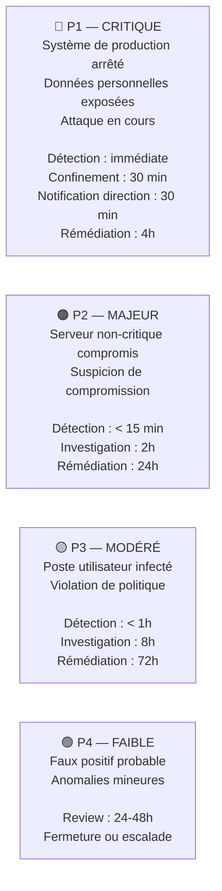

# SLA / SLO — Engagements de Service du SOC

<div
  class="omny-meta"
  data-level="🟡 Intermédiaire"
  data-version="2025"
  data-time="~1-2 heures">
</div>

## Introduction

!!! quote "Analogie pédagogique — Le Contrat de Déménagement"
    Quand vous engagez un déménageur, vous signez un contrat qui précise : livraison avant 18h, indemnisation si retard, assurance sur les objets fragiles. Sans ce contrat, personne ne sait ce qui est attendu. Le **SLA (Service Level Agreement)** d'un SOC est ce contrat : il définit précisément ce que le SOC s'engage à faire, dans quels délais, avec quelles pénalités si non-respecté.

**SLA vs SLO :**

| Terme | Signification | Usage |
|---|---|---|
| **SLA** | Service Level Agreement | Contrat formel avec engagement (externe) |
| **SLO** | Service Level Objective | Objectif interne de performance |
| **SLI** | Service Level Indicator | Métrique mesurée (MTTD, MTTR...) |

<br>

---

## Niveaux de priorité et délais de réponse



<br>

---

## Exemple de SLA pour un SOC Interne

```markdown title="SLA SOC Interne — Exemple documentaire"
# Service Level Agreement — SOC Interne
**Version :** 2.1 | **Validé par :** RSSI | **Date :** 2025-01-01

## Couverture du Service

- **Heures ouvrées :** 8h-20h (Lun-Ven) — Analyste dédié
- **Astreinte :** 20h-8h et week-ends — Analyste on-call (délai de prise en charge : 15 min)
- **Scope :** Tous les systèmes du SI (serveurs, postes, cloud Azure/AWS)

## Engagements par Niveau de Priorité

| Priorité | Délai de Détection | Délai de Notification | Délai de Confinement | Délai de Résolution |
|---|---|---|---|---|
| P1 — Critique | Immédiate (SIEM auto) | 30 min (RSSI + DG) | 30 min | 4 heures |
| P2 — Majeur | < 15 min | 2 heures (RSSI) | 2 heures | 24 heures |
| P3 — Modéré | < 1 heure | 24 heures | 8 heures | 72 heures |
| P4 — Faible | < 4 heures | Aucune | N/A | 1 semaine |

## Métriques de Reporting Mensuel

- MTTD moyen par niveau de priorité
- MTTR moyen par niveau de priorité
- Nombre d'incidents par catégorie (MITRE ATT&CK)
- Taux de faux positifs (objectif : < 20%)
- Disponibilité du SIEM (objectif : > 99,5%)
```

<br>

---

## Tableau de bord SLA — Wazuh Dashboard

Wazuh Dashboard permet de créer un tableau de bord de suivi SLA en temps réel :

```bash title="Requêtes OpenSearch pour tableau de bord SLA"
# MTTD moyen (temps entre l'événement et l'alerte Wazuh)
# → Analysé via les timestamps des alertes

# Nombre d'incidents P1 ce mois (alertes niveau 15)
rule.level: 15 AND @timestamp: [now-30d TO now]

# Taux de faux positifs (alertes fermées comme FP dans TheHive)
# Requête TheHive API :
curl -H "Authorization: Bearer API_KEY" \
  "http://thehive:9000/api/case?query={'_string':'status:Resolved+AND+resolutionStatus:FalsePositive'}&range=0-100"

# Top 10 règles les plus déclenchées (candidats au tuning)
# Dans Wazuh Dashboard : Visualize → Donut → rule.description, Top 10
```

<br>

---

## Conclusion

!!! quote "Ce qu'il faut retenir"
    Un SLA sans mesure est une promesse creuse. La valeur d'un SLA vient de sa **mesurabilité** : chaque engagement doit correspondre à une métrique précise, automatiquement collectée. Les SLA vous forcent aussi à être **honnête** sur les capacités réelles de votre SOC — mieux vaut un SLA réaliste et tenu qu'un SLA ambitieux constamment violé.

> Continuez avec **[Astreintes (On-Call) →](./oncall.md)** pour organiser la couverture 24/7 de votre SOC.

<br>