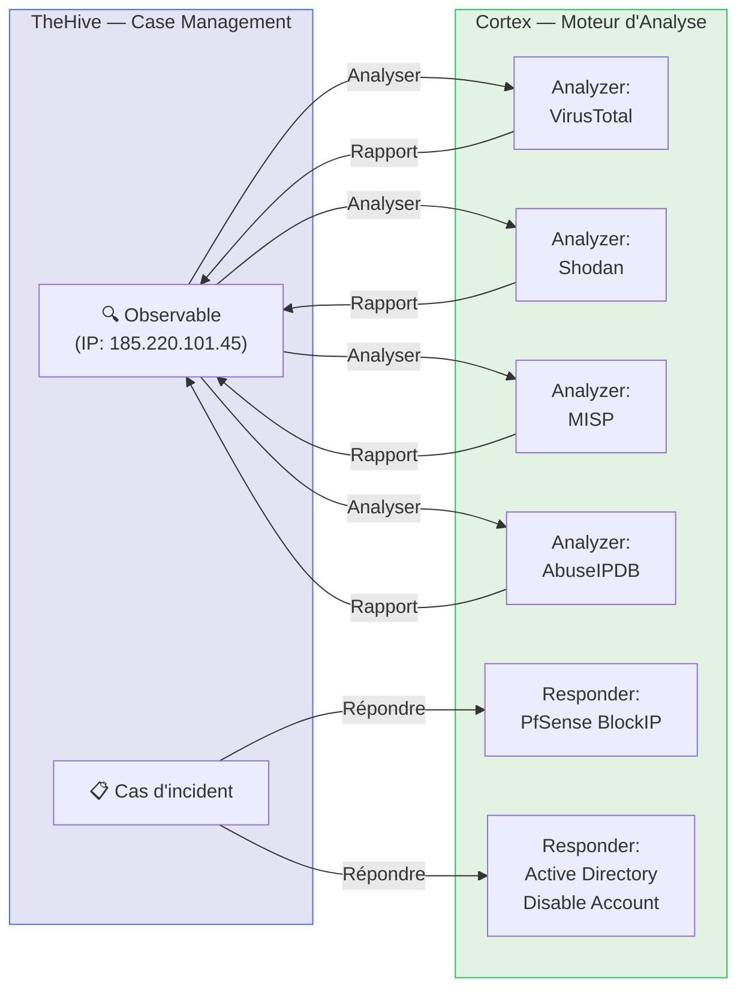

# Cortex — Moteur d'Automatisation TheHive

<div
  class="omny-meta"
  data-level="🟡 Intermédiaire"
  data-version="Cortex 3.1.x"
  data-time="~2 heures">
</div>

## Introduction

!!! quote "Analogie pédagogique — Le Laboratoire d'Analyses Médicales"
    Quand un médecin prescrit des analyses, il n'effectue pas lui-même les prises de sang, les cultures et les tests biochimiques — il envoie les échantillons au **laboratoire** qui retourne les résultats dans un format standardisé. **Cortex** est ce laboratoire pour votre SOC : vous lui soumettez des IOC (IPs, hash, domaines), il les analyse avec des dizaines d'outils différents et retourne un rapport unifié à TheHive.

**Cortex** est le moteur d'analyse et de réponse qui s'intègre à TheHive. Il s'appuie sur deux types de modules :

- **Analyzers** : analysent un observable (IP → VirusTotal, GeoIP, Shodan...)
- **Responders** : déclenchent des actions de réponse (bloquer une IP, désactiver un compte...)

<br>

---

## Architecture Cortex



<br>

---

## Configurer les Analyzers

```bash title="Installer et configurer les analyzers Cortex"
# Cloner le dépôt des analyzers officiels
git clone https://github.com/TheHive-Project/Cortex-Analyzers
cd Cortex-Analyzers

# Installer les dépendances Python pour un analyzer spécifique
pip3 install -r analyzers/VirusTotal/requirements.txt

# Dans l'interface Cortex : Organization → Analyzers → Refresh
# Puis activer les analyzers souhaités et configurer les clés API
```

**Analyzers gratuits essentiels :**

```json title="Configuration Cortex — Analyzers recommandés"
{
  "VirusTotal_GetReport_3_0": {
    "key": "VOTRE_CLE_API_VIRUSTOTAL",
    "polling_interval": 60
  },
  "Shodan_DNSResolve_1_0": {
    "key": "VOTRE_CLE_API_SHODAN"
  },
  "AbuseIPDB_1_0": {
    "key": "VOTRE_CLE_API_ABUSEIPDB",
    "max_age_in_days": 90
  },
  "MISP_2_1": {
    "url": "https://votre-misp.local",
    "key": "VOTRE_CLE_API_MISP",
    "cert_check": false
  },
  "MaxMind_GeoIP_3_0": {
    "key": "VOTRE_LICENCE_MAXMIND"
  },
  "Abuse_Finder_3_0": {}
}
```

<br>

---

## Créer un Responder custom

Un **Responder** est un script qui effectue une **action de réponse** déclenchée depuis TheHive.

```python title="Responder custom — Bloquer une IP sur pfSense"
#!/usr/bin/env python3
# Responder Cortex : bloquer une IP sur pfSense via l'API
# Fichier : cortex-analyzers/responders/PfSense_BlockIP/pfSense_block.py

import requests
import json
from cortexutils.responder import Responder

class PfSenseBlockIP(Responder):
    def __init__(self):
        super().__init__()
        # Configuration depuis Cortex
        self.pfsense_url = self.get_param('config.url', None, 'pfSense URL manquante')
        self.pfsense_key  = self.get_param('config.key', None, 'Clé API pfSense manquante')

    def run(self):
        # Récupérer l'observable depuis TheHive (IP à bloquer)
        observable = self.get_param('data.data', None, 'Aucun observable fourni')
        data_type  = self.get_param('data.dataType', None)

        if data_type != 'ip':
            self.error("Ce responder ne gère que les IPs")
            return

        # Appeler l'API pfSense pour ajouter la règle de blocage
        response = requests.post(
            f"{self.pfsense_url}/api/v1/firewall/rule",
            headers={"Authorization": f"Bearer {self.pfsense_key}"},
            json={
                "type": "block",
                "interface": "wan",
                "src": observable,
                "dst": "any",
                "descr": f"Bloqué par Cortex SOC - {observable}"
            },
            verify=False
        )

        if response.status_code == 200:
            self.report({
                "summary": f"IP {observable} bloquée sur pfSense",
                "success": True
            })
        else:
            self.error(f"Échec du blocage : {response.text}")

# Point d'entrée
if __name__ == '__main__':
    PfSenseBlockIP().run()
```

<br>

---

## Workflow automatique TheHive + Cortex

Avec Cortex configuré, TheHive peut **automatiquement analyser** chaque nouvel observable ajouté à un cas :

```yaml title="Configuration TheHive — Auto-analyse avec Cortex"
# Dans application.conf de TheHive
play.modules.enabled += org.thp.thehive.connector.cortex.CortexModule

cortex {
  servers = [
    {
      name = "Cortex-SOC"
      url = "http://cortex:9001"
      auth {
        type = "bearer"
        key = "VOTRE_CLE_CORTEX"
      }
    }
  ]
  # Analyser automatiquement les nouveaux observables
  # avec les analyzers activés pour chaque type
  autoCreateAlerts = true
}
```

<br>

---

## Conclusion

!!! quote "Ce qu'il faut retenir"
    Cortex est le **multiplicateur de force** de TheHive. Sans Cortex, chaque analyste doit manuellement copier-coller les IOC dans VirusTotal, Shodan et MISP. Avec Cortex, cette enrichissement se fait en un clic (ou automatiquement). Les Responders vont plus loin en **agissant** : bloquer une IP sur le firewall, désactiver un compte AD, mettre un fichier en quarantaine — sans quitter TheHive. C'est le cœur de la réponse automatisée.

> **La Phase 5 (SOAR & Automatisation) est terminée.** Dernière étape : **[Phase 6 — Gestion Opérationnelle →](../management/index.md)**.
