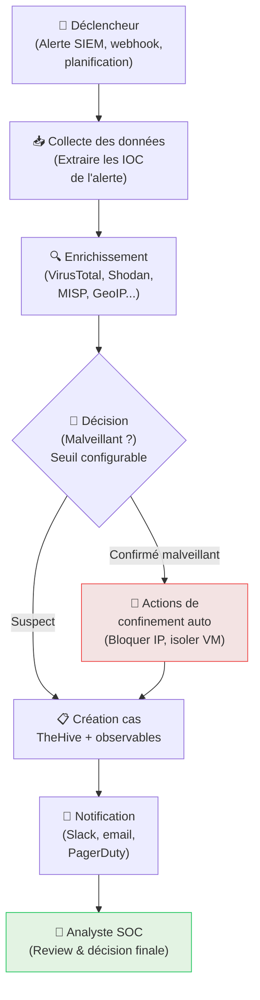

# Playbooks SOAR — Automatiser la Réponse aux Incidents

<div
  class="omny-meta"
  data-level="🟡 Intermédiaire"
  data-version="2025"
  data-time="~2 heures">
</div>

## Introduction

!!! quote "Analogie pédagogique — Le Programme de Cuisine Automatique"
    Un robot cuiseur comme le Thermomix dispose de **programmes préenregistrés** : vous sélectionnez "Risotto", il exécute automatiquement les étapes dans l'ordre (chauffer, ajouter les ingrédients, mélanger, timer). Vous n'avez pas à surveiller — le robot gère. Un **playbook SOAR** est ce programme : pour chaque type d'incident, il exécute automatiquement les étapes de réponse dans l'ordre défini.

Un playbook SOAR est un **workflow automatisé** déclenché sur un événement spécifique et qui exécute une séquence d'actions sans intervention humaine pour les étapes répétitives.

<br>

---

## Anatomie d'un playbook SOAR



<br>

---

## Playbook 1 — Brute Force SSH Automatique

```python title="Playbook Brute Force SSH — Pseudocode Shuffle"
# DÉCLENCHEUR : Alerte Wazuh
# Règle 100001 (brute force SSH) — niveau 10+

def playbook_brute_force_ssh(alert):
    # 1. Extraire l'IP attaquante
    attacker_ip = alert['data']['srcip']

    # 2. Enrichir l'IP
    vt_result = virustotal.lookup(attacker_ip)
    geo_result = maxmind.lookup(attacker_ip)

    # 3. Décision automatique
    if vt_result['malicious'] > 3:
        # IP malveillante connue → containment immédiat
        wazuh.active_response.block_ip(attacker_ip)
        message = f"🔴 IP malveillante BLOQUÉE : {attacker_ip} ({geo_result['country']})"
        severity = "HIGH"
    else:
        # IP inconnue → créer le cas pour review
        message = f"🟡 Brute Force SSH depuis {attacker_ip} ({geo_result['country']}) — Review requise"
        severity = "MEDIUM"

    # 4. Créer le cas TheHive
    case_id = thehive.create_case(
        title=f"Brute Force SSH — {attacker_ip}",
        severity=severity,
        observables=[
            {"type": "ip", "value": attacker_ip, "ioc": True}
        ]
    )

    # 5. Notifier le canal Slack SOC
    slack.post_message(
        channel="#soc-alerts",
        text=message,
        attachments=[{
            "color": "danger" if severity == "HIGH" else "warning",
            "fields": [
                {"title": "IP", "value": attacker_ip},
                {"title": "Pays", "value": geo_result['country']},
                {"title": "VT Détections", "value": str(vt_result['malicious'])},
                {"title": "Cas TheHive", "value": f"#{case_id}"}
            ]
        }]
    )
```

<br>

---

## Playbook 2 — Malware Détecté (ClamAV/Wazuh)

```yaml title="Playbook Malware — Workflow Shuffle (YAML simplifié)"
name: "Malware Detected Response"
trigger:
  type: webhook
  source: wazuh
  conditions:
    - rule.mitre.technique: T1486  # Ransomware
    - OR rule.description: contains("malware", "virus", "trojan")

steps:
  # Étape 1 : Extraire le contexte
  - name: "Extract Context"
    action: parse_json
    input: "{{trigger.data}}"
    output:
      host_ip: "{{data.agent.ip}}"
      file_hash: "{{data.syscheck.sha256_after}}"
      file_path: "{{data.syscheck.path}}"

  # Étape 2 : Analyser le hash
  - name: "Check Hash VirusTotal"
    action: virustotal.get_file_report
    input:
      hash: "{{steps.Extract_Context.file_hash}}"
    output:
      malicious_count: "{{response.data.attributes.last_analysis_stats.malicious}}"
      family: "{{response.data.attributes.popular_threat_classification.suggested_threat_label}}"

  # Étape 3 : Isoler la machine si ransomware
  - name: "Isolate Host"
    condition: "{{steps.Check_Hash.malicious_count}} > 10"
    action: wazuh.active_response
    input:
      command: "firewall-drop"
      agent_id: "{{trigger.agent.id}}"
      duration: 3600  # Isoler 1 heure

  # Étape 4 : Créer le cas TheHive
  - name: "Create Incident"
    action: thehive.create_case
    input:
      title: "Malware détecté — {{steps.Extract_Context.host_ip}}"
      severity: 4  # Critical
      tags: ["malware", "automated", "{{steps.Check_Hash.family}}"]
      description: |
        **Machine :** {{steps.Extract_Context.host_ip}}
        **Fichier :** {{steps.Extract_Context.file_path}}
        **Hash SHA256 :** {{steps.Extract_Context.file_hash}}
        **Famille :** {{steps.Check_Hash.family}}
        **Détections VT :** {{steps.Check_Hash.malicious_count}}

  # Étape 5 : Notifier d'urgence
  - name: "Critical Alert"
    action: slack.post_message
    input:
      channel: "#soc-critical"
      text: "🚨 MALWARE CRITIQUE — {{steps.Extract_Context.host_ip}} ISOLÉE — Cas TheHive #{{steps.Create_Incident.case_id}}"
```

<br>

---

## Conclusion

!!! quote "Ce qu'il faut retenir"
    Un bon playbook SOAR se reconnaît à deux critères : il **n'interrompt pas l'analyste** pour les actions répétitives (enrichissement, ticket, notification), et il **ne prend pas de décisions irréversibles** sans confirmation humaine (supprimer des données, éteindre un serveur de production). L'automatisation intelligente libère l'humain pour ce que les machines ne peuvent pas faire : le jugement contextuel.

> Terminez avec **[Cortex →](./cortex.md)** pour découvrir le moteur d'automatisation intégré à TheHive.

<br>