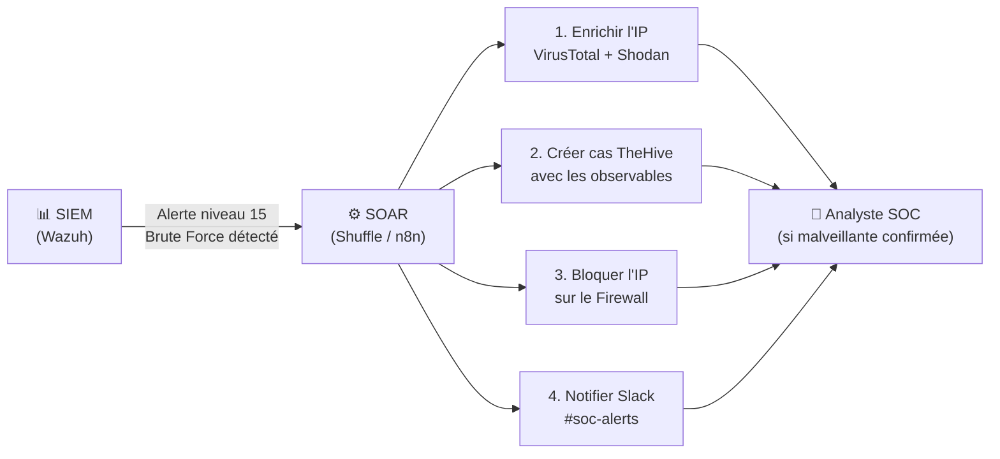

# SOAR — Security Orchestration, Automation & Response

<div
  class="omny-meta"
  data-level="🟡 Intermédiaire"
  data-version="2025"
  data-time="~2 heures">
</div>

## Introduction

!!! quote "Analogie pédagogique — Le Dispatcher des Urgences"
    Un centre d'urgences 112 reçoit des milliers d'appels par jour. Un bon dispatcher ne gère pas chaque appel manuellement de A à Z — il **orchestre** : il identifie le type d'urgence, déclenche automatiquement les bonnes ressources (pompiers, SAMU, police), notifie les parties prenantes et ne s'implique directement que pour les cas complexes nécessitant un jugement humain. Le **SOAR** est ce dispatcher pour votre SOC.

Le **SOAR** est une plateforme qui combine trois capacités :

| Pilier | Description |
|---|---|
| **Security Orchestration** | Connecter et coordonner tous les outils SOC (SIEM, TIP, EDR, firewall...) |
| **Automation** | Exécuter automatiquement des actions répétitives sans intervention humaine |
| **Response** | Déclencher des actions de réponse (bloquer une IP, désactiver un compte...) |

<br>

---

## SIEM vs SOAR — Complémentarité



_Le SIEM **détecte** et **alerte**. Le SOAR **réagit**, **enrichit** et **coordonne**. L'analyste ne voit que les alertes nécessitant un jugement humain — déjà contextualisées et avec les premières actions déjà effectuées._

<br>

---

## Métriques clés : MTTD et MTTR

| Métrique | Signification | Objectif |
|---|---|---|
| **MTTD** | Mean Time To Detect — délai moyen entre l'attaque et sa détection | Le plus bas possible (< 1h idéalement) |
| **MTTR** | Mean Time To Respond — délai moyen entre la détection et la remédiation | Le plus bas possible (< 4h pour P1) |
| **MTTI** | Mean Time To Investigate — délai d'investigation | < 30 min pour les cas simples |

!!! tip "Impact du SOAR sur les métriques"
    Selon les études du secteur, un SOC avec SOAR réduit son **MTTR de 60 à 80%** sur les incidents courants (brute force, phishing, malware connu) en automatisant l'enrichissement et les premières actions de containment.

<br>

---

## Shuffle — SOAR Open-Source

**Shuffle** est le SOAR open-source le plus accessible pour un SOC en construction. Il propose une interface visuelle de création de workflows (drag & drop).

```bash title="Installation Shuffle — Docker Compose"
git clone https://github.com/Shuffle/Shuffle
cd Shuffle

# Démarrer Shuffle
docker compose up -d

# Interface web sur http://localhost:3001
# Identifiants par défaut : admin@example.com / password

# Shuffle se connecte nativement à :
# - Wazuh (via webhook)
# - TheHive (via API)
# - MISP (via API)
# - VirusTotal (via API)
# - Slack / Discord (via webhook)
```

**Exemple de workflow Shuffle — Réponse automatique au phishing :**

```yaml title="Logique d'un workflow Shuffle anti-phishing"
# Déclencheur : alerte Wazuh sur email suspect (règle Sysmon Event ID 1 + Outlook)
Trigger: Wazuh Webhook
  → Rule level >= 10
  → Rule description contains "phishing OR suspicious email"

# Étape 1 : Extraire les IOC de l'alerte
Action: Parse alert
  → Extract: sender_ip, attachment_hash, url_in_email

# Étape 2 : Enrichir les IOC
Action: VirusTotal lookup
  → Input: attachment_hash
  → Output: malicious_score, detections

Action: URLScan.io lookup
  → Input: url_in_email
  → Output: screenshot, verdict

# Étape 3 : Créer un cas TheHive
Action: TheHive Create Case
  → Title: "Phishing suspect — {sender_email}"
  → Severity: if malicious_score > 50 then HIGH else MEDIUM
  → Add observables: sender_ip, hash, url

# Étape 4 : Actions de containment (si malveillant confirmé)
Condition: malicious_score > 70
  → True:
    - Bloquer l'IP source sur le firewall (API Palo Alto / pfSense)
    - Notifier Slack #soc-critical avec le rapport
    - Désactiver le compte email si pièce jointe exécutée
  → False:
    - Notifier Slack #soc-alerts pour review manuelle
```

<br>

---

## Conclusion

!!! quote "Ce qu'il faut retenir"
    Le SOAR est l'investissement qui rend votre SOC **scalable**. Sans lui, chaque nouvelle alerte est une charge de travail supplémentaire pour l'équipe. Avec lui, les alertes répétitives sont traitées en secondes, les analystes sont libérés pour la vraie investigation, et votre MTTR s'effondre. Pour un SOC open-source, Shuffle + Wazuh + TheHive + MISP forme une stack de réponse aux incidents entièrement automatisable.

> Continuez avec **[Playbooks SOAR →](./playbooks.md)** pour apprendre à concevoir des workflows de réponse automatique.

<br>