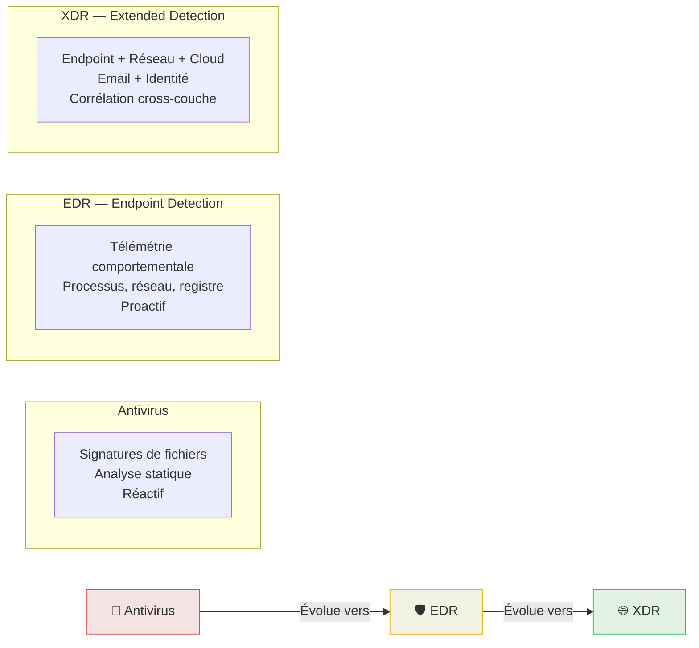
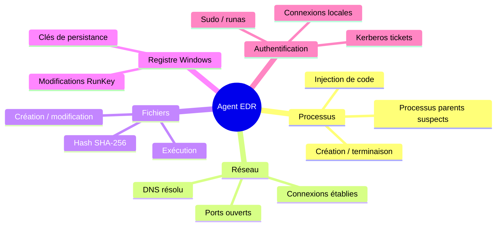

# EDR / XDR — Détection & Réponse Endpoint

<div
  class="omny-meta"
  data-level="🟡 Intermédiaire"
  data-version="2025"
  data-time="~2-3 heures">
</div>

## Introduction

!!! quote "Analogie pédagogique — Le Moniteur Cardiaque Continu"
    Un électrocardiogramme en continu ne se contente pas de mesurer votre fréquence cardiaque — il analyse **chaque battement**, détecte les arythmies, enregistre l'historique et alerte immédiatement le cardiologue en cas d'anomalie. L'**EDR** fait exactement cela pour votre endpoint : il surveille chaque processus, chaque connexion réseau, chaque modification de fichier, **en continu**, et corrèle ces événements pour détecter les comportements malveillants.

L'**EDR (Endpoint Detection & Response)** est la couche de sécurité qui surveille l'activité interne de chaque machine — là où les IDS/IPS et les firewalls sont aveugles (trafic chiffré, attaques locales, mouvements latéraux).

<br>

---

## EDR vs XDR vs Antivirus



| Capacité | Antivirus | EDR | XDR |
|---|:---:|:---:|:---:|
| Détection par signature | ✅ | ✅ | ✅ |
| Analyse comportementale | ❌ | ✅ | ✅ |
| Télémétrie processus/réseau | ❌ | ✅ | ✅ |
| Corrélation multi-sources | ❌ | ❌ | ✅ |
| Réponse automatique | Limitée | ✅ | ✅ |
| Forensic endpoint | ❌ | ✅ | ✅ |

<br>

---

## Ce que collecte un EDR

Un agent EDR surveille en temps réel les **événements endpoint** les plus critiques :



<br>

---

## Wazuh en mode XDR

Wazuh, avec ses agents déployés sur tous les endpoints, remplit naturellement un rôle **XDR** en corrélant les événements de multiples sources.

**Capacités XDR natives de Wazuh :**

| Capacité XDR | Implémentation Wazuh |
|---|---|
| **FIM (File Integrity Monitoring)** | Surveillance en temps réel des fichiers critiques |
| **Vulnerability Detection** | Inventaire CVE des packages installés |
| **SCA (Security Config Assessment)** | Audit de durcissement (CIS Benchmarks) |
| **Active Response** | Blocage automatique IP, kill processus |
| **Rootcheck** | Détection de rootkits et backdoors |
| **Command monitoring** | Surveillance des commandes exécutées |

```xml title="ossec.conf — Activer la détection de rootkits"
<ossec_config>
  <!-- Surveillance des rootkits et anomalies systèmes -->
  <rootcheck>
    <disabled>no</disabled>
    <frequency>7200</frequency>         <!-- Scan toutes les 2 heures -->
    <rootkit_files>etc/shared/rootkit_files.txt</rootkit_files>
    <rootkit_trojans>etc/shared/rootkit_trojans.txt</rootkit_trojans>
    <system_audit>etc/shared/system_audit_rcl.txt</system_audit>
    <check_unixaudit>yes</check_unixaudit>
    <check_winapps>yes</check_winapps>
    <check_winaudit>yes</check_winaudit>
  </rootcheck>
</ossec_config>
```

<br>

---

## Velociraptor — Forensic EDR Open-Source

**Velociraptor** est un outil EDR orienté **investigation forensique** et **threat hunting** à grande échelle. Il permet d'interroger simultanément des milliers d'endpoints en quelques secondes.

```bash title="Installation Velociraptor Server (Linux)"
# Télécharger le binaire Velociraptor
wget https://github.com/Velocidex/velociraptor/releases/latest/download/velociraptor-v0.7.0-linux-amd64

chmod +x velociraptor-v0.7.0-linux-amd64
mv velociraptor-v0.7.0-linux-amd64 /usr/local/bin/velociraptor

# Générer la configuration serveur
velociraptor config generate -i

# Lancer le serveur
velociraptor --config server.config.yaml frontend -v
```

**Exemple de VQL (Velociraptor Query Language) — Chasse aux persistances** :

```sql title="VQL — Détecter les entrées de registre de persistance (Windows)"
-- Requête exécutée sur tous les agents simultanément
SELECT Key, Name, Data
FROM glob(globs="HKEY_LOCAL_MACHINE/SOFTWARE/Microsoft/Windows/CurrentVersion/Run/*")
WHERE Data =~ "\\.exe$"   -- Chercher les exécutables dans les clés Run
  AND NOT Data =~ "C:\\\\Program Files"  -- Exclure les logiciels légitimes
```

_Cette requête s'exécute en quelques secondes sur l'ensemble du parc et retourne tous les programmes configurés pour démarrer automatiquement — une technique classique de persistance malveillante._

<br>

---

## Conclusion

!!! quote "Ce qu'il faut retenir"
    L'EDR/XDR est la réponse à une vérité fondamentale : **les attaques se passent sur les endpoints**, pas sur le réseau. Un ransomware qui chiffre vos fichiers n'émet peut-être aucun trafic réseau suspect — mais il crée des milliers de fichiers, consomme du CPU et modifie les extensions. Seul un EDR voit cela. Wazuh vous offre cette visibilité gratuitement, sur tous vos systèmes.

> Continuez avec le cours **[NDR →](./ndr.md)** pour comprendre comment surveiller les comportements anormaux sur le réseau lui-même.

<br>