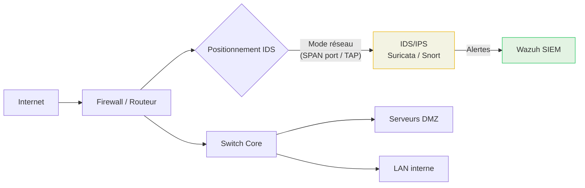

# IDS / IPS

## Introduction à la Détection & Prévention d'Intrusion Réseau

!!! quote "Analogie pédagogique — Le Vigile à l'Entrée"
    Un IDS est comme un **vigile qui observe** à l'entrée d'un bâtiment et note tous les comportements suspects dans un registre. L'IPS est le même vigile, mais avec **le pouvoir de refuser l'entrée** et d'expulser les intrus immédiatement. L'un documente, l'autre agit.

Les systèmes de détection et de prévention d'intrusion surveillent le **trafic réseau en temps réel** à la recherche de signatures d'attaques connues ou de comportements anormaux.

| Type | Acronyme | Action |
|---|---|---|
| **Intrusion Detection System** | IDS | Détecte et alerte — passif |
| **Intrusion Prevention System** | IPS | Détecte et bloque — actif |

 

---

## Modes de détection

### Par signature

Comparison du trafic avec une base de **signatures d'attaques connues** (Emerging Threats, Snort Community). Très efficace contre les menaces connues, aveugle sur le zero-day.

### Par anomalie

Modélisation d'un **comportement de référence** (baseline) puis alerte sur les écarts. Détecte les attaques inconnues mais génère plus de faux positifs.

### Hybride

Combinaison des deux approches — la majorité des outils modernes comme **Suricata** utilisent cette méthode.

 

---

## Positionnement réseau

_En mode **réseau passif** (port SPAN), l'IDS reçoit une copie du trafic et n'interfère pas avec le flux. En mode **IPS inline**, il est positionné sur le chemin du trafic et peut bloquer activement._

 

---

## Outils de référence

-   :lucide-shield:{ .lg .middle } **Suricata**

    ---
    IDS/IPS haute performance, multi-threadé, règles Emerging Threats, intégration Wazuh native. **Recommandé pour les nouveaux déploiements.**

    [:lucide-book-open-check: Cours Suricata →](./suricata.md)

-   :lucide-shield-alert:{ .lg .middle } **Snort**

    ---
    La référence historique. Règles Snort Community, large écosystème, base de nombreux autres outils.

    [:lucide-book-open-check: Cours Snort →](./snort.md)

 

---

## Conclusion

!!! quote "IDS vs IPS — Quel choix pour votre SOC ?"
    En SOC, on commence souvent en **mode IDS** (passif) pour éviter les faux positifs bloquants, puis on passe progressivement en **mode IPS** sur les règles les plus fiables. Suricata gère les deux modes sans reconfiguration majeure.

> Commencez par **[Suricata →](./suricata.md)** — c'est l'outil recommandé pour tout nouveau déploiement SOC.

 
