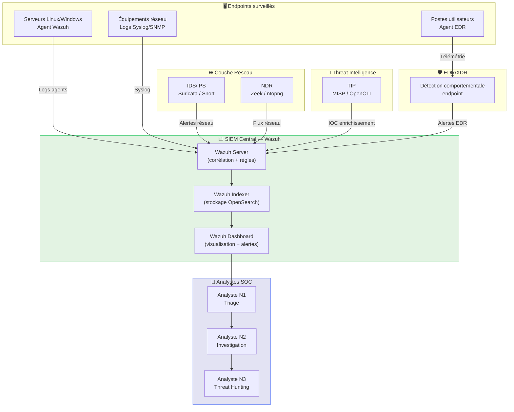

# Architecture SOC

## Introduction

!!! quote "Analogie pédagogique — L'Hôpital de Réanimation"
    Un service de réanimation ne fonctionne pas avec un seul médecin et un seul outil. Il y a des **moniteurs cardiaques** (capteurs constants), un **poste central de surveillance** (corrélation des données), des **équipes spécialisées** (analyse et réponse), et des **protocoles d'intervention** clairs. Si un patient décroche, l'alarme sonne immédiatement et le protocole démarre. Un SOC est identique : chaque composant a un rôle précis, et l'absence de l'un fragilise l'ensemble.

Un SOC moderne est une **architecture distribuée** de collecte, corrélation et réponse. Il ne repose pas sur un seul outil magique, mais sur la **complémentarité de 5 briques techniques** qui s'alimentent mutuellement pour former une chaîne de détection sans angle mort.

 

---

## Les 5 briques d'un SOC moderne

_Ce diagramme illustre comment chaque brique collecte des données spécifiques et les achemine vers le SIEM central qui sert de point de corrélation pour les analystes._

 

---

### 1 — SIEM : le cerveau

Le **SIEM (Security Information and Event Management)** est le composant central. Il collecte, normalise, corrèle et alerte sur l'ensemble des événements de sécurité.

**En OmnyDocs, nous utilisons [Wazuh](./siem.md)** — la solution SIEM/XDR open-source de référence, dont l'architecture moderne repose sur 4 composants distincts :

| Composant | Rôle |
|---|---|
| **Wazuh Indexer** | Stockage et indexation des événements (OpenSearch) |
| **Wazuh Server** | Moteur de corrélation, décodeurs, règles de détection |
| **Wazuh Dashboard** | Interface de visualisation, alertes, tableaux de bord |
| **Wazuh Agent** | Capteur déployé sur chaque endpoint surveillé |

[:lucide-book-open-check: Cours complet — Wazuh SIEM/XDR](./siem.md)

 

---

### 2 — EDR/XDR : la télémétrie endpoint

L'**EDR (Endpoint Detection & Response)** surveille en continu le comportement de chaque machine : processus lancés, connexions réseau, fichiers créés, clés de registre modifiées. L'**XDR** étend cette visibilité à l'ensemble de l'infrastructure (cloud, email, réseau).

[:lucide-book-open-check: Cours complet — EDR/XDR](./edr-xdr.md)

 

---

### 3 — IDS/IPS : la sentinelle réseau

L'**IDS (Intrusion Detection System)** analyse le trafic réseau en temps réel et lève des alertes sur les signatures connues (attaques, scans, exploits). L'**IPS** va plus loin en **bloquant activement** le trafic malveillant.

| Outil | Type | Force |
|---|---|---|
| **Suricata** | IDS/IPS | Haute performance, règles Emerging Threats, intégration Wazuh |
| **Snort** | IDS/IPS | Référence historique, grande communauté |

[:lucide-book-open-check: Cours complet — IDS/IPS](./ids-ips/index.md)

 

---

### 4 — NDR : la cartographie du réseau

Le **NDR (Network Detection & Response)** complète l'IDS en analysant les **métadonnées de flux réseau** plutôt que les paquets bruts. Il détecte les comportements anormaux (exfiltration lente, mouvements latéraux, beaconing C2) qui échappent aux signatures.

[:lucide-book-open-check: Cours complet — NDR](./ndr.md) | [:lucide-book-open-check: ntopng](./ntopng.md)

 

---

### 5 — TIP : l'intelligence externe

La **TIP (Threat Intelligence Platform)** centralise et enrichit les indicateurs de compromission (IOC) provenant de sources externes (MISP, feeds commerciaux, CERT-FR). Elle alimente le SIEM pour corréler les alertes internes avec la menace mondiale connue.

[:lucide-book-open-check: Cours complet — Threat Intelligence Platform](./tip.md)

 

---

    style G fill:#e3f3e3,stroke:#22c55e

 

---

## Piloter l'efficacité du SOC

Un SOC ne se juge pas au nombre d'outils installés, mais à sa capacité à **réduire l'exposition au risque**.

### 1 — Métriques Clés (KPIs)
Le succès opérationnel se mesure principalement sur deux axes temporels :

- **MTTD (Mean Time To Detect)** : Temps moyen entre l'intrusion initiale et sa détection. L'objectif est de passer de plusieurs mois (moyenne mondiale) à quelques heures.
- **MTTR (Mean Time To Respond)** : Temps moyen pour contenir la menace après détection.

### 2 — Mesurer la Visibilité (DeTTECT)
Pour éviter les angles morts, le SOC utilise des frameworks comme **DeTTECT** pour mapper la visibilité réelle (quels logs j'ai ?) par rapport aux techniques MITRE ATT&CK.

!!! bug "Le piège de la fausse sécurité"
    Avoir un SIEM sans logs PowerShell ou sans télémétrie Sysmon crée un **angle mort critique** : vous croyez être protégé, mais vous êtes aveugle aux techniques d'exécution les plus courantes.

 

---

## Conclusion

!!! quote "Ce qu'il faut retenir"
    L'architecture SOC n'est pas une liste de produits à acheter, c'est une **stratégie de visibilité**. Chaque brique répond à la question : **"Que vais-je voir et que vais-je rater ?"** L'objectif est de multiplier les points de détection pour qu'un attaquant doive contourner simultanément plusieurs technologies indépendantes — une tâche exponentiellement plus complexe.

> Commencez par le cours sur **[Wazuh SIEM/XDR →](./siem.md)** — c'est la brique centrale autour de laquelle tout s'articule.

 