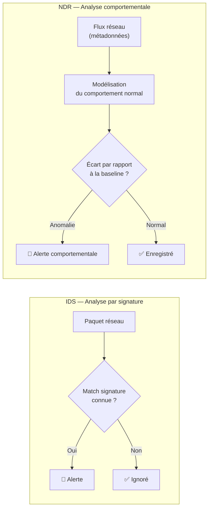

# NDR — Network Detection & Response

<div
  class="omny-meta"
  data-level="🟡 Intermédiaire"
  data-version="2025"
  data-time="~2 heures">
</div>

## Introduction

!!! quote "Analogie pédagogique — La Caméra de Surveillance Intelligente"
    Une caméra classique enregistre tout sans analyser. Une caméra **intelligente** détecte les comportements anormaux : quelqu'un qui tourne en rond, une voiture garée trop longtemps, un groupe qui s'attroupe. Le **NDR** fait cela sur votre réseau : il n'analyse pas chaque paquet (comme l'IDS), il analyse les **comportements** de vos flux réseau — et c'est ainsi qu'il détecte des attaques lentes et discrètes que les signatures ne verront jamais.

Le **NDR (Network Detection & Response)** analyse les **métadonnées de flux réseau** (qui parle à qui, combien, quand) plutôt que le contenu des paquets. Cette approche est particulièrement efficace pour détecter :

- Les **mouvements latéraux** (un serveur qui parle soudainement à 50 autres serveurs)
- L'**exfiltration lente** (100 Mo envoyés vers une IP externe sur 3 jours)
- Le **beaconing C2** (connexion régulière toutes les 5 minutes vers une IP externe)
- Les **tunnels DNS/HTTPS** (trafic chiffré utilisé comme canal de commande)

<br>

---

## IDS vs NDR — La différence fondamentale



_L'IDS rate un attaquant qui utilise du trafic HTTPS chiffré. Le NDR voit que ce serveur fait 200 connexions HTTPS vers des IPs externes inhabituelles — comportement anormal, alerte levée même sans signature._

<br>

---

## Zeek — Analyse comportementale réseau

**Zeek** (anciennement Bro) est le moteur d'analyse réseau de référence. Il extrait automatiquement les **métadonnées structurées** de chaque flux et les écrit dans des fichiers de logs séparés par protocole.

```bash title="Installation Zeek — Ubuntu 22.04"
# Ajouter le dépôt Zeek
echo 'deb http://download.opensuse.org/repositories/security:/zeek/xUbuntu_22.04/ /' \
  | tee /etc/apt/sources.list.d/security:zeek.list

curl -fsSL https://download.opensuse.org/repositories/security:zeek/xUbuntu_22.04/Release.key \
  | gpg --dearmor | tee /etc/apt/trusted.gpg.d/security_zeek.gpg > /dev/null

apt-get update && apt-get install -y zeek

# Configurer l'interface réseau à surveiller
echo "interface=eth0" >> /opt/zeek/etc/node.cfg

# Démarrer Zeek
/opt/zeek/bin/zeekctl deploy
```

**Logs générés automatiquement par Zeek :**

| Fichier de log | Contenu |
|---|---|
| `conn.log` | Toutes les connexions réseau (IP, port, durée, octets) |
| `dns.log` | Toutes les requêtes/réponses DNS |
| `http.log` | Requêtes HTTP (méthode, URI, User-Agent, réponse) |
| `ssl.log` | Sessions TLS (certificat, version, cipher) |
| `files.log` | Fichiers transférés (hash MD5/SHA1, MIME type) |
| `notice.log` | Alertes Zeek (scripts d'analyse) |

```bash title="Exemples de requêtes sur les logs Zeek"
# Trouver toutes les connexions vers des IPs externes (exfiltration potentielle)
zeek-cut id.orig_h id.resp_h resp_bytes duration < conn.log \
  | awk '$3 > 1000000'  # Plus de 1 Mo transféré

# Identifier les domaines DGA (chaînes aléatoires dans le DNS)
zeek-cut query < dns.log | sort | uniq -c | sort -rn | head -20

# Connexions HTTPS vers des IPs suspectes (sans nom de domaine = suspect)
zeek-cut id.orig_h id.resp_h server_name < ssl.log \
  | grep -v "\." | grep -v "^$"  # Pas de SNI = potentiel C2
```

<br>

---

## Arkime — Capture et analyse de paquets complets (PCAP)

**Arkime** (anciennement Moloch) est un système de **capture complète de paquets** (full PCAP) avec interface de recherche. Il enregistre tout le trafic et permet de retrouver le contexte exact d'un incident.

```bash title="Installation Arkime — Ubuntu 22.04"
# Télécharger le paquet Arkime
wget https://github.com/arkime/arkime/releases/download/v5.4.0/arkime_5.4.0-1_amd64.deb

# Installer les dépendances et Arkime
apt-get install -y libwww-perl
dpkg -i arkime_5.4.0-1_amd64.deb

# Configurer (interface, Elasticsearch/OpenSearch)
/opt/arkime/bin/Configure

# Initialiser la base de données
/opt/arkime/db/db.pl http://localhost:9200 init

# Démarrer les services
systemctl enable --now arkimecapture arkimeviewer
```

!!! tip "Stockage PCAP"
    La capture complète de paquets génère **beaucoup de données**. En production, prévoyez des rotations automatiques et un stockage dédié (SAN/NAS). Pour un lab, limitez la rétention à 7 jours.

<br>

---

## Conclusion

!!! quote "Ce qu'il faut retenir"
    Le NDR est l'outil qui détecte ce que les autres ne voient pas : les attaques **lentes**, **discrètes** et **chiffrées**. Un attaquant sophistiqué évite de déclencher les signatures IDS — mais il ne peut pas cacher que son implant contacte un serveur C2 toutes les 5 minutes. Le NDR voit ces patterns comportementaux. Zeek + Wazuh forme une combinaison redoutable et entièrement open-source.

> Continuez avec **[ntopng →](./ntopng.md)** pour le monitoring réseau temps réel, puis **[TIP →](./tip.md)** pour l'enrichissement par la Threat Intelligence.

<br>