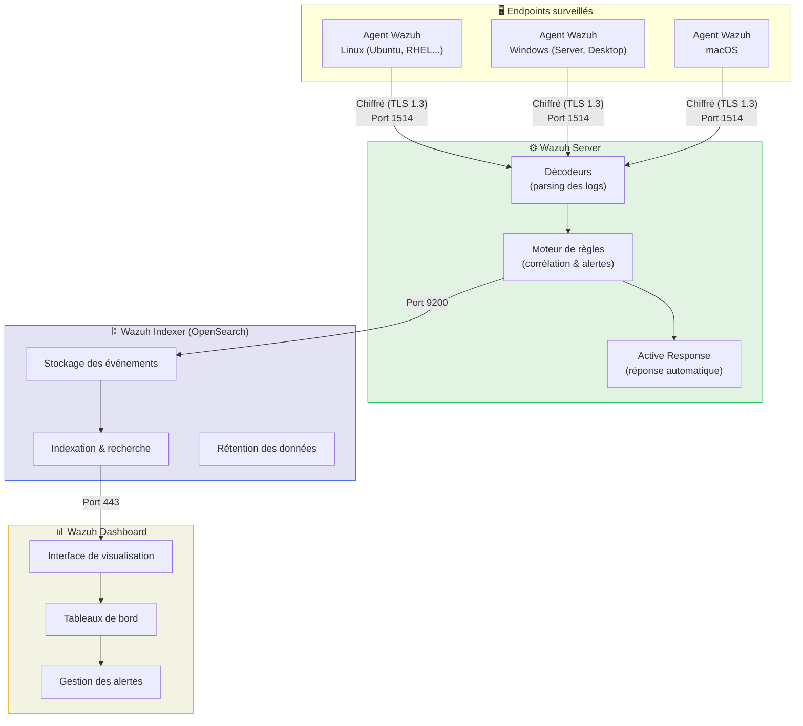

# Wazuh — SIEM & XDR Open-Source

<div
  class="omny-meta"
  data-level="🟡 Intermédiaire → 🔴 Avancé"
  data-version="Wazuh 4.x"
  data-time="~6-8 heures">
</div>

## Introduction

!!! quote "Analogie pédagogique — Le Système Nerveux Central"
    Imaginez votre infrastructure comme un corps humain. Les endpoints (serveurs, postes) sont les **organes**. Les agents Wazuh sont les **terminaisons nerveuses** qui captent chaque signal (processus lancé, fichier modifié, connexion établie). Le **Wazuh Server** est la **moelle épinière** qui traite ces signaux et détecte les anomalies. Le **Wazuh Indexer** est la **mémoire long terme** qui stocke tout. Et le **Wazuh Dashboard** est le **cerveau conscient** — l'interface où l'analyste voit, analyse et décide.

**Wazuh** est la solution SIEM/XDR open-source la plus déployée au monde dans les SOC. Elle unifie en une seule plateforme : la **collecte de logs**, la **détection de menaces**, la **réponse aux incidents**, la **conformité réglementaire** et la **surveillance de l'intégrité des fichiers (FIM)**.

> Wazuh n'est pas un simple agrégateur de logs — c'est un moteur de **corrélation comportementale** capable de détecter des attaques sophistiquées en corrélant des événements provenant de dizaines de sources simultanément.

!!! info "Pourquoi Wazuh ?"
    - **Open-source et gratuit** : aucune licence, déploiement illimité
    - **Architecture moderne** : 4 composants découplés et scalables
    - **Intégrations natives** : Suricata, MISP, VirusTotal, TheHive
    - **Conformité intégrée** : PCI DSS, HIPAA, NIST, GDPR
    - **Communauté active** : 20 000+ stars GitHub, documentation officielle exhaustive

<br>

---

## Architecture Wazuh 4.x

L'architecture moderne de Wazuh se compose de **4 composants distincts** qui peuvent être déployés sur la même machine (environnement de lab) ou distribués sur plusieurs serveurs (production).



_Chaque agent collecte les événements de son endpoint et les transmet chiffrés au Wazuh Server. Celui-ci les décode, applique ses règles de corrélation, génère les alertes et envoie le tout vers l'Indexer pour stockage persistant. Le Dashboard interroge l'Indexer pour afficher les données à l'analyste._

<br>

---

## Les 4 composants en détail

### 🗂️ Wazuh Indexer

Le **Wazuh Indexer** est basé sur **OpenSearch** (fork open-source d'Elasticsearch). Il assure le stockage, l'indexation et la recherche rapide de tous les événements de sécurité.

| Caractéristique | Détail |
|---|---|
| **Base** | OpenSearch 2.x |
| **Port d'écoute** | 9200 (API REST), 9300 (cluster) |
| **Rétention** | Configurable (par défaut : rotation selon l'espace disque) |
| **Scalabilité** | Cluster multi-nœuds possible (production) |
| **Authentification** | Certificats TLS + utilisateurs internes |

!!! tip "Dimensionnement"
    En lab mono-nœud, comptez **4 Go RAM minimum** pour l'Indexer seul. En production, prévoyez **8-16 Go RAM** par nœud et un stockage SSD rapide (les recherches en dépendent directement).

<br>

### ⚙️ Wazuh Server

Le **Wazuh Server** est le cœur analytique. Il reçoit les logs des agents, les **décode** (parsing), les fait passer par le **moteur de règles** pour générer des alertes, et peut déclencher des **réponses actives** automatiques.

**Les décodeurs** transforment les logs bruts en données structurées :

```xml title="Exemple de décodeur — Authentification SSH"
<!-- Fichier : /var/ossec/etc/decoders/local_decoder.xml -->
<decoder name="sshd-custom">
  <!-- Filtre : on cible uniquement les logs sshd -->
  <program_name>sshd</program_name>

  <!-- Extraction des champs clés du log -->
  <regex>^Failed password for (\S+) from (\S+) port</regex>
  <order>user, srcip</order>
</decoder>
```

_Ce décodeur extrait automatiquement le `user` et l'`srcip` (IP source) de chaque tentative SSH échouée, rendant ces champs interrogeables dans le Dashboard._

**Le moteur de règles** applique des conditions pour générer des alertes :

```xml title="Exemple de règle — Brute Force SSH (5 échecs / 2 min)"
<!-- Fichier : /var/ossec/etc/rules/local_rules.xml -->
<rule id="100001" level="10">
  <!-- On hérite de la règle de base "echec auth SSH" (id 5716) -->
  <if_matched_sid>5716</if_matched_sid>

  <!-- Déclenchement si la même IP échoue 5 fois en 120 secondes -->
  <same_srcip/>
  <frequency>5</frequency>
  <timeframe>120</timeframe>

  <description>Brute Force SSH détecté — même IP, 5 échecs en 2 min</description>
  <mitre>
    <!-- Mappage MITRE ATT&CK : T1110 = Brute Force -->
    <id>T1110</id>
  </mitre>
</rule>
```

_Cette règle de corrélation temporelle est l'un des patterns les plus puissants de Wazuh : elle ne se déclenche pas sur un seul événement, mais sur une **fréquence anormale** dans un laps de temps défini._

<br>

### 📊 Wazuh Dashboard

Le **Wazuh Dashboard** est l'interface graphique basée sur **OpenSearch Dashboards**. C'est l'outil quotidien de l'analyste SOC.

**Modules disponibles :**

| Module | Description |
|---|---|
| **Security Events** | Vue centralisée de toutes les alertes en temps réel |
| **Integrity Monitoring (FIM)** | Détection de modifications de fichiers critiques |
| **Vulnerability Detector** | Inventaire des CVE affectant vos endpoints |
| **MITRE ATT&CK** | Mapping automatique des alertes sur le framework MITRE |
| **Compliance (PCI, HIPAA...)** | Tableaux de conformité réglementaire |
| **Security Configuration Assessment** | Audit de durcissement de vos systèmes |

<br>

### 🔌 Wazuh Agent

L'**agent Wazuh** est le capteur léger déployé sur chaque endpoint surveillé. Il collecte en continu :

- Les **logs système** (Syslog Linux, Event Log Windows)
- Les **événements de processus** (création, terminaison)
- Les **connexions réseau actives**
- Les **modifications de fichiers** (FIM)
- Les **paquets installés** (inventaire logiciel)
- Les **vulnérabilités** (via la base CVE)

```bash title="Installation de l'agent — Ubuntu 22.04"
# 1. Télécharger et ajouter le dépôt Wazuh
curl -s https://packages.wazuh.com/key/GPG-KEY-WAZUH | gpg --dearmor -o /usr/share/keyrings/wazuh.gpg

echo "deb [signed-by=/usr/share/keyrings/wazuh.gpg] https://packages.wazuh.com/4.x/apt/ stable main" \
  | tee /etc/apt/sources.list.d/wazuh.list

# 2. Installer l'agent
apt-get update && apt-get install -y wazuh-agent

# 3. Pointer l'agent vers votre Wazuh Server
# Remplacer <WAZUH_SERVER_IP> par l'IP de votre serveur
WAZUH_MANAGER="<WAZUH_SERVER_IP>" \
WAZUH_REGISTRATION_PASSWORD="votre_mot_de_passe" \
  dpkg-reconfigure wazuh-agent

# 4. Démarrer et activer l'agent
systemctl daemon-reload
systemctl enable --now wazuh-agent
```

_L'agent s'enregistre automatiquement auprès du Wazuh Server via un protocole sécurisé. Une fois enregistré, il apparaît instantanément dans le Dashboard._

<br>

---

## Installation complète en environnement de lab

L'installation officielle recommandée pour un lab est le **script d'installation tout-en-un** de Wazuh, qui déploie les 4 composants sur une seule machine.

!!! warning "Prérequis système"
    - **OS** : Ubuntu 22.04 LTS (recommandé) ou RHEL 9
    - **RAM** : 8 Go minimum (16 Go recommandé)
    - **CPU** : 4 vCPU minimum
    - **Stockage** : 50 Go SSD minimum (pour les index)
    - **Réseau** : Ports 443, 1514, 1515, 9200 ouverts

```bash title="Installation Wazuh 4.x — Script officiel tout-en-un"
# 1. Télécharger le script d'installation Wazuh
curl -sO https://packages.wazuh.com/4.12/wazuh-install.sh
curl -sO https://packages.wazuh.com/4.12/config.yml

# 2. Éditer la configuration (nommer les nœuds, définir les IPs)
# Modifier config.yml : remplacer les placeholders par vos IPs réelles
nano config.yml

# 3. Générer les certificats et les fichiers de configuration
bash wazuh-install.sh --generate-config-files

# 4. Installer le Wazuh Indexer
bash wazuh-install.sh --wazuh-indexer node-1

# 5. Démarrer le cluster Indexer
bash wazuh-install.sh --start-cluster

# 6. Installer le Wazuh Server
bash wazuh-install.sh --wazuh-server wazuh-1

# 7. Installer le Wazuh Dashboard
bash wazuh-install.sh --wazuh-dashboard dashboard

# 8. Récupérer le mot de passe admin généré
tar -xvf wazuh-passwords.tar -O | grep -P "\'admin\'" -A 1
```

_Le script prend environ 10-15 minutes sur une machine correctement dimensionnée. À la fin, les credentials admin sont affichés — **notez-les immédiatement**._

<br>

---

## Configuration essentielle du Wazuh Server

### Fichier principal : `ossec.conf`

```xml title="/var/ossec/etc/ossec.conf — Configuration minimale recommandée"
<ossec_config>

  <!-- Configuration globale -->
  <global>
    <!-- Niveau d'alerte minimum pour envoyer vers l'Indexer -->
    <jsonout_output>yes</jsonout_output>
    <alerts_log>yes</alerts_log>
    <!-- Activer les alertes email (optionnel) -->
    <email_notification>no</email_notification>
  </global>

  <!-- Surveillance de l'intégrité des fichiers (FIM) -->
  <syscheck>
    <!-- Vérification toutes les 12 heures -->
    <frequency>43200</frequency>
    <!-- Répertoires critiques à surveiller -->
    <directories check_all="yes" realtime="yes">/etc</directories>
    <directories check_all="yes" realtime="yes">/usr/bin</directories>
    <directories check_all="yes" realtime="yes">/usr/sbin</directories>
    <!-- Exclure les répertoires qui changent souvent (éviter le bruit) -->
    <ignore>/etc/mtab</ignore>
    <ignore>/etc/hosts.deny</ignore>
  </syscheck>

  <!-- Réponse active : bloquer les IPs en brute force -->
  <active-response>
    <command>firewall-drop</command>
    <!-- Déclencher sur la règle 100001 (brute force SSH) -->
    <rules_id>100001</rules_id>
    <!-- Durée du blocage : 600 secondes (10 minutes) -->
    <timeout>600</timeout>
  </active-response>

  <!-- Connexion vers l'Indexer -->
  <indexer>
    <enabled>yes</enabled>
    <hosts>
      <host>https://127.0.0.1:9200</host>
    </hosts>
    <ssl>
      <certificate_authorities>
        <ca>/etc/filebeat/certs/root-ca.pem</ca>
      </certificate_authorities>
    </ssl>
  </indexer>

</ossec_config>
```

_Le fichier `ossec.conf` contrôle l'ensemble du comportement du Wazuh Server. Toute modification nécessite un redémarrage du service (`systemctl restart wazuh-manager`)._

<br>

---

## Créer vos premières règles de détection

Wazuh dispose de **plus de 3 000 règles prédéfinies**. Vous pouvez les enrichir avec vos propres règles dans `/var/ossec/etc/rules/local_rules.xml`.

```xml title="/var/ossec/etc/rules/local_rules.xml — Exemples de règles SOC"
<group name="soc_custom,">

  <!-- Règle 1 : Connexion SSH depuis une IP non-française (geo-filtering) -->
  <rule id="100010" level="8">
    <!-- Hérite de la règle "connexion SSH réussie" (5715) -->
    <if_matched_sid>5715</if_matched_sid>
    <!-- IP source n'appartient pas à la plage FR (simplifié) -->
    <not_match>^(185\.|176\.|80\.|90\.)</not_match>
    <description>Connexion SSH réussie depuis IP potentiellement étrangère</description>
    <mitre>
      <!-- T1078 : Valid Accounts (utilisation de credentials légitimes) -->
      <id>T1078</id>
    </mitre>
  </rule>

  <!-- Règle 2 : Création d'un nouvel utilisateur (élévation de privilèges potentielle) -->
  <rule id="100020" level="12">
    <if_sid>5902</if_sid>
    <description>Nouvel utilisateur système créé — vérifier si autorisé</description>
    <mitre>
      <!-- T1136 : Create Account -->
      <id>T1136</id>
    </mitre>
  </rule>

  <!-- Règle 3 : Processus enfant de Word/Excel (macro malveillante) -->
  <rule id="100030" level="15">
    <!-- Depuis un event Sysmon (Event ID 1 = création de processus) -->
    <if_sid>61603</if_sid>
    <!-- Le processus parent est Word ou Excel -->
    <field name="win.eventdata.parentImage" type="pcre2">(?i)(WINWORD|EXCEL)\.EXE</field>
    <!-- Le processus enfant est suspect (cmd, powershell, wscript) -->
    <field name="win.eventdata.image" type="pcre2">(?i)(cmd|powershell|wscript|cscript)\.exe</field>
    <description>CRITIQUE : Processus suspect lancé par Office — possible macro malveillante</description>
    <mitre>
      <!-- T1059 : Command and Scripting Interpreter -->
      <id>T1059</id>
    </mitre>
  </rule>

</group>
```

_Les règles utilisent un système de niveaux (1-15) : niveau 1 = informatif, niveau 15 = critique immédiat. Chaque alerte est automatiquement mappée sur MITRE ATT&CK._

<br>

---

## Vérifier l'installation et valider les alertes

```bash title="Commandes de diagnostic Wazuh Server"
# Vérifier l'état des services
systemctl status wazuh-manager wazuh-indexer wazuh-dashboard

# Voir les agents connectés
/var/ossec/bin/agent_control -l

# Tester une règle manuellement (simuler un log)
/var/ossec/bin/ossec-logtest <<< "Jan  1 00:00:00 server sshd[1234]: Failed password for root from 192.168.1.100 port 22 ssh2"

# Voir les alertes en temps réel (niveau ≥ 3)
tail -f /var/ossec/logs/alerts/alerts.json | python3 -m json.tool | grep -A5 '"level"'

# Vérifier les erreurs de décodage
tail -100 /var/ossec/logs/ossec.log | grep -i "error\|warn"
```

_La commande `ossec-logtest` est votre meilleure alliée pour déboguer des règles : elle simule l'ingestion d'un log et affiche quelle règle se déclenche (ou pourquoi aucune ne se déclenche)._

<br>

---

## Intégrations clés

Wazuh s'intègre nativement avec l'écosystème SOC :

| Intégration | Cas d'usage | Configuration |
|---|---|---|
| **Suricata** | Ingestion des alertes IDS réseau | Logs Suricata → `/var/log/suricata/eve.json` collecté par l'agent |
| **VirusTotal** | Enrichissement automatique des hash de fichiers suspects | API key VirusTotal dans `ossec.conf` |
| **MISP** | Corrélation avec les IOC de la TIP | Plugin Wazuh-MISP |
| **TheHive** | Création automatique de cas d'incident | Script d'intégration Python |
| **Slack/Discord** | Notifications d'alertes critiques | Webhook dans `ossec.conf` |

```xml title="ossec.conf — Intégration VirusTotal (enrichissement hash)"
<integration>
  <!-- Activer l'intégration VirusTotal -->
  <name>virustotal</name>

  <!-- Votre clé API VirusTotal -->
  <api_key>VOTRE_CLE_API_ICI</api_key>

  <!-- Déclencher uniquement sur les alertes FIM (modifications de fichiers) -->
  <rule_id>550,553,554,555,556,557,558</rule_id>

  <!-- Niveau minimum d'alerte pour interroger VirusTotal -->
  <alert_format>json</alert_format>
</integration>
```

<br>

---

## Conclusion

!!! quote "Ce qu'il faut retenir"
    Wazuh est bien plus qu'un SIEM : c'est une plateforme complète de **détection et réponse** (XDR). Sa force réside dans la combinaison des **agents endpoint** (visibilité comportementale), du **moteur de règles** (corrélation intelligente), et de l'**Active Response** (réponse automatique). Un SOC opérationnel avec Wazuh peut détecter une attaque de brute force en quelques secondes et bloquer automatiquement l'IP source — sans intervention humaine pour les cas les plus simples.

> Une fois Wazuh déployé, continuez avec la configuration de **[Suricata →](./ids-ips/suricata.md)** pour ajouter la couche de détection réseau, puis avec **[EDR/XDR →](./edr-xdr.md)** pour renforcer la visibilité endpoint.

<br>