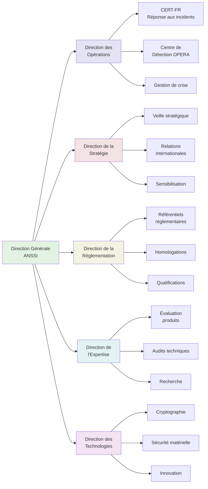
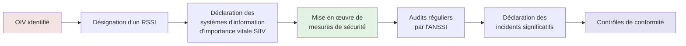
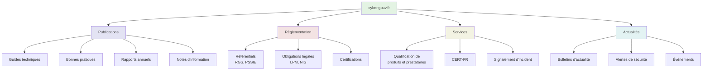
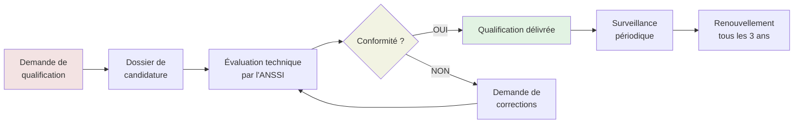
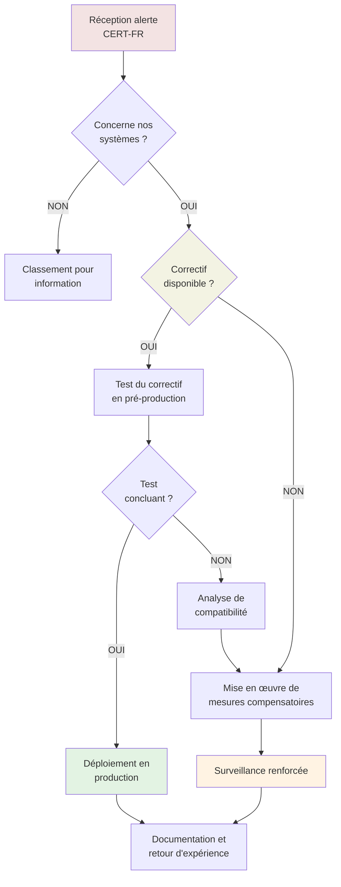
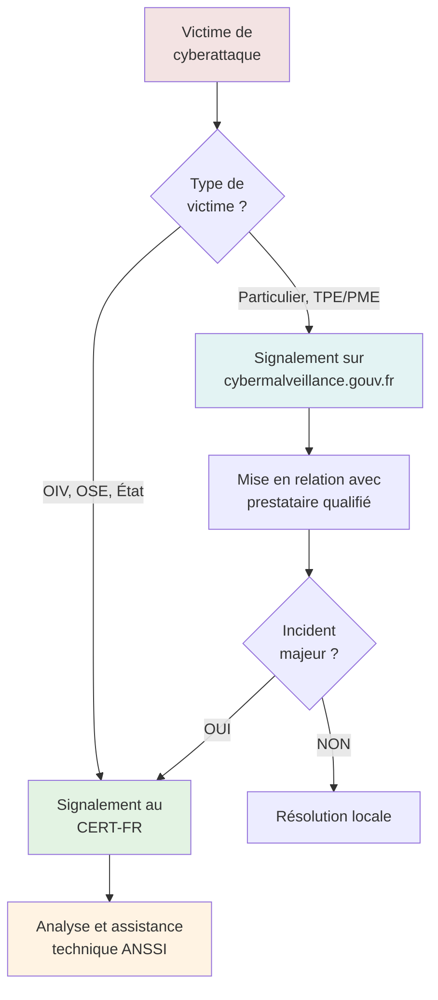

# ANSSI - Agence Nationale de la Sécurité des Systèmes d'Information

## Introduction

**Niveau :** Débutant & Intermédiaire

!!! quote "Analogie pédagogique"
    _Imaginez une **banque centrale de la sécurité numérique**. Tout comme la Banque de France régule et supervise le système financier national, **l'ANSSI régule et supervise la sécurité des systèmes d'information** de l'État et des infrastructures critiques françaises. Elle émet des **recommandations de sécurité** comme une banque centrale émet des directives économiques, **qualifie des produits de sécurité** comme une banque certifie des établissements financiers, et **intervient en cas de cyberattaque majeure** comme une banque centrale intervient lors d'une crise financière._

> L'**ANSSI** (Agence Nationale de la Sécurité des Systèmes d'Information) constitue l'**autorité nationale française** en matière de défense et de sécurité des systèmes d'information. Créée en 2009 et rattachée au Secrétariat général de la défense et de la sécurité nationale (SGDSN), sous l'autorité directe du Premier ministre, l'ANSSI joue un **rôle stratégique** dans la protection du cyberespace français.

Dans un contexte où les **cybermenaces se professionnalisent et s'intensifient**, où les **infrastructures critiques sont constamment ciblées**, et où la **souveraineté numérique** devient un enjeu géopolitique majeur, l'ANSSI représente le **pilier central de la cyberdéfense nationale**. Elle combine des missions de **régulation**, de **protection**, de **conseil** et de **réponse aux incidents** pour garantir la résilience du système d'information de l'État et accompagner les acteurs publics et privés dans leur sécurisation.

!!! info "Pourquoi c'est important ?"
    L'ANSSI **structure l'écosystème de la cybersécurité française** en définissant les référentiels, en qualifiant les produits et services de sécurité, en formant les professionnels, en coordonnant la réponse aux incidents majeurs, et en établissant la doctrine nationale de cybersécurité. **Comprendre son rôle et ses ressources** permet aux professionnels de la cybersécurité de **s'appuyer sur une autorité reconnue** et d'**adopter les meilleures pratiques** validées au plus haut niveau.

## Pour les vrais débutants

Si vous débutez dans la cybersécurité, il est essentiel de comprendre qu'**il existe des autorités de référence** qui définissent les standards et les bonnes pratiques. L'ANSSI n'est pas une entreprise privée ni un simple organisme de conseil. C'est une **autorité d'État** dont les recommandations et les certifications font **force de référence** dans l'écosystème français de la cybersécurité.

!!! tip "L'ANSSI n'est pas juste un site web de guides"
    Beaucoup de professionnels découvrent l'ANSSI uniquement via ses **guides techniques** disponibles sur son site. C'est réducteur. L'ANSSI est avant tout une **agence opérationnelle** qui dispose d'équipes techniques intervenant en temps réel lors de cyberattaques, qui **certifie des produits de sécurité**, qui **forme des experts**, et qui **coordonne la politique nationale** de cybersécurité. Les guides ne représentent qu'une partie visible de son activité.

## Historique et création

### Contexte de création (2009)

L'ANSSI a été créée par **décret du 7 juillet 2009**, dans un contexte où la France prenait conscience de la **criticité de la sécurité des systèmes d'information** pour la souveraineté nationale. Cette création fait suite à plusieurs constats majeurs survenus dans les années 2000.

**Les facteurs déclencheurs :**

- **Multiplication des cyberattaques** contre des administrations et des infrastructures critiques françaises
- **Dépendance croissante** de l'État et des entreprises aux systèmes d'information
- **Absence d'autorité centrale** coordonnant la cybersécurité au niveau national
- **Nécessité de souveraineté** face à la domination de produits de sécurité étrangers
- **Pression internationale** pour structurer une cyberdéfense cohérente

**Évolution des missions :**

| Période | Missions principales |
|---------|---------------------|
| **2009-2013** | Structuration de l'agence, mise en place des certifications, premières réponses aux incidents |
| **2013-2018** | Montée en puissance opérationnelle, création du dispositif de détection OPERA, renforcement du CERT-FR |
| **2018-2022** | Application de la directive NIS, création du label ExpertCyber, développement de la souveraineté numérique |
| **2022-2025** | Renforcement face aux cybermenaces hybrides, application de NIS2, accompagnement de la transformation numérique |

### Évolution du contexte réglementaire

L'ANSSI évolue dans un **cadre réglementaire en constante évolution** qui élargit progressivement son périmètre d'action.

**Textes structurants :**

- **Loi de Programmation Militaire (LPM) 2013** : Impose des obligations de sécurité aux Opérateurs d'Importance Vitale (OIV)
- **Directive NIS (2016)** : Harmonisation européenne de la cybersécurité des infrastructures critiques
- **Règlement Général sur la Protection des Données (RGPD) 2018** : Renforce la protection des données personnelles
- **Loi de Programmation Militaire 2019-2025** : Étend les obligations de sécurité et renforce les moyens de l'ANSSI
- **Directive NIS2 (2022)** : Élargissement du périmètre des entités concernées par les obligations de cybersécurité
- **Règlement DORA (2024)** : Résilience opérationnelle numérique du secteur financier

## Structure organisationnelle

L'ANSSI s'articule autour de **plusieurs directions spécialisées** qui couvrent l'ensemble du spectre de la cybersécurité.



_Ce diagramme illustre l'organisation de l'ANSSI en **directions spécialisées** qui assurent la **cohérence opérationnelle** entre la stratégie, la réglementation, l'expertise technique et les opérations de réponse aux incidents._

### Direction des Opérations

La **Direction des Opérations** constitue le **bras armé** de l'ANSSI face aux cybermenaces. Elle assure une **surveillance continue** du cyberespace français et intervient en temps réel lors d'incidents majeurs.

**CERT-FR (Centre gouvernemental de veille, d'alerte et de réponse aux attaques informatiques) :**

- **Mission principale** : Point de contact privilégié pour la gestion des incidents de cybersécurité
- **Fonctions opérationnelles** :
  - Réception et traitement des signalements d'incidents
  - Analyse technique des attaques
  - Émission d'alertes et de bulletins de sécurité
  - Coordination de la réponse aux incidents majeurs
  - Partage d'indicateurs de compromission avec l'écosystème

**Centre de Détection OPERA :**

- Système de **détection précoce** des cyberattaques visant les ministères et les OIV
- Analyse en temps réel du trafic réseau
- Corrélation d'événements de sécurité
- Alertes proactives sur les menaces émergentes

**Gestion de crise cyber :**

- Activation d'une **cellule de crise** lors d'attaques d'envergure nationale
- Coordination interministérielle
- Communication de crise
- Appui technique aux victimes

### Direction de la Réglementation et de la Conformité

Cette direction élabore et fait appliquer le **cadre réglementaire** de la cybersécurité française.

**Missions principales :**

- Rédaction des **référentiels de sécurité** (RGS, PSSIE, etc.)
- Gestion des **homologations de sécurité** des systèmes sensibles
- Délivrance des **qualifications** de produits et de prestataires de services de confiance
- Contrôle du respect des obligations des OIV et OSE (Opérateurs de Services Essentiels)
- Application de la réglementation LPM et NIS

**Processus de qualification :**

Les produits et services de sécurité peuvent obtenir une **qualification ANSSI** attestant de leur niveau de robustesse.

| Niveau de qualification | Périmètre | Niveau de confiance |
|------------------------|-----------|---------------------|
| **Élémentaire** | Produits destinés à protéger des données sensibles non classifiées | Protection contre des attaquants disposant de moyens limités |
| **Standard** | Produits pour la protection de données sensibles | Protection contre des attaquants disposant de moyens significatifs |
| **Renforcé** | Produits pour la protection de données très sensibles ou classifiées | Protection contre des attaquants disposant de moyens importants et d'expertise avancée |

### Direction de l'Expertise et de la Technologie

Cette direction assure la **légitimité technique** de l'ANSSI à travers ses capacités d'évaluation, d'audit et de recherche.

**Activités principales :**

- **Évaluation de produits de sécurité** : Tests approfondis selon les critères communs (ISO 15408)
- **Audits techniques** : Analyse de sécurité d'infrastructures critiques
- **Recherche en sécurité** : Développement de nouvelles techniques de détection et de protection
- **Cryptographie** : Conception et évaluation d'algorithmes cryptographiques
- **Sécurité matérielle** : Analyse de composants électroniques et de circuits intégrés

**Laboratoires spécialisés :**

L'ANSSI dispose de **laboratoires d'analyse** équipés pour :

- Rétro-ingénierie de malwares
- Analyse forensique de systèmes compromis
- Tests d'intrusion avancés
- Évaluation de résistance aux attaques physiques

## Missions de l'ANSSI

L'ANSSI remplit **cinq missions fondamentales** qui structurent son action.

### 1. Défendre les systèmes d'information de l'État

L'ANSSI assure la **protection des systèmes d'information** des ministères, des administrations et des établissements publics.

**Actions concrètes :**

- Définition de la **politique de sécurité** des systèmes d'information de l'État
- Élaboration du **référentiel général de sécurité (RGS)**
- Homologation des systèmes sensibles avant leur mise en production
- Audits réguliers des infrastructures critiques
- Formation des responsables de la sécurité des systèmes d'information (RSSI) de l'État

**Exemple d'application :**

Lorsqu'un ministère souhaite déployer un nouveau système d'information traitant des données sensibles, il doit obligatoirement obtenir une **homologation de sécurité** délivrée par l'ANSSI après vérification de la conformité aux exigences du RGS et réalisation d'audits techniques.

### 2. Accompagner les opérateurs d'importance vitale et les entités critiques

Les **Opérateurs d'Importance Vitale (OIV)** et les **Opérateurs de Services Essentiels (OSE)** bénéficient d'un accompagnement renforcé de l'ANSSI.

**OIV - Secteurs concernés :**

- Énergie (électricité, gaz, pétrole)
- Transports (ferroviaire, aérien, maritime)
- Santé (hôpitaux, approvisionnement pharmaceutique)
- Alimentation en eau potable
- Télécommunications
- Finance (banques, infrastructures de paiement)
- Industrie (chimie, nucléaire)
- Espace et recherche
- Gestion des eaux
- Administration et justice

**Obligations des OIV :**



**Accompagnement de l'ANSSI :**

- Publication de **guides sectoriels** adaptés à chaque domaine d'activité
- Réalisation d'**audits de conformité** réguliers
- Partage d'**indicateurs de compromission** spécifiques
- Organisation d'**exercices de crise** cyber
- Mise à disposition du **centre de détection OPERA**

### 3. Développer une industrie de confiance

L'ANSSI contribue au **développement d'un écosystème français** de solutions de cybersécurité souveraines.

**Leviers d'action :**

- **Qualification de produits** : Référencement de solutions françaises évaluées
- **Qualification de prestataires** : Certification PASSI (Prestataires d'Audit de la Sécurité des Systèmes d'Information), PRIS (Prestataires de Réponse aux Incidents de Sécurité), PDIS (Prestataires de Détection des Incidents de Sécurité)
- **Label ExpertCyber** : Reconnaissance des compétences des experts en cybersécurité
- **Soutien à l'innovation** : Financement de projets de recherche via le fonds ANSSI-Innovation
- **Promotion de solutions françaises** : Visibilité internationale des acteurs qualifiés

**Avantages pour les entreprises qualifiées :**

| Bénéfice | Impact |
|----------|--------|
| **Crédibilité renforcée** | Différenciation sur le marché face à des concurrents non qualifiés |
| **Accès privilégié** | Marchés publics réservés aux prestataires qualifiés pour certaines missions sensibles |
| **Visibilité** | Référencement sur le site de l'ANSSI et dans les guides officiels |
| **Réseau professionnel** | Intégration dans l'écosystème de la cybersécurité française |

### 4. Informer et sensibiliser

L'ANSSI joue un **rôle pédagogique majeur** pour élever le niveau général de cybersécurité.

**Publics cibles :**

- **Grand public** : via Cybermalveillance.gouv.fr et des campagnes de sensibilisation
- **Professionnels** : guides techniques, bonnes pratiques, formations
- **Décideurs** : notes stratégiques, rapports de menace
- **Collectivités territoriales** : accompagnement spécifique des communes et régions
- **TPE/PME** : guides simplifiés et outils pratiques

**Ressources de sensibilisation :**

L'ANSSI produit des contenus adaptés à chaque audience :

- **Guides techniques** : Documentation exhaustive sur des sujets pointus
- **Fiches pratiques** : Synthèses opérationnelles d'une à deux pages
- **Bulletins d'actualité** : Veille hebdomadaire sur les vulnérabilités et menaces
- **MOOC SecNumacadémie** : Formation en ligne gratuite à la cybersécurité
- **Supports pédagogiques** : Kits de sensibilisation pour entreprises

### 5. Contribuer à la politique européenne et internationale

L'ANSSI représente la France dans les **instances internationales** de cybersécurité.

**Participation aux organisations :**

- **ENISA** (European Union Agency for Cybersecurity) : Agence européenne de cybersécurité
- **SOG-IS** : Groupe de coopération pour l'évaluation et la certification de produits de sécurité
- **CERT-EU** : Computer Emergency Response Team de l'Union européenne
- **Groupe d'experts gouvernementaux de l'ONU** sur la cybersécurité

**Coopération bilatérale :**

L'ANSSI entretient des **partenariats stratégiques** avec les agences homologues :

- **NCSC** (National Cyber Security Centre) au Royaume-Uni
- **BSI** (Bundesamt für Sicherheit in der Informationstechnik) en Allemagne
- **NIST** (National Institute of Standards and Technology) aux États-Unis
- **CCCS** (Centre canadien pour la cybersécurité) au Canada

## Les ressources de l'ANSSI

L'ANSSI met à disposition un **ensemble de ressources structurées** qui constituent la référence française en cybersécurité.

### Le site cyber.gouv.fr

Le site institutionnel **cyber.gouv.fr** centralise l'ensemble des publications et ressources de l'ANSSI.

**Organisation du contenu :**



### Guides techniques de référence

L'ANSSI publie des **guides techniques exhaustifs** qui font autorité dans l'écosystème français.

**Guides incontournables :**

| Titre | Thématique | Public visé |
|-------|-----------|-------------|
| **Guide d'hygiène informatique** | 42 mesures essentielles de sécurité | Tous les professionnels |
| **Recommandations de sécurité relatives à un système GNU/Linux** | Durcissement de serveurs Linux | Administrateurs systèmes |
| **Recommandations de sécurité relatives à TLS** | Configuration sécurisée du protocole TLS/SSL | Administrateurs réseau |
| **Recommandations pour la mise en œuvre d'un site web** | Sécurisation d'applications web | Développeurs |
| **Guide de la classification de défense** | Gestion des informations classifiées | RSSI secteur défense |
| **Maîtriser la SSI pour les TPE/PME** | Introduction à la cybersécurité | Dirigeants de petites structures |
| **Recommandations relatives à l'authentification multifacteur** | Mise en œuvre de l'authentification forte | Architectes sécurité |
| **Recommandations pour l'administration sécurisée des SI** | Gestion des comptes à privilèges | Administrateurs |

**Structure type d'un guide ANSSI :**

Un guide ANSSI respecte généralement cette organisation :

1. **Préambule** : Contexte et objectifs du document
2. **Public visé** : Profils concernés par les recommandations
3. **Contexte réglementaire** : Références aux textes applicables
4. **Mesures de sécurité** : Recommandations détaillées et justifiées
5. **Mise en œuvre pratique** : Exemples concrets et configurations
6. **Glossaire** : Définitions des termes techniques
7. **Références** : Standards et documents associés

### Bulletins d'actualité et alertes

Le **CERT-FR** diffuse régulièrement des informations sur les vulnérabilités et menaces actives.

**Types de publications :**

- **Bulletins d'actualité** : Synthèse hebdomadaire des vulnérabilités majeures
- **Alertes** : Notifications urgentes sur des menaces critiques nécessitant une action immédiate
- **Avis de sécurité** : Analyses détaillées de vulnérabilités affectant des produits largement déployés
- **Rapports de menace** : Analyses approfondies de campagnes d'attaque ou de groupes APT

**Exemple de structure d'un bulletin d'actualité :**

```
BULLETIN D'ACTUALITÉ CERT-FR
Semaine XX - 2025

VULNÉRABILITÉS CRITIQUES :

1. [Produit] - Exécution de code arbitraire à distance
   - Gravité : CRITIQUE
   - CVE : CVE-2025-XXXXX
   - Systèmes affectés : [Liste des versions]
   - Correctif disponible : OUI / NON
   - Recommandations : [Actions à effectuer]

2. [Produit] - Élévation de privilèges
   - Gravité : ÉLEVÉE
   [...]

CAMPAGNES D'ATTAQUE EN COURS :

- [Description de la campagne]
- Vecteurs d'infection observés
- Indicateurs de compromission (IoC)
- Mesures de protection recommandées

RAPPELS DE SÉCURITÉ :

- [Bonnes pratiques à rappeler]
```

### Référentiel Général de Sécurité (RGS)

Le **RGS** définit les règles de sécurité applicables aux **systèmes d'information de l'administration**.

**Périmètre d'application :**

- Obligatoire pour les administrations de l'État
- Recommandé pour les collectivités territoriales
- Référence pour les prestataires de services numériques publics

**Structure du RGS :**

Le RGS s'articule autour de **trois annexes principales** :

| Annexe | Contenu | Usage |
|--------|---------|-------|
| **Annexe A1** | Référentiel général de sécurité (règles générales) | Base réglementaire |
| **Annexe A2** | Politique de certification électronique | Gestion des certificats |
| **Annexe B1** | Référentiel de sécurité pour les autorités de certification | Certification PKI |

**Niveaux de sécurité :**

Le RGS définit **trois niveaux de sécurité** correspondant à la sensibilité des données :

- **Niveau 1** : Données publiques ou non sensibles
- **Niveau 2** : Données sensibles nécessitant une protection renforcée
- **Niveau 3** : Données très sensibles ou classifiées

### Qualifications et certifications

L'ANSSI délivre des **qualifications** attestant de la conformité de produits ou de services aux exigences de sécurité.

**Catégories de qualifications :**

**Qualification de produits :**

- **Produits de sécurité** : Pare-feu, antivirus, solutions de chiffrement, etc.
- **Détecteurs d'attaque** : Sondes de détection d'intrusion
- **Produits de confiance numérique** : Solutions de signature électronique, horodatage

**Qualification de prestataires :**

| Type | Acronyme | Mission |
|------|----------|---------|
| **Prestataire d'Audit de la Sécurité des SI** | PASSI | Réalisation d'audits techniques et organisationnels |
| **Prestataire de Réponse aux Incidents de Sécurité** | PRIS | Intervention lors d'incidents de sécurité |
| **Prestataire de Détection des Incidents de Sécurité** | PDIS | Surveillance et détection des menaces (SOC) |
| **Prestataire de Services de Confiance Qualifié** | PSCQ | Délivrance de certificats électroniques qualifiés |

**Processus de qualification :**



_Ce diagramme illustre le **processus exigeant** de qualification qui garantit la **robustesse technique** des solutions qualifiées._

**Avantages d'une qualification ANSSI :**

Pour les **éditeurs de solutions** :

- Différenciation concurrentielle majeure
- Accès aux marchés publics sensibles
- Reconnaissance de l'expertise technique
- Visibilité auprès des décideurs

Pour les **clients** :

- Garantie d'un niveau de sécurité évalué par une autorité indépendante
- Conformité facilitée aux exigences réglementaires
- Réduction des risques liés aux solutions de cybersécurité
- Traçabilité et responsabilité renforcées

### Formation et montée en compétence

L'ANSSI contribue activement à la **formation des professionnels** de la cybersécurité.

**Dispositifs de formation :**

**SecNumacadémie :**

- MOOC (Massive Open Online Course) gratuit
- Formation accessible à tous niveaux
- Modules couvrant les fondamentaux de la cybersécurité
- Certification délivrée à l'issue du parcours

**Label ExpertCyber :**

Reconnaissance des **compétences individuelles** des experts en cybersécurité selon quatre niveaux :

| Niveau | Profil | Expérience requise |
|--------|--------|-------------------|
| **Niveau 1** | Sensibilisé | Connaissances de base |
| **Niveau 2** | Opérationnel | 2 ans d'expérience minimum |
| **Niveau 3** | Confirmé | 5 ans d'expérience minimum |
| **Niveau 4** | Expert | 8 ans d'expérience minimum + reconnaissance par les pairs |

**Formations dispensées par l'ANSSI :**

L'ANSSI propose des **sessions de formation** pour les RSSI de l'État et certains partenaires sur :

- Gestion de crise cyber
- Homologation de sécurité
- Analyse de risques selon la méthode EBIOS Risk Manager
- Sécurité des infrastructures Cloud
- Cryptographie appliquée

## Utiliser les ressources de l'ANSSI en entreprise

Pour les professionnels de la cybersécurité en entreprise, l'ANSSI constitue une **source de référence incontournable**.

### Intégration des recommandations ANSSI

**Approche structurée pour intégrer les guides ANSSI :**

1. **Identifier les guides applicables** à votre secteur d'activité et à vos systèmes
2. **Prioriser les mesures** selon leur criticité et votre contexte opérationnel
3. **Créer une roadmap d'implémentation** progressive des recommandations
4. **Documenter les écarts** entre vos pratiques actuelles et les recommandations
5. **Justifier les déviations** lorsqu'une recommandation ne peut être appliquée strictement
6. **Suivre l'évolution** des guides et adapter vos pratiques

**Exemple de matrice de conformité :**

| Recommandation ANSSI | Statut | Écart | Action | Priorité | Échéance |
|---------------------|--------|-------|--------|----------|----------|
| Authentification multifacteur sur les comptes à privilèges | Partiellement conforme | MFA uniquement sur serveurs critiques | Étendre MFA à tous les comptes admin | HAUTE | T1 2025 |
| Segmentation réseau | Non conforme | Réseau plat unique | Projet de micro-segmentation | CRITIQUE | T2 2025 |
| Journalisation centralisée | Conforme | - | - | - | - |

### S'abonner aux alertes du CERT-FR

**Configuration de la veille de sécurité :**

1. **Inscription aux flux RSS** du CERT-FR pour recevoir automatiquement les bulletins
2. **Automatisation du traitement** des bulletins d'actualité via un SIEM ou un système de ticketing
3. **Création de procédures** de traitement des alertes selon leur criticité
4. **Désignation de responsables** de la veille de sécurité
5. **Intégration des IoC** (Indicateurs de Compromission) dans les solutions de détection

**Workflow type de traitement d'une alerte critique :**



### Préparer une homologation de sécurité

Pour les systèmes d'information devant être **homologués** selon le RGS ou les exigences de l'ANSSI, une démarche structurée s'impose.

**Étapes d'une homologation :**

1. **Cadrage du périmètre** : Définition précise du système et de ses frontières
2. **Analyse de risques** : Utilisation de la méthode EBIOS Risk Manager recommandée par l'ANSSI
3. **Définition des mesures de sécurité** : Sélection des contrôles adaptés au niveau de sensibilité
4. **Documentation** : Constitution du dossier d'homologation complet
5. **Revue de sécurité** : Audit technique et organisationnel
6. **Décision d'homologation** : Validation par l'autorité d'homologation
7. **Maintien en conditions de sécurité** : Suivi continu et réhomologation périodique

**Contenu du dossier d'homologation :**

- Présentation du système et de son contexte
- Analyse de risques complète
- Politique de sécurité du système
- Liste des mesures de sécurité mises en œuvre
- Plan de continuité d'activité
- Procédures de gestion des incidents
- Attestations de conformité
- Résultats d'audits et de tests de pénétration

### Solliciter l'accompagnement de l'ANSSI

Selon votre profil, vous pouvez bénéficier d'un **accompagnement de l'ANSSI**.

**Conditions d'éligibilité :**

- **Administrations de l'État** : Accompagnement systématique
- **Opérateurs d'Importance Vitale** : Accompagnement renforcé obligatoire
- **Opérateurs de Services Essentiels** : Accompagnement dans le cadre de la directive NIS
- **Collectivités territoriales** : Accompagnement via les délégations régionales
- **Entreprises critiques** : Possibilité de solliciter l'ANSSI pour des projets sensibles

**Formes d'accompagnement :**

- Participation à des audits de sécurité
- Conseil sur l'architecture de sécurité
- Analyse de produits ou de solutions spécifiques
- Formation de vos équipes techniques
- Exercices de crise cyber

## Relation avec les autres acteurs de la cybersécurité

L'ANSSI s'inscrit dans un **écosystème coordonné** d'acteurs publics et privés.

### Articulation avec la CNIL

**ANSSI et CNIL ont des périmètres distincts mais complémentaires** :

| Critère | ANSSI | CNIL |
|---------|-------|------|
| **Focus principal** | Sécurité des systèmes d'information | Protection des données personnelles |
| **Approche** | Technique et opérationnelle | Juridique et organisationnelle |
| **Obligations imposées** | LPM, NIS, RGS | RGPD, Loi Informatique et Libertés |
| **Public prioritaire** | État, OIV, OSE | Tous les organismes traitant des données personnelles |
| **Sanctions** | Administratives et pénales (LPM) | Administratives (amendes RGPD) |

**Points de convergence :**

- **Sécurité des données** : La CNIL impose la sécurité des données personnelles, l'ANSSI fournit les recommandations techniques pour y parvenir
- **Notification d'incidents** : Les violations de données personnelles doivent être notifiées à la CNIL, les incidents de sécurité significatifs au CERT-FR
- **Guides communs** : ANSSI et CNIL publient conjointement des guides sur la sécurité des données personnelles

### Coordination avec Cybermalveillance.gouv.fr

**Cybermalveillance.gouv.fr** constitue le **dispositif national d'assistance** aux victimes de cyberattaques, piloté en coordination avec l'ANSSI.

**Répartition des rôles :**

- **Cybermalveillance.gouv.fr** : Assistance de premier niveau aux particuliers, TPE, PME et collectivités
- **ANSSI (CERT-FR)** : Traitement des incidents majeurs affectant les OIV, OSE et systèmes d'importance nationale

**Processus de signalement :**



### Écosystème de prestataires qualifiés

L'ANSSI structure un **réseau de confiance** de prestataires qualifiés qui assurent la mise en œuvre opérationnelle de la cybersécurité.

**Types de prestataires et leurs rôles :**

**PASSI (Prestataire d'Audit de la Sécurité des SI) :**

- Tests d'intrusion (pentest)
- Audits de code source
- Audits d'architecture
- Audits organisationnels (ISO 27001, etc.)

**PRIS (Prestataire de Réponse aux Incidents de Sécurité) :**

- Intervention en urgence lors de cyberattaques
- Analyse forensique
- Remédiation et restauration
- Accompagnement juridique post-incident

**PDIS (Prestataire de Détection des Incidents de Sécurité) :**

- Exploitation de SOC (Security Operations Center)
- Surveillance 24/7/365
- Corrélation d'événements de sécurité
- Chasse aux menaces (threat hunting)

**Comment choisir un prestataire qualifié :**

1. **Consulter le catalogue** des prestataires qualifiés sur cyber.gouv.fr
2. **Vérifier le périmètre de qualification** : certaines qualifications sont limitées à certaines technologies ou types d'audits
3. **Demander des références** sur des missions similaires
4. **Vérifier la validité** de la qualification (durée de 3 ans)
5. **Évaluer la méthodologie** et les outils utilisés
6. **Négocier les conditions** d'intervention et les livrables

## Tendances et évolutions

L'ANSSI adapte continuellement son action aux **nouvelles menaces** et aux **évolutions technologiques**.

### Montée en puissance face aux menaces hybrides

Les **attaques hybrides** combinent cyberattaques et opérations d'influence ou d'ingérence, brouillant les frontières entre cybersécurité, défense et renseignement.

**Réponse de l'ANSSI :**

- Renforcement de la **coopération avec les services de renseignement**
- Détection des **campagnes d'influence** par des moyens techniques
- Protection des **infrastructures électorales** et des institutions démocratiques
- Surveillance des **opérations informationnelles** ciblant la France

### Accompagnement de la transformation Cloud

La migration massive vers le **Cloud** nécessite une adaptation des référentiels de sécurité.

**Initiatives de l'ANSSI :**

- Publication du **référentiel SecNumCloud** pour la qualification de services Cloud
- Doctrine de **Cloud de confiance** privilégiant les acteurs souverains
- **Guides spécifiques** pour la sécurisation d'architectures Cloud (AWS, Azure, GCP)
- Qualification de **solutions Cloud françaises et européennes**

**Critères SecNumCloud :**

| Critère | Exigence |
|---------|----------|
| **Localisation des données** | Union européenne uniquement |
| **Immunité extraterritoriale** | Hébergeur non soumis à des législations extraterritoriales (ex : Cloud Act) |
| **Transparence** | Traçabilité complète des opérations et des accès |
| **Réversibilité** | Portabilité des données garantie |
| **Souveraineté** | Contrôle français ou européen de l'infrastructure |

### Intelligence artificielle et sécurité

L'émergence de l'**IA générative** et des **systèmes d'IA critiques** génère de nouveaux enjeux de sécurité.

**Axes de travail de l'ANSSI :**

- **Sécurisation des modèles d'IA** : Protection contre les attaques adversariales et l'empoisonnement de données
- **IA pour la cyberdéfense** : Utilisation de l'IA pour la détection d'anomalies et l'analyse de menaces
- **Éthique et confiance** : Garantir la transparence et l'explicabilité des systèmes d'IA de sécurité
- **Réglementation européenne** : Contribution à l'AI Act et adaptation des référentiels

### Cryptographie post-quantique

Les **ordinateurs quantiques** menacent les algorithmes cryptographiques actuels.

**Préparation de l'ANSSI :**

- **Veille technologique** sur les avancées de l'informatique quantique
- **Évaluation d'algorithmes post-quantiques** résistants aux attaques quantiques
- **Recommandations de transition** pour anticiper la migration cryptographique
- **Participation aux standards internationaux** (NIST, IETF)

**Calendrier estimé de transition :**

| Période | Étape |
|---------|-------|
| **2025-2028** | Évaluation et standardisation d'algorithmes post-quantiques |
| **2028-2032** | Déploiement progressif dans les systèmes sensibles |
| **2032-2035** | Généralisation de la cryptographie post-quantique |
| **2035+** | Obsolescence de la cryptographie actuelle face aux ordinateurs quantiques |

## Le mot de la fin

!!! quote
    L'ANSSI incarne la **souveraineté numérique française** à travers son expertise technique, ses capacités opérationnelles et son rôle de régulateur. Comprendre l'ANSSI, c'est saisir que la cybersécurité n'est pas une simple question technique mais un **enjeu stratégique national** qui nécessite une coordination entre l'État, les entreprises et les citoyens.
    
    Pour les professionnels de la cybersécurité, l'ANSSI représente bien plus qu'une source de documentation. C'est une **autorité de référence** dont les qualifications, les recommandations et les alertes structurent l'écosystème français. **S'appuyer sur les ressources de l'ANSSI**, c'est bénéficier d'une expertise validée au plus haut niveau et contribuer à la **résilience collective** face aux cybermenaces.
    
    Les guides de l'ANSSI ne sont pas de simples conseils optionnels. Ils constituent des **standards de l'industrie** que tout professionnel sérieux devrait maîtriser et appliquer. Lorsqu'un incident survient, la première question posée sera souvent : _"Étiez-vous conforme aux recommandations de l'ANSSI ?"_ Cette conformité peut faire la différence entre une responsabilité engagée ou non, entre une couverture d'assurance activée ou refusée.
    
    L'évolution constante des menaces impose une **veille permanente**. Les ressources de l'ANSSI ne sont pas statiques. Elles évoluent au rythme des menaces, des technologies et des réglementations. **S'abonner aux flux du CERT-FR**, **consulter régulièrement les nouvelles publications**, **participer aux événements** organisés par l'ANSSI sont autant de pratiques qui distinguent un professionnel informé d'un amateur déconnecté de la réalité opérationnelle.
    
    Pour les entreprises soumises aux obligations LPM ou NIS, l'ANSSI n'est pas seulement une ressource mais un **partenaire obligatoire**. Comprendre ses attentes, anticiper ses contrôles et intégrer ses recommandations dans vos processus n'est pas une contrainte mais une **opportunité de renforcer réellement votre sécurité**.
    
    Enfin, au-delà de l'aspect technique, l'ANSSI porte une **vision stratégique** de la cybersécurité comme pilier de la souveraineté nationale. Cette vision dépasse largement le cadre technique pour toucher à des questions de **politique industrielle**, de **protection de l'innovation**, et de **défense des intérêts nationaux**. Comprendre cette dimension permet de saisir pourquoi certaines recommandations privilégient des solutions françaises ou européennes, pourquoi la qualification de prestataires est exigeante, et pourquoi la coopération internationale reste sélective.
    
    **Maîtriser l'ANSSI**, c'est maîtriser le référentiel qui structure la cybersécurité française. C'est se donner les moyens de concevoir des systèmes conformes, de dialoguer efficacement avec les auditeurs, et de contribuer à un écosystème de confiance. C'est aussi reconnaître que derrière chaque guide technique se cache une **expérience opérationnelle** accumulée au fil de milliers d'incidents traités, d'audits réalisés et de crises gérées.


## Ressources complémentaires

### Liens officiels

- **Site institutionnel** : [https://cyber.gouv.fr](https://cyber.gouv.fr)
- **CERT-FR** : [https://www.cert.ssi.gouv.fr](https://www.cert.ssi.gouv.fr)
- **Catalogue des produits qualifiés** : [https://cyber.gouv.fr/produits-certifies](https://cyber.gouv.fr/produits-certifies)
- **Catalogue des prestataires qualifiés** : [https://cyber.gouv.fr/annuaire-prestataires](https://cyber.gouv.fr/annuaire-prestataires)
- **SecNumacadémie** : [https://secnumacademie.gouv.fr](https://secnumacademie.gouv.fr)

### Documents de référence

- **Guide d'hygiène informatique** : Mesures essentielles pour tout système d'information
- **Référentiel Général de Sécurité (RGS)** : Cadre réglementaire pour l'administration
- **EBIOS Risk Manager** : Méthodologie d'analyse de risques
- **Panorama de la cybermenace** : Rapport annuel sur les menaces observées

### Contact

**En cas d'incident de sécurité :**

- **CERT-FR** : [cert-fr.cossi@ssi.gouv.fr](mailto:cert-fr.cossi@ssi.gouv.fr)
- **Formulaire de signalement** : Disponible sur cyber.gouv.fr

**Pour les questions générales :**

- **Contact ANSSI** : [communication@ssi.gouv.fr](mailto:communication@ssi.gouv.fr)
- **Adresse postale** : ANSSI, 51 boulevard de La Tour-Maubourg, 75700 Paris 07 SP


---

!!! abstract "Métadonnées"
    **Version** : 0.1  
    **Dernière mise à jour** : Novembre 2025  
    **Durée de lecture** : 45-50 minutes  
    **Niveau** : Débutant & Intermédiaire
