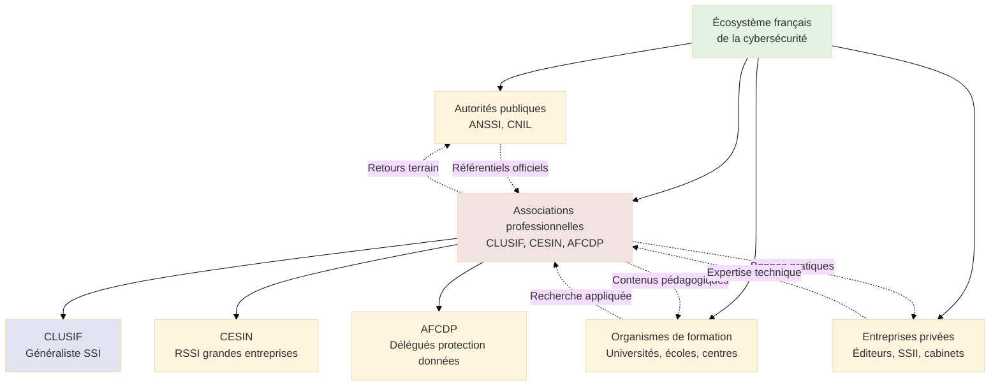
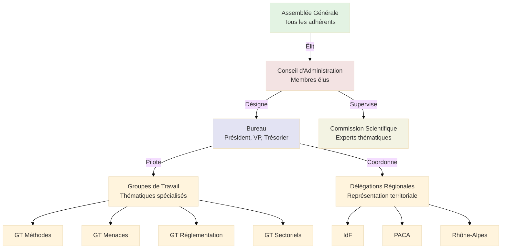
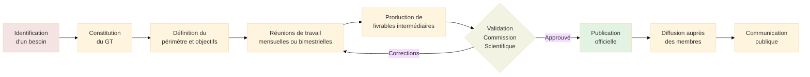
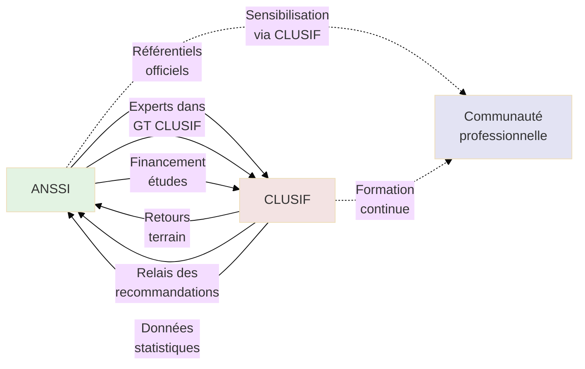
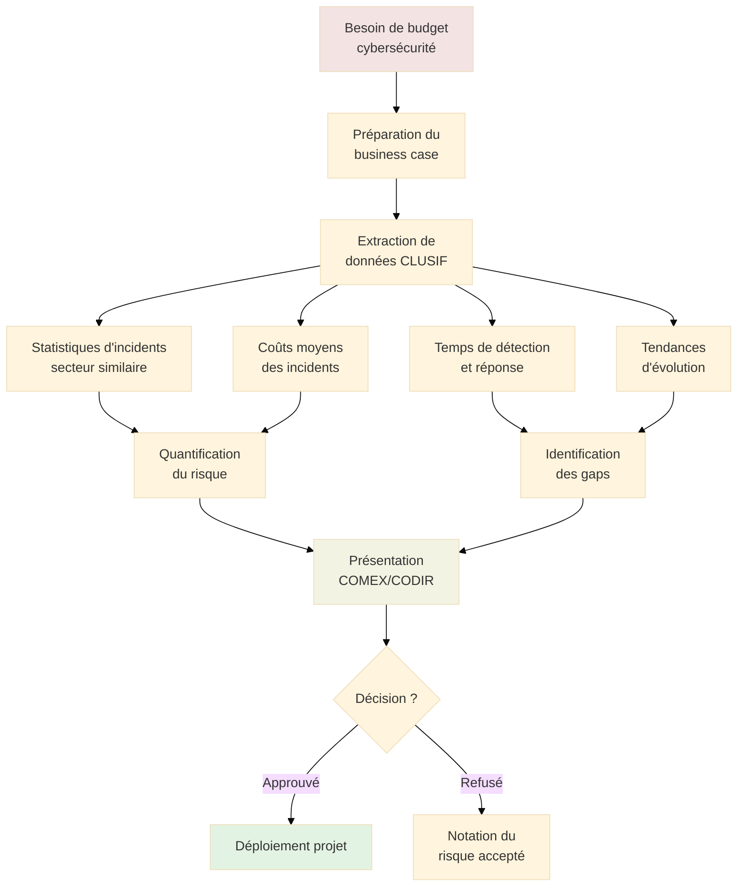

# CLUSIF - Club de la Sécurité de l'Information Français

## Introduction

**Niveau :** Débutant & Intermédiaire

!!! quote "Analogie pédagogique"
    _Imaginez une **association professionnelle comme l'Ordre des Médecins, mais pour la cybersécurité**. Tout comme l'Ordre réunit les praticiens médicaux pour partager les bonnes pratiques, actualiser les connaissances et faire évoluer la profession, **le CLUSIF fédère les professionnels de la sécurité de l'information** pour mutualiser les expertises, publier des référentiels, et faire progresser collectivement l'état de l'art de la cybersécurité en France._

> Le **CLUSIF** (Club de la Sécurité de l'Information Français) constitue la **principale association française** dédiée à la sécurité de l'information et à la cybersécurité. Créée en 1984, cette association loi 1901 rassemble des **professionnels issus de tous secteurs d'activité** (entreprises privées, administrations publiques, prestataires de services) autour d'une mission commune : **promouvoir l'échange de connaissances et de bonnes pratiques** en matière de sécurité des systèmes d'information.

Contrairement à l'ANSSI qui est une **autorité d'État** avec des missions régaliennes, le CLUSIF est une **association professionnelle indépendante** fonctionnant sur la base de la **contribution volontaire de ses membres**. Cette nature associative lui confère une **agilité** et une **proximité avec le terrain** qui complètent utilement l'action des autorités publiques. Le CLUSIF produit des **études de référence**, des **guides méthodologiques** et des **baromètres** qui reflètent les préoccupations réelles des praticiens de la cybersécurité.

!!! info "Pourquoi c'est important ?"
    Le CLUSIF représente la **voix collective des professionnels de la cybersécurité en France**. Ses publications constituent des **références sectorielles** reconnues, ses études mesurent l'évolution des pratiques et des menaces, et ses groupes de travail permettent le **partage d'expériences** entre pairs. Pour un professionnel de la cybersécurité, adhérer au CLUSIF ou consulter ses ressources offre un **accès privilégié à l'intelligence collective** de la communauté française.

## Pour les vrais débutants

Si vous découvrez l'univers de la cybersécurité, il est essentiel de comprendre qu'**au-delà des autorités publiques et des entreprises commerciales**, il existe un **écosystème associatif** qui structure la profession. Le CLUSIF n'édicte pas de règles obligatoires comme l'ANSSI, ne contrôle pas la conformité comme la CNIL, et ne vend pas de produits comme les éditeurs de solutions. Il constitue un **lieu d'échange neutre** où les professionnels partagent leurs expériences, leurs difficultés et leurs solutions.

!!! tip "Le CLUSIF n'est pas un organisme de formation"
    Bien que le CLUSIF organise régulièrement des conférences et des journées thématiques, **ce n'est pas un organisme de formation certifiant**. Son rôle est de **faciliter le partage de connaissances** entre professionnels déjà en poste, pas de délivrer des certifications individuelles. Les formations sont assurées par des organismes spécialisés, tandis que le CLUSIF produit des **référentiels et des retours d'expérience** qui alimentent ces formations.

## Historique et évolution

### Création et contexte (1984)

Le CLUSIF a été fondé en **1984** par un groupe de **Responsables de la Sécurité des Systèmes d'Information (RSSI)** pionniers qui constataient l'**isolement professionnel** dans lequel ils évoluaient. À cette époque, la sécurité informatique était un domaine émergent, peu structuré et sans référentiels partagés.

**Constats à l'origine de la création :**

- **Absence de communauté professionnelle** permettant l'échange d'expériences
- **Manque de visibilité** sur les bonnes pratiques et les solutions éprouvées
- **Isolement des RSSI** face à des problématiques complexes
- **Nécessité de mutualiser** les connaissances face à des menaces en évolution constante
- **Besoin de faire reconnaître** la fonction de RSSI dans les organisations

**Évolution chronologique :**

| Période | Événements marquants |
|---------|---------------------|
| **1984-1990** | Création du club, premiers groupes de travail, premières publications |
| **1990-2000** | Structuration de l'association, développement de méthodes d'analyse de risques |
| **2000-2010** | Internationalisation des échanges, publication de référentiels sectoriels |
| **2010-2015** | Montée en puissance des problématiques cyber, création de groupes thématiques spécialisés |
| **2015-2020** | Adaptation au RGPD, digitalisation des événements, élargissement des thématiques |
| **2020-2025** | Hybridation des formats, focus sur la résilience cyber, intégration de l'IA dans la sécurité |

### Positionnement dans l'écosystème

Le CLUSIF occupe une **position unique** dans l'écosystème français de la cybersécurité.

_Ce diagramme illustre la **position centrale** du CLUSIF dans un écosystème où il fait **le lien entre autorités, praticiens, formateurs et fournisseurs** sans appartenir à aucune de ces catégories._

## Structure et fonctionnement

### Gouvernance associative

Le CLUSIF fonctionne selon les **principes d'une association loi 1901**, avec une gouvernance démocratique impliquant ses membres.

**Organes de gouvernance :**

**Rôles des instances :**

| Instance | Composition | Mission |
|----------|-------------|---------|
| **Assemblée Générale** | Tous les membres à jour de cotisation | Vote les orientations stratégiques, élit le CA |
| **Conseil d'Administration** | 12 à 20 membres élus pour 3 ans | Définit la stratégie, valide le budget, supervise l'activité |
| **Bureau** | Président, Vice-Présidents, Trésorier, Secrétaire | Pilotage opérationnel quotidien |
| **Commission Scientifique** | Experts reconnus | Valide la qualité scientifique des publications |
| **Groupes de Travail** | Membres volontaires par thématique | Produisent les livrables (guides, études, baromètres) |

### Modèle d'adhésion

Le CLUSIF propose **plusieurs types d'adhésion** adaptés aux différents profils.

**Catégories de membres :**

| Catégorie | Profil | Cotisation annuelle (ordre de grandeur) | Droits |
|-----------|--------|----------------------------------------|--------|
| **Membre personne morale** | Entreprises, administrations, associations | 1 000 - 5 000 € selon taille | Participation à tous les GT, accès intégral aux publications, votes AG |
| **Membre personne physique** | Professionnels indépendants | 150 - 300 € | Participation aux GT, accès publications, votes AG |
| **Membre étudiant** | Étudiants en cybersécurité | Gratuit ou symbolique | Accès publications, participation événements étudiants |
| **Membre d'honneur** | Personnalités reconnues | - | Conseil et expertise |

**Avantages de l'adhésion :**

- **Accès intégral** aux publications du CLUSIF (études, guides, baromètres)
- **Participation aux groupes de travail** et contribution aux livrables
- **Invitation prioritaire** aux événements (conférences, petit-déjeuners thématiques)
- **Réseau professionnel** : échanges avec des centaines de RSSI et experts
- **Veille partagée** : accès aux retours d'expérience de la communauté
- **Visibilité** : possibilité de présenter ses travaux ou solutions lors d'événements

### Groupes de travail thématiques

Les **groupes de travail (GT)** constituent le **cœur de l'activité** du CLUSIF. Ils réunissent des experts volontaires autour de thématiques spécifiques pour produire des livrables concrets.

**Principaux groupes de travail permanents :**

**GT Méthodes et Outils :**

- Développement et mise à jour de méthodologies d'analyse de risques
- Évaluation comparative d'outils de sécurité
- Guides de mise en œuvre de normes et référentiels

**GT Menaces et Vulnérabilités :**

- Analyse des tendances de la cybermenace
- Retours d'expérience sur incidents majeurs
- Veille sur les nouvelles techniques d'attaque

**GT Réglementation et Conformité :**

- Décryptage des évolutions réglementaires (RGPD, NIS2, DORA)
- Guides d'application pratique des textes
- Interface avec les autorités de régulation

**GT Sectoriels :**

- GT Santé
- GT Finance
- GT Industrie
- GT Secteur Public
- GT Retail et Distribution

**GT Thématiques émergentes :**

- Sécurité du Cloud et des infrastructures hybrides
- Intelligence artificielle et machine learning appliqués à la sécurité
- Sécurité des objets connectés (IoT)
- Gestion de crise cyber
- Sensibilisation et culture de la sécurité

**Fonctionnement d'un groupe de travail :**

## Productions et ressources

Le CLUSIF produit un **volume considérable de contenus** qui constituent des **références** dans l'écosystème français de la cybersécurité.

### Études et baromètres de référence

Le CLUSIF publie régulièrement des **études quantitatives** qui mesurent l'évolution des pratiques et des menaces.

**Études majeures récurrentes :**

**Panorama de la Cybermenace :**

- **Fréquence** : Annuelle
- **Contenu** : Analyse statistique des incidents de sécurité observés par les membres
- **Méthodologie** : Enquête auprès de plusieurs centaines d'organisations
- **Thématiques** : Types d'attaques, secteurs ciblés, impacts financiers, temps de détection et de réponse
- **Utilité** : Benchmark pour les RSSI, arguments pour la direction générale, tendances sectorielles

**Menaces informatiques et Pratiques de Sécurité (MIPS) :**

- **Fréquence** : Bisannuelle (tous les 2 ans)
- **Contenu** : État des lieux complet de la maturité en cybersécurité des organisations françaises
- **Périmètre** : Gouvernance, organisation, technologies, processus, sensibilisation
- **Échantillon** : 300 à 500 organisations de toutes tailles et secteurs
- **Valeur** : Vision macroscopique de l'évolution de la sécurité en France

**Baromètre du RSSI :**

- **Fréquence** : Annuelle
- **Contenu** : Portrait sociologique de la fonction de RSSI en France
- **Données** : Rémunération, formation, rattachement hiérarchique, budget, effectifs
- **Objectif** : Professionnalisation et reconnaissance de la fonction

**Études sectorielles spécifiques :**

Le CLUSIF produit également des **études ciblées** sur des secteurs ou thématiques particuliers :

- Cybersécurité dans le secteur de la santé
- Sécurité des infrastructures critiques
- Maturité Cloud des organisations françaises
- Cybersécurité des collectivités territoriales
- Impact du télétravail sur la sécurité

### Guides méthodologiques et bonnes pratiques

Le CLUSIF publie des **guides pratiques** destinés à accompagner les professionnels dans leurs missions.

**Catégories de guides :**

**Guides méthodologiques généraux :**

| Titre | Thématique | Public visé |
|-------|-----------|-------------|
| **Guide de la classification des données** | Méthodologie de classification de l'information | RSSI, DPO, Risk Managers |
| **Guide de l'analyse de risques** | Démarche structurée d'appréciation des risques | RSSI, auditeurs, consultants |
| **Guide de la gestion de crise cyber** | Organisation et conduite d'une cellule de crise | Directions, RSSI, DSI |
| **Guide de la sensibilisation à la sécurité** | Conception et déploiement de campagnes | RSSI, RH, communication interne |
| **Mise en place d'un SOC** | Architecture et opération d'un centre de supervision | RSSI, responsables SOC |

**Guides de conformité réglementaire :**

- Application pratique du RGPD pour les RSSI
- Conformité NIS2 : démarche opérationnelle
- DORA pour les établissements financiers
- Référentiel ISO 27001 : retours d'expérience

**Guides sectoriels :**

- Sécurité des systèmes d'information hospitaliers
- Cybersécurité pour les établissements d'enseignement
- Protection des infrastructures industrielles (OT/ICS)
- Sécurité des applications de paiement

**Structure type d'un guide CLUSIF :**

Les guides CLUSIF suivent généralement cette architecture :

1. **Synthèse exécutive** : Résumé pour les décideurs
2. **Contexte et enjeux** : Problématique adressée
3. **Périmètre d'application** : Organisations et systèmes concernés
4. **Méthodologie** : Démarche structurée étape par étape
5. **Retours d'expérience** : Témoignages anonymisés de membres
6. **Cas pratiques** : Exemples concrets et scénarios
7. **Annexes** : Templates, check-lists, matrices
8. **Glossaire et références** : Définitions et documents associés

### Méthodes MEHARI et EBIOS (contribution historique)

Le CLUSIF a joué un **rôle historique majeur** dans le développement de **méthodes d'analyse de risques** largement adoptées en France.

**MEHARI (Méthode Harmonisée d'Analyse de Risques) :**

- **Origine** : Développée par le CLUSIF dans les années 1990
- **Principe** : Méthode structurée d'appréciation et de traitement des risques SSI
- **Approche** : Combinaison d'analyse qualitative et quantitative
- **Référentiels fournis** : Base de connaissances de scénarios de risques, questionnaires d'audit, modèles de plans d'action
- **Évolution** : Plusieurs versions majeures, dernière mise à jour pour intégrer ISO 27005
- **Statut actuel** : Maintenance assurée par le CLUSIF, large adoption dans les administrations et grandes entreprises françaises

**Relation avec EBIOS :**

Bien qu'**EBIOS** (Expression des Besoins et Identification des Objectifs de Sécurité) soit une méthode **officiellement portée par l'ANSSI**, le CLUSIF a **contribué historiquement** à son développement et continue de publier des retours d'expérience sur son application. La version actuelle **EBIOS Risk Manager** (2018) est le fruit d'une collaboration entre l'ANSSI et des praticiens issus notamment du CLUSIF.

**Complémentarité des méthodes :**

| Critère | MEHARI | EBIOS Risk Manager |
|---------|--------|-------------------|
| **Porteur** | CLUSIF | ANSSI |
| **Focus** | Approche patrimoniale, conformité | Approche scénarisée, menaces ciblées |
| **Complexité** | Moyenne à élevée | Élevée |
| **Usage privilégié** | Analyse de risques globale d'un SI | Homologation de systèmes sensibles, analyse de risques métier |
| **Référentiels** | Base de scénarios génériques | Cartographie des menaces actualisée |

### Publications académiques et recherche appliquée

Le CLUSIF ne se limite pas à la production de guides pratiques. Il contribue également à la **recherche appliquée** en cybersécurité.

**Axes de recherche :**

- **Économie de la cybersécurité** : Modèles de calcul du ROI des investissements sécurité
- **Sociologie de la cybersécurité** : Comportements humains et culture de la sécurité
- **Nouvelles technologies** : Implications sécuritaires de l'IA, blockchain, quantique
- **Évolution des menaces** : Prospective sur les cybermenaces à horizon 5-10 ans

**Partenariats académiques :**

Le CLUSIF entretient des **relations étroites** avec des universités et écoles d'ingénieurs :

- Intervention d'experts CLUSIF dans des cursus académiques
- Parrainage de chaires de recherche en cybersécurité
- Stages et projets de fin d'études en lien avec les travaux du CLUSIF
- Publications conjointes chercheurs-praticiens

## Événements et animation de la communauté

Le CLUSIF organise un **calendrier dense d'événements** destinés à animer la communauté des professionnels de la cybersécurité.

### Conférences et journées thématiques

**Assises de la Sécurité (partenariat) :**

Le CLUSIF est **partenaire fondateur** des Assises de la Sécurité, le **plus grand événement francophone** de cybersécurité qui se tient chaque année à Monaco.

- **Format** : 3 jours de conférences, ateliers et tables rondes
- **Audience** : 2 000 à 3 000 participants (RSSI, DSI, consultants, éditeurs)
- **Contribution CLUSIF** : Organisation de sessions thématiques, animation de tables rondes, présentation d'études

**Forum CLUSIF :**

- **Fréquence** : Annuel
- **Objectif** : Présentation des travaux de l'année et prospective
- **Format** : Plénières et ateliers parallèles
- **Audience** : 300 à 500 participants

**Petit-déjeuners thématiques :**

- **Fréquence** : Mensuelle
- **Format** : 2 heures (8h-10h) avec présentation suivie d'échanges
- **Thématiques** : Actualités réglementaires, retours d'expérience, nouvelles menaces
- **Lieu** : Paris + visioconférence pour les régions

### Délégations régionales

Pour assurer une **présence territoriale**, le CLUSIF s'appuie sur des **délégations régionales** animées par des bénévoles membres.

**Principales délégations :**

- **Île-de-France** : La plus importante, concentrant la majorité des membres
- **PACA** : Marseille et Sophia-Antipolis
- **Rhône-Alpes** : Lyon et Grenoble
- **Alsace** : Strasbourg
- **Grand Ouest** : Nantes et Rennes

**Activités des délégations :**

- Organisation d'événements locaux (petit-déjeuners, soirées networking)
- Relais des communications nationales
- Animation de groupes de travail régionaux
- Sensibilisation des acteurs économiques locaux

### Webinaires et contenus digitaux

Depuis la pandémie de 2020, le CLUSIF a considérablement **développé ses formats digitaux**.

**Types de contenus :**

- **Webinaires thématiques** : Sessions d'1h sur un sujet précis avec Q&A
- **Replays** : Mise à disposition des enregistrements pour les membres
- **Podcasts** : Interviews d'experts et décryptages d'actualité
- **Newsletters** : Bulletin mensuel récapitulant les actualités et publications

## Positionnement et complémentarité avec l'ANSSI

La relation entre le CLUSIF et l'ANSSI mérite une **clarification précise** car ces deux acteurs sont souvent confondus par les néophytes.

### Différences fondamentales

| Critère | CLUSIF | ANSSI |
|---------|--------|-------|
| **Nature juridique** | Association loi 1901 indépendante | Autorité d'État rattachée au Premier ministre |
| **Mission** | Partage de connaissances et mutualisation entre professionnels | Défense et sécurité des SI de l'État et des infrastructures critiques |
| **Périmètre** | Tous secteurs, approche communautaire | État, OIV, OSE, réglementation |
| **Moyens d'action** | Publications, événements, groupes de travail | Réglementation, homologation, qualification, réponse aux incidents |
| **Pouvoir contraignant** | Aucun (recommandations) | Pouvoir réglementaire et de contrôle |
| **Financement** | Cotisations des membres | Budget de l'État |
| **Production** | Retours d'expérience, guides pratiques, études statistiques | Référentiels officiels, guides techniques, certifications |

### Complémentarité et collaboration

Loin d'être concurrents, CLUSIF et ANSSI entretiennent une **relation de complémentarité**.

**Points de collaboration :**

**Exemples concrets de collaboration :**

- **Participation d'agents ANSSI** aux groupes de travail CLUSIF pour apporter l'expertise étatique
- **Relais des campagnes de sensibilisation** de l'ANSSI par le réseau du CLUSIF
- **Contribution du CLUSIF** aux consultations publiques de l'ANSSI sur de nouveaux référentiels
- **Financement par l'ANSSI** de certaines études du CLUSIF (panorama de la cybermenace)
- **Interventions croisées** lors d'événements respectifs

**Complémentarité des productions :**

Lorsque l'**ANSSI publie un référentiel technique** (par exemple, recommandations sur TLS), le **CLUSIF produit un retour d'expérience** sur son application concrète dans différents contextes organisationnels. L'ANSSI définit **le "quoi faire"**, le CLUSIF partage **le "comment le faire" et les difficultés rencontrées**.

## Utiliser les ressources du CLUSIF

Pour les professionnels de la cybersécurité, le CLUSIF offre un **ensemble de ressources valorisables** dans leur pratique quotidienne.

### Accès aux publications

**Modalités d'accès :**

- **Publications publiques** : Certaines études majeures (Panorama de la cybermenace, synthèses de baromètres) sont accessibles gratuitement sur le site web
- **Publications réservées aux membres** : La majorité des guides détaillés, études complètes et retours d'expérience nécessitent une adhésion
- **Achats à l'unité** : Possibilité d'acquérir certains guides sans adhésion (tarif majoré)

**Catalogue de publications :**

Le site du CLUSIF propose un **moteur de recherche** permettant de filtrer les publications par :

- Thématique (gouvernance, technique, juridique, organisationnel)
- Secteur d'activité
- Date de publication
- Type de document (guide, étude, baromètre, fiche pratique)

### Exploitation des études pour convaincre la direction

Les **études statistiques du CLUSIF** constituent des **arguments factuels** pour convaincre la direction générale d'investir dans la cybersécurité.

**Utilisation du Panorama de la Cybermenace :**

**Exemple de message percutant :**

_"Selon le Panorama 2024 du CLUSIF, 67% des entreprises de notre secteur ont subi au moins un incident de sécurité majeur au cours des 12 derniers mois, avec un coût moyen de 450 000 €. Le temps moyen de détection d'une intrusion est de 87 jours. Notre capacité actuelle de détection est estimée à 120 jours. Sans investissement dans un SOC, nous sommes statistiquement en retard de 33 jours par rapport à la moyenne sectorielle."_

### Participer aux groupes de travail

La **participation active** aux groupes de travail offre des **bénéfices considérables**.

**Avantages de la participation :**

| Bénéfice | Impact professionnel |
|----------|---------------------|
| **Réseau qualifié** | Accès direct à des dizaines de RSSI et experts de votre domaine |
| **Veille collaborative** | Mutualisation de la veille technologique et réglementaire |
| **Apprentissage par les pairs** | Exposition à des approches et solutions diverses |
| **Visibilité professionnelle** | Reconnaissance comme contributeur actif de la communauté |
| **Accès anticipé** | Connaissance des publications en cours d'élaboration |

**Engagement requis :**

- **Temps** : 2 à 4 heures par mois en moyenne (réunions de GT)
- **Contribution** : Rédaction de sections, relecture, partage d'expérience
- **Présence** : Participation régulière aux réunions (physiques ou visio)

**Comment rejoindre un GT :**

1. **Identifier le GT pertinent** via le site du CLUSIF
2. **Contacter l'animateur** du groupe (coordonnées disponibles pour les membres)
3. **Assister à une réunion** en observateur pour évaluer l'adéquation
4. **S'engager formellement** si le format et les objectifs conviennent

### Exploiter MEHARI pour l'analyse de risques

Pour les organisations cherchant une **méthodologie structurée d'analyse de risques**, MEHARI constitue une option éprouvée.

**Étapes de mise en œuvre :**

1. **Formation à la méthode** : Suivre une formation MEHARI (CLUSIF ou organismes partenaires)
2. **Téléchargement des outils** : Bases de connaissances et tableurs disponibles gratuitement
3. **Adaptation au contexte** : Personnalisation des scénarios de risques
4. **Audit initial** : Évaluation de la maturité actuelle via les questionnaires MEHARI
5. **Identification des risques** : Cartographie des risques inacceptables
6. **Plan de traitement** : Définition des mesures de réduction des risques
7. **Suivi et réévaluation** : Mise à jour régulière de l'analyse

**Ressources MEHARI disponibles :**

- **Guide méthodologique** complet en français
- **Base de connaissances** : 300+ scénarios de risques
- **Questionnaires d'audit** : Évaluation de 27 domaines de sécurité
- **Calculateur de risques** : Outil Excel pour la cotation
- **Retours d'expérience** : Études de cas de mise en œuvre

## Évolutions et tendances

Le CLUSIF adapte continuellement son action aux **transformations de l'écosystème** de la cybersécurité.

### Internationalisation des échanges

Face à la **globalisation des menaces**, le CLUSIF développe ses **coopérations internationales**.

**Partenariats établis :**

- **CLUSIT** (Italie) : Association sœur italienne, échanges réguliers
- **ISSA** (International Information System Security Association) : Réseau mondial de chapitres
- **ISACA** : Partenariats sur les certifications et bonnes pratiques
- **Participation à des consortiums européens** : Projets de recherche H2020

**Bénéfices de l'internationalisation :**

- Partage de **retours d'expérience transnationaux** sur des incidents majeurs
- **Benchmark international** des pratiques de sécurité
- Anticipation des **tendances réglementaires** européennes
- Accès à des **expertises pointues** non disponibles en France

### Digitalisation et accessibilité

Le CLUSIF investit dans la **transformation digitale** de ses services.

**Initiatives digitales :**

- **Plateforme collaborative** : Espace membres en ligne pour accès aux documents et échanges
- **Webinaires enregistrés** : Bibliothèque de contenus vidéo accessibles à la demande
- **Application mobile** : Notifications d'alertes et actualités
- **Formats interactifs** : Infographies, datavisualisations, serious games

**Impact sur l'accessibilité :**

Cette digitalisation permet de **toucher un public plus large**, notamment :

- PME et ETI éloignées géographiquement de Paris
- Jeunes professionnels habitués aux formats digitaux
- Responsables sécurité à temps partiel manquant de disponibilité pour les événements physiques

### Focus sur les enjeux émergents

Le CLUSIF anticipe les **problématiques de demain** en créant des groupes de travail dédiés.

**Thématiques émergentes prioritaires :**

**Intelligence artificielle et cybersécurité :**

- **Utilisation offensive de l'IA** : Automatisation d'attaques, génération de malwares
- **IA pour la défense** : Détection d'anomalies, analyse prédictive des menaces
- **Sécurité des modèles d'IA** : Protection contre l'empoisonnement de données, attaques adversariales
- **Gouvernance de l'IA** : Intégration de l'IA Act européen dans les pratiques de sécurité

**Cybersécurité et transition écologique :**

- **Empreinte carbone de la cybersécurité** : Impact énergétique des SOC, des sauvegardes
- **Sécurité des smart grids** : Protection des réseaux électriques intelligents
- **Résilience climatique** : Continuité d'activité face aux événements climatiques extrêmes

**Souveraineté numérique :**

- **Cloud de confiance** : Critères de sélection de fournisseurs souverains
- **Supply chain de sécurité** : Maîtrise des chaînes d'approvisionnement technologique
- **Cryptographie post-quantique** : Préparation de la migration

## Limites et critiques

Comme toute organisation, le CLUSIF présente certaines **limites** qu'il convient de reconnaître pour une vision équilibrée.

### Coût d'adhésion pour les petites structures

Pour une **TPE ou un professionnel indépendant**, le coût d'adhésion peut représenter un frein.

**Critique** : Les cotisations, bien que justifiées par la qualité des productions, peuvent paraître élevées pour des structures disposant de budgets limités.

**Réponse du CLUSIF** :

- Tarification différenciée selon la taille de l'organisation
- Adhésion gratuite ou symbolique pour les étudiants
- Publications majeures accessibles publiquement
- Événements gratuits ou à tarif réduit pour non-membres

### Concentration géographique francilienne

Malgré les délégations régionales, l'activité du CLUSIF reste **largement concentrée en Île-de-France**.

**Constat** : Les petit-déjeuners, ateliers et groupes de travail se tiennent majoritairement à Paris, rendant la participation difficile pour les professionnels de province.

**Évolution** : La digitalisation accélérée depuis 2020 atténue progressivement cette limite en proposant des formats hybrides ou 100% en ligne.

### Délai de publication vs. rapidité des évolutions

La production de guides via groupes de travail suit un **processus rigoureux** (validation scientifique, relectures multiples) qui peut prendre 12 à 18 mois.

**Critique** : Dans un domaine où les menaces évoluent en semaines, certains contenus peuvent sembler datés au moment de leur publication.

**Réponse du CLUSIF** :

- Distinction entre **guides méthodologiques** (pérennes) et **veilles tactiques** (rapides)
- Complémentarité avec les alertes du CERT-FR pour l'actualité immédiate
- Mises à jour régulières des documents de référence

## Le mot de la fin

!!! quote
    Le CLUSIF incarne la **maturité collective** de la communauté française de la cybersécurité. Contrairement aux éditeurs qui vendent des solutions, aux autorités qui imposent des règles, ou aux cabinets qui vendent du conseil, le CLUSIF représente un **espace neutre de mutualisation** où les professionnels partagent honnêtement leurs succès et leurs échecs.
    
    Adhérer au CLUSIF ou simplement consulter ses publications, c'est **rejoindre une communauté** qui a compris qu'en cybersécurité, **l'isolement est une vulnérabilité**. Les menaces que vous affrontez aujourd'hui, des dizaines de RSSI les ont déjà rencontrées. Les questions que vous vous posez sur la mise en œuvre d'un SOC, sur la gestion d'une crise, sur le dimensionnement d'un budget de sécurité, d'autres se les sont déjà posées et ont expérimenté des réponses.
    
    La valeur du CLUSIF ne réside pas uniquement dans la qualité de ses publications, mais dans la **dynamique de partage** qu'il facilite. Participer à un groupe de travail, c'est découvrir que le RSSI d'un concurrent direct partage généreusement ses méthodes, que l'expert d'un cabinet conseil contribue bénévolement sans arrière-pensée commerciale, que le représentant de l'ANSSI apporte son éclairage sans formalisme administratif.
    
    Les statistiques du CLUSIF constituent des **munitions argumentatives** précieuses face à des directions générales souvent sceptiques sur les investissements sécurité. Pouvoir affirmer que "67% des entreprises de notre secteur ont subi un incident majeur" avec la caution du CLUSIF pèse infiniment plus lourd qu'une affirmation non sourcée.
    
    Pour les jeunes professionnels de la cybersécurité, le CLUSIF offre une **visibilité sur la diversité des métiers** de la sécurité. Les groupes de travail rassemblent des auditeurs, des architectes, des analystes SOC, des juristes spécialisés, des responsables conformité, montrant l'**étendue du spectre** de la profession bien au-delà du stéréotype du "hacker éthique".
    
    Enfin, le CLUSIF joue un **rôle de mémoire** de la profession. Ses archives documentent quarante ans d'évolution de la cybersécurité en France. Consulter les baromètres des années 2000 permet de mesurer le chemin parcouru, de constater que certaines problématiques persistent (sensibilisation, budgets), et d'identifier les véritables ruptures (Cloud, mobilité, télétravail, IA).
    
    **Maîtriser le CLUSIF**, c'est reconnaître que votre expertise individuelle, aussi pointue soit-elle, bénéficie toujours du recul et de l'expérience collective. C'est accepter que la cybersécurité se construit dans la **collaboration**, pas dans la compétition.

---

## Ressources complémentaires

### Liens officiels

- **Site web du CLUSIF** : [https://www.clusif.fr](https://www.clusif.fr)
- **Catalogue de publications** : [https://www.clusif.fr/publications](https://www.clusif.fr/publications)
- **Agenda des événements** : [https://www.clusif.fr/agenda](https://www.clusif.fr/agenda)
- **Adhésion** : [https://www.clusif.fr/adhesion](https://www.clusif.fr/adhesion)
- **Méthode MEHARI** : [https://mehari.clusif.fr](https://mehari.clusif.fr)

### Publications incontournables (accès libre)

- **Panorama de la Cybermenace** (édition annuelle)
- **Synthèse du baromètre MIPS**
- **Synthèse du baromètre du RSSI**
- **Fiches pratiques** thématiques

### Réseaux sociaux et communication

- **LinkedIn** : Page officielle CLUSIF avec actualités quotidiennes
- **Twitter/X** : Veille et relais d'informations
- **Newsletter mensuelle** : Inscription via le site web

### Contact

**Secrétariat du CLUSIF :**

- **Email** : [clusif@clusif.fr](mailto:clusif@clusif.fr)
- **Téléphone** : +33 1 53 25 08 80
- **Adresse** : 11 rue de Mogador, 75009 Paris

---

!!! abstract "Métadonnées"
    **Version** : 0.1  
    **Dernière mise à jour** : Novembre 2025  
    **Durée de lecture** : 40-45 minutes  
    **Niveau** : Débutant & Intermédiaire
