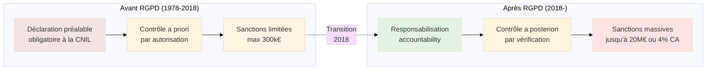
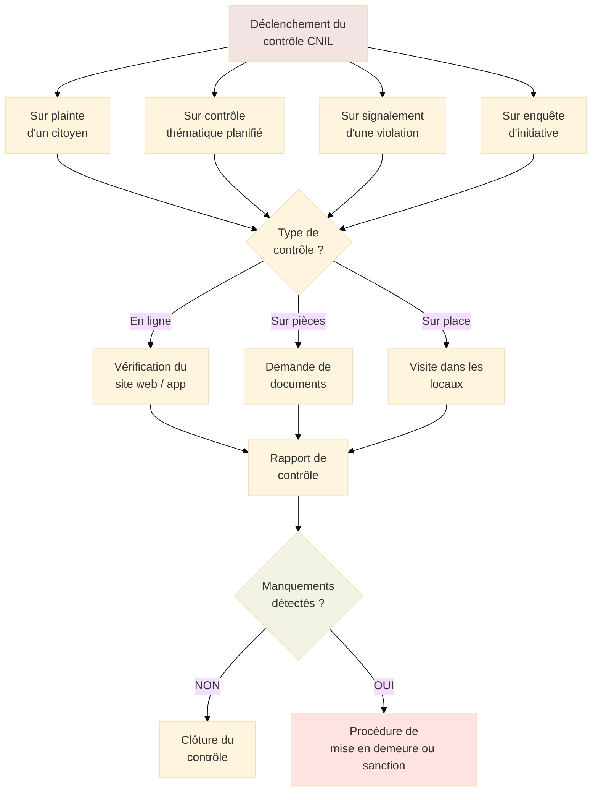
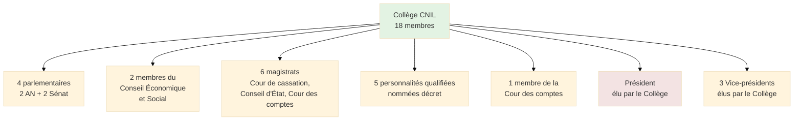
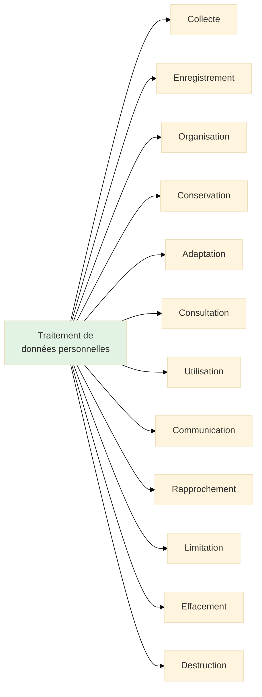
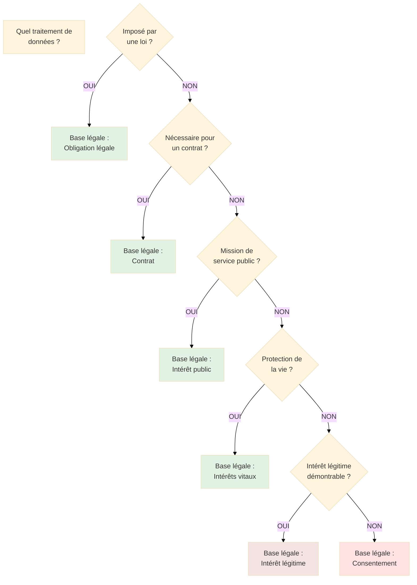
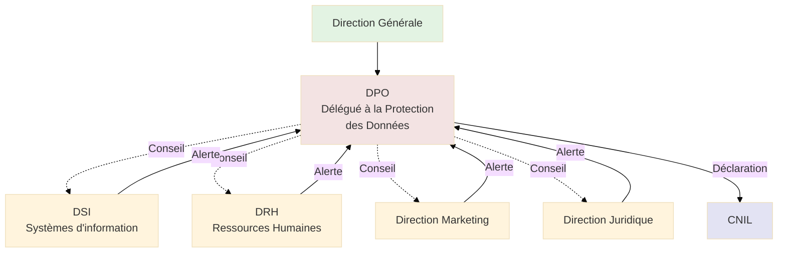
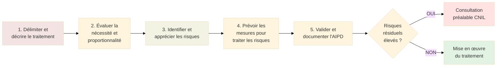

# CNIL - Commission Nationale de l'Informatique et des Libertés

## Introduction

<div
  class="omny-meta"
  data-level="🟢 Débutant & 🟡 Intermédiaire"
  data-version="0.2"
  data-time="45-50 minutes">
</div>

!!! quote "Analogie pédagogique"
    _Imaginez un **gardien constitutionnel des données personnelles**, équivalent du Conseil constitutionnel pour la protection de la vie privée numérique. Tout comme le Conseil constitutionnel veille au respect des droits fondamentaux, **la CNIL garantit que les traitements de données personnelles respectent les droits et libertés** des citoyens. Elle combine les rôles de **régulateur** (comme l'Autorité de la concurrence), de **conseil** (comme le Défenseur des droits), et de **sanctionnaire** (comme l'Autorité des marchés financiers)._

> La **CNIL** (Commission Nationale de l'Informatique et des Libertés) constitue l'**autorité administrative indépendante française** chargée de veiller à la protection des données personnelles et de la vie privée dans l'environnement numérique. Créée par la loi "Informatique et Libertés" du 6 janvier 1978, elle précède de près de quarante ans le Règlement Général sur la Protection des Données (RGPD) européen, témoignant d'une **conscience précoce** de la France sur les enjeux de protection des données.

Dans un monde où **chaque interaction numérique génère des données**, où les **algorithmes prennent des décisions impactant la vie des individus**, et où la **monétisation des données personnelles** alimente l'économie numérique, la CNIL joue un rôle **absolument central**. Elle n'est pas une simple administration bureaucratique : c'est une **autorité de régulation puissante** dotée de pouvoirs d'investigation, de contrôle et de sanctions financières pouvant atteindre plusieurs dizaines de millions d'euros.

!!! info "Pourquoi c'est important ?"
    La CNIL **structure l'ensemble de l'écosystème** de protection des données en France. Ses **décisions créent jurisprudence**, ses **recommandations définissent les standards**, ses **sanctions dissuadent les manquements**, et ses **outils pratiques** facilitent la mise en conformité. Pour tout professionnel manipulant des données personnelles, **comprendre la CNIL est aussi essentiel que comprendre le droit du travail pour un DRH** : c'est le cadre légal incontournable de votre activité.

## Pour repartir des bases (vrais débutants)

Si vous découvrez le monde de la protection des données, il est crucial de comprendre que **toute organisation traitant des données personnelles** (nom, prénom, email, adresse IP, cookies, historiques d'achat, données de santé, etc.) est **soumise à la réglementation** que la CNIL fait appliquer. Ce n'est pas réservé aux grandes entreprises technologiques. Une **PME avec un fichier client**, une **association gérant des adhérents**, un **site web utilisant Google Analytics**, un **artisan conservant des devis** : tous manipulent des données personnelles et sont donc concernés.

!!! tip "CNIL et RGPD : quelle différence ?"
    Le **RGPD** (Règlement Général sur la Protection des Données) est le **texte législatif européen** qui définit les règles de protection des données applicables dans toute l'Union européenne depuis mai 2018. La **CNIL** est l'**autorité française** chargée de faire appliquer ce règlement en France. **Le RGPD est la règle, la CNIL est le régulateur** qui veille à son respect sur le territoire français. Chaque pays européen possède son autorité de protection des données (ICO au Royaume-Uni, AEPD en Espagne, etc.), coordonnées au niveau européen par le Comité Européen de la Protection des Données (CEPD).

## Historique et création

### Contexte de création (1978)

La CNIL a été créée dans un contexte de **prise de conscience collective** des dangers de l'informatisation massive des fichiers de citoyens.

**Le projet SAFARI (1974) - déclencheur de la mobilisation :**

En 1974, le journal *Le Monde* révèle l'existence du projet **SAFARI** (Système Automatisé pour les Fichiers Administratifs et le Répertoire des Individus), un projet gouvernemental visant à **interconnecter tous les fichiers administratifs** français via le numéro de sécurité sociale comme identifiant unique. Cette révélation provoque un **tollé général**.

**Craintes exprimées :**

- Constitution d'un **fichier central de surveillance** de la population
- Risque de **dérive totalitaire** via le croisement systématique des données
- **Absence de contrôle citoyen** sur l'usage des informations personnelles
- Potentiel de **discrimination** basée sur des profils automatisés

**Réponse législative :**

Face à cette mobilisation, le gouvernement crée une **commission d'enquête** présidée par Bernard Tricot. Ses travaux aboutissent à la **loi "Informatique et Libertés" du 6 janvier 1978**, qui crée simultanément la CNIL.

**Principes fondateurs de la loi de 1978 :**

| Principe | Portée |
|----------|--------|
| **Finalité** | Les données doivent être collectées pour un objectif déterminé et légitime |
| **Pertinence** | Seules les données strictement nécessaires peuvent être collectées |
| **Conservation limitée** | Les données ne peuvent être conservées indéfiniment |
| **Sécurité** | L'organisme doit protéger les données contre les accès non autorisés |
| **Droits des personnes** | Droit d'accès, de rectification et d'opposition |

### Évolution du cadre juridique

La CNIL a traversé **plusieurs mutations majeures** de son cadre d'intervention.

**Chronologie des évolutions législatives :**

| Période | Événement | Impact |
|---------|-----------|--------|
| **1978** | Création de la loi Informatique et Libertés | Naissance de la CNIL, régime déclaratif obligatoire |
| **2004** | Révision de la loi IL | Simplification des formalités, renforcement des sanctions |
| **2016** | Adoption du RGPD au niveau européen | Harmonisation européenne, amendes massives possibles |
| **2018** | Entrée en application du RGPD | Suppression des déclarations préalables, responsabilisation des acteurs |
| **2019** | Nouvelle loi française adaptant le RGPD | Clarification des pouvoirs de la CNIL, aggravation des sanctions pénales |

**Rupture majeure du RGPD (2018) :**

L'entrée en application du RGPD marque un **changement de paradigme** fondamental.



_Ce diagramme illustre le **basculement fondamental** d'un régime de **contrôle préalable** (l'administration autorise avant) vers un régime de **responsabilisation** (l'organisation doit démontrer sa conformité)._

**Conséquences pratiques de la transition :**

- **Avant 2018** : Les organisations devaient déclarer leurs fichiers à la CNIL avant de les utiliser
- **Après 2018** : Les organisations doivent tenir un **registre des traitements** et être capables de **prouver leur conformité** en cas de contrôle
- **Philosophie** : Passage d'une logique administrative à une logique de **responsabilité proactive**

## Missions et pouvoirs de la CNIL

La CNIL remplit **quatre missions fondamentales** qui structurent son action.

### Mission 1 : Informer et conseiller

La CNIL joue un **rôle pédagogique majeur** pour démocratiser la compréhension de la protection des données.

**Actions d'information :**

**Vers le grand public :**

- **Site web cnil.fr** : Documentation complète, articles pédagogiques, actualités
- **Campagnes de sensibilisation** : Publicités TV/radio sur les droits numériques
- **Fiches pratiques** : Guides simples pour maîtriser ses données (réseaux sociaux, cookies, droit à l'oubli)
- **Service de plainte en ligne** : Formulaire accessible pour signaler un manquement

**Vers les professionnels :**

- **Guides sectoriels** : Conformité RGPD adaptée à chaque secteur (santé, RH, marketing, etc.)
- **Packs de conformité** : Kits clés-en-main pour TPE/PME
- **Référentiels** : Documents définissant les bonnes pratiques (cookies, prospection commerciale)
- **MOOC en ligne** : Formation gratuite "L'atelier RGPD" avec attestation

**Vers les DPO (Délégués à la Protection des Données) :**

- **Lettre d'information mensuelle** spécifique aux DPO
- **Événements de formation** et retours d'expérience
- **Plateforme dédiée** : Espace privé pour les DPO désignés
- **Permanence téléphonique** : Conseil juridique sur des cas complexes

### Mission 2 : Accompagner la conformité

La CNIL propose des **outils pratiques** pour faciliter la mise en conformité RGPD.

**Outils mis à disposition :**

**Registre des traitements (modèle) :**

- Template Excel téléchargeable
- Tutoriel vidéo de remplissage
- Exemples par type d'activité (e-commerce, association, collectivité)

**Analyse d'Impact relative à la Protection des Données (AIPD) :**

- **Logiciel libre PIA** développé par la CNIL
- Méthodologie structurée en 5 étapes
- Base de connaissances de mesures de sécurité

**Modèles de mentions d'information :**

- Clauses types pour sites web
- Mentions pour formulaires papier
- Information des candidats à un recrutement
- Information des patients (santé)

**Générateur de politique de cookies :**

- Outil interactif pour créer un bandeau conforme
- Vérification de la conformité des paramétrages
- Export du code HTML à intégrer

### Mission 3 : Contrôler et sanctionner

La CNIL dispose de **pouvoirs d'investigation étendus** et peut prononcer des **sanctions lourdes**.

**Types de contrôles :**



_Ce diagramme montre les **différentes modalités de déclenchement et de déroulement** d'un contrôle CNIL, aboutissant potentiellement à une procédure de sanction._

**Déroulement d'un contrôle sur place :**

1. **Notification préalable** : La CNIL informe l'organisme quelques jours à l'avance (sauf urgence)
2. **Visite des locaux** : Les contrôleurs accèdent aux bureaux, serveurs, postes de travail
3. **Audition des responsables** : DSI, RSSI, DPO, direction sont interrogés
4. **Collecte de preuves** : Documents, captures d'écran, exports de bases de données
5. **Procès-verbal** : Rédaction d'un compte-rendu contradictoire
6. **Réponse de l'organisme** : Délai pour apporter des explications ou corrections
7. **Décision** : Mise en demeure, sanction ou clôture

**Pouvoirs de sanction :**

La CNIL peut prononcer une **gamme de sanctions graduées**.

| Sanction | Gravité | Montant / Impact |
|----------|---------|------------------|
| **Rappel à l'ordre** | Légère | Aucune amende, publicité possible |
| **Mise en demeure** | Moyenne | Obligation de mise en conformité sous 1 à 3 mois |
| **Limitation temporaire** | Grave | Suspension d'un traitement de données |
| **Amende administrative** | Très grave | Jusqu'à 20 millions d'euros OU 4% du CA mondial annuel (le plus élevé) |
| **Suspension des flux** | Critique | Interdiction de transferts de données hors UE |
| **Injonction de cesser le traitement** | Critique | Arrêt immédiat d'un traitement illégal |

**Critères d'appréciation des sanctions :**

La CNIL évalue la gravité selon **plusieurs facteurs** :

- Nature et gravité du manquement
- Caractère intentionnel ou négligent
- Mesures prises pour atténuer le dommage
- Degré de coopération avec la CNIL
- Catégories de données concernées (sensibles ou non)
- Nombre de personnes affectées
- Antécédents de l'organisme

**Exemples de sanctions marquantes :**

| Année | Organisme | Montant | Motif |
|-------|-----------|---------|-------|
| **2019** | Google Ireland | 50 millions € | Défaut de transparence et d'information sur la publicité ciblée |
| **2020** | Google LLC & Google Ireland | 100 millions € | Cookies non conformes (absence de consentement) |
| **2020** | Amazon Europe Core | 35 millions € | Publicité ciblée sans consentement valide |
| **2021** | Facebook Ireland & Google Ireland | 60 + 60 millions € | Cookies déposés sans consentement |
| **2023** | Microsoft Ireland | 60 millions € | Cookies publicitaires sans consentement préalable |

### Mission 4 : Anticiper et innover

La CNIL ne se contente pas de réguler l'existant : elle **anticipe les enjeux futurs** liés aux nouvelles technologies.

**Bac à sable réglementaire (Sandbox) :**

Créé en 2021, le **bac à sable CNIL** permet à des organisations de **tester des traitements innovants** de données sous supervision de la CNIL.

**Fonctionnement :**

1. **Appel à candidatures** : La CNIL ouvre périodiquement des sessions
2. **Sélection** : Projets innovants avec enjeux de protection des données significatifs
3. **Accompagnement** : Suivi personnalisé pendant 6 à 12 mois
4. **Expérimentation encadrée** : Déploiement limité avec garanties renforcées
5. **Évaluation** : Bilan et recommandations pour généralisation

**Exemples de projets accompagnés :**

- **Reconnaissance faciale** dans les aéroports (contrôle d'identité biométrique)
- **Intelligence artificielle** pour le diagnostic médical
- **Blockchain** pour la traçabilité alimentaire
- **Objets connectés** de santé (monitoring cardiaque)

**Laboratoire d'innovation numérique (LINC) :**

Le **LINC** est le centre de prospective de la CNIL qui explore les enjeux émergents.

**Thématiques explorées :**

- **IA et algorithmes** : Explicabilité, biais, décisions automatisées
- **Blockchain et registres distribués** : Compatibilité avec le droit à l'effacement
- **Données de santé** : Ouverture contrôlée, recherche médicale
- **Neurotechnologies** : Interfaces cerveau-machine, protection des données cérébrales
- **Métavers et réalité virtuelle** : Identité numérique, données comportementales immersives

## Structure organisationnelle

La CNIL s'articule autour d'une **gouvernance collégiale** et de **services opérationnels spécialisés**.

### Collège et présidence

**Le Collège de la CNIL** constitue l'organe décisionnel composé de **18 membres** issus de différentes institutions.

**Composition du Collège :**



**Rôle du Collège :**

- Délibère sur les **sanctions**
- Valide les **référentiels et recommandations**
- Adopte les **positions stratégiques**
- Approuve le **rapport d'activité annuel**
- Fixe les **priorités de contrôle**

**Garanties d'indépendance :**

- **Mandat de 5 ans** non renouvelable
- **Incompatibilités strictes** : Aucun membre ne peut exercer de fonction dans une entreprise traitant des données
- **Protection contre les pressions** : Les membres ne peuvent être révoqués
- **Budget autonome** : Dotation de l'État sans contrôle sur l'affectation

### Services opérationnels

La CNIL dispose d'environ **250 agents** répartis en **services spécialisés**.

**Organisation des services :**

| Service | Mission | Effectifs |
|---------|---------|-----------|
| **Service des plaintes et contrôles** | Traitement des plaintes, organisation des contrôles | 60 agents |
| **Service de l'expertise technologique** | Analyse technique, audits de sécurité, évaluation d'algorithmes | 25 agents |
| **Service juridique** | Conseil, production de référentiels, contentieux | 30 agents |
| **Service de la communication** | Information du public, relations presse, sensibilisation | 20 agents |
| **Secrétariat général** | Administration, RH, finances, systèmes d'information | 40 agents |
| **Service de l'innovation** | LINC, bac à sable, prospective | 15 agents |

## Concepts clés du RGPD appliqués par la CNIL

Pour comprendre l'action de la CNIL, il est essentiel de maîtriser les **concepts fondamentaux du RGPD**.

### Donnée personnelle

Une **donnée personnelle** désigne toute information se rapportant à une **personne physique identifiée ou identifiable**.

**Critères d'identification :**

Une personne est identifiable si elle peut être identifiée, **directement ou indirectement**, par référence à :

- Un **identifiant** : nom, prénom, numéro, identifiant en ligne
- Un ou plusieurs **éléments spécifiques** : localisation, données génétiques, biométriques, économiques, culturelles, sociales

**Exemples de données personnelles :**

| Catégorie | Exemples |
|-----------|----------|
| **Identification directe** | Nom, prénom, photo, vidéo, empreinte digitale, voix |
| **Identifiants** | Email, numéro de téléphone, adresse IP, identifiant cookie, numéro client |
| **Caractéristiques physiques** | Taille, poids, couleur des yeux, ADN, groupe sanguin |
| **Vie personnelle** | Situation familiale, loisirs, opinions politiques, convictions religieuses |
| **Vie professionnelle** | CV, diplômes, formations, évaluations, salaire |
| **Données de connexion** | Logs, géolocalisation, historique de navigation |
| **Données économiques** | Revenus, crédits, historique d'achats, patrimoine |

**Données sensibles (catégories particulières) :**

Certaines données nécessitent une **protection renforcée** car leur traitement présente des risques accrus de discrimination.

**Liste exhaustive des données sensibles :**

- Origine raciale ou ethnique
- Opinions politiques
- Convictions religieuses ou philosophiques
- Appartenance syndicale
- Données génétiques
- Données biométriques (aux fins d'identifier une personne)
- Données de santé
- Données concernant la vie sexuelle ou l'orientation sexuelle
- Données relatives aux condamnations pénales et infractions

**Principe général** : Le traitement de données sensibles est **interdit** sauf exceptions strictement encadrées (consentement explicite, intérêt public majeur, recherche médicale, etc.).

### Traitement de données

Un **traitement** désigne toute opération portant sur des données personnelles, **quel que soit le procédé utilisé**.

**Opérations constituant un traitement :**



**Exemples concrets :**

- Collecter des emails via un formulaire en ligne
- Stocker des CV de candidats dans un logiciel RH
- Envoyer une newsletter à une liste de contacts
- Analyser les habitudes d'achat pour recommander des produits
- Partager des coordonnées clients avec un sous-traitant
- Archiver des contrats contenant des noms et adresses
- Supprimer des comptes inactifs après 3 ans

### Responsable de traitement et sous-traitant

Le RGPD distingue **deux rôles clés** dans le traitement des données.

**Responsable de traitement :**

L'entité qui **détermine les finalités et les moyens** du traitement.

- **Décide** : Pourquoi collecter ces données ? Combien de temps les conserver ?
- **Choisit** : Quelles données collecter ? Quels outils utiliser ?
- **Assume la responsabilité juridique** de la conformité

**Sous-traitant :**

L'entité qui **traite des données pour le compte** du responsable de traitement.

- **Exécute** : Suit les instructions du responsable de traitement
- **Ne décide pas** : N'a pas d'autonomie sur les finalités
- **Partage certaines obligations** : Sécurité, notification de violations

**Exemples de répartition :**

| Situation | Responsable de traitement | Sous-traitant |
|-----------|--------------------------|---------------|
| **Site e-commerce** | Le commerçant | Hébergeur web, solution de paiement, outil d'emailing |
| **Cabinet médical** | Le médecin | Logiciel de gestion de dossiers médicaux, laboratoire d'analyses |
| **Entreprise avec RH** | L'employeur | Éditeur du logiciel de paie, plateforme de recrutement |
| **Application mobile** | L'éditeur de l'app | Service d'analytics (ex: Google Analytics), cloud hosting |

**Obligations du responsable de traitement :**

- Garantir la **licéité** du traitement (base légale valide)
- Respecter les **principes** (finalité, minimisation, conservation limitée)
- Assurer la **sécurité** des données
- Tenir un **registre des traitements**
- Effectuer une **AIPD** si risques élevés
- Nommer un **DPO** si obligatoire
- Notifier les **violations de données** à la CNIL sous 72h

**Obligations du sous-traitant :**

- Traiter les données **uniquement sur instruction** du responsable de traitement
- Garantir la **confidentialité** de ses employés
- Assurer la **sécurité** du traitement
- Assister le responsable de traitement pour les **droits des personnes**
- Tenir un **registre des catégories de traitements**
- Notifier les **violations de données** au responsable de traitement

### Bases légales du traitement

Tout traitement de données doit reposer sur **au moins une des six bases légales** définies par le RGPD.

**Les 6 bases légales :**

| Base légale | Description | Exemples d'usage |
|-------------|-------------|------------------|
| **Consentement** | La personne a donné son accord explicite | Newsletter marketing, cookies publicitaires |
| **Contrat** | Nécessaire à l'exécution d'un contrat | Traitement d'une commande, livraison |
| **Obligation légale** | Imposé par une loi | Conservation des factures 10 ans, déclarations fiscales |
| **Sauvegarde des intérêts vitaux** | Protection de la vie de la personne | Traitement médical d'urgence |
| **Mission d'intérêt public** | Mission de service public | Traitement par une administration |
| **Intérêt légitime** | Intérêt légitime du responsable de traitement, sous conditions | Sécurité des systèmes, prévention de la fraude |

**Critères de choix de la base légale :**



**Consentement : exigences strictes**

Lorsque la base légale est le consentement, celui-ci doit être :

- **Libre** : Sans contrainte ni conditionnalité abusive
- **Spécifique** : Pour chaque finalité distincte
- **Éclairé** : Information claire sur l'usage des données
- **Univoque** : Manifestation de volonté claire (case à cocher, clic)
- **Révocable** : Facilement retirable à tout moment

**Exemples de consentement invalide :**

- Case pré-cochée
- Consentement groupé pour plusieurs finalités différentes
- Acceptation obligatoire pour accéder au service (sauf si strictement nécessaire)
- Procédure de retrait plus complexe que celle d'obtention

### Droits des personnes

Le RGPD confère **huit droits fondamentaux** aux personnes dont les données sont traitées.

**Liste des droits :**

| Droit | Description | Délai de réponse |
|-------|-------------|------------------|
| **Droit d'accès** | Obtenir copie de ses données et informations sur leur traitement | 1 mois |
| **Droit de rectification** | Corriger des données inexactes | 1 mois |
| **Droit à l'effacement** ("droit à l'oubli") | Demander la suppression de ses données | 1 mois |
| **Droit à la limitation** | Geler temporairement le traitement | 1 mois |
| **Droit à la portabilité** | Récupérer ses données dans un format exploitable | 1 mois |
| **Droit d'opposition** | Refuser un traitement basé sur intérêt légitime ou marketing | Immédiat |
| **Droits relatifs aux décisions automatisées** | Ne pas être soumis à une décision 100% automatisée | 1 mois |
| **Droit de définir des directives post-mortem** | Organiser la gestion de ses données après le décès | - |

**Obligations du responsable de traitement :**

- **Faciliter l'exercice** : Formulaire en ligne, email dédié, espace client
- **Vérifier l'identité** : Demander une preuve d'identité si doute légitime
- **Répondre dans le délai** : Maximum 1 mois, extensible à 3 mois si complexité
- **Justifier un refus** : Motifs légaux explicites si la demande est rejetée
- **Gratuité** : Sauf demandes manifestement infondées ou excessives

## Conformité RGPD : démarche pratique

La mise en conformité RGPD suit une **méthodologie structurée** en plusieurs étapes.

### Étape 1 : Désigner un pilote

**Nommer un Délégué à la Protection des Données (DPO) :**

Le DPO est **obligatoire** pour :

- Autorités et organismes publics
- Organismes dont les activités de base consistent en un **suivi régulier et systématique** de personnes à grande échelle
- Organismes dont les activités de base consistent en un traitement à grande échelle de **données sensibles**

**Missions du DPO :**

- Informer et conseiller le responsable de traitement
- Contrôler le respect du RGPD
- Conseiller sur les AIPD
- Coopérer avec la CNIL
- Être le point de contact des personnes concernées

**Positionnement du DPO :**



### Étape 2 : Cartographier les traitements

**Tenir un registre des activités de traitement :**

Document **obligatoire** recensant l'ensemble des traitements de données personnelles.

**Contenu minimum du registre :**

Pour chaque traitement, documenter :

- **Finalité** : Pourquoi collecte-t-on ces données ?
- **Catégories de données** : Quelles données précisément ?
- **Catégories de personnes concernées** : Clients, prospects, salariés, etc.
- **Catégories de destinataires** : Qui accède aux données ?
- **Transferts hors UE** : Pays tiers et garanties
- **Durées de conservation** : Combien de temps ?
- **Mesures de sécurité** : Chiffrement, contrôle d'accès, etc.

**Exemple d'entrée de registre :**

```
TRAITEMENT : Gestion des candidatures
Finalité : Recrutement de nouveaux collaborateurs
Base légale : Exécution de mesures précontractuelles
Données : Nom, prénom, CV, lettre de motivation, diplômes
Personnes concernées : Candidats ayant postulé
Destinataires : Service RH, managers recruteurs
Durée de conservation : 2 ans après dernier contact
Sécurité : Accès restreint RH, stockage sur serveur chiffré
Transferts : Aucun
```

### Étape 3 : Prioriser les actions

**Identifier les traitements à risque :**

Tous les traitements ne présentent pas le même niveau de risque. **Priorisez** selon :

- **Volume de données** : Traitements massifs
- **Sensibilité** : Données de santé, biométriques, judiciaires
- **Vulnérabilité des personnes** : Mineurs, personnes fragiles
- **Croisement de données** : Profilage, scoring
- **Innovation technologique** : IA, reconnaissance faciale

### Étape 4 : Gérer les risques

**Réaliser une Analyse d'Impact (AIPD) si nécessaire :**

L'AIPD est **obligatoire** pour les traitements susceptibles d'engendrer un **risque élevé** pour les droits et libertés.

**Situations nécessitant une AIPD :**

- Évaluation systématique et automatisée de données personnelles (scoring, profilage)
- Traitement à grande échelle de données sensibles
- Surveillance systématique à grande échelle d'une zone accessible au public (vidéosurveillance)
- Utilisation de technologies innovantes (IA, blockchain, biométrie)

**Démarche AIPD en 5 étapes :**



### Étape 5 : Organiser les processus internes

**Mettre en place des procédures :**

- **Gestion des demandes d'exercice de droits** : Formulaire dédié, workflow de traitement
- **Notification des violations de données** : Procédure sous 72h à la CNIL
- **Validation des nouveaux traitements** : Comité de validation avec DPO
- **Audits réguliers** : Vérification de la conformité annuelle ou bisannuelle

**Sécuriser les données :**

La sécurité est une **obligation du RGPD**, pas une option.

**Mesures de sécurité obligatoires (selon les risques) :**

| Mesure | Niveau de priorité | Exemples |
|--------|-------------------|----------|
| **Chiffrement** | Critique pour données sensibles | TLS pour transmission, chiffrement au repos |
| **Contrôle d'accès** | Critique | Authentification forte, gestion des habilitations |
| **Traçabilité** | Élevée | Logs d'accès, piste d'audit |
| **Sauvegarde** | Élevée | Backup quotidien, test de restauration |
| **Pseudonymisation** | Moyenne à élevée | Remplacement des identifiants directs |
| **Destruction sécurisée** | Moyenne | Effacement certifié des supports |

### Étape 6 : Documenter la conformité

**Constituer un dossier de preuves :**

Le principe d'**accountability** (responsabilité) impose de **pouvoir prouver** la conformité.

**Documents à conserver :**

- Registre des traitements à jour
- AIPD réalisées
- Contrats avec sous-traitants (clauses RGPD)
- Consentements collectés
- Procédures internes (gestion des droits, violations)
- Preuves de formation des collaborateurs
- Rapports d'audit de sécurité
- Documentation technique des mesures de sécurité

## Ressources pratiques de la CNIL

La CNIL met à disposition un **arsenal d'outils** pour faciliter la conformité.

### Packs de conformité sectoriels

La CNIL a développé des **kits clés-en-main** par secteur d'activité.

**Packs disponibles :**

- **Associations et fondations**
- **Collectivités territoriales**
- **Bailleurs sociaux**
- **Mutuelles et assurances**
- **Sous-traitants informatiques**
- **Professionnels de santé**
- **Cabinets d'avocats**

**Contenu type d'un pack :**

1. **Fiche synthétique** : Obligations spécifiques au secteur
2. **Modèle de registre** : Adapté aux traitements typiques du secteur
3. **Modèles de mentions d'information**
4. **Checklist de conformité**
5. **FAQ** : Réponses aux questions récurrentes

### Outils en ligne

**Générateur de mentions d'information :**

Outil interactif produisant des **mentions légales personnalisées** pour :

- Sites web
- Applications mobiles
- Formulaires de contact
- Questionnaires

**Modèle de registre RGPD :**

Tableur Excel pré-rempli avec :

- Onglets par catégorie de traitement
- Exemples concrets
- Liste déroulante pour faciliter la saisie
- Calcul automatique de certains indicateurs

**Logiciel PIA (Privacy Impact Assessment) :**

Application **open source** pour réaliser des AIPD.

**Fonctionnalités :**

- Questionnaire guidé
- Base de connaissances de risques et mesures
- Génération automatique du rapport
- Export PDF pour documentation

### Guides sectoriels et référentiels

**Référentiel cookies et traceurs (octobre 2020) :**

Document **opposable** définissant les règles strictes pour les cookies.

**Principes clés :**

- Consentement préalable **obligatoire** pour cookies non essentiels
- Interdiction des **cases pré-cochées**
- Obligation de **refus aussi simple que l'acceptation**
- Durée de validité du consentement : **6 mois maximum**
- Obligation d'information claire : finalité, durée, partage avec tiers

**Référentiel prospection commerciale :**

Règles pour l'envoi d'emails et SMS marketing.

**Règles principales :**

- **B2C (particuliers)** : Consentement préalable obligatoire (opt-in)
- **B2B (professionnels)** : Intérêt légitime possible, droit d'opposition respecté (opt-out)
- **Exception vente de produits similaires** : Possibilité de prospection si client existant et information sur opt-out
- Conservation des emails : **3 ans** après dernier contact

## Articulation avec l'ANSSI et le CLUSIF

La CNIL s'inscrit dans un **écosystème complémentaire** avec d'autres acteurs de la cybersécurité.

### CNIL vs. ANSSI : complémentarité

| Critère | CNIL | ANSSI |
|---------|------|-------|
| **Focus** | Protection des données personnelles et vie privée | Sécurité des systèmes d'information |
| **Périmètre** | Toutes organisations traitant des données personnelles | État, OIV, OSE prioritairement |
| **Approche** | Juridique et organisationnelle | Technique et opérationnelle |
| **Obligations** | RGPD, Loi Informatique et Libertés | LPM, NIS, RGS |
| **Sanctions** | Amendes administratives (jusqu'à 20M€) | Sanctions administratives et pénales (LPM) |

**Points de convergence :**

- **Sécurité des données** : La CNIL exige la sécurité, l'ANSSI fournit les recommandations techniques pour la garantir
- **Notification d'incidents** : Violations de données personnelles à la CNIL, incidents de sécurité significatifs au CERT-FR
- **Guides communs** : Publications conjointes sur la sécurité des données

**Exemple de collaboration :**

Lors d'une **cyberattaque avec fuite de données personnelles**, l'organisation doit :

1. **Notifier la CNIL** sous 72h (violation de données personnelles)
2. **Notifier le CERT-FR** si OIV/OSE (incident de sécurité)
3. Appliquer les **recommandations ANSSI** pour sécuriser le système
4. Respecter les **obligations CNIL** vis-à-vis des personnes concernées

### CNIL et CLUSIF : partage de bonnes pratiques

Le **CLUSIF** produit des guides pratiques qui **facilitent l'application concrète** des exigences de la CNIL.

**Exemples de contributions du CLUSIF :**

- **Guides de classification des données** : Aident à identifier les données personnelles et sensibles
- **Méthodes d'analyse de risques** : MEHARI intègre des scénarios liés à la protection des données
- **Retours d'expérience** : Partage de cas de mise en conformité RGPD
- **Sensibilisation** : Campagnes de sensibilisation incluant les enjeux RGPD

## Le mot de la fin

!!! quote
    La CNIL incarne un **équilibre délicat** entre la protection des droits fondamentaux et le développement de l'économie numérique. Contrairement à une idée reçue, la CNIL ne cherche pas à freiner l'innovation mais à garantir qu'elle se déploie dans le **respect de la dignité humaine** et des libertés individuelles.
    
    Comprendre la CNIL, c'est saisir que la protection des données n'est pas une **contrainte bureaucratique** mais un **enjeu de société fondamental**. Chaque donnée personnelle collectée, chaque algorithme prenant une décision automatisée, chaque croisement de fichiers peut potentiellement impacter la vie d'un individu : son accès au crédit, son employabilité, sa réputation, sa liberté de conscience.
    
    Pour les professionnels du numérique, la CNIL représente un **partenaire exigeant mais constructif**. Les outils qu'elle met à disposition (générateurs, modèles, guides) sont conçus pour **faciliter la conformité**, pas pour la rendre impossible. Le bac à sable réglementaire démontre une volonté d'**accompagner l'innovation** plutôt que de la bloquer systématiquement.
    
    Les sanctions prononcées par la CNIL, parfois perçues comme excessives, doivent être replacées dans leur contexte. Les amendes de plusieurs dizaines de millions d'euros visent des **géants technologiques** qui ont délibérément contourné la réglementation à des fins lucratives, impactant des millions de personnes. Ces sanctions créent une **dissuasion nécessaire** dans un secteur où la tentation de privilégier la croissance au détriment de la conformité est permanente.
    
    Pour les citoyens, la CNIL constitue un **rempart essentiel** contre les dérives de la surveillance généralisée. Le simple fait qu'une autorité indépendante existe pour **contrôler les plus puissants acteurs du numérique** et les contraindre au respect des droits fondamentaux est une conquête démocratique majeure.
    
    La montée en puissance de l'IA, la prolifération des objets connectés, le développement du métavers, la généralisation de la reconnaissance faciale, autant de **défis inédits** que la CNIL devra relever dans les années à venir. Sa capacité à anticiper ces enjeux via le LINC et le bac à sable témoigne d'une **agilité remarquable** pour une institution publique.
    
    **Maîtriser la CNIL**, c'est maîtriser le cadre juridique qui conditionne toute activité numérique manipulant des données personnelles. C'est reconnaître que le respect de la vie privée n'est pas optionnel mais constitutif de toute société démocratique moderne. C'est aussi admettre que la conformité RGPD, loin d'être un fardeau, constitue un **avantage concurrentiel** : les organisations qui traitent les données de manière éthique et transparente gagnent la confiance de leurs clients, ressource de plus en plus précieuse dans un monde saturé de scandales de fuites de données.

---

## Ressources complémentaires

### Liens officiels

- **Site institutionnel** : [https://www.cnil.fr](https://www.cnil.fr)
- **Espace professionnel** : [https://www.cnil.fr/professionnel](https://www.cnil.fr/professionnel)
- **MOOC L'atelier RGPD** : [https://atelier-rgpd.cnil.fr](https://atelier-rgpd.cnil.fr)
- **Logiciel PIA** : [https://www.cnil.fr/fr/outil-pia-telechargez-et-installez-le-logiciel-de-la-cnil](https://www.cnil.fr/fr/outil-pia-telechargez-et-installez-le-logiciel-de-la-cnil)
- **Registre des DPO** : [https://www.cnil.fr/fr/designation-dpo](https://www.cnil.fr/fr/designation-dpo)

### Textes de référence

- **RGPD (Règlement UE 2016/679)** : Texte intégral en français
- **Loi Informatique et Libertés modifiée** : Version consolidée
- **Délibérations de la CNIL** : Référentiels, recommandations, sanctions

### Outils pratiques

- **Générateur de mentions d'information** : Outil interactif
- **Modèle de registre** : Excel téléchargeable
- **Check-list de conformité** : Auto-évaluation
- **Packs de conformité sectoriels** : Adaptés à chaque métier

### Contact

**Service des plaintes :**

- **Formulaire en ligne** : [https://www.cnil.fr/fr/plaintes](https://www.cnil.fr/fr/plaintes)

**Permanence téléphonique (pour les professionnels) :**

- **Numéro** : 01 53 73 22 22
- **Horaires** : Du lundi au vendredi, 9h-12h / 14h-17h

**Adresse postale :**

- CNIL - Service des plaintes
- 3 Place de Fontenoy - TSA 80715
- 75334 Paris Cedex 07

---

