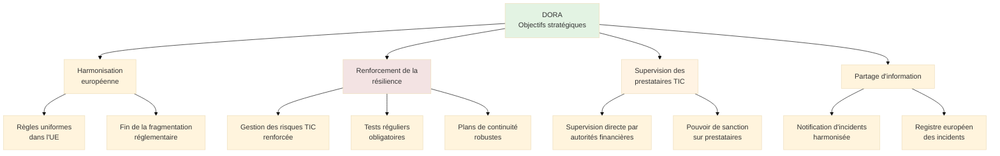
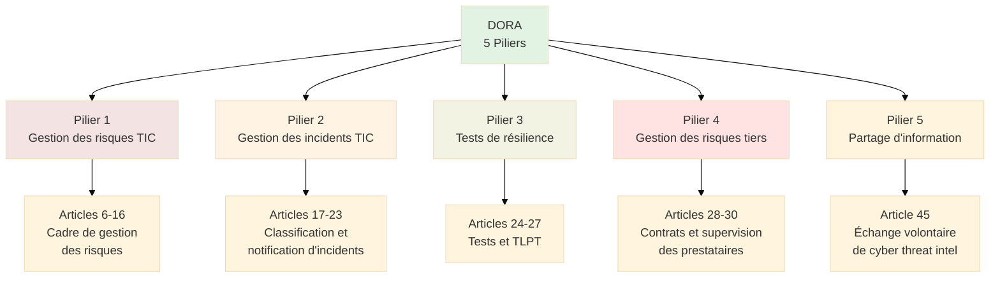
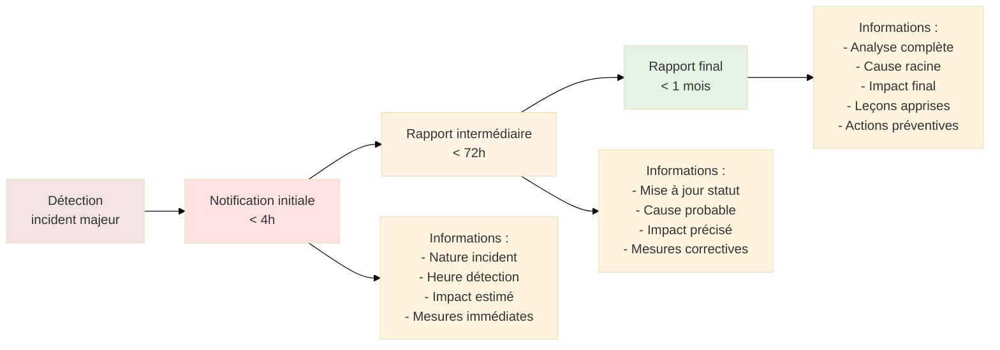
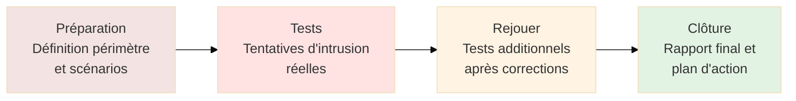
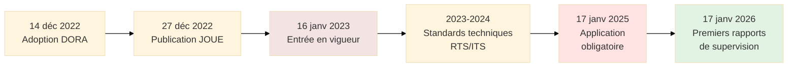
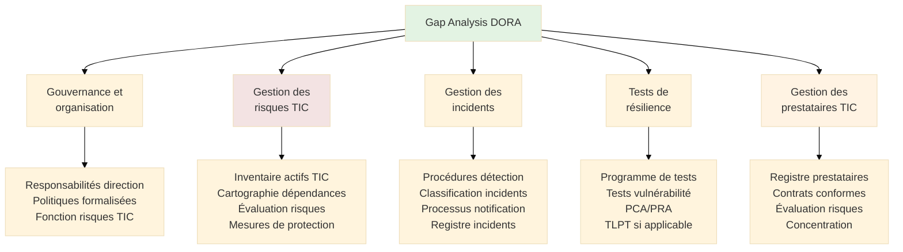

# DORA - Digital Operational Resilience Act

## Introduction

**Niveau :** Débutant & Intermédiaire

!!! quote "Analogie pédagogique"
    _Imaginez un **règlement imposant des normes antisismiques** à tous les bâtiments d'une région à risque sismique. Peu importe la taille de l'immeuble, tous doivent respecter des standards de construction garantissant leur résistance aux tremblements de terre. **DORA fonctionne sur ce principe pour le secteur financier** : tous les acteurs, des grandes banques aux petites fintechs, doivent garantir la résilience de leurs systèmes numériques face aux cybermenaces et incidents technologiques._

> **DORA** (Digital Operational Resilience Act), ou **Règlement sur la résilience opérationnelle numérique**, constitue le **cadre réglementaire européen** harmonisant les exigences de sécurité informatique et de gestion des risques technologiques pour l'ensemble du secteur financier. Adopté le **14 décembre 2022** et publié au Journal officiel de l'UE le **27 décembre 2022**, DORA entrera en application le **17 janvier 2025**, donnant aux entités financières **deux ans** pour se conformer.

DORA répond à un constat majeur : la **transformation numérique du secteur financier** a créé une **dépendance critique aux technologies de l'information** qui expose le système financier à des risques systémiques sans précédent. Une cyberattaque massive contre une infrastructure financière partagée, une défaillance d'un prestataire informatique majeur, ou une panne technologique prolongée peuvent **paralyser l'économie entière**. DORA vise à garantir que le secteur financier européen peut **résister, réagir et récupérer** rapidement face à ces menaces.

!!! info "Pourquoi c'est important ?"
    DORA **unifie et renforce** les exigences de résilience opérationnelle numérique qui étaient auparavant **fragmentées** entre directives sectorielles, réglementations nationales et guidelines non contraignantes. Pour les entités financières, DORA impose des **obligations strictes** avec un contrôle renforcé des autorités de supervision. Pour les prestataires de services TIC (technologies de l'information et de la communication), DORA crée un **cadre de supervision directe** inédit, les plaçant sous le contrôle des autorités financières européennes.

## Pour les vrais débutants

Si vous découvrez DORA, comprenez qu'il s'agit d'un **règlement européen directement applicable** (comme le RGPD), et non d'une directive nécessitant une transposition nationale. Dès son **entrée en vigueur le 17 janvier 2025**, DORA s'appliquera **uniformément** dans les 27 États membres de l'Union européenne sans nécessiter de loi nationale d'application.

DORA ne se limite pas aux grandes banques. Il couvre **l'ensemble de l'écosystème financier** : banques, assurances, sociétés de gestion d'actifs, bourses, chambres de compensation, conseillers en investissement, intermédiaires en assurance, fintechs, et même les **prestataires informatiques critiques** servant le secteur financier (cloud, datacenters, logiciels de trading, solutions de paiement).

!!! tip "DORA et autres réglementations : articulation"
    **DORA** se concentre sur la **résilience opérationnelle numérique** du secteur financier. Il **complète** mais ne remplace pas :
    - **RGPD** : Protection des données personnelles (obligations cumulatives)
    - **NIS2** : Cybersécurité des infrastructures critiques (DORA prime pour le secteur financier)
    - **PSD2** : Services de paiement (DORA renforce les exigences techniques)
    - **MiFID II/MiFIR** : Marchés d'instruments financiers (DORA ajoute la dimension technologique)

## Contexte et genèse de DORA

### Incidents déclencheurs

Plusieurs **incidents majeurs** ont démontré la vulnérabilité du secteur financier aux risques technologiques.

**Exemples d'incidents ayant motivé DORA :**

| Année | Incident | Impact | Leçon |
|-------|----------|--------|-------|
| **2016** | Cyberattaque Bangladesh Bank (SWIFT) | Vol de 81 millions USD | Sécurité des infrastructures de messagerie financière |
| **2017** | Panne TSB Bank (UK) | 1,9 milliard £ de perte, 1,3 million de clients impactés pendant des semaines | Risque de migration technologique mal maîtrisée |
| **2018** | Panne Visa Europe | Impossibilité de payer par carte pendant plusieurs heures | Dépendance aux infrastructures centralisées |
| **2019** | Cyberattaque Capital One | Données de 106 millions de clients compromises | Sécurité du cloud computing |
| **2020** | SolarWinds supply chain attack | Compromission de multiples institutions financières | Risque de la chaîne d'approvisionnement TIC |
| **2021** | Panne Fastly CDN | Indisponibilité de sites financiers majeurs | Concentration des risques chez des prestataires tiers |

**Constat des régulateurs :**

Ces incidents ont révélé que :

- Le secteur financier dépend **massivement de prestataires TIC tiers** (cloud, centres de données, logiciels) sans contrôle suffisant
- Les **exigences de résilience étaient fragmentées** entre États membres et secteurs financiers
- Les **tests de résilience** étaient insuffisants ou inexistants
- Le **partage d'information** sur les incidents était lacunaire
- Les **autorités de supervision** manquaient de pouvoir sur les prestataires TIC critiques

### Objectifs de DORA

## Champ d'application de DORA

### Entités financières concernées

DORA s'applique à **une vingtaine de catégories d'entités financières** couvrant l'ensemble de l'écosystème.

**Principales catégories d'entités financières (Article 2) :**

| Catégorie | Exemples | Nombre estimé (UE) |
|-----------|----------|-------------------|
| **Établissements de crédit** | Banques commerciales, banques d'investissement | ~6 000 |
| **Entreprises d'investissement** | Sociétés de courtage, négociateurs pour compte propre | ~6 000 |
| **Prestataires de services de paiement** | Établissements de paiement, établissements de monnaie électronique | ~900 |
| **Entreprises d'assurance et de réassurance** | Compagnies d'assurance vie, non-vie, réassureurs | ~3 500 |
| **Intermédiaires en assurance** | Courtiers, agents généraux | ~1 000 000+ (nombreuses TPE) |
| **Organismes de placement collectif (OPCVM)** | Fonds d'investissement, SICAV | ~60 000 fonds |
| **Sociétés de gestion** | Gestionnaires d'actifs | ~6 000 |
| **Marchés réglementés** | Bourses (Euronext, Deutsche Börse) | ~100 |
| **Contreparties centrales (CCP)** | LCH, Eurex Clearing | ~15 |
| **Dépositaires centraux (CSD)** | Euroclear, Clearstream | ~30 |
| **Agences de notation de crédit** | S&P, Moody's, Fitch | ~30 |
| **Administrateurs d'indices de référence** | ICE Benchmark Administration | ~30 |
| **Prestataires de services sur crypto-actifs** | Exchanges crypto, custodians | ~200 (croissance rapide) |
| **Fournisseurs de services de financement participatif** | Plateformes crowdfunding, crowdlending | ~500 |

**Exclusions :**

DORA **ne s'applique pas** aux :

- Micro-entreprises (< 10 salariés ET < 2M€ CA/bilan) sauf si identifiées comme critiques
- Certains gestionnaires de fonds de très petite taille
- Régimes de retraite professionnelle de petite dimension

**En pratique :** L'exclusion des micro-entreprises est **très limitée** car la plupart des acteurs financiers dépassent ces seuils.

### Prestataires de services TIC tiers

**Innovation majeure de DORA :** Les **prestataires de services TIC** utilisés par les entités financières entrent dans le champ d'application.

**Prestataires TIC tiers concernés (Article 3) :**

Une entreprise fournissant des **services numériques** (services d'informatique en nuage, logiciels, centres de données, gestion de réseau) à des entités financières.

**Exemples concrets :**

- **Hyperscalers cloud** : AWS, Microsoft Azure, Google Cloud, OVHcloud
- **Éditeurs de logiciels financiers** : Bloomberg Terminal, Murex, Calypso
- **Centres de données** : Equinix, Interxion, Scaleway
- **Fournisseurs de services de paiement technique** : Worldline, Adyen
- **Prestataires de sécurité** : Solutions antivirus, EDR, SOC externalisés
- **Fournisseurs de connectivité** : Opérateurs télécom, fournisseurs VPN
- **Fournisseurs de services cloud spécialisés** : Salesforce, ServiceNow

**Prestataires TIC critiques :**

Les prestataires dont la **défaillance aurait un impact systémique** sur la stabilité financière sont désignés comme **prestataires TIC tiers critiques** et soumis à une **supervision directe** par les Autorités Européennes de Surveillance (AES).

**Critères de criticité (Article 31) :**

1. **Impact systémique** : Nombre et importance des entités financières clientes
2. **Dépendance** : Degré de substituabilité du service
3. **Complexité** : Complexité technique des services fournis

**Estimation :** 10 à 20 prestataires seraient qualifiés de "critiques" (notamment les hyperscalers cloud).

## Structure du règlement DORA

DORA s'organise en **5 piliers** correspondant à 5 chapitres du règlement.

### Pilier 1 : Gestion des risques liés aux TIC (Articles 6-16)

**Obligation centrale (Article 6) :**

Les entités financières doivent mettre en place un **cadre de gestion des risques liés aux TIC solide, complet et bien documenté**.

**Exigences du cadre de gestion des risques TIC :**

**1. Gouvernance et organisation (Article 6) :**

- **Responsabilité** de l'organe de direction (conseil d'administration, directoire)
- Désignation d'un **responsable de la gestion des risques TIC** (fonction dédiée pour les grandes entités)
- **Politiques** formalisées et approuvées par la direction
- **Revue annuelle** du cadre de gestion des risques

**2. Identification et évaluation des risques (Article 8) :**

- **Inventaire complet** des actifs TIC (matériels, logiciels, données)
- **Cartographie** des systèmes critiques et de leurs dépendances
- **Évaluation régulière** des risques (au moins annuelle)
- **Analyse des menaces** cyber et technologiques

**3. Mesures de protection et de prévention (Article 9) :**

| Catégorie | Mesures obligatoires |
|-----------|---------------------|
| **Sécurité des réseaux** | Segmentation, filtrage, détection d'intrusion |
| **Contrôle d'accès** | Authentification forte, gestion des privilèges, révision des habilitations |
| **Chiffrement** | Protection des données sensibles au repos et en transit |
| **Sécurité physique** | Protection des datacenters, contrôle d'accès physique |
| **Gestion des vulnérabilités** | Patch management, tests de pénétration |
| **Formation** | Sensibilisation du personnel aux risques cyber |

**4. Détection d'anomalies (Article 10) :**

- Mise en place de **mécanismes de détection** (SIEM, IDS/IPS, EDR)
- **Surveillance continue** des systèmes critiques
- **Alertes automatiques** en cas d'événements suspects
- **Corrélation** des événements de sécurité

**5. Réponse et rétablissement (Article 11) :**

- **Procédures de réponse aux incidents** formalisées
- **Plans de continuité d'activité** (PCA) et de reprise d'activité (PRA)
- **Tests réguliers** des PCA/PRA
- **Sauvegardes** fréquentes et sécurisées
- **Capacité de restauration** dans des délais définis (RTO/RPO)

**6. Apprentissage et amélioration continue (Article 12) :**

- **Retours d'expérience** après incidents
- **Amélioration continue** du cadre de gestion des risques
- **Veille** sur les menaces émergentes

**7. Documentation (Article 13) :**

- **Politiques** de sécurité TIC
- **Procédures** opérationnelles
- **Protocoles** de communication de crise
- **Inventaires** d'actifs TIC
- **Plans** de continuité et de reprise
- **Registres** des incidents

### Pilier 2 : Gestion des incidents liés aux TIC (Articles 17-23)

**Classification des incidents (Article 18) :**

Les entités doivent classer les incidents selon leur **gravité** :

| Niveau | Critères | Exemples |
|--------|----------|----------|
| **Majeur** | Impact significatif sur les services financiers | Indisponibilité prolongée d'un service de paiement, compromission de données clients massives |
| **Significatif** | Impact notable mais contenu | Ralentissement d'un service, tentative d'intrusion détectée et bloquée |
| **Mineur** | Impact limité ou nul | Incident sans impact client, vulnérabilité corrigée avant exploitation |

**Notification d'incidents (Article 19) :**

Les incidents **majeurs** doivent être notifiés à l'autorité compétente selon un **processus en trois étapes** :

**Délais de notification :**

- **Notification initiale** : Dans les **4 heures** suivant la classification de l'incident comme majeur
- **Rapport intermédiaire** : **72 heures** après la notification initiale
- **Rapport final** : **1 mois** après la notification initiale

**Centralisation européenne :**

L'**ESMA** (European Securities and Markets Authority) gère un **registre central** des incidents majeurs permettant une vision consolidée au niveau européen.

### Pilier 3 : Tests de résilience opérationnelle numérique (Articles 24-27)

**Obligation de tests (Article 24) :**

Les entités financières doivent réaliser des **tests réguliers** de leur résilience opérationnelle numérique.

**Programme de tests (Article 25) :**

| Type de test | Fréquence | Objectif |
|--------------|-----------|----------|
| **Tests de vulnérabilité** | Annuelle minimum | Identifier les failles de sécurité |
| **Analyses de scénarios** | Annuelle minimum | Évaluer la réponse à des scénarios de crise |
| **Tests de compatibilité** | Lors de changements majeurs | Vérifier l'interopérabilité |
| **Tests de continuité** | Annuelle minimum | Valider les PCA/PRA |
| **Tests de basculement** | Semestrielle pour systèmes critiques | Vérifier la redondance |

**Tests de pénétration menés par des autorités (TLPT) - Article 26 :**

Les entités financières **critiques** doivent réaliser des **Threat-Led Penetration Tests (TLPT)** tous les **3 ans minimum**.

**Caractéristiques des TLPT :**

- Réalisés par des **testeurs externes indépendants qualifiés**
- Basés sur des **scénarios de menaces réalistes** (Threat Intelligence)
- Couvrent l'**ensemble de la chaîne de défense** (social engineering, attaque technique, maintien de l'accès)
- **Aveugles** (red team) ou **semi-aveugles** (purple team)
- **Supervisés** par l'autorité compétente

**Phases d'un TLPT :**

**Testeurs qualifiés :**

Les TLPT doivent être réalisés par des **prestataires figurant sur une liste** gérée par les autorités européennes. Critères de qualification :

- Certification technique (CREST, OSCP, etc.)
- Expérience démontrée en tests d'intrusion financiers
- Indépendance vis-à-vis de l'entité testée
- Respect de codes éthiques stricts

### Pilier 4 : Gestion des risques liés aux prestataires de services TIC tiers (Articles 28-30)

**Principes clés (Article 28) :**

Les entités financières doivent :

1. **Évaluer** les prestataires TIC avant contractualisation
2. **Suivre** en continu les risques associés aux prestataires
3. **Contractualiser** des clauses de sécurité et de résilience
4. **Maintenir** un registre des prestataires TIC
5. **Gérer** les risques de concentration

**Éléments contractuels obligatoires (Article 30) :**

Les contrats avec les prestataires TIC doivent inclure :

| Clause | Contenu obligatoire |
|--------|---------------------|
| **Description du service** | Périmètre précis, niveaux de service (SLA) |
| **Localisation des données** | Où sont traitées et stockées les données (y compris sauvegardes) |
| **Accès et audits** | Droit d'audit de l'entité financière et de l'autorité de supervision |
| **Notification d'incidents** | Obligation du prestataire de notifier rapidement |
| **Continuité et sortie** | Procédures de continuité en cas de défaillance, plan de réversibilité |
| **Sous-traitance** | Encadrement strict de la sous-traitance ultérieure |
| **Sécurité** | Mesures de sécurité techniques et organisationnelles |
| **Résiliation** | Conditions de résiliation pour manquement grave |

**Registre des prestataires TIC (Article 28.9) :**

Chaque entité financière doit tenir un **registre** contenant :

- Identité du prestataire
- Services fournis
- Criticité du service
- Localisation des données
- Date de début et fin de contrat
- Montants facturés

Ce registre doit être **mis à disposition de l'autorité de supervision** sur demande.

**Gestion de la concentration (Article 29) :**

Les entités doivent :

- **Identifier** les concentrations de risques (dépendance excessive à un prestataire unique)
- **Évaluer** l'impact d'une défaillance du prestataire
- **Mitiger** les risques de concentration (diversification, plans de secours)

**Supervision des prestataires TIC critiques (Article 31) :**

Les prestataires désignés comme **critiques** seront soumis à :

- **Supervision directe** par les autorités européennes (ESMA, EBA, EIOPA)
- **Inspections sur site** par les superviseurs
- **Demandes d'information** régulières
- **Pouvoir de sanction** en cas de manquement (jusqu'à 1% du CA journalier mondial)

### Pilier 5 : Partage d'information (Article 45)

**Échange volontaire de Cyber Threat Intelligence :**

DORA encourage les entités financières à **partager volontairement** des informations sur les cybermenaces et vulnérabilités.

**Mécanismes de partage :**

- **Information Sharing and Analysis Centers (ISAC)** sectoriels
- **Plateformes de partage** gérées par autorités nationales ou européennes
- **Protocoles de confidentialité** protégeant les données partagées

**Protection des entités partageuses :**

L'article 45 garantit que le partage d'information **ne peut être utilisé** contre l'entité par les autorités de supervision, sauf en cas de manquement délibéré.

## Sanctions et contrôle (Article 50-51)

DORA prévoit des **sanctions administratives** harmonisées au niveau européen.

### Sanctions pour entités financières

**Montants maximaux des amendes administratives :**

| Type de manquement | Montant maximal |
|-------------------|----------------|
| **Violations graves** (ex : absence de cadre de gestion des risques TIC) | **10 millions d'euros** OU **5% du CA annuel mondial** (le plus élevé) |
| **Violations moins graves** (ex : retard de notification) | **5 millions d'euros** OU **2,5% du CA annuel mondial** (le plus élevé) |

**Personnes physiques :**

Les dirigeants et responsables peuvent être sanctionnés individuellement :

- Amendes jusqu'à **1 million d'euros**
- Interdiction temporaire d'exercer des fonctions de direction

**Critères d'appréciation des sanctions :**

- Gravité et durée de la violation
- Degré de responsabilité
- Capacité financière de l'entité
- Coopération avec l'autorité
- Violations antérieures

### Sanctions pour prestataires TIC critiques

Les prestataires TIC critiques peuvent être sanctionnés par les autorités européennes :

- Amendes jusqu'à **1% du chiffre d'affaires journalier mondial moyen**
- Interdiction temporaire de fournir des services à des entités financières de l'UE

**Exemple de calcul :**

Un prestataire cloud avec un CA annuel mondial de **50 milliards €** aurait un CA journalier moyen de **137 millions €**. Une amende de 1% correspondrait à **1,37 million € par jour** de violation constatée.

## Calendrier de mise en conformité

**Échéances clés :**

**Délais spécifiques :**

| Obligation | Échéance |
|------------|----------|
| **Conformité générale** | 17 janvier 2025 |
| **Premier TLPT** pour entités critiques | Dans les 3 ans suivant l'application (janvier 2028 max) |
| **Contrats avec prestataires TIC** | Mise en conformité des contrats existants : 17 janvier 2025 |
| **Registre des prestataires TIC** | 17 janvier 2025 |

**Standards techniques réglementaires (RTS/ITS) :**

Les **Autorités Européennes de Surveillance** (EBA, ESMA, EIOPA) doivent publier des **standards techniques** détaillant :

- Critères de classification des incidents
- Modèles de notification d'incidents
- Méthodologie des TLPT
- Critères de désignation des prestataires TIC critiques

Ces standards sont en cours de finalisation (2023-2024) et entreront en application le **17 janvier 2025**.

## Approche pratique de mise en conformité DORA

### Étape 1 : Évaluation initiale (Gap Analysis)

**Cartographie de l'existant :**

**Questionnaire d'auto-évaluation :**

Pour chacun des 5 piliers, évaluer le niveau de maturité actuel :

| Pilier | Niveau 0 (Inexistant) | Niveau 1 (Initial) | Niveau 2 (Géré) | Niveau 3 (Défini) | Niveau 4 (Optimisé) |
|--------|---------------------|-------------------|----------------|------------------|-------------------|
| Gestion risques TIC | Aucun cadre formel | Initiatives ponctuelles | Politiques documentées | Processus standardisés | Amélioration continue |
| Gestion incidents | Pas de procédure | Réaction ad hoc | Procédures basiques | Processus éprouvés | Anticipation et ML |
| Tests résilience | Aucun test | Tests occasionnels | Tests annuels | Programme complet | Tests continus |
| Gestion tiers | Aucun suivi | Liste informelle | Évaluation basique | Due diligence complète | Gestion stratégique |
| Partage info | Aucun partage | Partage informel | Participation ISAC | Partage structuré | Leadership sectoriel |

### Étape 2 : Priorisation des actions

**Matrice de priorisation :**

| Écart identifié | Impact DORA | Complexité | Délai | Priorité |
|----------------|-------------|------------|-------|----------|
| Absence de responsable risques TIC | Critique | Faible | Court | **P0** |
| Registre prestataires TIC inexistant | Critique | Moyenne | Court | **P0** |
| Contrats non conformes | Critique | Élevée | Moyen | **P1** |
| Programme TLPT à créer | Critique (si applicable) | Élevée | Moyen | **P1** |
| Procédures notification incidents | Critique | Moyenne | Court | **P0** |
| Tests de résilience insuffisants | Importante | Moyenne | Moyen | **P2** |

**Priorités :**

- **P0** : Actions critiques à démarrer immédiatement
- **P1** : Actions importantes à démarrer sous 3-6 mois
- **P2** : Actions nécessaires à démarrer sous 6-12 mois

### Étape 3 : Gouvernance du projet DORA

**Pilotage du projet :**

- **Sponsor exécutif** : Membre du COMEX/directoire
- **Chef de projet DORA** : RSSI, CRO (Chief Risk Officer) ou DSI
- **Comité de pilotage** : Représentants de toutes les fonctions impactées

**Fonctions impliquées :**

| Fonction | Rôle dans DORA |
|----------|---------------|
| **Direction Générale** | Responsabilité ultime, approbation des politiques |
| **Risques** | Coordination du cadre de gestion des risques TIC |
| **DSI/RSSI** | Mise en œuvre opérationnelle des mesures techniques |
| **Juridique** | Conformité réglementaire, contrats avec prestataires |
| **Conformité** | Suivi des obligations, reporting aux autorités |
| **Achats** | Gestion des prestataires TIC, négociations contractuelles |
| **Audit interne** | Vérification de la conformité |

### Étape 4 : Quick Wins

**Actions rapides à fort impact :**

**1. Nommer un responsable de la gestion des risques TIC (1-2 semaines) :**

- Désigner formellement une personne ou une fonction
- Documenter les responsabilités
- Communiquer en interne

**2. Créer le registre des prestataires TIC (1 mois) :**

- Inventorier tous les prestataires informatiques
- Collecter les informations obligatoires (services, localisation, criticité)
- Mettre en place un processus de mise à jour

**3. Définir la procédure de notification d'incidents (1 mois) :**

- Établir les critères de classification
- Définir les workflows de notification
- Former les équipes concernées
- Tester la procédure

**4. Cartographier les systèmes critiques (2 mois) :**

- Identifier les applications/infrastructures essentielles au métier
- Documenter les dépendances (fournisseurs, interconnexions)
- Évaluer les impacts d'une indisponibilité

### Étape 5 : Chantiers structurants

**Chantiers de moyen terme (6-12 mois) :**

**Chantier 1 : Révision des contrats avec prestataires TIC**

- Auditer les contrats existants
- Identifier les clauses manquantes au regard de DORA
- Négocier des avenants ou nouveaux contrats
- Traiter en priorité les prestataires critiques

**Chantier 2 : Mise en place du programme de tests de résilience**

- Définir le calendrier annuel de tests
- Sélectionner les outils et méthodologies
- Former les équipes
- Réaliser les premiers tests

**Chantier 3 : Renforcement du cadre de gestion des risques TIC**

- Formaliser les politiques de sécurité TIC
- Mettre en œuvre les mesures de protection manquantes
- Déployer les solutions de détection (SIEM, EDR)
- Automatiser les processus de patch management

**Chantier 4 : Préparation au premier TLPT (si applicable)**

- Sélectionner un prestataire qualifié
- Définir le périmètre et les scénarios
- Obtenir l'approbation de l'autorité de supervision
- Planifier les phases de test et de correction

## Mapping DORA - ISO 27001/NIS2/RGPD

### Correspondance DORA - ISO 27001

| Exigence DORA | ISO 27001:2022 | Commentaire |
|---------------|----------------|-------------|
| **Cadre de gestion des risques TIC** (Art. 6) | 6.1.2 Appréciation des risques de SI 6.1.3 Traitement des risques de SI | ISO 27001 couvre 70% des exigences DORA |
| **Gouvernance** (Art. 6.1) | 5.1 Leadership et engagement | Responsabilité de la direction |
| **Identification actifs** (Art. 8) | 5.9 Inventaire des actifs | Inventaire obligatoire |
| **Mesures de protection** (Art. 9) | 8.1 à 8.34 Mesures de sécurité | 93 mesures ISO couvrant DORA |
| **Détection** (Art. 10) | 8.16 Activités de surveillance | SIEM, IDS/IPS |
| **Réponse incidents** (Art. 11) | 5.24-5.27 Gestion des incidents | Procédures de réponse |
| **PCA/PRA** (Art. 11) | 5.29-5.30 Continuité d'activité | Plans de continuité |
| **Tests** (Art. 24-27) | 8.8 Gestion des vulnérabilités techniques | Tests de pénétration |
| **Gestion prestataires** (Art. 28-30) | 5.19-5.22 Sécurité relations fournisseurs | Contrats et audits |

**Synergie :** Une entité certifiée **ISO 27001** dispose d'une base solide pour DORA mais doit compléter sur :

- Notification d'incidents (délais et formats spécifiques DORA)
- TLPT (tests d'intrusion renforcés)
- Registre des prestataires TIC (format DORA)
- Clauses contractuelles spécifiques au secteur financier

### Correspondance DORA - NIS2

| Aspect | DORA | NIS2 |
|--------|------|------|
| **Périmètre** | Secteur financier uniquement | 18 secteurs dont services numériques |
| **Entités** | ~20 000 entités financières UE | Plusieurs dizaines de milliers (toutes infrastructures critiques) |
| **Notification incidents** | 4h / 72h / 1 mois | 24h / 72h / 1 mois |
| **Tests** | TLPT obligatoires (entités critiques) | Tests réguliers mais TLPT non explicites |
| **Prestataires tiers** | Supervision directe des prestataires TIC critiques | Obligations sur supply chain mais pas de supervision directe |
| **Sanctions** | Jusqu'à 10M€ ou 5% CA | Jusqu'à 10M€ ou 2% CA (entités essentielles) |

**Articulation :** Pour une entité relevant **à la fois de DORA et NIS2** (ex : infrastructure de marché financier), **DORA prime** car il est **lex specialis** (loi spécifique) pour le secteur financier.

### Correspondance DORA - RGPD

| Aspect | DORA | RGPD |
|--------|------|------|
| **Focus** | Résilience opérationnelle numérique | Protection des données personnelles |
| **Notification incidents** | Incidents TIC majeurs (< 4h) | Violations de données (< 72h) |
| **Sécurité** | Mesures de sécurité des systèmes TIC | Mesures de sécurité des données personnelles |
| **Sous-traitants** | Gestion des prestataires TIC | Gestion des sous-traitants de traitement de données |
| **Sanctions** | Jusqu'à 10M€ ou 5% CA | Jusqu'à 20M€ ou 4% CA |

**Obligations cumulatives :** DORA et RGPD s'appliquent **simultanément**. Une violation de données personnelles causée par un incident TIC doit être notifiée :

- À l'**autorité de supervision financière** (DORA)
- À la **CNIL** (RGPD)
- Aux **personnes concernées** (RGPD si risque élevé)

## Le mot de la fin

!!! quote
    DORA marque un **tournant historique** dans la régulation du risque technologique du secteur financier. Pour la première fois, un règlement européen impose un cadre **harmonisé et contraignant** couvrant l'ensemble de la chaîne de valeur numérique, des banques aux fintechs, des assureurs aux prestataires cloud.
    
    L'innovation majeure de DORA réside dans la **supervision directe des prestataires TIC critiques** par les autorités financières européennes. Les hyperscalers cloud (AWS, Azure, Google Cloud) et autres infrastructures numériques critiques ne peuvent plus opérer en dehors du périmètre réglementaire financier. Cette supervision constitue une **réponse à la dépendance excessive** du secteur financier envers quelques acteurs technologiques dominants.
    
    Pour les entités financières, DORA impose une **transformation culturelle** autant que technique. La résilience opérationnelle numérique ne peut plus être déléguée à la DSI seule : elle devient une **responsabilité directe de la direction générale** qui doit approuver les politiques, allouer les ressources et superviser la mise en œuvre.
    
    Les **tests de pénétration menés par des autorités (TLPT)** représentent une exigence sans précédent. Ces tests, réalisés tous les trois ans par des équipes de hackers éthiques simulant des attaques réelles, confronteront les institutions financières à la réalité des menaces cyber. Les résultats de ces tests **ne pourront être dissimulés** : ils seront partagés avec les superviseurs et devront déclencher des plans d'action correctifs.
    
    La **notification d'incidents en 4 heures** constitue un défi opérationnel majeur. Détecter un incident, le qualifier comme majeur, et notifier l'autorité dans ce délai contraint nécessite des capacités de détection et de réponse matures (SOC 24/7, playbooks automatisés, cellule de crise pré-constituée).
    
    Les **sanctions potentielles** (jusqu'à 10 millions d'euros ou 5% du chiffre d'affaires mondial) créent un risque financier significatif qui captera l'attention des directions financières et des conseils d'administration. Ce niveau de sanction égale celui du RGPD et dépasse largement les amendes traditionnelles du secteur financier.
    
    DORA s'inscrit dans une **dynamique européenne de souveraineté numérique**. En imposant des exigences strictes sur la localisation des données, les capacités de réversibilité, et la protection contre les ingérences extraterritoriales, DORA rejoint les objectifs de SecNumCloud et de Gaia-X pour réduire la dépendance aux acteurs non-européens.
    
    **Maîtriser DORA**, c'est comprendre que la stabilité du système financier européen dépend désormais autant de la robustesse des infrastructures technologiques que de la solidité des fonds propres. C'est reconnaître que dans un monde où les transactions s'exécutent en millisecondes, une défaillance technologique peut déclencher une **crise systémique** en quelques minutes. C'est accepter que la conformité DORA n'est pas un projet ponctuel mais un **engagement permanent** de renforcement de la résilience.

---

## Ressources complémentaires

### Textes officiels

- **Règlement DORA (UE) 2022/2554** : [https://eur-lex.europa.eu/eli/reg/2022/2554](https://eur-lex.europa.eu/eli/reg/2022/2554)
- **Standards techniques réglementaires (RTS/ITS)** : En cours de publication par EBA, ESMA, EIOPA

### Autorités européennes de surveillance

- **EBA** (European Banking Authority) : [https://www.eba.europa.eu](https://www.eba.europa.eu)
- **ESMA** (European Securities and Markets Authority) : [https://www.esma.europa.eu](https://www.esma.europa.eu)
- **EIOPA** (European Insurance and Occupational Pensions Authority) : [https://www.eiopa.europa.eu](https://www.eiopa.europa.eu)

### Autorités nationales françaises

- **ACPR** (Autorité de Contrôle Prudentiel et de Résolution) : [https://acpr.banque-france.fr](https://acpr.banque-france.fr)
- **AMF** (Autorité des Marchés Financiers) : [https://www.amf-france.org](https://www.amf-france.org)

### Standards et référentiels

- **ISO/IEC 27001:2022** : Systèmes de management de la sécurité de l'information
- **NIST Cybersecurity Framework** : Cadre de gestion des risques cyber
- **TIBER-EU** : Cadre européen pour les tests d'intrusion (base des TLPT DORA)

### Guides pratiques

- **Guide DORA** de l'EBA/ESMA/EIOPA (à paraître)
- **Guides sectoriels** des autorités nationales
- **Cartographie DORA-ISO 27001** : Documents de synthèse des cabinets de conseil

---

!!! abstract "Métadonnées"
    **Version** : 0.1  
    **Dernière mise à jour** : Novembre 2025  
    **Durée de lecture** : 55-65 minutes  
    **Niveau** : Débutant & Intermédiaire
    