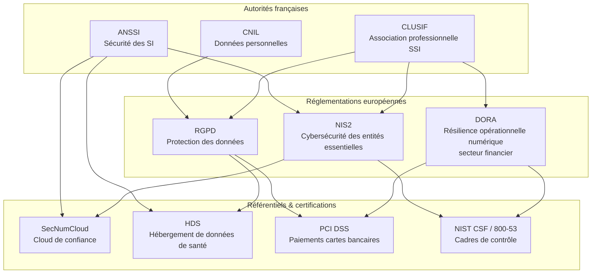
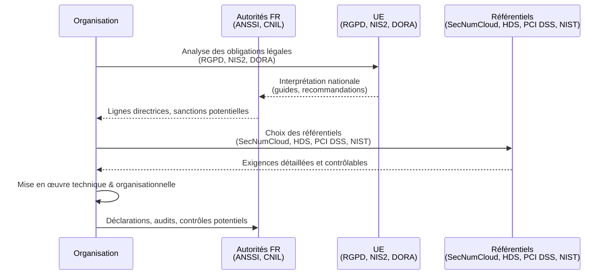

# Référentiels & Normes — Vue d’ensemble

Cette page sert de **carte mentale** des principaux acteurs et textes qui structurent la cybersécurité et la conformité en France et en Europe. Chaque élément (**ANSSI**, **CNIL**, **RGPD**, **NIS2**, **DORA**, **SecNumCloud**, **HDS**, **PCI DSS**, **NIST**) fait l’objet d’une **documentation dédiée**.  

> Ici, nous présentons uniquement **les rôles** et **les liens logiques** entre eux.

!!! info "Logique globale de l’écosystème"
    On peut lire cet ensemble comme **une chaîne cohérente** :
    
    - des **autorités nationales** qui définissent, encadrent ou recommandent
    - des **réglementations européennes** qui fixent des obligations légales transverses
    - des **référentiels et certifications** qui traduisent ces exigences en **exigences opérationnelles, contrôlables et auditables**

## Vue d’ensemble (schéma global)

Ce schéma illustre :

* les **autorités françaises** qui influencent ou interprètent les textes (ANSSI, CNIL, CLUSIF) ;
* les **textes européens** qui fixent le cadre légal (RGPD, NIS2, DORA) ;
* les **référentiels et certifications** qui servent de **traduction opérationnelle** des exigences (SecNumCloud, HDS, PCI DSS, NIST).

---

## 1. Autorités françaises (3)

### ANSSI — Autorité nationale de sécurité des systèmes d’information

!!! info ""

    L’**ANSSI** est l’autorité technique de l’État français pour la sécurité des systèmes d’information.
    Elle publie des **guides, bonnes pratiques et référentiels** et intervient notamment sur :

    * l’interprétation et la mise en œuvre des obligations de cybersécurité liées à **NIS2** en France ;
    * la qualification de services de cloud via le référentiel **SecNumCloud** ;
    * les exigences de sécurité pour certains hébergeurs, en complément ou articulation avec **HDS**.

    Dans ta documentation détaillée, la page ANSSI exposera les **rôles, guides et labels**, alors que cette vue d’ensemble montre **comment** elle s’articule avec NIS2, SecNumCloud et les autres blocs.

### CLUSIF — Club de la sécurité de l’information français

!!! info ""

    Le **CLUSIF** n’est pas une autorité étatique, mais une **association professionnelle**.
    Il produit des **retours d’expérience, baromètres, guides et travaux collectifs**.

    Son rôle dans ce panorama :

    * apporter une **vision pragmatique** des exigences issues du **RGPD**, de **NIS2** ou de **DORA** ;
    * fournir des ressources méthodologiques (état de la menace, bonnes pratiques, retours terrain) qui complètent les référentiels plus normatifs (ISO, NIST, etc.).

### CNIL — Commission nationale de l’informatique et des libertés

!!! info ""

    La **CNIL** est l’autorité française de protection des données personnelles.
    Elle est **l’autorité de contrôle du RGPD en France**.

    Liens principaux :

    * elle interprète et applique le **RGPD** dans le contexte français (sanctions, recommandations, lignes directrices) ;
    * ses avis et recommandations influencent la mise en œuvre de référentiels comme **HDS**, **SecNumCloud**, ou encore certaines pratiques liés à **PCI DSS** lorsqu’il y a traitement de données personnelles.

## 2. Réglementations européennes (3)

### RGPD — Règlement général sur la protection des données

!!! info ""

    Le **RGPD** encadre tous les traitements de **données à caractère personnel** dans l’Union européenne.

    Dans cette carte :

    * la **CNIL** (et ses homologues européennes) en assurent le **contrôle** ;
    * il se décline dans des référentiels sectoriels comme **HDS** (santé) et influence directement les pratiques **PCI DSS** (données de cartes bancaires = données sensibles + données perso) ;
    * il coexiste avec **NIS2** et **DORA**, qui ajoutent une couche **cybersécurité** et **résilience**.

### NIS2 — Directive sur la sécurité des réseaux et de l’information (v2)

!!! info ""

    **NIS2** impose des exigences de cybersécurité renforcées aux **entités essentielles et importantes** (énergie, santé, transport, numérique, etc.).

    Articulation :

    * transposée en droit français sous la supervision de l’**ANSSI** 
    * renforce la logique de gestion des risques et des mesures techniques/organisationnelles  
    * peut être mise en musique via des cadres de contrôle comme **NIST** ou des référentiels labellisés comme **SecNumCloud** pour le cloud.

### DORA — Digital Operational Resilience Act

!!! info ""

    **DORA** cible la **résilience opérationnelle numérique du secteur financier** (banques, assurances, prestataires critiques TIC).

    Dans ce paysage :

    * il complète les obligations de sécurité déjà présentes dans **NIS2** pour certains acteurs
    * il est souvent implémenté à l’aide de **cadres de contrôle** comme **NIST CSF / 800-53**, et croise les obligations de **PCI DSS** quand il y a traitement de paiements
    * il s’appuie sur les mêmes principes : gestion du risque, contrôle des tiers, plans de continuité, tests, reporting

## 3. Référentiels & Certifications (4)

### SecNumCloud — Cloud de confiance labellisé par l’ANSSI

!!! info ""

    **SecNumCloud** est un **référentiel de qualification** pour les prestataires de services cloud, publié par l’**ANSSI**.

    Liens avec le reste :

    * il fournit une **traduction opérationnelle** de haut niveau des besoins NIS2 (gouvernance, sécurité opérationnelle, gestion des incidents, etc.) côté cloud
    * il doit rester compatible avec les exigences **RGPD/CNIL** sur la protection des données
    * il peut s’appuyer sur des cadres internationaux comme **NIST** ou ISO 27001, même s’ils ne sont pas détaillés ici

### HDS — Hébergement de données de santé

!!! info ""

    Le **référentiel HDS** encadre les **hébergeurs de données de santé** en France.

    Il se situe à l’intersection de :

    * **RGPD** et **CNIL** (données de santé = catégorie particulière de données personnelles)
    * exigences de **sécurité** proches de celles de NIS2 et des standards de l’ANSSI
    * parfois d’autres référentiels (ISO, NIST) utilisés comme base de contrôle dans les audits.

### PCI DSS — Sécurité des données de cartes de paiement

!!! info ""

    **PCI DSS** est un standard international pour la **sécurité des données de cartes bancaires**, porté par le **PCI Security Standards Council** (Visa, Mastercard, etc.).

    Dans la vue d’ensemble :

    * il s’aligne avec des objectifs proches de ceux de **RGPD** (protection des données), mais avec un focus spécifique sur les **données de carte** ;
    * il s’inscrit dans les obligations plus larges de conformité et de résilience (ex. **DORA** pour les acteurs financiers) ;
    * il peut être mis en œuvre via des cadres de contrôle type **NIST**.

### NIST — Référentiels de contrôle (NIST CSF, SP 800-53, etc.)

!!! info ""

    Les frameworks **NIST** ne sont pas des lois en Europe, mais des **référentiels techniques** extrêmement utilisés pour structurer :

    * la gestion des risques cyber (NIST CSF) ;
    * les contrôles de sécurité techniques et organisationnels (NIST SP 800-53, 800-171, etc.).

    Dans ton écosystème :

    * ils servent de **boîte à outils structurée** pour mettre en œuvre NIS2, DORA, voire certaines exigences d’ANSSI ;
    * ils facilitent l’alignement entre plusieurs exigences : un même contrôle NIST peut couvrir à la fois des obligations **NIS2**, **DORA**, **RGPD** (sécurité), voire **PCI DSS**.

---

## Parcours type d’une organisation française

Pour donner une vision « dynamique », voici un **parcours simplifié** d’une organisation française qui doit se mettre en conformité :

_Cette page fournit simplement une **vue d’ensemble pédagogique** pour comprendre où se situent chaque document détaillé (ANSSI, CNIL, RGPD, NIS2, DORA, SecNumCloud, HDS, PCI DSS, NIST) dans le paysage global. Les fiches individuelles restent **indépendantes**, mais reliées conceptuellement par cette cartographie._
