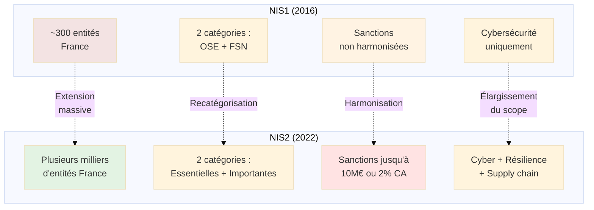
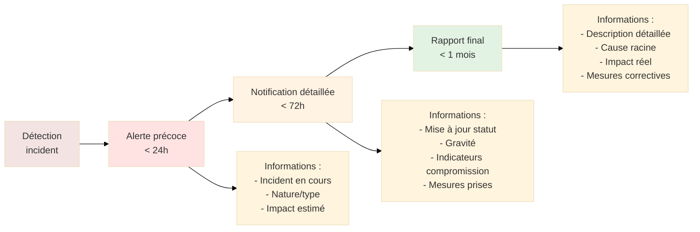
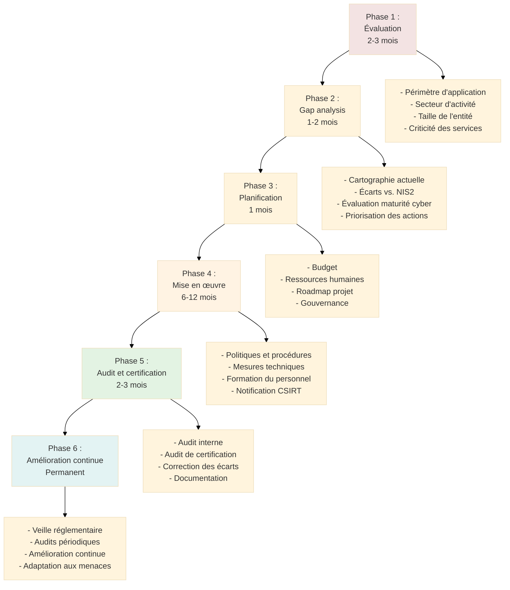

# NIS2 - Directive sur la Sécurité des Réseaux et des Systèmes d'Information

## Introduction

**Niveau :** Débutant & Intermédiaire

!!! quote "Analogie pédagogique"
    _Imaginez un **règlement de sécurité incendie étendu à l'échelle européenne**. Tout comme les établissements recevant du public doivent respecter des normes strictes de sécurité incendie (extincteurs, issues de secours, détecteurs de fumée), **NIS2 impose des exigences de cybersécurité** aux organisations fournissant des services essentiels ou importants pour la société. L'absence de conformité expose à des sanctions, tout comme le non-respect des normes de sécurité incendie._

> La **directive NIS2** (Network and Information Security Directive 2) constitue le **cadre réglementaire européen** visant à renforcer la cybersécurité des infrastructures critiques et des services essentiels à l'échelle de l'Union européenne. Adoptée le **14 décembre 2022** et publiée au Journal officiel de l'UE le **27 décembre 2022**, elle remplace la directive NIS1 de 2016 et doit être **transposée en droit national** par les États membres avant le **17 octobre 2024**.

NIS2 marque une **extension massive** du périmètre réglementaire de la cybersécurité européenne. Là où NIS1 concernait environ **300 entités en France**, NIS2 en concerne potentiellement **plusieurs milliers**. Cette directive répond à un constat simple : la **dépendance croissante de nos sociétés aux systèmes numériques** rend les cyberattaques contre les infrastructures critiques aussi dangereuses que des attaques physiques.

!!! info "Pourquoi c'est important ?"
    NIS2 **harmonise les exigences de cybersécurité** à travers l'Europe, créant un socle commun de mesures de protection. Pour les organisations concernées, la conformité NIS2 n'est **pas optionnelle** : elle s'impose sous peine de sanctions administratives lourdes (jusqu'à 10 millions d'euros ou 2% du CA mondial). Pour les professionnels de la cybersécurité, NIS2 structure le **cadre d'intervention** et définit les **standards minimaux** à respecter pour protéger les services essentiels.

## Pour les vrais débutants

Si vous découvrez NIS2, comprenez qu'il s'agit d'une **directive européenne** et non d'un règlement. Contrairement au RGPD (règlement directement applicable), une directive doit être **transposée en droit national** par chaque État membre. Chaque pays européen a donc adopté ou adoptera une **loi nationale** qui transpose les exigences de NIS2 en droit local.

En France, la transposition de NIS2 se fait via une **modification de la Loi de Programmation Militaire (LPM)** et des décrets d'application. Le cadre français était déjà partiellement aligné avec NIS2 via le régime des **Opérateurs d'Importance Vitale (OIV)** et des **Opérateurs de Services Essentiels (OSE)**, mais NIS2 étend considérablement le périmètre.

!!! tip "NIS2 ne remplace pas le RGPD"
    **NIS2** se concentre sur la **sécurité des systèmes d'information** et la **continuité des services essentiels**. Le **RGPD** se concentre sur la **protection des données personnelles**. Les deux textes sont **complémentaires** et **cumulatifs**. Une organisation peut être soumise aux deux réglementations simultanément et doit respecter les deux cadres juridiques.

## Évolution : de NIS1 à NIS2

### Contexte de NIS1 (2016)

La **première directive NIS** (2016/1148), adoptée en juillet 2016, constituait la première législation européenne sur la cybersécurité. Elle visait à :

- Établir des **capacités nationales** de cybersécurité (CSIRT nationaux)
- Créer un **cadre de coopération** entre États membres
- Imposer des **obligations de sécurité** aux Opérateurs de Services Essentiels (OSE) et aux Fournisseurs de Services Numériques (FSN)

**Limites de NIS1 :**

- **Périmètre trop restreint** : Environ 300 entités en France
- **Disparités nationales** : Chaque État membre a transposé différemment
- **Absence de sanctions dissuasives** : Pas de montants minimaux d'amendes
- **Lacunes sectorielles** : Services postaux, gestion des déchets, secteur spatial non couverts
- **Pas d'obligations pour la supply chain** : Sécurité des fournisseurs non adressée

### Principales évolutions de NIS2

NIS2 apporte des **changements majeurs** :

**Tableau comparatif NIS1 vs NIS2 :**

| Critère | NIS1 | NIS2 |
|---------|------|------|
| **Périmètre** | 7 secteurs (énergie, transport, santé, eau, finance, infrastructures numériques, bancaire) | 18 secteurs (+ services postaux, gestion déchets, spatial, chimie, agroalimentaire, etc.) |
| **Nombre d'entités (France)** | ~300 | Plusieurs milliers (estimation 5 000 à 10 000) |
| **Catégories** | OSE (essentiels) + FSN (numériques) | Essentielles + Importantes |
| **Critères d'inclusion** | Basés sur seuils nationaux variables | Critères de taille harmonisés (250+ salariés ou 50M€ CA) + criticité |
| **Supply chain** | Non adressée | Obligations de sécurité des fournisseurs |
| **Gouvernance** | Non précisée | Obligations explicites pour les organes de direction |
| **Sanctions** | Libres (États membres) | Harmonisées : jusqu'à 10M€ ou 2% CA (essentielles), 7M€ ou 1,4% CA (importantes) |
| **Notification incidents** | 24h (alerte initiale) | 24h (alerte), 72h (notification), 1 mois (rapport final) |
| **Registre des entités** | Non obligatoire | Registre public obligatoire par État membre |

## Champ d'application de NIS2

### Entités essentielles

Les **entités essentielles** sont celles dont la **perturbation aurait un impact critique** sur les fonctions sociétales ou économiques essentielles.

**Secteurs d'activité des entités essentielles (Annexe I de la directive) :**

1. **Énergie**
   - Électricité (production, transport, distribution, fourniture)
   - Réseaux de chauffage et de refroidissement urbains
   - Pétrole (pipelines, production, raffinage, stockage, fourniture)
   - Gaz (production, raffinage, transport, stockage, fourniture, réseaux de distribution, GNL, GPL)
   - Hydrogène (production, stockage, transport)

2. **Transports**
   - Aérien (transporteurs aériens, gestionnaires d'aéroports, opérateurs de gestion du trafic aérien)
   - Ferroviaire (entreprises ferroviaires, gestionnaires d'infrastructures)
   - Maritime (compagnies maritimes de transport de passagers et de fret, gestionnaires de ports, services de trafic maritime)
   - Routier (autorités routières, opérateurs de systèmes de transport intelligents)

3. **Secteur bancaire**
   - Établissements de crédit

4. **Infrastructures des marchés financiers**
   - Opérateurs de plateformes de négociation
   - Contreparties centrales

5. **Santé**
   - Prestataires de soins de santé (hôpitaux, cliniques)
   - Laboratoires de référence de l'UE
   - Entités effectuant des activités de R&D de médicaments
   - Fabricants de dispositifs médicaux critiques
   - Fabricants de produits pharmaceutiques

6. **Eau potable**
   - Fournisseurs et distributeurs d'eau destinée à la consommation humaine (sauf distributeurs pour lesquels la distribution d'eau est une part négligeable de leur activité)

7. **Eaux usées**
   - Entreprises collectant, évacuant ou traitant les eaux usées urbaines ou industrielles

8. **Infrastructures numériques**
   - Points d'échange Internet (IXP)
   - Fournisseurs de services DNS
   - Registres de noms de domaine de premier niveau (TLD)
   - Fournisseurs de services d'informatique en nuage (cloud computing)
   - Fournisseurs de services de centres de données
   - Fournisseurs de réseaux de diffusion de contenu (CDN)
   - Fournisseurs de services de confiance
   - Fournisseurs de réseaux de communications publics
   - Fournisseurs de services de communications électroniques accessibles au public

9. **TIC (Technologies de l'Information et de la Communication) - Gestion des services**
   - Fournisseurs de services gérés
   - Fournisseurs de services de sécurité gérés

10. **Administration publique**
    - Entités de l'administration publique des États membres et de l'Union (centrale, régionale)

11. **Espace**
    - Opérateurs d'infrastructures terrestres détenues, gérées et exploitées par les États membres ou des parties privées, qui appuient la fourniture de services spatiaux

### Entités importantes

Les **entités importantes** fournissent des services dont la perturbation peut avoir un **impact significatif** mais non critique.

**Secteurs d'activité des entités importantes (Annexe II de la directive) :**

1. **Services postaux et d'expédition**
   - Prestataires de services postaux (au sens de la directive sur les services postaux)

2. **Gestion des déchets**
   - Entreprises de gestion des déchets (sauf entreprises pour lesquelles la gestion des déchets n'est pas leur activité économique principale)

3. **Fabrication, production et distribution de produits chimiques**
   - Fabrication, production et distribution de substances et mélanges chimiques

4. **Production, transformation et distribution de denrées alimentaires**
   - Entreprises de l'industrie agroalimentaire (production à grande échelle, transformation et distribution)
   - Exclusion : Commerce de détail, restauration

5. **Fabrication**
   - Fabrication de dispositifs médicaux critiques
   - Fabrication de dispositifs médicaux de diagnostic in vitro
   - Fabrication d'ordinateurs, produits électroniques et optiques
   - Fabrication de matériels électriques
   - Fabrication de machines et équipements
   - Fabrication de véhicules automobiles, remorques et semi-remorques
   - Fabrication d'autres matériels de transport

6. **Fournisseurs numériques**
   - Fournisseurs de services numériques (places de marché en ligne, moteurs de recherche en ligne, plateformes de réseaux sociaux)

7. **Recherche**
   - Organismes de recherche effectuant des activités de R&D

### Critères de taille

NIS2 définit des **seuils harmonisés** pour déterminer les entités couvertes :

**Critères cumulatifs d'inclusion :**

Une entité est couverte par NIS2 si elle remplit **au moins deux des trois critères** suivants :

1. **Effectif** : 250 employés ou plus
2. **Chiffre d'affaires** : 50 millions d'euros ou plus
3. **Bilan** : 43 millions d'euros ou plus

**Entités de petite taille :**

Les entités ne remplissant **aucun de ces critères** (TPE/PME) sont **exclues**, sauf si :

- Elles sont le **seul fournisseur** d'un service essentiel dans un État membre
- Un **incident** affectant cette entité aurait des **effets perturbateurs importants**

**Cas particuliers :**

- **Toutes les administrations publiques** de niveau central sont incluses, quelle que soit leur taille
- **Toutes les entités du secteur de la santé** au-dessus de critères spécifiques sont incluses
- **Filiales de groupes** : Si une filiale fait partie d'un groupe dépassant les seuils, elle peut être incluse

### Exclusions

NIS2 **ne s'applique pas** aux entités :

- Exerçant des activités relevant de la **sécurité nationale, défense, sûreté publique**
- Étant des **parlements ou banques centrales** dans l'exercice de leurs fonctions
- Relevant des **services de renseignement**

## Obligations des entités NIS2

NIS2 impose **dix catégories d'obligations** détaillées à l'article 21 de la directive.

### Article 21 : Mesures de gestion des risques de cybersécurité

Les entités doivent prendre des **mesures techniques, opérationnelles et organisationnelles** appropriées et proportionnées pour gérer les risques pesant sur la sécurité des réseaux et des systèmes d'information.

**Mesures minimales obligatoires (article 21.2) :**

#### 1. Politiques d'analyse des risques et de sécurité des systèmes d'information

**Exigence :**

Établir et mettre en œuvre des **politiques formalisées** couvrant :

- **Analyse des risques** : Identification, évaluation et traitement des risques cyber
- **Sécurité des systèmes d'information** : Définition des mesures de protection

**Application pratique :**

- Documenter une **politique de sécurité** approuvée par la direction
- Réaliser une **analyse de risques** selon une méthode reconnue (EBIOS Risk Manager, ISO 27005, MEHARI)
- Définir un **plan de traitement des risques** avec priorisation
- Réviser annuellement l'analyse de risques

**Mapping ISO 27001 :**

| Exigence NIS2 | ISO 27001:2022 | ISO 9001:2015 | ISO 14001:2015 |
|---------------|----------------|---------------|----------------|
| Politiques d'analyse des risques | 5.1 Politiques de sécurité de l'information 6.1.2 Appréciation des risques de sécurité de l'information | 6.1 Actions à mettre en œuvre face aux risques et opportunités | 6.1 Actions à mettre en œuvre face aux risques et opportunités |
| Sécurité des SI | 6.1.3 Traitement des risques de sécurité de l'information 8.1 Planification et contrôle opérationnels | 8.1 Planification et maîtrise opérationnelles | 8.1 Planification et maîtrise opérationnelles |

#### 2. Gestion des incidents

**Exigence :**

Mettre en place des capacités de **prévention, détection et traitement des incidents** de cybersécurité.

**Application pratique :**

- Définir une **procédure de gestion des incidents** (détection, qualification, escalade, traitement, clôture)
- Mettre en place des **outils de détection** (SIEM, IDS/IPS, EDR)
- Constituer une **équipe de réponse aux incidents** (CSIRT interne ou externalisé)
- Documenter les **incidents** dans un registre
- Réaliser des **retours d'expérience** post-incident

**Mapping ISO :**

| Exigence NIS2 | ISO 27001:2022 | ISO 9001:2015 | ISO 14001:2015 |
|---------------|----------------|---------------|----------------|
| Gestion des incidents | 5.24 Planification et préparation de la gestion des incidents de sécurité de l'information 5.25 Appréciation et décision concernant les événements de sécurité de l'information 5.26 Réponse aux incidents de sécurité de l'information | 8.7 Maîtrise des éléments de sortie non conformes 10.1 Généralités (Amélioration) | 8.2 Préparation et réponse aux situations d'urgence |
| Prévention | 5.7 Renseignement sur les menaces 8.16 Activités de surveillance | 9.1 Surveillance, mesure, analyse et évaluation | 9.1 Surveillance, mesure, analyse et évaluation |

#### 3. Continuité des activités et gestion de crise

**Exigence :**

Garantir la **continuité des opérations** en cas d'incident majeur, notamment via des systèmes de secours et de reprise après sinistre.

**Application pratique :**

- Élaborer un **Plan de Continuité d'Activité (PCA)** cyber
- Identifier les **services critiques** et leurs délais de reprise maximaux (RTO, RPO)
- Mettre en place des **sauvegardes** régulières et testées
- Établir des **systèmes de secours** (sites de repli, redondance)
- Tester le PCA via des **exercices réguliers** (au moins annuels)
- Documenter une **procédure de gestion de crise** incluant la communication de crise

**Mapping ISO :**

| Exigence NIS2 | ISO 27001:2022 | ISO 9001:2015 | ISO 14001:2015 |
|---------------|----------------|---------------|----------------|
| Continuité d'activité | 5.29 Sécurité de l'information pendant les perturbations 5.30 Préparation des TIC pour la continuité de l'activité | - | 8.2 Préparation et réponse aux situations d'urgence |
| Gestion de crise | 5.27 Tirer les leçons des incidents de sécurité de l'information | 10.3 Amélioration continue | 10.3 Amélioration continue |
| Sauvegardes | 8.13 Sauvegarde de l'information | 7.1.5.1 Ressources générales | - |

#### 4. Sécurité de la chaîne d'approvisionnement (supply chain)

**Exigence :**

Sécuriser les relations avec les **fournisseurs et prestataires** ayant accès aux réseaux et systèmes d'information.

**Application pratique :**

- **Évaluer les risques** liés aux fournisseurs critiques
- Intégrer des **clauses de cybersécurité** dans les contrats
- Exiger des **garanties de sécurité** (certifications, audits, conformité NIS2 si applicable)
- Surveiller la **conformité** des fournisseurs
- Gérer les **sous-traitants de sous-traitants** (chaîne étendue)

**Mapping ISO :**

| Exigence NIS2 | ISO 27001:2022 | ISO 9001:2015 | ISO 14001:2015 |
|---------------|----------------|---------------|----------------|
| Sécurité supply chain | 5.19 Sécurité de l'information dans les relations avec les fournisseurs 5.20 Traitement de la sécurité de l'information dans les accords avec les fournisseurs 5.21 Gestion de la sécurité de l'information dans la chaîne logistique des TIC 5.22 Surveillance, revue et gestion du changement des services fournisseurs | 8.4 Maîtrise des processus, produits et services fournis à l'extérieur | 8.1 Planification et maîtrise opérationnelles (prestataires externes) |

#### 5. Sécurité de l'acquisition, du développement et de la maintenance

**Exigence :**

Sécuriser le **cycle de vie complet** des systèmes d'information, de leur conception à leur décommissionnement.

**Application pratique :**

- Intégrer la **sécurité dès la conception** (security by design)
- Appliquer des pratiques de **développement sécurisé** (OWASP, SANS)
- Réaliser des **tests de sécurité** (revue de code, tests d'intrusion)
- Gérer les **vulnérabilités** (patch management)
- Sécuriser les **environnements de développement** (séparation dev/prod)
- Maîtriser les **modifications** (change management)

**Mapping ISO :**

| Exigence NIS2 | ISO 27001:2022 | ISO 9001:2015 | ISO 14001:2015 |
|---------------|----------------|---------------|----------------|
| Développement sécurisé | 8.25 Cycle de développement sécurisé 8.26 Exigences de sécurité des applications | 8.3 Conception et développement de produits et services | - |
| Gestion des changements | 8.32 Gestion du changement | 8.5.6 Maîtrise des modifications | 8.1 Planification et maîtrise opérationnelles (modifications) |
| Vulnérabilités | 8.8 Gestion des vulnérabilités techniques | - | - |

#### 6. Politiques et procédures d'évaluation de l'efficacité des mesures

**Exigence :**

**Évaluer régulièrement** l'efficacité des mesures de cybersécurité mises en place.

**Application pratique :**

- Définir des **indicateurs de sécurité** (KPI/KRI)
- Réaliser des **audits internes** réguliers
- Effectuer des **tests d'intrusion** annuels
- Mesurer la **conformité** aux politiques
- Réviser les **mesures de sécurité** en fonction des résultats
- Documenter les **actions correctives**

**Mapping ISO :**

| Exigence NIS2 | ISO 27001:2022 | ISO 9001:2015 | ISO 14001:2015 |
|---------------|----------------|---------------|----------------|
| Évaluation efficacité | 9.1 Surveillance, mesure, analyse et évaluation 9.2 Audit interne | 9.1 Surveillance, mesure, analyse et évaluation 9.2 Audit interne | 9.1 Surveillance, mesure, analyse et évaluation 9.2 Audit interne |
| Amélioration | 10.1 Amélioration continue 10.2 Non-conformité et action corrective | 10.1 Généralités 10.2 Non-conformité et actions correctives 10.3 Amélioration continue | 10.1 Généralités 10.2 Non-conformité et actions correctives 10.3 Amélioration continue |

#### 7. Pratiques d'hygiène informatique et formations

**Exigence :**

Assurer un **niveau de base d'hygiène informatique** et former régulièrement le personnel.

**Application pratique :**

- Appliquer les **42 mesures du guide d'hygiène informatique ANSSI**
- Former les collaborateurs à la **sensibilisation cyber** (phishing, ingénierie sociale)
- Former les équipes techniques aux **bonnes pratiques** (développement sécurisé, configuration sécurisée)
- Organiser des **campagnes de sensibilisation** régulières
- Tester la vigilance via des **simulations de phishing**
- Former spécifiquement les **administrateurs systèmes**

**Mesures d'hygiène de base :**

- Politique de mots de passe robustes
- Authentification multifacteur (MFA)
- Mises à jour de sécurité régulières
- Antivirus/EDR à jour
- Sauvegardes régulières et testées
- Pare-feu correctement configuré
- Journalisation activée
- Chiffrement des données sensibles

**Mapping ISO :**

| Exigence NIS2 | ISO 27001:2022 | ISO 9001:2015 | ISO 14001:2015 |
|---------------|----------------|---------------|----------------|
| Hygiène informatique | 5.16 Identité et gestion des accès 8.5 Authentification sécurisée 8.7 Protection contre les logiciels malveillants | - | - |
| Formations | 6.3 Sensibilisation, formation et compétence | 7.2 Compétences 7.3 Sensibilisation | 7.2 Compétences 7.3 Sensibilisation |

#### 8. Politiques et procédures de cryptographie et chiffrement

**Exigence :**

Utiliser des solutions de **chiffrement** pour protéger les données sensibles.

**Application pratique :**

- Définir une **politique de cryptographie** (algorithmes autorisés, longueur de clés)
- Chiffrer les **données au repos** (disques, bases de données)
- Chiffrer les **communications** (TLS pour web, VPN pour accès distants)
- Gérer les **clés cryptographiques** (génération, stockage, rotation, révocation)
- Respecter les **recommandations ANSSI** sur la cryptographie
- Utiliser des **algorithmes robustes** (AES-256, RSA-2048+, SHA-256+)

**Mapping ISO :**

| Exigence NIS2 | ISO 27001:2022 | ISO 9001:2015 | ISO 14001:2015 |
|---------------|----------------|---------------|----------------|
| Cryptographie | 8.24 Utilisation de la cryptographie | - | - |
| Gestion des clés | 5.17 Informations d'authentification | - | - |
| Protection données | 5.33 Protection des enregistrements 8.11 Masquage des données | 7.5.3 Maîtrise des informations documentées | - |

#### 9. Sécurité des ressources humaines, politiques de contrôle d'accès et gestion des actifs

**Exigence :**

Sécuriser l'ensemble du **cycle de vie des employés** et contrôler l'accès aux systèmes et données.

**Application pratique :**

**Ressources humaines :**

- Vérifications avant embauche (antécédents si nécessaire)
- Clause de confidentialité dans les contrats
- Formation à l'arrivée et sensibilisation continue
- Procédure de départ (révocation des accès, restitution du matériel)

**Contrôle d'accès :**

- Gestion des identités et des accès (IAM)
- Principe du **moindre privilège**
- Authentification forte pour les comptes à privilèges
- Revue régulière des habilitations
- Traçabilité des accès (logs)

**Gestion des actifs :**

- Inventaire des actifs matériels et logiciels
- Classification des actifs selon leur criticité
- Propriétaire désigné pour chaque actif
- Protection physique des actifs critiques

**Mapping ISO :**

| Exigence NIS2 | ISO 27001:2022 | ISO 9001:2015 | ISO 14001:2015 |
|---------------|----------------|---------------|----------------|
| RH sécurité | 6.1 Sélection 6.2 Termes et conditions d'emploi 6.4 Processus disciplinaire 6.5 Responsabilités après la cessation ou le changement d'emploi | 7.2 Compétences | 7.2 Compétences |
| Contrôle d'accès | 5.15 Contrôle d'accès 5.16 Gestion des identités 8.2 Droits d'accès privilégiés 8.3 Restriction de l'accès à l'information 8.5 Authentification sécurisée | - | - |
| Gestion actifs | 5.9 Inventaire des actifs d'information et autres actifs associés 5.10 Utilisation acceptable de l'information et autres actifs associés 5.12 Classification de l'information | - | - |

#### 10. Utilisation de solutions d'authentification multifacteur (MFA)

**Exigence :**

Déployer l'**authentification multifacteur** pour sécuriser l'accès aux systèmes critiques.

**Application pratique :**

- Activer le **MFA obligatoire** pour :
  - Comptes administrateurs
  - Accès à distance (VPN, bureaux virtuels)
  - Accès aux applications critiques
  - Messagerie professionnelle
  
- Privilégier des méthodes robustes :
  - Application d'authentification (TOTP)
  - Clés de sécurité matérielles (FIDO2)
  - Biométrie avec stockage local (pas de transmission biométrique)

- Éviter les méthodes faibles :
  - SMS (vulnérable à l'interception)
  - Email (si boîte mail compromise)

**Mapping ISO :**

| Exigence NIS2 | ISO 27001:2022 | ISO 9001:2015 | ISO 14001:2015 |
|---------------|----------------|---------------|----------------|
| MFA | 8.5 Authentification sécurisée | - | - |
| Accès distants | 6.7 Travail à distance 8.6 Gestion de la capacité | - | - |

### Responsabilité des organes de direction (Article 20)

NIS2 introduit une **responsabilité personnelle** des dirigeants.

**Obligations de la direction :**

1. **Approuver** les mesures de gestion des risques de cybersécurité
2. **Superviser** leur mise en œuvre
3. Suivre des **formations** en cybersécurité adaptées
4. **Évaluer l'efficacité** des mesures et y remédier en cas de défaillance
5. Être **tenue pour responsable** en cas de non-conformité

**Conséquences :**

- Sanctions personnelles possibles contre les dirigeants
- Responsabilité civile et pénale engagée
- Obligation de justifier d'une **diligence raisonnable**

### Notification d'incidents (Article 23)

**Obligation de notification en trois temps :**

**1. Alerte précoce (< 24 heures) :**

Dès qu'un incident significatif est **détecté**, notification à l'autorité compétente (ANSSI en France via le CERT-FR).

**2. Notification détaillée (< 72 heures) :**

Transmission d'informations **plus complètes** sur l'incident (gravité, impact, mesures de mitigation).

**3. Rapport final (< 1 mois) :**

**Rapport complet** incluant l'analyse de cause racine et les mesures correctives.

**Incidents significatifs :**

Un incident est **significatif** s'il :

- A causé ou est susceptible de causer une **perturbation opérationnelle grave**
- A causé ou est susceptible de causer des **pertes financières considérables**
- Affecte ou est susceptible d'affecter **d'autres personnes physiques ou morales**

## Sanctions (Article 34)

NIS2 harmonise les **sanctions administratives** à travers l'Europe.

### Sanctions pour entités essentielles

**Montant maximal :**

- **10 millions d'euros** OU
- **2% du chiffre d'affaires annuel mondial total** (le montant le plus élevé)

### Sanctions pour entités importantes

**Montant maximal :**

- **7 millions d'euros** OU
- **1,4% du chiffre d'affaires annuel mondial total** (le montant le plus élevé)

### Critères d'appréciation des sanctions

Les autorités tiennent compte de :

- Gravité et durée de la violation
- Caractère intentionnel ou négligent
- Mesures prises pour atténuer les dommages
- Niveau de coopération avec l'autorité compétente
- Violations antérieures
- Impact sur les services essentiels

### Sanctions à l'encontre des dirigeants

NIS2 prévoit explicitement la possibilité de **tenir personnellement responsables les membres des organes de direction** en cas de non-respect des obligations, notamment en ce qui concerne la supervision et l'approbation des mesures de cybersécurité.

## Mapping complet NIS2 - ISO 27001/9001/14001

### Tableau de correspondance synthétique

| Article NIS2 | Exigence | ISO 27001:2022 | ISO 9001:2015 | ISO 14001:2015 |
|--------------|----------|----------------|---------------|----------------|
| **Art. 20** | Responsabilité direction | 5.1 Leadership et engagement | 5.1 Leadership et engagement | 5.1 Leadership et engagement |
| **Art. 21.2.a** | Politiques d'analyse des risques | 5.1 Politiques 6.1.2 Appréciation des risques | 6.1 Actions face aux risques | 6.1 Actions face aux risques |
| **Art. 21.2.b** | Gestion des incidents | 5.24-5.27 Gestion des incidents | 8.7 Éléments de sortie non conformes 10.1-10.3 Amélioration | 8.2 Situations d'urgence |
| **Art. 21.2.c** | Continuité d'activité | 5.29-5.30 Continuité | - | 8.2 Situations d'urgence |
| **Art. 21.2.d** | Sécurité supply chain | 5.19-5.22 Relations fournisseurs | 8.4 Processus externes | 8.1 Opérations (prestataires) |
| **Art. 21.2.e** | Sécurité acquisition/développement | 8.25-8.26 Développement sécurisé 8.8 Vulnérabilités 8.32 Gestion changements | 8.3 Conception et développement 8.5.6 Maîtrise modifications | 8.1 Modifications |
| **Art. 21.2.f** | Évaluation efficacité | 9.1-9.2 Surveillance et audit | 9.1-9.2 Surveillance et audit | 9.1-9.2 Surveillance et audit |
| **Art. 21.2.g** | Hygiène informatique et formation | 5.16 Gestion identités 6.3 Sensibilisation et formation | 7.2-7.3 Compétences et sensibilisation | 7.2-7.3 Compétences et sensibilisation |
| **Art. 21.2.h** | Cryptographie | 8.24 Cryptographie 5.17 Gestion des clés | - | - |
| **Art. 21.2.i** | RH, contrôle d'accès, actifs | 6.1-6.5 Sécurité RH 5.15-5.16 Contrôle d'accès 5.9-5.12 Gestion actifs | 7.2 Compétences | 7.2 Compétences |
| **Art. 21.2.j** | MFA | 8.5 Authentification sécurisée | - | - |
| **Art. 23** | Notification incidents | 5.25 Décision sur événements 5.26 Réponse aux incidents | 10.2 Non-conformité | 10.2 Non-conformité |

### Synergies entre référentiels

**ISO 27001 :**

La **certification ISO 27001** couvre **90% des exigences techniques de NIS2**. Une organisation certifiée ISO 27001 devra principalement compléter par :

- Obligations spécifiques de **notification d'incidents** (délais NIS2)
- Responsabilité formelle de la **direction**
- **MFA obligatoire** (pas toujours imposé par ISO 27001)
- Exigences renforcées sur la **supply chain**

**ISO 9001 :**

La **certification ISO 9001** apporte les fondations de **management de la qualité** qui soutiennent la conformité NIS2 :

- Approche processus structurée
- Culture d'amélioration continue
- Gestion documentaire rigoureuse
- Audit interne régulier

**ISO 14001 :**

La **certification ISO 14001** partage la **structure HLS** (High Level Structure) commune à ISO 27001 et ISO 9001, facilitant l'**intégration des systèmes de management** :

- Gestion des situations d'urgence (parallèle à la gestion de crise cyber)
- Évaluation des risques environnementaux (méthodologie transposable au cyber)
- Engagement de la direction

### Approche de système de management intégré

**Structure HLS commune :**

Tous les standards ISO modernes (27001:2022, 9001:2015, 14001:2015) suivent la **même structure en 10 chapitres** :

1. Domaine d'application
2. Références normatives
3. Termes et définitions
4. Contexte de l'organisme
5. Leadership
6. Planification
7. Support
8. Réalisation des activités opérationnelles
9. Évaluation de la performance
10. Amélioration

Cette structure commune facilite l'**intégration** en un **SMSI (Système de Management de la Sécurité de l'Information)** unique couvrant :

- Sécurité de l'information (ISO 27001)
- Qualité (ISO 9001)
- Environnement (ISO 14001)
- Conformité NIS2

**Bénéfices d'un système intégré :**

- **Optimisation des ressources** : Un seul audit pour plusieurs référentiels
- **Cohérence documentaire** : Politiques et procédures unifiées
- **Synergies opérationnelles** : Processus transverses (gestion des risques, amélioration continue)
- **Vision globale** : Approche holistique de la performance organisationnelle

## Calendrier de mise en conformité

**Échéances clés :**

| Date | Événement |
|------|-----------|
| **27 décembre 2022** | Publication de la directive NIS2 au JOUE |
| **17 octobre 2024** | Date limite de transposition en droit national par les États membres |
| **17 octobre 2024** | Entrée en application des obligations pour les entités |
| **17 avril 2025** | Publication des registres nationaux d'entités |
| **17 octobre 2027** | Premier rapport de la Commission sur l'application de NIS2 |

**Étapes de mise en conformité recommandées :**

## Le mot de la fin

!!! quote
    NIS2 marque un **tournant historique** dans la régulation de la cybersécurité en Europe. En étendant massivement le périmètre des entités concernées, elle acte que la cybersécurité n'est plus une préoccupation réservée aux secteurs technologiques mais une **nécessité transversale** pour toute organisation fournissant des services essentiels ou importants à la société.
    
    Pour les professionnels de la cybersécurité, NIS2 représente à la fois une **contrainte réglementaire** et une **opportunité**. Contrainte, car elle impose des exigences strictes avec des sanctions dissuasives. Opportunité, car elle légitime enfin les investissements en cybersécurité auprès des directions générales qui ne peuvent plus ignorer le sujet.
    
    La responsabilisation des organes de direction constitue une **innovation majeure**. En rendant les dirigeants personnellement responsables de la supervision de la cybersécurité, NIS2 transforme un sujet technique en **enjeu de gouvernance stratégique**. Les COMEX devront désormais consacrer du temps à la cybersécurité, au même titre qu'aux finances ou aux ressources humaines.
    
    L'articulation avec les standards ISO (27001, 9001, 14001) offre une **voie pragmatique de mise en conformité**. Les organisations déjà certifiées ISO 27001 disposent d'une longueur d'avance considérable, devant principalement compléter sur les aspects de notification d'incidents et de gouvernance. Celles qui ne le sont pas devraient considérer la certification ISO 27001 comme un **levier de conformité NIS2** efficace.
    
    La supply chain devient enfin un **sujet réglementaire explicite**. Après des années où les failles de sécurité des fournisseurs ont causé des incidents majeurs (SolarWinds, Kaseya, Log4Shell), NIS2 impose une **diligence raisonnable** sur la sécurité de la chaîne d'approvisionnement. Cette exigence forcera une **montée en maturité collective** de l'écosystème.
    
    Les sanctions financières atteignent des niveaux **réellement dissuasifs** (jusqu'à 10 millions d'euros ou 2% du CA mondial). Contrairement à NIS1 où les sanctions étaient théoriques, NIS2 crée un risque financier tangible qui captera l'attention des directions financières et des conseils d'administration.
    
    La mise en conformité NIS2 ne se résume **pas à un projet ponctuel**. C'est un **engagement de long terme** nécessitant une transformation culturelle, l'allocation de ressources pérennes, et une amélioration continue. Les organisations qui percevront NIS2 comme une simple formalité administrative sont celles qui subiront les sanctions les plus lourdes.
    
    **Maîtriser NIS2**, c'est comprendre que la cybersécurité des infrastructures critiques n'est plus une option mais une **obligation légale et sociétale**. C'est reconnaître que dans un monde hyperconnecté, la défaillance d'un maillon peut fragiliser l'ensemble du système. C'est accepter que la conformité réglementaire n'est que le **minimum légal**, et que l'excellence en cybersécurité nécessite d'aller au-delà.

---

## Ressources complémentaires

### Textes officiels

- **Directive NIS2 (UE) 2022/2555** : [https://eur-lex.europa.eu/eli/dir/2022/2555](https://eur-lex.europa.eu/eli/dir/2022/2555)
- **Transposition française** : Modifications de la LPM et décrets d'application (en cours)

### Guides ANSSI

- **Guide de mise en conformité NIS2** (à paraître)
- **Guide d'hygiène informatique** : Mesures essentielles
- **EBIOS Risk Manager** : Méthode d'analyse de risques

### Standards ISO

- **ISO/IEC 27001:2022** : Systèmes de management de la sécurité de l'information
- **ISO 9001:2015** : Systèmes de management de la qualité
- **ISO 14001:2015** : Systèmes de management environnemental
- **ISO/IEC 27002:2022** : Code de bonnes pratiques pour la sécurité de l'information

### Organismes de référence

- **ANSSI** : [https://cyber.gouv.fr](https://cyber.gouv.fr)
- **ENISA** : [https://www.enisa.europa.eu](https://www.enisa.europa.eu)
- **Commission européenne** : [https://digital-strategy.ec.europa.eu](https://digital-strategy.ec.europa.eu)

---

!!! abstract "Métadonnées"
    **Version** : 0.1  
    **Dernière mise à jour** : Novembre 2025  
    **Durée de lecture** : 55-65 minutes  
    **Niveau** : Débutant & Intermédiaire