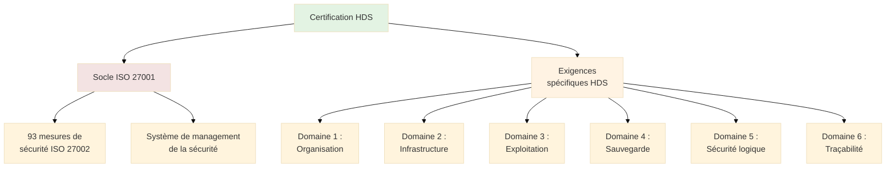
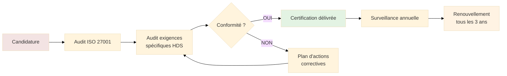

# HDS - Hébergement de Données de Santé

## Introduction

**Niveau :** Débutant & Intermédiaire

!!! quote "Analogie pédagogique"
    _Imaginez un **coffre-fort certifié pour objets de valeur**. Seuls les coffres répondant à des normes strictes de résistance à l'effraction peuvent être vendus pour protéger des biens précieux. **HDS fonctionne identiquement pour les données de santé** : seuls les hébergeurs certifiés conformes à un référentiel technique strict peuvent légalement stocker des données médicales personnelles. Cette certification garantit un niveau de sécurité adapté à la sensibilité extrême de ces informations._

> La **certification HDS** (Hébergement de Données de Santé) constitue l'**obligation réglementaire française** pour toute organisation hébergeant des **données de santé à caractère personnel** pour le compte d'établissements de santé, de professionnels de santé ou de patients. Créée par la **loi de modernisation du système de santé du 26 janvier 2016** et codifiée à l'**article L.1111-8 du Code de la Santé Publique**, HDS vise à garantir la **confidentialité, l'intégrité et la disponibilité** des données médicales dans un contexte de transformation numérique massive du secteur de la santé.

Les données de santé constituent la **catégorie de données personnelles la plus sensible** selon le RGPD. Leur compromission peut avoir des **conséquences dramatiques** : discrimination à l'emploi ou à l'assurance, chantage, atteinte à la vie privée irréversible. HDS impose donc un cadre de sécurité renforcé qui va **au-delà des exigences RGPD génériques**.

!!! info "Pourquoi c'est important ?"
    HDS **structure l'écosystème de l'e-santé française** en définissant les standards de sécurité applicables à tous les acteurs (hôpitaux, laboratoires, éditeurs de logiciels médicaux, hébergeurs cloud). Pour les professionnels de santé, choisir un hébergeur certifié HDS garantit la conformité réglementaire. Pour les hébergeurs, obtenir la certification HDS ouvre l'accès au **marché de la santé numérique** en forte croissance. L'**absence de certification HDS** rend illégal l'hébergement de données de santé et expose à des sanctions pénales (5 ans d'emprisonnement, 300 000€ d'amende).

## Champ d'application

### Données de santé concernées

**Définition légale (Article L.1111-8 du CSP) :**

Sont des données de santé à caractère personnel : _"Les informations concernant la santé physique ou mentale, passée, présente ou future, d'une personne physique (y compris la prestation de services de soins de santé) qui révèlent des informations sur l'état de santé de cette personne."_

**Exemples de données de santé :**

| Catégorie | Exemples concrets |
|-----------|-------------------|
| **Données administratives** | Nom, prénom, n° sécurité sociale, coordonnées du patient |
| **Données médicales** | Antécédents médicaux, diagnostics, pathologies, allergies |
| **Données de soins** | Prescriptions, comptes rendus d'hospitalisation, protocoles de soins |
| **Imagerie médicale** | Radiographies, IRM, scanner, échographies |
| **Données biologiques** | Résultats d'analyses, groupe sanguin, données génétiques |
| **Données psychologiques** | Comptes rendus psychiatriques, évaluations psychologiques |
| **Données de dispositifs médicaux** | Données de pacemaker, pompe à insuline, objets connectés santé |

### Activités d'hébergement soumises à HDS

**Activités couvertes par HDS (arrêté du 4 janvier 2017) :**

1. **Mise à disposition et maintien en condition opérationnelle** des sites physiques permettant d'héberger l'infrastructure matérielle
2. **Mise à disposition et maintien en condition opérationnelle** de l'infrastructure matérielle hébergeant les données de santé
3. **Mise à disposition et maintien en condition opérationnelle** de l'infrastructure virtuelle hébergeant les données de santé
4. **Mise à disposition et maintien en condition opérationnelle** de la plateforme d'hébergement applicatif
5. **Administration et exploitation** du système d'information contenant les données de santé
6. **Sauvegarde** des données de santé

**Acteurs concernés :**

| Type d'acteur | Obligation HDS | Exemples |
|---------------|---------------|----------|
| **Hébergeur physique** | OUI (activité 1) | Datacenters (Equinix, Interxion) |
| **Fournisseur IaaS** | OUI (activités 2-3) | OVHcloud, Cloud Temple, AWS |
| **Fournisseur PaaS** | OUI (activité 4) | Plateformes applicatives cloud |
| **Éditeur SaaS santé** | OUI (activité 5) | Doctolib, Maiia, logiciels de gestion patients |
| **Prestataire sauvegarde** | OUI (activité 6) | Solutions de backup spécialisées |
| **Établissement de santé** | NON (exception) | Hôpitaux hébergeant leurs propres données |
| **Professionnel de santé libéral** | NON (exception) | Médecin hébergeant données dans son cabinet |

**Exceptions :**

Les professionnels et établissements de santé **hébergeant eux-mêmes** leurs données (serveurs sur site) sont **dispensés de certification HDS** mais doivent respecter la **politique de sécurité des systèmes d'information de santé (PGSSI-S)**.

## Référentiel HDS

### Structure du référentiel

HDS s'appuie sur **deux référentiels complémentaires** :

**1. ISO/IEC 27001:2013** (devenu 27001:2022) : Système de management de la sécurité de l'information

**2. Exigences spécifiques HDS** : 68 exigences additionnelles organisées en 6 domaines

### Les 6 domaines HDS

**Domaine 1 : Organisation et pilotage (12 exigences)**

- Gouvernance de la sécurité des données de santé
- Responsable de la sécurité désigné
- Gestion documentaire (politiques, procédures)
- Formation et sensibilisation du personnel
- Gestion des sous-traitants

**Domaine 2 : Sécurité de l'infrastructure (14 exigences)**

- Sécurité physique des datacenters (contrôle d'accès, vidéosurveillance)
- Redondance et continuité (alimentation, climatisation, connectivité)
- Protection contre les sinistres (incendie, inondation)
- Sécurité logique des infrastructures (pare-feu, segmentation réseau)

**Domaine 3 : Exploitation et maintenance (16 exigences)**

- Gestion des incidents de sécurité
- Gestion des changements
- Gestion des configurations
- Surveillance et supervision (monitoring 24/7)
- Gestion des mises à jour et correctifs

**Domaine 4 : Sauvegarde (8 exigences)**

- Politique de sauvegarde documentée
- Fréquence adaptée à la criticité
- Tests de restauration réguliers
- Stockage sécurisé des sauvegardes
- Chiffrement des sauvegardes

**Domaine 5 : Sécurité logique et gestion des accès (12 exigences)**

- Authentification forte (MFA obligatoire pour accès administratifs)
- Gestion des habilitations (principe du moindre privilège)
- Traçabilité des accès et opérations
- Chiffrement des données au repos et en transit
- Gestion sécurisée des clés cryptographiques

**Domaine 6 : Traçabilité et gestion des preuves (6 exigences)**

- Journalisation exhaustive des événements
- Conservation des logs minimum 3 ans
- Protection de l'intégrité des logs
- Capacité de recherche et d'analyse des logs
- Horodatage certifié

## Processus de certification

### Étapes de la certification

**1. Préparation (6-12 mois) :**

- Mise en conformité ISO 27001
- Implémentation des 68 exigences HDS spécifiques
- Documentation complète (politiques, procédures, enregistrements)
- Tests et corrections

**2. Choix de l'organisme certificateur (1 mois) :**

Sélection d'un organisme accrédité COFRAC :

- AFNOR Certification
- Bureau Veritas
- SGS
- DNV
- LCIE Bureau Veritas

**3. Audit de certification (2-5 jours) :**

- Audit documentaire (politiques, procédures)
- Audit sur site (visite des datacenters, interviews)
- Tests techniques (accès, logs, sauvegardes)
- Rédaction du rapport d'audit

**4. Délivrance de la certification (1 mois) :**

Si conforme : certificat valable **3 ans** précisant les activités certifiées (parmi les 6)

**5. Surveillance (annuelle) :**

Audits de suivi annuels pour vérifier le maintien de la conformité

**6. Renouvellement (tous les 3 ans) :**

Audit complet de renouvellement

### Coûts de la certification

| Poste | Montant estimé |
|-------|---------------|
| **Préparation et mise en conformité** | 50 000 € - 200 000 € |
| **Audit de certification** | 10 000 € - 30 000 € |
| **Surveillance annuelle** | 5 000 € - 15 000 € |
| **Renouvellement (tous les 3 ans)** | 8 000 € - 25 000 € |
| **Consultant externe (optionnel)** | 30 000 € - 100 000 € |

**Facteurs de variation :**

- Taille de l'organisation et périmètre
- Nombre d'activités certifiées (1 à 6)
- Niveau de maturité ISO 27001 initial
- Complexité technique des infrastructures

## HDS et RGPD : articulation

### Obligations cumulatives

HDS et RGPD s'appliquent **simultanément** aux hébergeurs de données de santé.

| Aspect | HDS | RGPD |
|--------|-----|------|
| **Nature juridique** | Certification obligatoire (droit français) | Règlement européen directement applicable |
| **Périmètre** | Hébergement données de santé France | Traitement données personnelles UE |
| **Focus** | Sécurité technique de l'hébergement | Protection des droits des personnes |
| **Obligation** | Certification par organisme accrédité | Conformité auto-déclarée (accountability) |
| **Contrôle** | CNIL + ARS (Agences Régionales de Santé) | CNIL |
| **Sanctions** | Pénales (5 ans prison, 300k€) + RGPD | Administratives (20M€ ou 4% CA) |

**Complémentarité :**

- **HDS** garantit la **sécurité technique** de l'hébergement
- **RGPD** impose le **respect des droits** des patients (accès, rectification, portabilité)

**Obligations RGPD additionnelles :**

Même certifié HDS, l'hébergeur doit :

- **Registre des traitements** : Documenter les traitements de données de santé
- **AIPD** : Réaliser une analyse d'impact (obligatoire pour données de santé à grande échelle)
- **DPO** : Désigner un Délégué à la Protection des Données
- **Notification violations** : Notifier la CNIL sous 72h en cas de fuite de données
- **Clauses contractuelles** : Contrats conformes RGPD avec les clients (responsables de traitement)

## Sanctions et contrôles

### Sanctions pénales

**Article 226-17 du Code pénal :**

_"Le fait de procéder ou de faire procéder à un traitement de données à caractère personnel sans mettre en œuvre les mesures prescrites à l'article 34 de la loi n° 78-17 du 6 janvier 1978 précitée est puni de cinq ans d'emprisonnement et de 300 000 € d'amende."_

**Application à HDS :**

Héberger des données de santé **sans certification HDS** constitue un **délit pénal** passible de :

- **5 ans d'emprisonnement**
- **300 000 € d'amende**

### Sanctions administratives RGPD

En cumul des sanctions pénales, la CNIL peut prononcer :

- Amendes jusqu'à **20 millions €** ou **4% du CA mondial**
- Injonction de mise en conformité
- Limitation ou interdiction temporaire de traitement

### Contrôles

**Autorités compétentes :**

- **CNIL** : Contrôle du respect du RGPD et de HDS
- **ARS** : Contrôle des établissements de santé et de leurs prestataires
- **ANSM** : Agence Nationale de Sécurité du Médicament (dispositifs médicaux connectés)

**Modalités de contrôle :**

- Audits sur pièces (demande de documentation)
- Audits sur site (visite des infrastructures)
- Tests techniques (pentests, audits de configuration)
- Contrôles suite à plaintes ou incidents

## Le mot de la fin

!!! quote
    HDS incarne la reconnaissance par le législateur français de la **criticité absolue** des données de santé. En imposant une certification obligatoire distincte du RGPD, la France affirme que la santé numérique nécessite un **cadre de sécurité renforcé** adapté aux enjeux médicaux.
    
    Pour les hébergeurs cloud, HDS représente à la fois une **barrière à l'entrée** (coût et complexité de certification) et une **opportunité de marché** (e-santé en croissance exponentielle). La certification HDS constitue un **différenciateur concurrentiel** sur le marché de la santé.
    
    L'articulation HDS-RGPD crée un **cadre juridique exigeant** qui contraint les acteurs à une rigueur technique et organisationnelle maximale. Les sanctions pénales (5 ans de prison) démontrent que l'hébergement illégal de données de santé est traité avec la même sévérité que l'exercice illégal de la médecine.

---

## Ressources complémentaires

- **Code de la Santé Publique** : Article L.1111-8
- **Référentiel HDS** : Arrêté du 4 janvier 2017
- **Liste hébergeurs certifiés** : [esante.gouv.fr](https://esante.gouv.fr)
- **ASIP Santé** : Agence du Numérique en Santé

---

!!! abstract "Métadonnées"
    **Version** : 0.1  
    **Dernière mise à jour** : Novembre 2025  
    **Durée de lecture** : 25-30 minutes  
    **Niveau** : Débutant & Intermédiaire