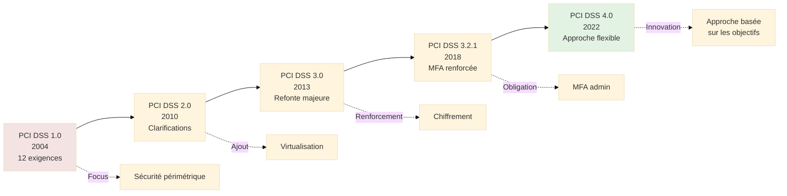
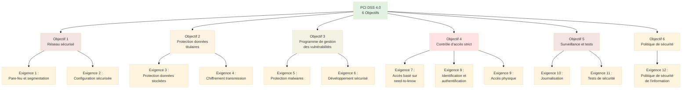

# PCI DSS - Payment Card Industry Data Security Standard

## Introduction

**Niveau :** Débutant & Intermédiaire

!!! quote "Analogie pédagogique"
    _Imaginez un **protocole de sécurité universel pour les transports de fonds**. Peu importe le pays ou l'entreprise, tous les véhicules blindés doivent respecter les mêmes normes de blindage, de verrouillage et de traçabilité GPS. **PCI DSS fonctionne identiquement pour les paiements par carte** : tous les acteurs manipulant des données de cartes bancaires (numéros, codes CVV, dates d'expiration) doivent respecter le même standard de sécurité, quelle que soit leur taille ou localisation._

> **PCI DSS** (Payment Card Industry Data Security Standard) constitue le **standard international de sécurité** développé par les principales sociétés de cartes bancaires (Visa, Mastercard, American Express, Discover, JCB) pour protéger les données de cartes de paiement contre le vol, la fraude et les compromissions. Créé en **2004** et géré par le **PCI Security Standards Council**, PCI DSS définit les **exigences techniques et opérationnelles** minimales que doivent respecter toutes les organisations stockant, traitant ou transmettant des données de titulaires de cartes.

Contrairement aux réglementations étatiques (RGPD, NIS2), PCI DSS est un **standard privé imposé contractuellement** par les réseaux de cartes bancaires. Tout commerçant ou prestataire de services acceptant les paiements par carte s'engage contractuellement, via son contrat d'acceptation, à respecter PCI DSS. Le **non-respect** expose à des sanctions financières massives (amendes, majoration des commissions), voire à l'**interdiction d'accepter les paiements par carte**.

!!! info "Pourquoi c'est important ?"
    Les **violations de données de cartes bancaires** causent des dommages considérables : pertes financières directes, coûts de renouvellement massif de cartes, atteinte à la réputation, sanctions des réseaux de cartes. PCI DSS **structure l'écosystème mondial du paiement** en imposant un socle de sécurité uniforme. Pour les commerçants et prestataires, la conformité PCI DSS est **non négociable** : elle conditionne la capacité même d'accepter les cartes bancaires. Pour les professionnels de la cybersécurité, PCI DSS constitue un **référentiel technique détaillé** couvrant l'ensemble du spectre de la sécurité informatique appliquée aux paiements.

## Pour les vrais débutants

Si vous découvrez PCI DSS, comprenez qu'il s'agit d'un **standard privé** et non d'une loi. Il est **imposé contractuellement** par les réseaux de cartes bancaires à tous les acteurs de la chaîne de paiement. PCI DSS s'applique **mondialement** : un site e-commerce français, une PME américaine ou une multinationale japonaise acceptant Visa/Mastercard doivent tous respecter PCI DSS.

PCI DSS ne se limite pas aux grandes entreprises. **Tout commerçant**, quelle que soit sa taille, manipule des données de cartes et est donc soumis au standard. Cependant, les **exigences de validation** (audits, tests) varient selon le **volume de transactions annuel**.

!!! tip "PCI DSS et RGPD : articulation"
    **PCI DSS** se concentre sur la **sécurité des données de cartes bancaires**. Le **RGPD** couvre la **protection de toutes les données personnelles** (dont les données de paiement font partie). Les deux textes sont **complémentaires** et **cumulatifs**. Un commerçant européen doit respecter à la fois PCI DSS (pour les données de cartes) et RGPD (pour l'ensemble des données clients). Certaines exigences se recoupent (chiffrement, contrôle d'accès, journalisation), mais PCI DSS est **plus prescriptif techniquement** sur les aspects paiement.

## Historique et évolutions

### Genèse de PCI DSS (2004)

Avant PCI DSS, chaque réseau de carte (Visa, Mastercard) avait son **propre standard** de sécurité, créant une complexité ingérable pour les commerçants devant se conformer à des exigences multiples et parfois contradictoires.

**Facteurs déclencheurs :**

- **Augmentation massive** des violations de données de cartes (années 2000)
- **Coûts astronomiques** des fraudes et renouvellements de cartes
- **Fragmentation** des standards de sécurité entre réseaux
- **Nécessité d'un cadre unifié** applicable mondialement

**Création du PCI Security Standards Council (2006) :**

Visa, Mastercard, American Express, Discover et JCB créent un **organisme indépendant** chargé de maintenir et faire évoluer PCI DSS.

### Versions majeures

**PCI DSS 4.0 (mars 2022) :**

La version **4.0** représente une **refonte majeure** avec :

- **Approche flexible** : Possibilité d'atteindre les objectifs de sécurité par des moyens alternatifs documentés
- **Nouvelles exigences** : 64 nouvelles exigences (362 au total vs 298 en v3.2.1)
- **Période de transition** : Applicable jusqu'au **31 mars 2024**, obligatoire après le **31 mars 2025**
- **Focus sur les nouvelles menaces** : Sécurité du cloud, conteneurs, API

## Champ d'application

### Qui est concerné ?

**Tous les acteurs manipulant des données de cartes de paiement :**

| Type d'entité | Exemples | Obligations PCI DSS |
|---------------|----------|-------------------|
| **Commerçants** | Sites e-commerce, magasins physiques, restaurants | Conformité selon niveau de transactions |
| **Prestataires de services** | Processeurs de paiement, passerelles, hébergeurs e-commerce | Conformité + audits annuels obligatoires |
| **Acquéreurs** | Banques acquéreuses | Conformité + supervision des commerçants |
| **Émetteurs de cartes** | Banques émettrices | Conformité selon programmes internes |
| **Sous-traitants** | Centres d'appels, prestataires support, développeurs | Conformité si accès aux données de cartes |

### Types de données protégées

**Données de titulaires de cartes (Cardholder Data - CHD) :**

| Donnée | Description | Stockage autorisé | Protection requise |
|--------|-------------|-------------------|-------------------|
| **PAN** (Primary Account Number) | Numéro de carte (16 chiffres généralement) | OUI (si nécessaire) | Chiffrement obligatoire |
| **Nom du titulaire** | Nom inscrit sur la carte | OUI | Protection standard |
| **Date d'expiration** | MM/AA | OUI | Protection standard |
| **Code de service** | Code à 3 chiffres sur piste magnétique | OUI | Protection standard |

**Données sensibles d'authentification (Sensitive Authentication Data - SAD) :**

| Donnée | Description | Stockage autorisé | Sanction |
|--------|-------------|-------------------|----------|
| **CVV/CVC** | Code de vérification (3-4 chiffres au dos) | **JAMAIS** | Violation majeure |
| **PIN** | Code personnel d'identification | **JAMAIS** | Violation critique |
| **Données de piste magnétique complète** | Track 1 & 2 | **JAMAIS** | Violation majeure |
| **Données de puce (CAV/CVC)** | Données cryptographiques de la puce | **JAMAIS** | Violation majeure |

**Règle absolue :**

Les **données sensibles d'authentification** (SAD) ne doivent **JAMAIS** être stockées après autorisation de la transaction, **même chiffrées**. Toute violation de cette règle entraîne des sanctions immédiates et sévères.

### Niveaux de commerçants

Les commerçants sont classés en **4 niveaux** selon leur volume de transactions annuel :

| Niveau | Volume annuel | Obligations de validation |
|--------|---------------|--------------------------|
| **Niveau 1** | Plus de 6 millions de transactions | - Audit annuel par QSA (Qualified Security Assessor) - Scan trimestriel par ASV (Approved Scanning Vendor) - Attestation de conformité (AOC) |
| **Niveau 2** | 1 à 6 millions de transactions | - SAQ (Self-Assessment Questionnaire) ou audit QSA - Scan trimestriel ASV - Attestation de conformité |
| **Niveau 3** | 20 000 à 1 million de transactions e-commerce | - SAQ (Self-Assessment Questionnaire) - Scan trimestriel ASV - Attestation de conformité |
| **Niveau 4** | Moins de 20 000 transactions e-commerce ou moins de 1 million toutes transactions | - SAQ (Self-Assessment Questionnaire) - Scan trimestriel ASV (recommandé) - Attestation de conformité |

**Note :** Les volumes sont définis **par réseau de carte** (Visa, Mastercard). Un commerçant peut être Niveau 2 chez Visa et Niveau 3 chez Mastercard.

## Structure de PCI DSS 4.0

PCI DSS s'organise autour de **12 exigences** regroupées en **6 objectifs** de sécurité.

### Exigence 1 : Pare-feu et segmentation réseau

**Objectif :** Installer et maintenir des contrôles de sécurité réseau.

**Sous-exigences clés (4.0) :**

**1.1 : Processus et mécanismes de sécurité réseau**

- Documentation de l'architecture réseau (diagrammes à jour)
- Flux de données cartographiés
- Configuration des pare-feu documentée

**1.2 : Segmentation réseau**

- **Séparation** du **Cardholder Data Environment (CDE)** du reste du réseau
- **Segmentation** pour limiter la portée PCI DSS
- **Contrôles** aux points d'entrée/sortie du CDE
- **Tests** annuels de la segmentation

**1.3 : Accès réseau au CDE restreint**

- Restriction des **connexions entrantes** au strict nécessaire
- Restriction des **connexions sortantes** du CDE
- **Interdiction** d'accès direct depuis Internet au CDE
- **DMZ** obligatoire pour services exposés

**1.4 : Contrôles pour les connexions distantes**

- **VPN** ou connexions sécurisées équivalentes obligatoires
- **MFA** (authentification multifacteur) pour tous les accès distants au CDE
- **Déconnexion automatique** après période d'inactivité

**1.5 : Risques provenant de services gérés et de connexions de tiers**

- Gestion des accès des **prestataires tiers** au CDE
- Activation **uniquement pendant la durée nécessaire**
- **Surveillance** des activités des tiers

### Exigence 2 : Configuration sécurisée des systèmes

**Objectif :** Appliquer des configurations sécurisées à tous les composants système.

**Sous-exigences clés :**

**2.1 : Processus et mécanismes de configuration sécurisée**

- **Standards de configuration** documentés pour tous les types de systèmes
- Basés sur des **références reconnues** (CIS Benchmarks, guides NIST)
- Revue **annuelle** des standards

**2.2 : Configuration sécurisée des composants système**

- **Durcissement** (hardening) de tous les systèmes du CDE
- **Désactivation** des services, protocoles, démons inutiles
- **Suppression** des comptes par défaut et mots de passe vendeurs
- **Un seul rôle primaire** par serveur (pas de serveur multi-fonction)

**2.3 : Services système sécurisés**

- **Chiffrement** obligatoire pour administration à distance (SSH, HTTPS)
- **Interdiction** de Telnet, FTP non sécurisés
- **Console d'administration** sécurisée séparément

### Exigence 3 : Protection des données de titulaires de cartes stockées

**Objectif :** Protéger les données de cartes stockées.

**Sous-exigences clés :**

**3.1 : Processus pour la protection des données stockées**

- **Inventaire** des emplacements de stockage des CHD
- **Minimisation** : Ne stocker que le strict nécessaire
- **Rétention** : Durée de conservation justifiée et documentée
- **Suppression sécurisée** au-delà de la période de rétention

**3.2 : Interdiction de stockage des données sensibles d'authentification (SAD)**

- **JAMAIS** stocker CVV/CVC, PIN, données de piste complète après autorisation
- **Validation automatisée** : Scripts détectant toute présence de SAD

**3.3 : Le PAN est masqué lors de l'affichage**

- Maximum **6 premiers** et **4 derniers** chiffres visibles
- Masquage obligatoire sauf pour utilisateurs avec **besoin métier documenté**

**3.4 : Le PAN est illisible où qu'il soit stocké**

- **Chiffrement** du PAN (AES-256, RSA-2048 minimum)
- **Hachage** unidirectionnel (salted hash) si possible
- **Tokenisation** comme alternative
- **Troncature** (mais ne suffit pas seule pour stockage long terme)

**3.5 : Gestion sécurisée des clés cryptographiques**

- **Génération** de clés robustes (FIPS 140-2 ou équivalent)
- **Distribution** sécurisée (chiffrement des clés)
- **Stockage** sécurisé (HSM, keystore chiffré)
- **Rotation** périodique des clés
- **Destruction sécurisée** des anciennes clés
- **Séparation des rôles** : Personne ne peut reconstituer seule une clé complète

### Exigence 4 : Protection des transmissions de données de titulaires

**Objectif :** Protéger les données de cartes lors des transmissions sur réseaux publics.

**Sous-exigences clés :**

**4.1 : Processus et mécanismes de transmission sécurisée**

- **Chiffrement obligatoire** (TLS 1.2 minimum, TLS 1.3 recommandé)
- **Interdiction** de SSL, TLS 1.0, TLS 1.1
- **Certificats** valides et à jour
- **Configuration** sécurisée des protocoles (désactivation des ciphers faibles)

**4.2 : Le PAN n'est jamais envoyé via technologies de messagerie utilisateur final**

- **Interdiction** d'envoyer PAN par email, SMS, chat non sécurisés
- Si absolument nécessaire : **chiffrement de bout en bout** obligatoire

### Exigence 5 : Protection contre les malwares

**Objectif :** Protéger tous les systèmes et réseaux contre les logiciels malveillants.

**Sous-exigences clés :**

**5.1 : Processus et mécanismes de protection contre malwares**

- Déploiement d'**antivirus/anti-malware** sur tous les systèmes sensibles aux malwares
- **Mises à jour automatiques** des définitions de virus
- **Scans périodiques** (au moins hebdomadaires)

**5.2 : Les malwares sont empêchés ou détectés**

- **Protection en temps réel** active
- **Détection comportementale** (EDR) recommandée pour PCI DSS 4.0
- **Centralisation** des alertes

**5.3 : Anti-malware non désactivable**

- Mécanismes empêchant la **désactivation** ou **altération** par utilisateurs
- **Alertes** automatiques en cas de désactivation

### Exigence 6 : Développement et maintenance sécurisés

**Objectif :** Développer et maintenir des systèmes et applications sécurisés.

**Sous-exigences clés :**

**6.1 : Processus de gestion des vulnérabilités**

- **Veille** sur les vulnérabilités (CVE, alertes vendeurs)
- **Priorisation** des correctifs selon criticité
- **Déploiement** des patchs critiques dans le mois suivant publication

**6.2 : Prévention des vulnérabilités courantes**

- Formation des développeurs aux **failles de sécurité** (OWASP Top 10)
- **Revue de code** de sécurité
- **Tests de sécurité applicative** avant déploiement

**6.3 : Les vulnérabilités de sécurité sont identifiées et traitées**

- **Scans de vulnérabilité** au moins trimestriels
- **Tests d'intrusion** au moins annuels (après changements majeurs)
- **Correction** des vulnérabilités critiques et élevées

**6.4 : Applications publiques protégées**

- **WAF** (Web Application Firewall) obligatoire pour applications web publiques accessibles par Internet
- Alternative : Revue manuelle de code sécurisé

**6.5 : Changements aux composants système sécurisés**

- **Gestion des changements** formalisée
- **Environnements séparés** (développement, test, production)
- **Tests de sécurité** avant déploiement en production

### Exigence 7 : Restreindre l'accès aux données selon le besoin d'en connaître

**Objectif :** Restreindre l'accès aux données et systèmes selon le principe du **besoin d'en connaître (need-to-know)**.

**Sous-exigences clés :**

**7.1 : Processus de contrôle d'accès**

- Définition des **rôles** et **privilèges** nécessaires
- Attribution des accès selon **fonction métier uniquement**
- **Revue** au moins semestrielle des habilitations

**7.2 : L'accès est attribué selon le besoin d'en connaître**

- **Principe du moindre privilège** appliqué systématiquement
- Accès **par défaut à "refuser"**, autorisation explicite nécessaire
- Accès aux données de cartes **strictement limité**

**7.3 : L'accès est basé sur la classification des données**

- Classification des données selon sensibilité
- Accès modulé selon classification

### Exigence 8 : Identification et authentification

**Objectif :** Identifier les utilisateurs et authentifier l'accès aux composants système.

**Sous-exigences clés :**

**8.1 : Processus d'identification et d'authentification**

- **Compte unique** par utilisateur (pas de comptes partagés)
- **Désactivation** immédiate des comptes des personnes parties
- **Suspension** après 90 jours d'inactivité

**8.2 : Authentification forte pour utilisateurs et administrateurs**

- **MFA** (authentification multifacteur) **obligatoire** pour :
  - Tous les accès administratifs au CDE
  - Tous les accès au CDE depuis Internet
  - Tous les accès non-console au CDE (PCI DSS 4.0)

**8.3 : Mots de passe robustes**

- Longueur **minimum 12 caractères** (ou 8 si complexité renforcée)
- **Complexité** : Majuscules, minuscules, chiffres, caractères spéciaux
- **Historique** : 4 derniers mots de passe non réutilisables
- **Expiration** : Changement au moins tous les 90 jours

**8.4 : Authentification multifacteur (MFA)**

- **Deux facteurs indépendants** minimum parmi :
  - Quelque chose que vous **connaissez** (mot de passe, PIN)
  - Quelque chose que vous **possédez** (token, smartphone, carte)
  - Quelque chose que vous **êtes** (biométrie)

### Exigence 9 : Restreindre l'accès physique

**Objectif :** Restreindre l'accès physique aux données de cartes.

**Sous-exigences clés :**

**9.1 : Processus de contrôle d'accès physique**

- **Contrôles** aux entrées des datacenters, salles serveurs
- **Badges** d'identification
- **Registre** des entrées/sorties

**9.2 : Accès physique contrôlé**

- **Mécanismes** : Badges RFID, biométrie, vidéosurveillance
- **Destruction sécurisée** des supports contenant des données de cartes

**9.3 : Accès physique pour le personnel et visiteurs**

- **Escorte** obligatoire pour visiteurs
- **Badge** distinctif pour visiteurs

### Exigence 10 : Journalisation et surveillance

**Objectif :** Journaliser et surveiller tous les accès aux ressources réseau et aux données de cartes.

**Sous-exigences clés :**

**10.1 : Processus de journalisation et de surveillance**

- **Journalisation** de tous les accès aux composants système et aux données de cartes
- **Horodatage** synchronisé (NTP)
- **Conservation** minimum 1 an, 3 mois en ligne

**10.2 : Logs capturant les événements critiques**

- Accès utilisateurs aux données de cartes
- Actions des comptes à privilèges
- Accès aux logs d'audit
- Tentatives d'accès invalides
- Modifications des mécanismes d'authentification
- Arrêt/démarrage des logs

**10.3 : Les logs sont protégés contre altération**

- **Intégrité** protégée (écriture seule, hachage)
- **Sauvegarde** sur serveur centralisé
- **Accès** restreint aux logs

**10.4 : Revue des logs**

- **Revue quotidienne** des logs critiques
- **Alertes** automatiques sur événements suspects
- **Corrélation** via SIEM recommandée

### Exigence 11 : Tests réguliers de sécurité

**Objectif :** Tester régulièrement les systèmes et processus de sécurité.

**Sous-exigences clés :**

**11.1 : Processus de test de sécurité**

- **Programme** annuel de tests de sécurité documenté
- **Tests** après changements significatifs

**11.2 : Détection et prévention des intrusions**

- **IDS/IPS** déployés aux points critiques
- **Surveillance** du trafic anormal

**11.3 : Scans de vulnérabilité externes**

- **Scans trimestriels** par ASV (Approved Scanning Vendor) approuvé PCI SSC
- **Scan** après changements significatifs
- **Correction** de toutes vulnérabilités critiques/élevées avant validation

**11.4 : Tests d'intrusion**

- **Pentests** au moins annuels (réseau et applications)
- Tests après changements significatifs
- **Méthodologie** reconnue (PTES, OWASP, OSSTMM)

**11.5 : Détection de modifications non autorisées**

- **FIM** (File Integrity Monitoring) sur fichiers critiques
- **Alertes** automatiques sur modifications

**11.6 : Détection et alertes sur failles de sécurité**

- **Surveillance** active des nouvelles vulnérabilités
- **Communication** rapide aux parties concernées

### Exigence 12 : Politique de sécurité de l'information

**Objectif :** Maintenir une politique de sécurité de l'information.

**Sous-exigences clés :**

**12.1 : Politique de sécurité établie et maintenue**

- **Politique** documentée et approuvée par direction
- **Revue** au moins annuelle
- **Communication** à tous les employés

**12.2 : Risques de sécurité acceptables définis**

- **Évaluation annuelle** des risques formelle
- **Méthodologie** reconnue (ISO 27005, NIST SP 800-30)

**12.3 : Revue des prestataires tiers**

- **Inventaire** des prestataires accédant au CDE
- **Due diligence** avant engagement
- **Contrats** incluant clauses de conformité PCI DSS
- **Surveillance** continue de la conformité

**12.4 : Responsabilités de sécurité clairement définies**

- **RSSI** ou équivalent désigné
- **Responsabilités** documentées pour tous les rôles

**12.5 : Programme de sensibilisation à la sécurité**

- **Formation annuelle** obligatoire pour tous les employés
- **Formation spécialisée** pour personnel gérant le CDE

**12.6 : Programme de gestion des incidents de sécurité**

- **Plan de réponse** aux incidents documenté
- **Tests** réguliers du plan
- **Disponibilité 24/7** pour incidents critiques

## Validation de la conformité

### Méthodes de validation

| Méthode | Description | Applicable à |
|---------|-------------|-------------|
| **SAQ** (Self-Assessment Questionnaire) | Auto-évaluation guidée | Niveaux 2-4 (selon type de SAQ) |
| **Audit QSA** (Qualified Security Assessor) | Audit par évaluateur certifié PCI SSC | Niveau 1 (obligatoire) Niveaux 2-4 (optionnel) |
| **Scan ASV** | Scan de vulnérabilité externe trimestriel | Tous niveaux avec présence Internet |

### Types de SAQ

Le **Self-Assessment Questionnaire (SAQ)** existe en **plusieurs variantes** selon le mode de traitement des paiements :

| Type SAQ | Description | Nombre de questions | Cas d'usage |
|----------|-------------|---------------------|-------------|
| **SAQ A** | E-commerce full outsourcing (redirection vers PSP) | ~20 | Site redirige vers page paiement tierce (Stripe, PayPal) |
| **SAQ A-EP** | E-commerce partiel outsourcing (iframe PSP) | ~180 | Paiement intégré via iframe d'un PSP |
| **SAQ B** | Terminal de paiement physique (sans stockage électronique) | ~40 | TPE en magasin, dial-up |
| **SAQ B-IP** | Terminal de paiement IP (sans stockage) | ~80 | TPE connecté à Internet |
| **SAQ C** | Terminal de paiement + système connecté (sans stockage) | ~160 | Système de caisse avec TPE intégré |
| **SAQ D** | Tous les autres commerçants | ~330 | E-commerce avec serveur gérant paiement |
| **SAQ P2PE** | Solution P2PE (Point-to-Point Encryption) validée | ~35 | TPE avec chiffrement de bout en bout |

**Choix du SAQ :**

Le type de SAQ dépend de la **méthode de traitement des paiements**. **Externaliser** le traitement réduit drastiquement le scope PCI DSS et le nombre de contrôles (SAQ A = 20 questions vs SAQ D = 330).

### Scans de vulnérabilité ASV

**ASV (Approved Scanning Vendor) :**

Entreprise certifiée par le PCI SSC pour réaliser des **scans de vulnérabilité externes**.

**Fréquence :** **Trimestrielle** (4 scans par an)

**Périmètre :** Toutes les **adresses IP publiques** dans le scope PCI DSS

**Critères de réussite :**

- **Aucune vulnérabilité critique ou élevée** non corrigée
- Conformité aux standards de scan PCI SSC

**Principaux ASV :**

- Qualys
- Trustwave
- ControlScan
- SecurityMetrics
- Rapid7

## Sanctions et conséquences du non-respect

### Sanctions des réseaux de cartes

**Types de sanctions :**

| Sanction | Montant/Impact | Déclencheur |
|----------|---------------|------------|
| **Amendes de non-conformité** | 5 000 à 100 000 USD/mois | Non-conformité découverte avant incident |
| **Amendes post-violation** | 50 000 à 500 000 USD (voire millions) | Violation de données avérée |
| **Majoration des commissions** | +0,5% à 2% par transaction | Non-conformité persistante |
| **Interdiction d'accepter les cartes** | Perte totale d'activité paiement | Violations graves répétées |
| **Coûts de renouvellement de cartes** | 2 à 10 USD par carte compromise | Violation de données |

**Exemple réel :**

**Target (2013)** : Violation de 40 millions de cartes
- Amendes : 18,5 millions USD
- Coûts totaux : Plus de 200 millions USD (renouvellement cartes, poursuites, atteinte réputation)

### Responsabilité en cascade

En cas de violation chez un **prestataire de services**, les sanctions peuvent remonter :

1. **Prestataire** : Amendes massives, perte de clients
2. **Acquéreur** (banque du commerçant) : Amendes des réseaux de cartes
3. **Commerçant** : Amendes de l'acquéreur répercutées

## Le mot de la fin

!!! quote
    PCI DSS incarne la **réponse privée de l'industrie du paiement** face à l'ampleur des violations de données de cartes. En imposant un standard technique unifié mondialement, PCI DSS crée un socle de sécurité minimal qui protège l'ensemble de l'écosystème.
    
    Pour les commerçants, PCI DSS représente une **obligation contractuelle incontournable**. L'alternative à la conformité n'est pas la non-conformité mais l'**impossibilité d'accepter les cartes bancaires**, ce qui équivaut à une mort commerciale pour la plupart des entreprises modernes.
    
    La **version 4.0** marque une évolution majeure vers une approche flexible basée sur les objectifs de sécurité plutôt que sur des contrôles prescriptifs figés. Cette évolution reconnaît la diversité technologique (cloud, conteneurs, API) tout en maintenant des exigences de sécurité strictes.
    
    **Maîtriser PCI DSS**, c'est comprendre que la sécurité des paiements n'est pas négociable. C'est reconnaître que chaque transaction par carte génère des données ultra-sensibles qui, si compromises, causent des dommages massifs. C'est accepter que la conformité PCI DSS est un **engagement permanent** nécessitant vigilance, investissements et audits réguliers.

---

## Ressources complémentaires

- **PCI Security Standards Council** : [https://www.pcisecuritystandards.org](https://www.pcisecuritystandards.org)
- **PCI DSS 4.0** : Document complet téléchargeable
- **SAQ** : Tous les types de questionnaires
- **Liste ASV qualifiés** : Vendors approuvés pour scans
- **Liste QSA** : Auditeurs qualifiés

---

!!! abstract "Métadonnées"
    **Version** : 0.1  
    **Dernière mise à jour** : Novembre 2025  
    **Durée de lecture** : 50-60 minutes  
    **Niveau** : Débutant & Intermédiaire