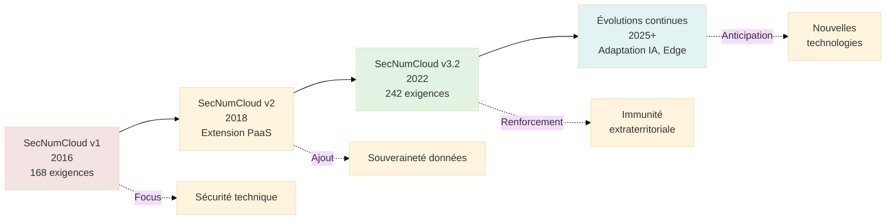
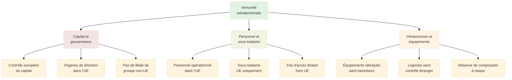
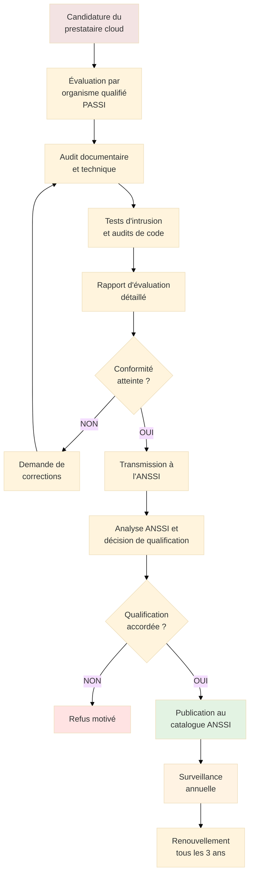

# SecNumCloud - Référentiel de Sécurité Cloud de Confiance

## Introduction

**Niveau :** Débutant & Intermédiaire

!!! quote "Analogie pédagogique"
    _Imaginez un **label de qualité alimentaire comme Label Rouge** qui garantit l'origine, la traçabilité et la qualité des produits. **SecNumCloud fonctionne sur le même principe pour les services cloud** : c'est une qualification délivrée par l'ANSSI qui atteste qu'un fournisseur cloud respecte des exigences strictes de sécurité, de souveraineté et de résilience. Utiliser un cloud SecNumCloud, c'est comme choisir un produit Label Rouge : vous savez exactement ce que vous obtenez._

> **SecNumCloud** constitue le **référentiel de qualification** des prestations de services d'informatique en nuage (cloud computing) développé par l'**ANSSI** (Agence Nationale de la Sécurité des Systèmes d'Information). Créé en 2016 et profondément remanié en 2022 (version 3.2), SecNumCloud définit les **critères de sécurité et de confiance** que doivent respecter les fournisseurs de services cloud pour obtenir une **qualification** reconnue par l'État français.

Dans un contexte où **80% des données d'entreprise migrent vers le cloud**, où les **souverainetés numériques** deviennent des enjeux géopolitiques, et où les **législations extraterritoriales** (Cloud Act américain, lois chinoises sur la cybersécurité) menacent la confidentialité des données européennes, SecNumCloud représente une **réponse technique et politique** visant à garantir qu'un service cloud respecte les **intérêts de sécurité nationale** et offre des **garanties de confiance** maximales.

!!! info "Pourquoi c'est important ?"
    SecNumCloud **structure l'écosystème français et européen du cloud de confiance**. Pour les entreprises et administrations manipulant des données sensibles, choisir un cloud SecNumCloud garantit un **niveau de sécurité évalué** par l'autorité nationale, une **immunité aux législations extraterritoriales**, et une **souveraineté des données**. Pour les fournisseurs cloud, obtenir la qualification SecNumCloud constitue un **différenciateur concurrentiel majeur** sur les marchés publics et privés exigeant des garanties de sécurité maximales.

## Pour repartir des bases (vrais débutants)

Si vous découvrez SecNumCloud, il est essentiel de comprendre qu'il ne s'agit **pas d'un label commercial** auto-déclaratif mais d'une **qualification délivrée par l'ANSSI** après un processus d'évaluation rigoureux par des organismes indépendants. SecNumCloud n'est **pas une certification ISO** (bien qu'il intègre les exigences ISO 27001/27017/27018), mais un **référentiel souverain** développé par l'État français pour répondre à ses besoins spécifiques de sécurité et de confiance.

SecNumCloud s'adresse principalement aux **services IaaS (Infrastructure as a Service) et PaaS (Platform as a Service)**. Les services SaaS (Software as a Service) peuvent également être qualifiés sous conditions. Le référentiel couvre l'**hébergement de données** (compute, stockage, réseau) mais aussi les **services associés** (sauvegarde, archivage, journalisation).

!!! tip "SecNumCloud et Cloud de confiance : quelle différence ?"
    **Cloud de confiance** est un terme marketing utilisé par certains acteurs. **SecNumCloud** est la qualification technique et juridique précise délivrée par l'ANSSI. Certains fournisseurs communiquent sur le "cloud de confiance" sans avoir la qualification SecNumCloud. **Seule la mention explicite "Qualifié SecNumCloud par l'ANSSI"** avec un numéro de qualification garantit la conformité au référentiel.

## Historique et évolutions

### Contexte de création (2016)

SecNumCloud a été créé dans un contexte de **prise de conscience** des risques liés à la dépendance aux fournisseurs cloud étrangers.

**Facteurs déclencheurs :**

- **Révélations Snowden (2013)** : Mise en lumière de la surveillance massive des communications par la NSA
- **Cloud Act américain (2018 en projet dès 2015)** : Risque d'accès extraterritorial aux données hébergées par des entreprises américaines
- **Dépendance technologique** : Domination quasi-monopolistique d'AWS, Azure, Google Cloud
- **Besoin souverain** : Nécessité pour l'État français de garantir la confidentialité de données sensibles

**Objectifs de SecNumCloud :**

1. Définir un **référentiel technique** de haut niveau de sécurité
2. Créer un **écosystème français/européen** de fournisseurs cloud souverains
3. Offrir une **alternative crédible** aux hyperscalers américains pour les données sensibles
4. Garantir l'**immunité extraterritoriale** des données

### Évolutions du référentiel

**SecNumCloud v1 (2016) :**

- Premier référentiel axé IaaS
- 168 exigences de sécurité
- Focus sur la sécurité technique

**SecNumCloud v2 (2018) :**

- Extension au PaaS
- Renforcement des exigences de souveraineté
- Introduction de critères sur la localisation des données

**SecNumCloud v3.2 (2022) :**

- **Refonte majeure** alignée sur les enjeux actuels
- **242 exigences** (vs 168 en v1)
- Intégration des **exigences ISO 27001/27017/27018**
- Critères renforcés sur l'**immunité extraterritoriale**
- Exigences sur la **résilience** et la **réversibilité**
- Prise en compte du **SaaS** sous conditions
- Alignement avec le **règlement européen sur la libre circulation des données**

**Chronologie des versions :**

## Structure du référentiel SecNumCloud 3.2

Le référentiel SecNumCloud 3.2 s'articule autour de **18 chapitres thématiques** regroupant **242 exigences**.

### Organisation des chapitres

**Chapitres du référentiel :**

| Chapitre | Thématique | Nombre d'exigences | Focus principal |
|----------|-----------|-------------------|----------------|
| **1. Organisation** | Gouvernance et pilotage du service | 15 | Organisation interne, rôles et responsabilités |
| **2. Protection du personnel** | Sécurité RH | 12 | Vérifications, formations, confidentialité |
| **3. Sécurité physique** | Protection des infrastructures physiques | 18 | Datacenters, contrôle d'accès physique |
| **4. Sécurité de la virtualisation** | Isolation et cloisonnement | 14 | Hyperviseurs, conteneurs, segmentation |
| **5. Administration** | Gestion sécurisée du cloud | 25 | Comptes privilégiés, authentification, traçabilité |
| **6. Gestion du réseau** | Architecture et sécurité réseau | 22 | Segmentation, filtrage, chiffrement |
| **7. Durcissement** | Configuration sécurisée | 19 | Hardening des systèmes, réduction surface d'attaque |
| **8. Gestion opérationnelle** | Exploitation quotidienne sécurisée | 20 | Changements, mises à jour, sauvegardes |
| **9. Journalisation** | Traçabilité et détection | 16 | Logs, SIEM, conservation |
| **10. Gestion des incidents** | Détection et réponse | 15 | Incidents de sécurité, communication |
| **11. Continuité d'activité** | Résilience et PCA | 14 | Disponibilité, reprise, redondance |
| **12. Gestion des vulnérabilités** | Détection et correction | 10 | Veille, patch management, audits |
| **13. Sécurité de la chaîne d'approvisionnement** | Supply chain | 8 | Sous-traitants, équipements, logiciels |
| **14. Localisation des données** | Souveraineté géographique | 6 | Hébergement UE, interdiction transferts hors UE |
| **15. Immunité du service** | Protection contre ingérences | 7 | Absence de contrôle extraterritorial |
| **16. Protection des données du client** | Confidentialité et intégrité | 12 | Chiffrement, isolation, effacement sécurisé |
| **17. Réversibilité** | Portabilité et sortie | 5 | Export données, fin de service, documentation |
| **18. Gestion de la conformité** | Audits et certifications | 4 | ISO 27001, audits réguliers, amélioration |

### Exigences différenciantes de SecNumCloud

Certaines exigences constituent le **cœur de la différenciation** SecNumCloud par rapport aux standards internationaux classiques.

#### Localisation des données (Chapitre 14)

**Exigence fondamentale :**

_"Les données du client (incluant les données en production, sauvegardes, journaux) doivent être stockées et traitées exclusivement au sein de l'Union européenne"_

**Interdictions strictes :**

- Aucun **transfert hors UE**, même temporaire
- Aucun **traitement hors UE** (calcul, analyse)
- Aucune **sauvegarde hors UE**
- Aucun **miroir ou réplication hors UE**

**Exceptions :**

Seules des exceptions **explicitement demandées et validées par le client** sont autorisées, avec documentation des garanties juridiques et techniques.

**Conséquences pratiques :**

- Datacenters **obligatoirement situés dans l'UE**
- Personnel d'exploitation **basé dans l'UE**
- Aucun recours à des services tiers hors UE (CDN, DNS externes)

#### Immunité extraterritoriale (Chapitre 15)

**Exigence clé :**

_"Le prestataire doit garantir que ni lui, ni ses sous-traitants, ni ses équipements ne sont soumis à une réglementation extra-européenne permettant un accès aux données sans consentement du client"_

**Critères d'immunité :**

**Exemples d'exclusion :**

- Une **filiale française** d'un groupe américain (AWS, Azure, Google) **ne peut** obtenir SecNumCloud car le groupe parent reste soumis au Cloud Act
- Un prestataire utilisant des équipements de marques américaines **doit démontrer** l'absence de backdoors ou de fonctionnalités de contrôle à distance
- Un fournisseur employant des administrateurs en **télétravail depuis un pays hors UE** ne satisfait pas les critères

#### Chiffrement et protection des données (Chapitre 16)

**Exigences de chiffrement :**

| Type de données | Chiffrement obligatoire | Gestion des clés |
|-----------------|------------------------|------------------|
| **Données au repos** | OUI (AES-256 minimum) | Clés maîtrisées par le client (option recommandée) ou par le prestataire avec isolation |
| **Données en transit** | OUI (TLS 1.2+ ou IPsec) | Certificats validés, pas de clés partagées |
| **Sauvegardes** | OUI | Mêmes exigences que données primaires |
| **Logs contenant données client** | OUI si logs externalisés | Chiffrement bout en bout |

**Gestion des clés de chiffrement :**

SecNumCloud impose une **séparation stricte** entre :

- L'infrastructure hébergeant les données chiffrées (IaaS)
- Le système de gestion des clés de chiffrement (KMS)

**Option recommandée :** Le client conserve le **contrôle exclusif** des clés de chiffrement via un KMS qu'il maîtrise, garantissant que le prestataire cloud **ne peut accéder aux données en clair**.

#### Traçabilité et journalisation (Chapitre 9)

**Exigences de journalisation :**

SecNumCloud impose la **conservation d'au moins 6 mois de logs** couvrant :

- **Accès administratifs** : Tout accès aux systèmes de gestion du cloud
- **Opérations sur les données** : Création, modification, lecture, suppression
- **Événements de sécurité** : Tentatives d'intrusion, alertes SIEM
- **Modifications de configuration** : Tout changement d'infrastructure

**Mise à disposition au client :**

Les logs doivent être **accessibles au client** via une interface sécurisée permettant :

- Consultation en temps réel
- Export pour analyse externe
- Corrélation avec les logs applicatifs du client

**Protection de l'intégrité :**

Les logs doivent être **protégés contre la falsification** :

- Horodatage certifié
- Signature cryptographique
- Stockage en append-only
- Conservation sur support WORM (Write Once Read Many) pour les durées longues

## Processus de qualification

L'obtention de la qualification SecNumCloud nécessite un **processus rigoureux** qui peut prendre **12 à 24 mois**.

### Étapes du processus

**Description des étapes :**

**1. Candidature (1-2 mois) :**

Le prestataire candidate auprès de l'ANSSI en fournissant :

- Description détaillée du service
- Périmètre de qualification souhaité
- Documentation préliminaire de conformité

**2. Sélection d'un organisme évaluateur (PASSI) :**

Le prestataire **choisit** un PASSI (Prestataire d'Audit de la Sécurité des Systèmes d'Information) qualifié par l'ANSSI pour réaliser l'évaluation.

**3. Évaluation complète (6-12 mois) :**

L'organisme PASSI réalise :

- **Audit documentaire** : Vérification des politiques, procédures, contrats
- **Audit technique** : Tests de configuration, revue d'architecture
- **Tests d'intrusion** : Pentests externes et internes
- **Audits de code** : Si développements spécifiques (portails clients, API)
- **Vérifications physiques** : Visite des datacenters

**4. Rapport d'évaluation (1-2 mois) :**

Le PASSI rédige un **rapport exhaustif** détaillant :

- Conformité à chacune des 242 exigences
- Écarts identifiés et leur criticité
- Recommandations de correction
- Niveau de confiance global

**5. Corrections et retests (2-6 mois) :**

Le prestataire corrige les non-conformités et soumet à un **nouvel audit** des points corrigés.

**6. Décision ANSSI (2-4 mois) :**

L'ANSSI analyse le rapport final et :

- Valide la conformité
- Peut demander des compléments d'information ou de tests
- Prend la **décision de qualification**

**7. Publication et surveillance :**

- **Publication** au catalogue officiel ANSSI des prestataires qualifiés
- **Surveillance annuelle** : Audits de maintien de la qualification
- **Renouvellement triennal** : Réévaluation complète tous les 3 ans

### Organismes évaluateurs (PASSI)

Seuls les **PASSI qualifiés par l'ANSSI** peuvent réaliser les audits SecNumCloud.

**Liste des PASSI qualifiés (exemples non exhaustifs) :**

- Wavestone
- Atos Cybersecurity
- Devoteam
- Orange Cyberdefense
- Thales
- Capgemini
- Sogeti

**Critères de sélection d'un PASSI :**

- **Expertise technique** : Compétences cloud, sécurité réseau, cryptographie
- **Expérience SecNumCloud** : Nombre de qualifications déjà réalisées
- **Disponibilité** : Délais d'intervention
- **Tarifs** : Budget d'évaluation (généralement 100k€ à 300k€)

### Coûts de la qualification

**Budget total estimé pour un prestataire :**

| Poste | Montant estimé |
|-------|---------------|
| **Évaluation PASSI** | 100 000 € - 300 000 € |
| **Mise en conformité technique** | 500 000 € - 2 000 000 € |
| **Consultants externes** | 50 000 € - 200 000 € |
| **Formation et sensibilisation** | 20 000 € - 100 000 € |
| **Frais de renouvellement (tous les 3 ans)** | 50 000 € - 150 000 € |
| **Total première qualification** | **700 000 € - 2 600 000 €** |

Ces montants varient fortement selon :

- La **taille du périmètre** qualifié (nombre de datacenters, services)
- Le **niveau de maturité initial** du prestataire
- La **complexité technique** de l'infrastructure

## Services qualifiés SecNumCloud

**Prestataires qualifiés (liste non exhaustive au 2025) :**

### IaaS (Infrastructure as a Service)

| Prestataire | Nom commercial | Qualification | Particularités |
|-------------|---------------|---------------|----------------|
| **OVHcloud** | Hosted Private Cloud | SecNumCloud 3.2 | Leader français, souveraineté totale |
| **Orange Business Services** | Flexible Engine | SecNumCloud 3.2 | Basé sur Huawei (controversé) |
| **Atos** | Atos Sovereign Cloud | SecNumCloud | Orienté secteur public |
| **Outscale (Dassault Systèmes)** | Outscale IaaS | SecNumCloud | Compatible AWS S3 |
| **Cloud Temple** | Cloud Temple IaaS | SecNumCloud 3.2 | Spécialiste cloud souverain |
| **Numspot** | Numspot IaaS | En cours | Joint-venture Dassault/Bouygues/Docaposte |
| **S3NS** | S3NS Compute | SecNumCloud | Orienté défense et OIV |

### PaaS (Platform as a Service)

| Prestataire | Nom commercial | Qualification | Cas d'usage |
|-------------|---------------|---------------|-------------|
| **OVHcloud** | Public Cloud PaaS | SecNumCloud | Kubernetes managé, bases de données |
| **Outscale** | Outscale PaaS | SecNumCloud | Orchestration, stockage objet |
| **Atos** | Atos Cloud Platform | SecNumCloud | Conteneurs, CI/CD |

### Services spécialisés

| Prestataire | Service | Qualification | Domaine |
|-------------|---------|---------------|---------|
| **Thales** | Thales Trusted Cloud | SecNumCloud | Données hautement sensibles (défense) |
| **IBM France** | IBM Cloud France | Partielle | Orienté grands comptes |

**Services non encore qualifiés (work in progress) :**

- **Microsoft Azure** : Démarche en cours via une filiale française dédiée (Bleu)
- **Google Cloud** : Projet via une entité souveraine (abandon en 2021, relance discussions 2024)
- **AWS** : Pas de démarche publique connue

### Limites des hyperscalers américains

Les **géants américains** (AWS, Microsoft Azure, Google Cloud) font face à un **obstacle structurel** pour obtenir SecNumCloud :

**Incompatibilité avec l'exigence d'immunité extraterritoriale :**

Même une filiale française d'un groupe américain reste soumise au **Cloud Act** (Clarifying Lawful Overseas Use of Data Act) qui permet aux autorités américaines d'exiger l'accès aux données hébergées par des entreprises américaines, **quel que soit le lieu de stockage**.

**Stratégies de contournement tentées :**

1. **Création de joint-ventures** : Microsoft a tenté avec Capgemini et Orange (projet abandonné)
2. **Filiales autonomes** : Google Cloud a annoncé puis abandonné un projet de cloud souverain français
3. **Partenariats technologiques** : Fournir la technologie tandis qu'un acteur européen exploite (complexité opérationnelle)

**Enjeu politique et économique :**

L'obtention de SecNumCloud par les hyperscalers américains ferait **perdre son sens au référentiel**, dont l'objectif initial est précisément de créer une **alternative souveraine** à ces acteurs dominants.

## Bénéfices de SecNumCloud

### Pour les clients (consommateurs de cloud)

**Garanties de sécurité :**

- **Niveau de sécurité certifié** par une autorité indépendante (ANSSI)
- **Conformité** aux standards internationaux (ISO 27001/27017/27018)
- **Traçabilité** et transparence des opérations
- **Résilience** et continuité d'activité garanties

**Souveraineté et confiance :**

- **Immunité extraterritoriale** : Protection contre les ingérences étrangères
- **Localisation garantie dans l'UE** : Données jamais transférées hors Europe
- **Contrôle européen** : Capital et gouvernance sous contrôle UE
- **Conformité RGPD** facilitée : SecNumCloud intègre les exigences RGPD

**Facilitation de la conformité réglementaire :**

Pour les entités soumises à des obligations strictes, SecNumCloud simplifie la conformité :

- **Opérateurs d'Importance Vitale (OIV)** : SecNumCloud répond aux exigences LPM
- **Opérateurs de Services Essentiels (OSE)** : Alignement avec NIS2
- **Secteur santé** : Hébergement de Données de Santé (HDS) facilité
- **Secteur public** : Conformité RGS (Référentiel Général de Sécurité)

**Réduction des risques :**

| Risque | Sans SecNumCloud | Avec SecNumCloud |
|--------|------------------|------------------|
| **Accès gouvernemental étranger** | Élevé (Cloud Act, lois chinoises) | Quasi nul (immunité extraterritoriale) |
| **Transfert de données hors UE** | Possible (CDN, sauvegardes) | Interdit |
| **Faille de sécurité** | Dépend du prestataire | Niveau minimal garanti par qualification |
| **Perte de données** | Dépend du SLA | Sauvegardes et PCA obligatoires |
| **Enfermement propriétaire** | Élevé (lock-in) | Réversibilité garantie |

### Pour les fournisseurs (prestataires cloud)

**Différenciation concurrentielle :**

- **Accès aux marchés publics** : De nombreux appels d'offres exigent SecNumCloud
- **Confiance clients** : Qualification reconnue immédiatement
- **Positionnement premium** : Justification de tarifs supérieurs
- **Référencement ANSSI** : Visibilité institutionnelle

**Structuration de l'organisation :**

Le processus de qualification **force une mise à niveau** de l'ensemble de l'organisation :

- Documentation exhaustive des processus
- Amélioration continue de la sécurité
- Professionnalisation des équipes
- Culture de la conformité

**Opportunités de marché :**

Les secteurs régaliens et critiques **exigent de plus en plus SecNumCloud** :

- Défense et sécurité
- Santé (hôpitaux, laboratoires pharmaceutiques)
- Finance (données sensibles)
- Collectivités territoriales
- Recherche (données scientifiques)

## Comparaison avec d'autres référentiels

### SecNumCloud vs. ISO 27001/27017/27018

| Critère | ISO 27001/27017/27018 | SecNumCloud |
|---------|----------------------|-------------|
| **Portée géographique** | Mondiale | France (reconnaissance européenne en discussion) |
| **Focus** | Sécurité de l'information générique | Cloud computing avec exigences souveraines |
| **Immunité extraterritoriale** | Non adressée | Exigence centrale |
| **Localisation données** | Non contrainte | UE exclusivement |
| **Organisme certificateur** | Multiples organismes internationaux | ANSSI (autorité unique) |
| **Reconnaissance** | Universelle | Forte en France, croissante en Europe |
| **Niveau de détail technique** | Modéré | Très détaillé (242 exigences spécifiques cloud) |

**Complémentarité :**

SecNumCloud **intègre les exigences ISO 27001/27017/27018** et y ajoute des critères de souveraineté. Un prestataire qualifié SecNumCloud est **nécessairement conforme ISO** mais l'inverse n'est pas vrai.

### SecNumCloud vs. SOC 2

| Critère | SOC 2 (AICPA) | SecNumCloud |
|---------|--------------|-------------|
| **Origine** | États-Unis (AICPA) | France (ANSSI) |
| **Focus** | Contrôles internes génériques | Sécurité cloud et souveraineté |
| **Confidentialité rapport** | Privé (NDA avec clients) | Qualification publique |
| **Périmètre** | Flexible (5 principes Trust Services) | Rigide (242 exigences obligatoires) |
| **Immunité extraterritoriale** | Non adressée | Centrale |
| **Reconnaissance Europe** | Croissante mais non officielle | Forte (autorité nationale) |

### SecNumCloud vs. Gaia-X

**Gaia-X** est une **initiative européenne** visant à créer un écosystème de services cloud fédérés respectant les valeurs européennes.

| Critère | Gaia-X | SecNumCloud |
|---------|--------|-------------|
| **Nature** | Initiative politique et framework | Qualification technique opérationnelle |
| **Périmètre** | Europe (22 pays) | France (extension européenne envisagée) |
| **Stade** | En construction (2019-) | Opérationnel (depuis 2016) |
| **Contraintes** | Principes généraux (souveraineté, portabilité) | 242 exigences techniques précises |
| **Certification** | Labels Gaia-X (en cours de définition) | Qualification ANSSI (processus établi) |
| **Focus** | Interopérabilité et fédération | Sécurité et souveraineté |

**Positionnement :**

SecNumCloud pourrait devenir un **des référentiels reconnus** dans l'écosystème Gaia-X pour le niveau de confiance maximal.

## Cas d'usage et retours d'expérience

### Secteur public

**Ministère des Armées :**

Le **Ministère des Armées** impose SecNumCloud pour l'hébergement de données sensibles non classifiées (Diffusion Restreinte).

**Bénéfices observés :**

- Garantie d'**immunité** face aux ingérences étrangères
- **Conformité** avec les exigences de sécurité défense
- **Traçabilité** totale des accès et opérations
- **Résilience** garantie pour les applications critiques

**Direction Interministérielle du Numérique (DINUM) :**

Recommandation de SecNumCloud pour les **Clouds Internes** (CI) des ministères hébergeant des données sensibles.

### Secteur santé

**Hébergement de Données de Santé (HDS) :**

La certification **HDS** (obligatoire pour héberger des données de santé à caractère personnel) peut être **facilitée** par SecNumCloud.

**Exemple : Hôpitaux universitaires :**

Plusieurs CHU ont migré leurs **PACS** (Picture Archiving and Communication System - imagerie médicale) vers des clouds SecNumCloud pour :

- Garantir la **confidentialité** des données patients
- Respecter l'**exigence HDS**
- Bénéficier de la **résilience** (PCA)
- Éviter le risque de **ransomware** (isolation et sauvegardes sécurisées)

### Secteur financier

**Banques et assurances :**

Les établissements financiers manipulant des **données hautement sensibles** (transactions, données clients, scoring) privilégient SecNumCloud pour :

- **Conformité DORA** : Le règlement européen DORA (Digital Operational Resilience Act) impose des exigences de résilience que SecNumCloud facilite
- **Protection contre l'espionnage économique**
- **Conformité RGPD** renforcée

### Collectivités territoriales

**Cloud souverain pour les communes :**

Des **régions** et **métropoles** migrent vers SecNumCloud pour :

- Héberger les **données citoyens** (état civil, fiscalité locale)
- Respecter les **exigences de souveraineté** imposées par l'État
- **Réduire les risques** de cyberattaques (protection mutualisée)

## Perspectives et évolutions

### Extension européenne

**Discussions en cours** au niveau européen pour :

- **Reconnaissance mutuelle** : Qualification SecNumCloud reconnue dans d'autres États membres
- **Harmonisation** : Création d'un référentiel européen inspiré de SecNumCloud
- **Alignment avec Gaia-X** : Intégration de SecNumCloud comme label de confiance Gaia-X

**Initiatives nationales similaires :**

- **Allemagne** : Bundescloud, critères similaires à SecNumCloud
- **Italie** : Strategia Cloud Italia, niveau di servizio strategico
- **Espagne** : ENS (Esquema Nacional de Seguridad)

### Adaptation aux nouvelles technologies

**Intelligence Artificielle :**

SecNumCloud devra intégrer des exigences spécifiques pour :

- **Entraînement de modèles IA** dans le cloud
- **Protection de la propriété intellectuelle** des algorithmes
- **Explicabilité** et traçabilité des décisions IA
- **Sécurité des GPU** et infrastructures de calcul intensif

**Edge Computing :**

L'extension de SecNumCloud au **edge computing** (calcul en périphérie) nécessitera :

- Adaptation des critères de **sécurité physique** (datacenters distribués)
- **Chiffrement** adapté aux contraintes de latence
- **Traçabilité** dans des environnements déconnectés temporairement

**Quantum Computing :**

Anticiper l'impact du **calcul quantique** sur :

- **Cryptographie** : Migration vers algorithmes post-quantiques
- **Sécurisation** des infrastructures quantiques
- **Nouveaux modèles de menaces**

### Industrialisation et accessibilité

**Réduction des coûts de qualification :**

- **Outillage** : Développement de solutions d'automatisation de la conformité
- **Mutualisation** : Audits groupés pour prestataires de taille moyenne
- **Formation** : Programmes de montée en compétence des PASSI

**Ouverture aux PME :**

Actuellement, SecNumCloud est **accessible principalement aux grands acteurs** (OVHcloud, Orange, Atos) du fait des coûts. Des initiatives visent à :

- Créer des **offres SecNumCloud mutualisées** pour PME
- **Simplifier** certaines exigences pour services à faible criticité
- **Accompagner financièrement** les candidats (subventions, BPI France)

## Le mot de la fin

!!! quote
    SecNumCloud incarne une **vision politique de la souveraineté numérique** autant qu'une excellence technique en matière de sécurité cloud. En imposant des critères stricts d'immunité extraterritoriale et de localisation des données, SecNumCloud affirme que la **confiance numérique** ne peut se construire qu'avec des garanties juridiques et techniques robustes, hors de portée des législations étrangères potentiellement contraires aux intérêts européens.
    
    Pour les professionnels du cloud, SecNumCloud représente le **référentiel le plus exigeant au monde** en matière de cloud de confiance. Ses 242 exigences couvrent l'ensemble du spectre sécuritaire, de la sécurité physique des datacenters à la cryptographie, en passant par la gestion des incidents et la résilience. Aucun autre référentiel ne combine ce niveau de détail technique avec des exigences souveraines aussi strictes.
    
    L'exclusion de facto des hyperscalers américains (AWS, Azure, Google Cloud) du périmètre SecNumCloud n'est pas un protectionnisme naïf mais une **réponse rationnelle** à une menace réelle : le Cloud Act américain permet aux autorités US d'accéder aux données hébergées par des entreprises américaines sans contrôle judiciaire européen. Cette réalité géopolitique justifie l'existence d'alternatives souveraines crédibles.
    
    Les organisations manipulant des **données sensibles** (défense, santé, finance, administration) doivent impérativement privilégier SecNumCloud. Le surcoût éventuel par rapport à un cloud non qualifié est **dérisoire** face au risque d'exposition de données stratégiques ou au coût d'une violation de données (sanctions RGPD, perte de confiance, espionnage économique).
    
    SecNumCloud structure un **écosystème français et européen** de cloud de confiance qui, bien qu'encore modeste face aux géants américains, constitue une **alternative viable et crédible**. OVHcloud, Cloud Temple, Outscale, Atos démontrent qu'il est possible de fournir des services cloud performants, résilients et souverains.
    
    L'avenir de SecNumCloud se jouera à l'échelle **européenne**. L'harmonisation des critères de confiance à travers l'UE, la reconnaissance mutuelle des qualifications nationales, et l'intégration dans Gaia-X détermineront si SecNumCloud devient un **standard continental** ou reste un référentiel national.
    
    **Maîtriser SecNumCloud**, c'est comprendre que la sécurité technique ne suffit pas sans souveraineté juridique. C'est reconnaître que dans un monde où les données sont le nouveau pétrole, la maîtrise de leur localisation et de leur accès constitue un **enjeu de souveraineté nationale** au même titre que l'énergie ou la défense.

---

## Ressources complémentaires

### Documents officiels ANSSI

- **Référentiel SecNumCloud 3.2** : [https://cyber.gouv.fr/produits-certifies/secnumcloud](https://cyber.gouv.fr/produits-certifies/secnumcloud)
- **Catalogue des prestataires qualifiés** : [https://cyber.gouv.fr/produits-certifies](https://cyber.gouv.fr/produits-certifies)
- **Guide de mise en œuvre** : Documentation technique pour candidats

### Standards associés

- **ISO/IEC 27001:2022** : Systèmes de management de la sécurité de l'information
- **ISO/IEC 27017:2015** : Code de pratiques pour les contrôles de sécurité de l'information pour les services cloud
- **ISO/IEC 27018:2019** : Protection des données personnelles dans le cloud computing

### Textes réglementaires

- **RGPD** : Règlement (UE) 2016/679
- **Loi de Programmation Militaire (LPM)** : Articles sur les OIV
- **Directive NIS2** : (UE) 2022/2555
- **Règlement DORA** : (UE) 2022/2554 (secteur financier)

### Organismes et initiatives

- **ANSSI** : [https://cyber.gouv.fr](https://cyber.gouv.fr)
- **Gaia-X** : [https://gaia-x.eu](https://gaia-x.eu)
- **CEPD (Comité Européen de la Protection des Données)** : [https://edpb.europa.eu](https://edpb.europa.eu)

### Prestataires qualifiés

Consulter la liste officielle à jour sur le site de l'ANSSI, car les qualifications évoluent régulièrement (nouvelles qualifications, renouvellements, extensions de périmètre).

---

!!! abstract "Métadonnées"
    **Version** : 0.1  
    **Dernière mise à jour** : Novembre 2025  
    **Durée de lecture** : 50-60 minutes  
    **Niveau** : Débutant & Intermédiaire