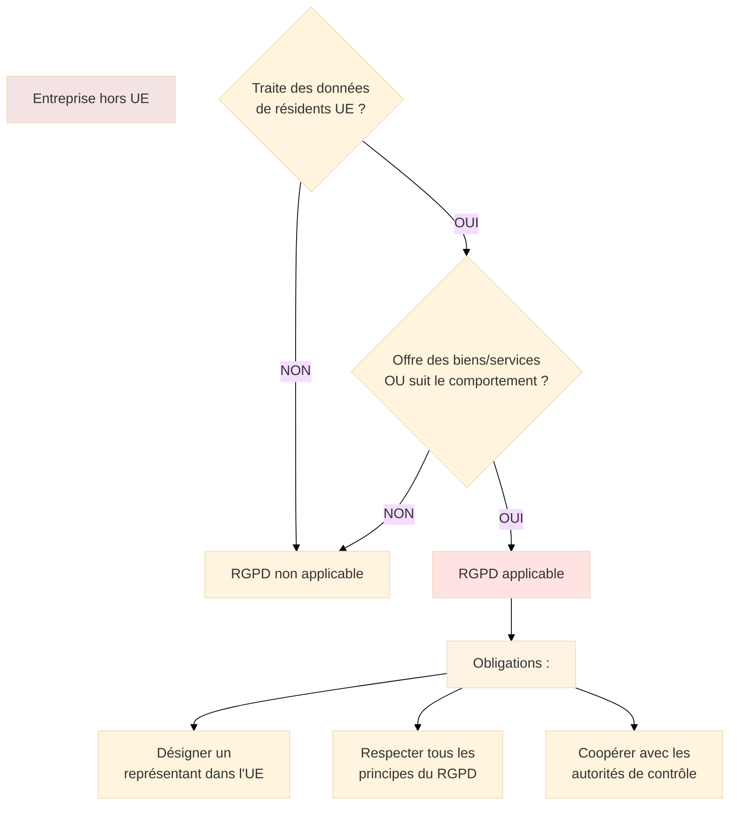
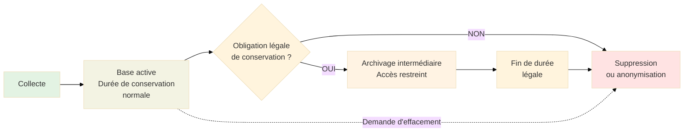
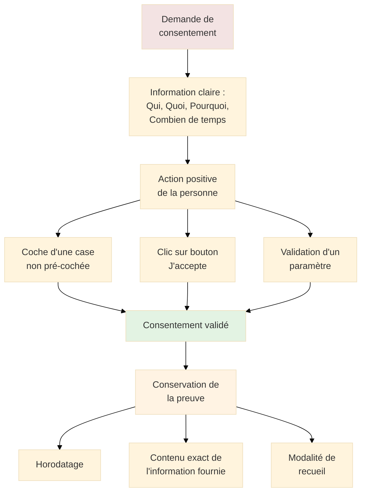
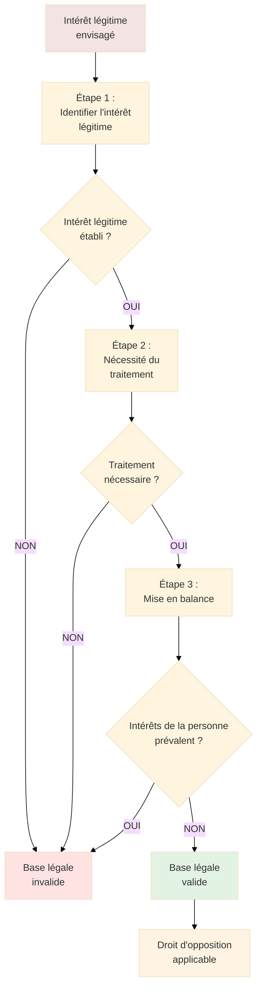

# RGPD - Règlement Général sur la Protection des Données

## Introduction

**Niveau :** Débutant & Intermédiaire

!!! quote "Analogie pédagogique"
    _Imaginez un **code de la route européen pour les données personnelles**. Tout comme le code de la route établit des règles uniformes pour circuler en toute sécurité dans tous les pays européens, **le RGPD définit un cadre harmonisé** pour traiter les données personnelles de manière respectueuse des droits fondamentaux à travers l'Union européenne. Les infractions graves peuvent entraîner des amendes aussi dissuasives qu'un retrait de permis._

> Le **RGPD** (Règlement Général sur la Protection des Données), ou **GDPR** (General Data Protection Regulation) en anglais, constitue le **texte de référence européen** en matière de protection des données personnelles. Entré en application le **25 mai 2018**, ce règlement européen (UE) 2016/679 remplace la directive 95/46/CE et harmonise la réglementation au sein des 27 États membres de l'Union européenne.

Le RGPD représente une **révolution juridique et opérationnelle** qui a bouleversé les pratiques de millions d'organisations à travers le monde. Avec ses **99 articles et 173 considérants**, il établit un cadre précis et contraignant qui s'impose à toute entité traitant des données personnelles de résidents européens, **quel que soit son lieu d'implantation géographique**. Cette portée extraterritoriale constitue une caractéristique majeure qui a forcé les géants technologiques mondiaux à adapter leurs pratiques.

!!! info "Pourquoi c'est important ?"
    Le RGPD **redéfinit l'équilibre de pouvoir** entre les organisations collectant des données et les individus. Il transforme la protection des données d'une **obligation formelle** en un **enjeu stratégique** impactant la réputation, la confiance client et la viabilité économique. Les amendes record prononcées contre Amazon (746 millions €), Google (90 millions €) et Meta (405 millions €) démontrent que le RGPD n'est pas une simple formalité administrative mais un **impératif juridique et financier absolu**.

## Pour les vrais débutants

Si vous découvrez le RGPD, comprenez qu'il ne s'agit pas d'un texte national français mais d'un **règlement européen directement applicable** dans tous les États membres sans nécessiter de transposition nationale. Cette nature de règlement (et non de directive) garantit une **application uniforme** à travers l'Europe.

Le RGPD ne se limite pas aux entreprises technologiques ou aux grandes organisations. **Toute entité** collectant ne serait-ce qu'un email pour une newsletter, conservant des coordonnées clients, utilisant des cookies de statistiques, ou gérant des données RH de salariés est **soumise au RGPD**. Cette universalité en fait un texte que **tout professionnel du numérique doit maîtriser**.

!!! tip "RGPD et loi Informatique et Libertés : quelle articulation ?"
    Le **RGPD** est le règlement européen applicable directement. La **loi Informatique et Libertés** française (modifiée en 2018 puis 2019) vient **compléter** le RGPD sur les points où celui-ci laisse une marge de manœuvre aux États membres (âge du consentement des mineurs, traitements de données de santé, recherche scientifique, etc.). Les deux textes doivent être lus conjointement pour appréhender le cadre juridique complet en France.

## Champ d'application du RGPD

### Application territoriale

Le RGPD s'applique selon **deux critères cumulatifs ou alternatifs**.

**Critère de l'établissement (article 3.1) :**

Le RGPD s'applique aux traitements effectués dans le cadre des activités d'un **établissement d'un responsable de traitement ou d'un sous-traitant sur le territoire de l'Union**, que le traitement ait lieu ou non dans l'Union.

**Critère du ciblage (article 3.2) :**

Le RGPD s'applique aux traitements de données à caractère personnel de personnes se trouvant sur le territoire de l'Union par un responsable du traitement ou un sous-traitant qui **n'est pas établi dans l'Union**, lorsque les activités de traitement sont liées :

- À l'**offre de biens ou de services** à ces personnes dans l'Union (qu'un paiement soit exigé ou non)
- Au **suivi du comportement** de ces personnes, dans la mesure où il s'agit d'un comportement qui a lieu au sein de l'Union

**Conséquences pratiques de l'extraterritorialité :**

**Exemples concrets d'application extraterritoriale :**

| Situation | RGPD applicable ? | Justification |
|-----------|-------------------|---------------|
| **Entreprise américaine proposant un site e-commerce accessible depuis la France, avec livraison en Europe** | OUI | Offre de biens à des résidents UE |
| **Application mobile chinoise collectant la géolocalisation d'utilisateurs européens** | OUI | Suivi du comportement de résidents UE |
| **Entreprise japonaise proposant un service uniquement en japonais, sans livraison en Europe, mais accessible techniquement depuis l'UE** | NON | Absence de ciblage intentionnel de l'UE |
| **Filiale européenne d'un groupe américain traitant des données de clients européens** | OUI | Établissement dans l'UE |

### Application matérielle

Le RGPD s'applique à tout **traitement de données à caractère personnel**, automatisé ou non.

**Définitions fondamentales :**

**Donnée à caractère personnel (article 4.1) :**

_"Toute information se rapportant à une personne physique identifiée ou identifiable"_

Une personne physique est **identifiable** si elle peut être identifiée, directement ou indirectement, notamment par référence à un identifiant tel qu'un nom, un numéro d'identification, des données de localisation, un identifiant en ligne, ou à un ou plusieurs éléments spécifiques propres à son identité physique, physiologique, génétique, psychique, économique, culturelle ou sociale.

**Traitement (article 4.2) :**

_"Toute opération ou tout ensemble d'opérations effectuées ou non à l'aide de procédés automatisés et appliquées à des données ou des ensembles de données à caractère personnel"_

Exemples : collecte, enregistrement, organisation, structuration, conservation, adaptation, modification, extraction, consultation, utilisation, communication par transmission, diffusion, mise à disposition, rapprochement, limitation, effacement, destruction.

**Exclusions du champ d'application :**

Le RGPD **ne s'applique pas** (article 2) :

- Aux traitements effectués dans le cadre d'une **activité qui ne relève pas du champ d'application du droit de l'Union** (sécurité nationale, défense)
- Aux traitements effectués par les **autorités compétentes à des fins de prévention et de détection des infractions pénales**, d'enquêtes et de poursuites en la matière ou d'exécution de sanctions pénales (directive "police-justice" 2016/680)
- Aux traitements effectués par une **personne physique dans le cadre d'une activité strictement personnelle ou domestique**
- Aux données relatives aux **personnes morales** (entreprises, associations)

## Principes fondamentaux

Le RGPD établit **six principes relatifs au traitement des données** (article 5) qui structurent l'ensemble de la réglementation.

### Principe 1 : Licéité, loyauté, transparence

**Article 5.1.a** : _"Les données à caractère personnel doivent être traitées de manière licite, loyale et transparente au regard de la personne concernée"_

**Licéité :**

Tout traitement doit reposer sur **au moins une des six bases légales** définies à l'article 6 (détaillées ci-après). Il est **illégal** de traiter des données sans base légale valide.

**Loyauté :**

Le traitement ne doit pas être **détourné de sa finalité initiale** ou comporter d'**éléments trompeurs**. Les pratiques déloyales sont sanctionnables même si une base légale existe formellement.

**Exemples de déloyauté :**

- Collecter des données sous un prétexte (ex : concours) pour les utiliser à d'autres fins (prospection commerciale non annoncée)
- Cases pré-cochées pour un consentement
- Formulations ambiguës ou trompeuses
- Collecte cachée de données (keyloggers, tracking invisible)

**Transparence :**

Les personnes concernées doivent être **informées clairement** de la collecte et du traitement de leurs données. Cette obligation se traduit par la fourniture d'**informations détaillées** (identité du responsable, finalités, destinataires, durées, droits, etc.).

### Principe 2 : Limitation des finalités

**Article 5.1.b** : _"Les données doivent être collectées pour des finalités déterminées, explicites et légitimes, et ne pas être traitées ultérieurement d'une manière incompatible avec ces finalités"_

**Exigences :**

- **Déterminée** : La finalité doit être précise, pas vague (interdit : "amélioration de nos services")
- **Explicite** : Clairement exprimée et documentée
- **Légitime** : Conforme à la loi, aux bonnes mœurs, à l'intérêt général

**Conséquences pratiques :**

Vous ne pouvez **pas** :

- Collecter des données "au cas où" elles serviraient ultérieurement
- Réutiliser des données collectées pour une finalité A dans le cadre d'une finalité B incompatible
- Changer de finalité sans nouvelle base légale et information des personnes

**Exception :** L'article 89 autorise des traitements ultérieurs à des **fins de recherche scientifique, historique ou statistique** sous conditions strictes.

### Principe 3 : Minimisation des données

**Article 5.1.c** : _"Les données doivent être adéquates, pertinentes et limitées à ce qui est nécessaire au regard des finalités pour lesquelles elles sont traitées"_

**Application pratique :**

Pour chaque donnée collectée, posez-vous la question : **est-elle strictement nécessaire pour atteindre la finalité** ?

**Exemples de minimisation :**

| Finalité | Donnée nécessaire | Donnée excessive |
|----------|-------------------|------------------|
| **Livraison d'un produit** | Nom, adresse postale, téléphone | Date de naissance, situation familiale |
| **Newsletter** | Email | Adresse postale, numéro de téléphone |
| **Traitement d'une candidature** | CV, lettre de motivation | Photo (sauf métiers spécifiques), situation matrimoniale |
| **Gestion de compte client** | Nom, email, historique d'achats | Orientation politique, convictions religieuses |

**Techniques de minimisation :**

- **Champs optionnels** : Ne rendre obligatoires que les données strictement nécessaires
- **Pseudonymisation** : Remplacer les identifiants directs par des identifiants indirects
- **Agrégation** : Travailler sur des données statistiques plutôt qu'individuelles lorsque possible
- **Collecte progressive** : Ne demander que les données nécessaires à chaque étape

### Principe 4 : Exactitude

**Article 5.1.d** : _"Les données doivent être exactes et, si nécessaire, tenues à jour"_

**Obligations :**

- **Vérification raisonnable** de l'exactitude lors de la collecte
- **Mise à jour régulière** des données susceptibles d'évoluer
- **Rectification ou effacement rapide** des données inexactes
- Mise en place de **procédures** permettant aux personnes de signaler des inexactitudes

**Exemples de mise en œuvre :**

- Double opt-in pour vérifier la validité d'une adresse email
- Confirmation annuelle des coordonnées de contact
- Interface permettant aux utilisateurs de modifier leurs données
- Suppression des emails en erreur (bounces) après plusieurs tentatives

### Principe 5 : Limitation de la conservation

**Article 5.1.e** : _"Les données doivent être conservées sous une forme permettant l'identification des personnes concernées pendant une durée n'excédant pas celle nécessaire au regard des finalités"_

**Définition des durées de conservation :**

Les durées doivent être **déterminées et justifiées** en fonction :

- De la **finalité du traitement**
- Des **obligations légales** de conservation
- Des **délais de prescription** applicables
- De l'**intérêt légitime** du responsable de traitement

**Durées de conservation recommandées par secteur :**

| Contexte | Type de données | Durée active | Archivage intermédiaire | Base légale |
|----------|-----------------|--------------|------------------------|-------------|
| **Prospection commerciale** | Prospects n'ayant jamais acheté | 3 ans à compter du dernier contact | - | Recommandation CNIL |
| **Gestion de clients** | Données clients après fin de relation | Durée de la relation + 3 ans | + 5 ans si contentieux | Prescription commerciale |
| **Ressources humaines** | CV non retenus | 2 ans après dernier contact | - | Recommandation CNIL |
| **Comptabilité** | Factures, pièces comptables | 10 ans | - | Code de commerce |
| **Vidéosurveillance** | Enregistrements | 1 mois maximum | - | Recommandation CNIL |
| **Logs de connexion** | Traces d'activité | 1 an | - | Article 6 LCEN |

**Gestion du cycle de vie des données :**

### Principe 6 : Intégrité et confidentialité

**Article 5.1.f** : _"Les données doivent être traitées de façon à garantir une sécurité appropriée, y compris la protection contre le traitement non autorisé ou illicite et contre la perte, la destruction ou les dégâts d'origine accidentelle"_

**Mesures de sécurité obligatoires :**

Le RGPD n'impose **pas de mesures techniques spécifiques** mais exige une **sécurité appropriée** au regard des risques. L'article 32 détaille les exigences.

**Exemples de mesures selon les risques :**

| Niveau de risque | Type de données | Mesures minimales |
|------------------|-----------------|-------------------|
| **Faible** | Données non sensibles, impact limité | Contrôle d'accès par mot de passe, sauvegarde régulière |
| **Modéré** | Données sensibles, volume modéré | Authentification forte (MFA), chiffrement des communications (TLS), journalisation |
| **Élevé** | Données sensibles à grande échelle | Chiffrement au repos, pseudonymisation, tests d'intrusion, SOC 24/7 |
| **Critique** | Données de santé, biométriques, judiciaires | Chiffrement de bout en bout, HSM, segmentation réseau stricte, audits réguliers |

## Bases légales du traitement

**Article 6** : Tout traitement de données doit reposer sur **au moins une des six bases légales** suivantes.

### Base légale 1 : Consentement

**Article 6.1.a** : _"La personne concernée a consenti au traitement de ses données à caractère personnel pour une ou plusieurs finalités spécifiques"_

**Définition du consentement (article 4.11) :**

_"Toute manifestation de volonté, libre, spécifique, éclairée et univoque par laquelle la personne concernée accepte, par une déclaration ou par un acte positif clair, que des données à caractère personnel la concernant fassent l'objet d'un traitement"_

**Critères cumulatifs d'un consentement valide :**

| Critère | Signification | Exemples invalides |
|---------|---------------|-------------------|
| **Libre** | Sans contrainte, sans conditionnalité abusive | Refus = impossibilité d'utiliser le service (sauf si strictement nécessaire) |
| **Spécifique** | Pour chaque finalité distincte | Consentement global pour plusieurs finalités non liées |
| **Éclairé** | Information claire et complète sur l'usage | Formulation vague, cachée dans CGU de 50 pages |
| **Univoque** | Manifestation de volonté claire | Case pré-cochée, silence, inaction |

**Modalités pratiques du consentement :**

**Retrait du consentement (article 7.3) :**

_"La personne concernée a le droit de retirer son consentement à tout moment. Le retrait du consentement ne compromet pas la licéité du traitement fondé sur le consentement effectué avant ce retrait. La personne concernée en est informée avant de donner son consentement. Il doit être aussi simple de retirer que de donner son consentement."_

**Exigences pratiques :**

- Lien de désinscription visible et fonctionnel dans chaque email marketing
- Option "Supprimer mon compte" accessible en un clic
- Bouton "Retirer mon consentement" dans les paramètres de l'application
- Interdiction de demander une justification pour le retrait

### Base légale 2 : Contrat

**Article 6.1.b** : _"Le traitement est nécessaire à l'exécution d'un contrat auquel la personne concernée est partie ou à l'exécution de mesures précontractuelles prises à la demande de celle-ci"_

**Champ d'application :**

Cette base légale couvre les traitements **strictement nécessaires** pour :

- Exécuter un contrat déjà conclu (livraison d'un produit acheté)
- Prendre des mesures précontractuelles à la demande de la personne (établir un devis)

**Exemples d'application correcte :**

| Traitement | Nécessaire au contrat ? | Base légale appropriée |
|------------|------------------------|------------------------|
| **Traiter une commande e-commerce** | OUI | Contrat |
| **Livrer un produit acheté** | OUI | Contrat |
| **Établir un devis demandé** | OUI | Mesure précontractuelle |
| **Envoyer des offres commerciales** | NON | Consentement ou intérêt légitime |
| **Analyser les habitudes d'achat pour de la publicité ciblée** | NON | Consentement |
| **Partager les coordonnées avec un partenaire commercial** | NON | Consentement |

**Limite importante :**

Le CEPD (Comité Européen de la Protection des Données) insiste sur une **interprétation stricte** : un traitement n'est nécessaire au contrat que s'il est **objectivement indispensable** à sa bonne exécution. Vous ne pouvez pas **élargir artificiellement** le périmètre du contrat pour y inclure des traitements qui relèveraient normalement du consentement.

### Base légale 3 : Obligation légale

**Article 6.1.c** : _"Le traitement est nécessaire au respect d'une obligation légale à laquelle le responsable du traitement est soumis"_

**Exemples d'obligations légales imposant des traitements :**

| Obligation | Texte de référence | Traitement de données |
|------------|-------------------|----------------------|
| **Conservation des factures** | Code de commerce (10 ans) | Nom, coordonnées clients |
| **Déclaration sociale nominative** | Code de la sécurité sociale | Données RH des salariés |
| **Lutte contre le blanchiment** | Code monétaire et financier | Vérification d'identité, surveillance des transactions |
| **Conservation des logs** | Article 6 LCEN (1 an) | Données de connexion |

**Caractéristique :**

Lorsque le traitement repose sur une obligation légale, la personne concernée **ne peut s'y opposer** car le responsable de traitement n'a pas de choix. Le droit d'opposition (article 21) ne s'applique pas.

### Base légale 4 : Sauvegarde des intérêts vitaux

**Article 6.1.d** : _"Le traitement est nécessaire à la sauvegarde des intérêts vitaux de la personne concernée ou d'une autre personne physique"_

**Interprétation stricte :**

Cette base légale ne s'applique que dans des **situations d'urgence vitale** où la vie ou l'intégrité physique d'une personne est en danger.

**Exemples légitimes :**

- Traitement de données médicales en urgence pour sauver une personne inconsciente
- Transmission de coordonnées aux services de secours lors d'un accident
- Traitement de données pour gérer une épidémie menaçant la santé publique

**Cette base légale ne peut PAS être invoquée** pour des situations non vitales, même si elles présentent un intérêt important pour la personne.

### Base légale 5 : Mission d'intérêt public

**Article 6.1.e** : _"Le traitement est nécessaire à l'exécution d'une mission d'intérêt public ou relevant de l'exercice de l'autorité publique dont est investi le responsable du traitement"_

**Champ d'application :**

Cette base légale concerne principalement les **organismes publics** exerçant des missions de service public :

- Administrations d'État
- Collectivités territoriales
- Établissements publics
- Délégataires de service public (sous conditions)

**Exemples :**

- Traitement des données fiscales par l'administration
- Gestion de l'état civil par les mairies
- Traitement des dossiers de demandeurs d'emploi par France Travail
- Gestion des dossiers médicaux par les hôpitaux publics

### Base légale 6 : Intérêt légitime

**Article 6.1.f** : _"Le traitement est nécessaire aux fins des intérêts légitimes poursuivis par le responsable du traitement ou par un tiers, à moins que ne prévalent les intérêts ou les libertés et droits fondamentaux de la personne concernée qui exigent une protection des données à caractère personnel"_

**Spécificité :**

C'est la base légale la plus **flexible** mais aussi la plus **complexe** à justifier. Elle nécessite une **mise en balance** (balancing test) entre :

- L'intérêt légitime du responsable de traitement
- Les droits et libertés de la personne concernée

**Test de proportionnalité en 3 étapes :**

**Exemples d'intérêts légitimes reconnus :**

| Intérêt légitime | Validation | Conditions |
|------------------|-----------|------------|
| **Prévention de la fraude** | Généralement accepté | Mesures proportionnées, limitation à la détection effective |
| **Sécurité des systèmes d'information** | Accepté | Surveillance strictement nécessaire, information des utilisateurs |
| **Marketing direct par courrier postal** | Accepté sous conditions | Information claire, opt-out facile, pas de profilage intrusif |
| **Recommandations de produits basées sur achats** | Accepté sous conditions | Transparence, possibilité de refus, pas de partage avec tiers |
| **Vidéosurveillance des locaux professionnels** | Accepté sous conditions | Proportionné au risque, zones limitées, information visible |

**Exemples d'intérêts légitimes rejetés :**

- Prospection commerciale par email sans consentement (nécessite opt-in)
- Partage de données avec des partenaires commerciaux pour leur prospection
- Profilage intrusif pour publicité comportementale (nécessite consentement)
- Surveillance généralisée des communications des salariés

**Droit d'opposition renforcé :**

Lorsque le traitement repose sur l'intérêt légitime, les personnes disposent d'un **droit d'opposition** (article 21). Le responsable de traitement doit **cesser le traitement** sauf s'il démontre des **motifs légitimes et impérieux** prévalant sur les intérêts de la personne.

## Droits des personnes concernées

Le RGPD confère **huit droits fondamentaux** aux personnes dont les données sont traitées (Chapitre III, articles 12 à 23).

### Droit d'accès (article 15)

**Contenu du droit :**

La personne concernée a le droit d'obtenir du responsable du traitement la **confirmation** que des données la concernant sont ou ne sont pas traitées et, si tel est le cas :

- Une **copie** des données à caractère personnel
- Les **finalités** du traitement
- Les **catégories** de données traitées
- Les **destinataires** ou catégories de destinataires
- La **durée de conservation** envisagée
- L'**existence** des droits de rectification, d'effacement, de limitation, d'opposition
- Le **droit d'introduire une réclamation** auprès d'une autorité de contrôle
- Les **informations sur la source** des données si elles n'ont pas été collectées auprès de la personne
- L'**existence d'une prise de décision automatisée** et les logiques sous-jacentes

**Modalités d'exercice :**

- **Délai de réponse** : 1 mois à compter de la réception de la demande (extensible à 3 mois si complexité)
- **Gratuité** : La première copie est gratuite, les suivantes peuvent être facturées (frais raisonnables)
- **Vérification d'identité** : Le responsable de traitement peut demander des informations complémentaires pour confirmer l'identité
- **Format** : Copie dans un format accessible et couramment utilisé

### Droit de rectification (article 16)

**Contenu du droit :**

La personne concernée a le droit d'obtenir la **rectification** des données inexactes la concernant et de faire **compléter** les données incomplètes.

**Exemples d'application :**

- Correction d'une adresse email erronée
- Mise à jour d'une adresse postale suite à un déménagement
- Ajout d'une information manquante dans un profil client
- Correction d'une erreur dans un dossier administratif

**Obligations du responsable :**

- **Délai** : 1 mois (extensible à 3 mois)
- **Notification** : Si les données ont été communiquées à des tiers, le responsable doit les informer de la rectification (sauf impossibilité ou effort disproportionné)

### Droit à l'effacement ("droit à l'oubli") (article 17)

**Conditions d'application :**

La personne concernée a le droit d'obtenir l'**effacement** de ses données dans les cas suivants :

1. Les données **ne sont plus nécessaires** au regard des finalités pour lesquelles elles ont été collectées
2. La personne **retire son consentement** et il n'existe pas d'autre base légale
3. La personne **s'oppose au traitement** et il n'existe pas de motif légitime impérieux
4. Les données ont fait l'objet d'un **traitement illicite**
5. L'effacement est **nécessaire au respect d'une obligation légale**
6. Les données concernent un **enfant** et ont été collectées dans le cadre de services de la société de l'information

**Exceptions - Le droit à l'effacement ne s'applique pas si le traitement est nécessaire :**

- À l'**exercice du droit à la liberté d'expression** et d'information
- Au **respect d'une obligation légale**
- À l'**exercice d'une mission d'intérêt public** ou d'autorité publique
- Pour des **motifs d'intérêt public dans le domaine de la santé**
- À des fins **archivistiques, de recherche scientifique ou historique** ou à des fins statistiques
- À la **constatation, l'exercice ou la défense de droits** en justice

**Effacement des données diffusées publiquement :**

Si le responsable de traitement a rendu publiques les données et doit les effacer, il doit prendre des **mesures raisonnables** (y compris techniques) pour informer les autres responsables de traitement qui traitent ces données que la personne a demandé l'effacement de tout lien vers ces données, ou de toute copie ou reproduction.

### Droit à la limitation du traitement (article 18)

**Contenu du droit :**

La personne concernée a le droit d'obtenir la **limitation du traitement** (gel des données) dans les cas suivants :

1. Elle **conteste l'exactitude** des données (pendant la vérification)
2. Le traitement est **illicite** mais elle préfère la limitation à l'effacement
3. Le responsable de traitement **n'a plus besoin** des données mais elles sont nécessaires à la personne pour une **action en justice**
4. La personne s'est **opposée au traitement** (pendant la vérification de la prévalence des intérêts)

**Conséquences de la limitation :**

Les données ne peuvent plus être traitées, **sauf** :

- Avec le consentement de la personne
- Pour la constatation, l'exercice ou la défense de droits en justice
- Pour la protection des droits d'une autre personne
- Pour des motifs importants d'intérêt public de l'Union ou d'un État membre

Les données limitées doivent être **conservées** mais ne peuvent être ni modifiées ni utilisées.

### Droit à la portabilité (article 20)

**Contenu du droit :**

La personne concernée a le droit de :

- **Recevoir** les données la concernant qu'elle a fournies dans un **format structuré, couramment utilisé et lisible par machine**
- **Transmettre** ces données à un autre responsable du traitement sans que le responsable du traitement actuel y fasse obstacle

**Conditions d'application :**

Ce droit ne s'applique que si :

1. Le traitement est fondé sur le **consentement** ou sur un **contrat**
2. Le traitement est effectué à l'aide de **procédés automatisés**

**Exemples d'application :**

- Export de l'historique d'achats d'une plateforme e-commerce
- Récupération de la liste de contacts d'un réseau social
- Export des données de santé d'une application de suivi médical
- Transfert de playlist musicale d'une plateforme de streaming à une autre

**Formats recommandés :**

- **CSV** pour données tabulaires
- **JSON** pour données structurées
- **XML** pour données hiérarchisées
- Formats ouverts et documentés

### Droit d'opposition (article 21)

**Opposition de principe :**

La personne concernée a le droit de **s'opposer à tout moment** au traitement de ses données lorsque celui-ci est fondé sur :

- L'**intérêt légitime** (article 6.1.f)
- Une **mission d'intérêt public** (article 6.1.e)

Le responsable de traitement doit **cesser le traitement**, sauf s'il démontre des **motifs légitimes et impérieux** pour le traitement qui prévalent sur les intérêts, droits et libertés de la personne, ou pour la constatation, l'exercice ou la défense de droits en justice.

**Opposition absolue en matière de prospection :**

Lorsque les données sont traitées à des **fins de prospection**, la personne a un **droit d'opposition absolu**. Le responsable de traitement ne peut invoquer aucun motif légitime impérieux et doit cesser immédiatement le traitement.

**Mise en œuvre :**

- Lien de désinscription dans chaque email marketing
- Option "Je ne souhaite plus recevoir d'offres commerciales" dans l'espace client
- Inscription sur des listes d'opposition (Bloctel pour le démarchage téléphonique)

### Droits relatifs aux décisions automatisées (article 22)

**Principe :**

La personne concernée a le droit de **ne pas faire l'objet d'une décision fondée exclusivement sur un traitement automatisé** produisant des **effets juridiques** la concernant ou l'**affectant de manière significative** de façon similaire.

**Exemples de décisions automatisées concernées :**

- Rejet automatique d'une demande de crédit par un algorithme
- Sélection automatique de candidatures sans intervention humaine
- Calcul automatique de prime d'assurance basé sur un profilage
- Détermination automatique de performances professionnelles

**Exceptions - La décision automatisée est autorisée si :**

1. Elle est **nécessaire à la conclusion ou à l'exécution d'un contrat**
2. Elle est **autorisée par le droit de l'Union ou de l'État membre** avec garanties appropriées
3. Elle est fondée sur le **consentement explicite** de la personne

**Garanties lorsque la décision automatisée est autorisée :**

- **Intervention humaine** : Droit d'obtenir une intervention humaine de la part du responsable du traitement
- **Expression du point de vue** : Droit d'exprimer son point de vue
- **Contestation** : Droit de contester la décision
- **Informations sur la logique** : Information sur la logique sous-jacente à la prise de décision

**Interdiction absolue pour les données sensibles :**

Les décisions fondées sur des **données sensibles** (santé, origine raciale, opinions politiques, etc.) sont **strictement interdites**, sauf consentement explicite ou motif d'intérêt public important avec garanties appropriées.

## Obligations du responsable de traitement

### Registre des activités de traitement (article 30)

**Obligation :**

Chaque responsable de traitement et sous-traitant doit tenir un **registre des activités de traitement** relevant de sa responsabilité.

**Exception :** Les entreprises de **moins de 250 salariés** sont dispensées, SAUF si le traitement :

- Présente un **risque pour les droits et libertés** des personnes
- N'est **pas occasionnel**
- Porte sur des **données sensibles** ou des données relatives à des condamnations pénales

**En pratique, l'exception est rarement applicable** : toute entreprise ayant un fichier client ou des salariés doit tenir un registre.

**Contenu minimum du registre (responsable de traitement) :**

Pour chaque traitement :

1. **Nom et coordonnées** du responsable de traitement (et du DPO le cas échéant)
2. **Finalités** du traitement
3. **Catégories de personnes concernées** (clients, prospects, salariés, etc.)
4. **Catégories de données** traitées
5. **Catégories de destinataires** des données
6. **Transferts** vers des pays tiers (hors UE) et garanties appropriées
7. **Délais de suppression** prévus pour les différentes catégories de données
8. **Description générale des mesures de sécurité** techniques et organisationnelles

**Format du registre :**

Aucun format n'est imposé. Il peut être :

- Tableur Excel (modèle CNIL disponible)
- Outil de gestion dédié (GRC - Governance, Risk & Compliance)
- Document textuel structuré

**Mise à jour :**

Le registre doit être **maintenu à jour** et être **disponible sur demande** de l'autorité de contrôle.

### Analyse d'Impact relative à la Protection des Données (AIPD / PIA) (article 35)

**Obligation :**

Une AIPD est **obligatoire** lorsqu'un traitement est susceptible d'engendrer un **risque élevé** pour les droits et libertés des personnes.

**Liste des traitements nécessitant une AIPD (article 35.3) :**

1. **Évaluation systématique et approfondie** d'aspects personnels, fondée sur un traitement automatisé (profilage) et produisant des effets juridiques ou affectant significativement la personne
2. Traitement à **grande échelle** de **données sensibles** ou de données relatives à des condamnations pénales
3. **Surveillance systématique à grande échelle** d'une zone accessible au public (vidéosurveillance massive)

**Listes établies par la CNIL :**

La CNIL a publié une **liste de types de traitements nécessitant une AIPD** incluant :

- Traitements de données biométriques
- Traitements de données génétiques
- Traitements ayant pour finalité la surveillance des salariés
- Traitements de données de personnes vulnérables (mineurs, personnes âgées)
- Utilisation de technologies innovantes (IA, blockchain)
- Décisions automatisées avec effets juridiques

**Contenu de l'AIPD :**

1. **Description systématique** du traitement et des finalités
2. **Évaluation de la nécessité et de la proportionnalité** des opérations de traitement
3. **Évaluation des risques** pour les droits et libertés des personnes
4. **Mesures envisagées** pour faire face aux risques

**Consultation préalable de l'autorité de contrôle (article 36) :**

Si l'AIPD révèle que le traitement présenterait un **risque élevé** malgré les mesures prévues, le responsable de traitement doit **consulter la CNIL** avant de mettre en œuvre le traitement.

### Sécurité des traitements (article 32)

**Obligation générale :**

Le responsable de traitement et le sous-traitant doivent mettre en œuvre des **mesures techniques et organisationnelles appropriées** pour garantir un niveau de sécurité adapté au risque.

**Mesures à considérer (liste non exhaustive) :**

1. **Pseudonymisation et chiffrement** des données à caractère personnel
2. **Moyens permettant de garantir la confidentialité, l'intégrité, la disponibilité et la résilience** constants des systèmes et services de traitement
3. **Moyens permettant de rétablir la disponibilité** et l'accès aux données en cas d'incident physique ou technique
4. **Procédure visant à tester, à analyser et à évaluer régulièrement** l'efficacité des mesures techniques et organisationnelles

**Critères d'appréciation du niveau de sécurité :**

- État des connaissances
- Coûts de mise en œuvre
- Nature, portée, contexte et finalités du traitement
- Risques pour les droits et libertés des personnes
- Probabilité et gravité des risques

**Exemples de mesures selon les risques :**

| Risque | Mesures techniques | Mesures organisationnelles |
|--------|-------------------|----------------------------|
| **Accès non autorisé** | Authentification forte (MFA), contrôle d'accès par rôle (RBAC), chiffrement | Politique de mots de passe, revue des habilitations, sensibilisation |
| **Perte de données** | Sauvegardes chiffrées, redondance, réplication | Procédure de sauvegarde/restauration, tests réguliers |
| **Divulgation** | Chiffrement des communications (TLS), pseudonymisation | Clauses de confidentialité, formation des employés |
| **Modification illicite** | Journalisation, contrôle d'intégrité, versioning | Gestion des changements, séparation des environnements |

### Notification de violations de données (articles 33 et 34)

**Obligation de notification à l'autorité de contrôle (article 33) :**

En cas de **violation de données à caractère personnel** (perte, destruction, altération, divulgation ou accès non autorisé), le responsable de traitement doit **notifier la violation à la CNIL dans les 72 heures** après en avoir pris connaissance, à moins que la violation ne soit pas susceptible d'engendrer un risque pour les droits et libertés des personnes.

**Contenu de la notification :**

1. **Nature de la violation** : Quelles données sont concernées ? Combien de personnes ?
2. **Nom et coordonnées du DPO** ou d'un point de contact
3. **Conséquences probables** de la violation
4. **Mesures prises ou envisagées** pour remédier à la violation et atténuer ses effets

**Communication aux personnes concernées (article 34) :**

Si la violation est susceptible d'engendrer un **risque élevé** pour les droits et libertés des personnes, le responsable de traitement doit **communiquer la violation aux personnes concernées dans les meilleurs délais**.

**Exemptions :**

La communication n'est pas nécessaire si :

- Des **mesures de protection appropriées** ont été appliquées (ex : chiffrement rendant les données inintelligibles)
- Le responsable de traitement a pris des **mesures ultérieures** garantissant que le risque élevé ne se matérialisera probablement pas
- La communication exigerait des **efforts disproportionnés** (dans ce cas, communication publique)

**Exemples de violations nécessitant une notification :**

| Type de violation | Notification CNIL | Communication personnes |
|-------------------|-------------------|------------------------|
| **Fuite de 10 000 emails clients non chiffrés** | OUI (sous 72h) | Probablement NON (risque modéré) |
| **Vol de mots de passe non hachés** | OUI (sous 72h) | OUI (risque élevé d'usurpation d'identité) |
| **Accès non autorisé à des données de santé** | OUI (sous 72h) | OUI (données sensibles) |
| **Destruction accidentelle de données sauvegardées** | Possiblement NON (si restauration rapide sans impact) | NON |

### Désignation d'un Délégué à la Protection des Données (articles 37 à 39)

**Obligation de désigner un DPO :**

La désignation d'un DPO est **obligatoire** dans les cas suivants :

1. Le traitement est effectué par une **autorité publique ou un organisme public**
2. Les activités de base du responsable de traitement consistent en des **opérations de traitement exigeant un suivi régulier et systématique à grande échelle** des personnes
3. Les activités de base consistent en un **traitement à grande échelle de données sensibles** ou de données relatives à des condamnations pénales

**Désignation facultative :**

Même si non obligatoire, la désignation d'un DPO est **fortement recommandée** car elle simplifie la gouvernance de la protection des données.

**Missions du DPO (article 39) :**

- **Informer et conseiller** le responsable de traitement, le sous-traitant et les employés
- **Contrôler le respect** du RGPD et d'autres dispositions
- **Dispenser des conseils** sur l'AIPD et en vérifier l'exécution
- **Coopérer** avec l'autorité de contrôle
- Être le **point de contact** pour l'autorité de contrôle et les personnes concernées

**Positionnement du DPO :**

- **Indépendance** : Ne peut recevoir d'instructions pour l'exercice de ses missions
- **Absence de conflit d'intérêts** : Ne peut occuper de poste de direction (DG, DSI, DRH) qui le mettrait en position de déterminer les finalités et moyens des traitements
- **Ressources** : Doit disposer de moyens appropriés pour exercer ses missions

## Transferts de données hors UE (Chapitre V)

**Principe :**

Les transferts de données à caractère personnel vers des pays **hors de l'Union européenne** (pays tiers) sont **interdits** sauf si le pays tiers offre un **niveau de protection adéquat** ou si des **garanties appropriées** sont mises en place.

### Décisions d'adéquation

**Article 45 :** La Commission européenne peut reconnaître qu'un pays tiers offre un **niveau de protection adéquat**. Dans ce cas, les transferts vers ce pays sont libres.

**Pays reconnus comme adéquats (liste non exhaustive au 2025) :**

- Royaume-Uni
- Suisse
- Andorre
- Îles Féroé
- Guernesey, Jersey, Île de Man
- Canada (organismes commerciaux)
- Japon
- Nouvelle-Zélande
- Corée du Sud
- Argentine
- Uruguay

**Attention :** Les **États-Unis ne bénéficient PAS** d'une décision d'adéquation générale. Le Privacy Shield a été invalidé par la CJUE en juillet 2020 (arrêt Schrems II). Le **Data Privacy Framework** (DPF), adopté en juillet 2023, permet des transferts vers les entreprises américaines certifiées DPF, mais reste juridiquement fragile.

### Garanties appropriées

**Article 46 :** En l'absence de décision d'adéquation, les transferts peuvent être effectués si le responsable de traitement ou le sous-traitant a mis en place des **garanties appropriées**.

**Instruments de garantie :**

| Instrument | Description | Mise en œuvre |
|------------|-------------|---------------|
| **Clauses contractuelles types (SCC)** | Modèles de contrats approuvés par la Commission européenne | Contrat entre exportateur et importateur de données |
| **Règles d'entreprise contraignantes (BCR)** | Code de conduite interne pour groupes multinationaux | Validation par autorités de contrôle |
| **Code de conduite** | Code sectoriel approuvé | Adhésion et engagement contractuel |
| **Mécanisme de certification** | Certification avec engagements contraignants | Obtention de la certification |

**Mesures supplémentaires post-Schrems II :**

Suite à l'arrêt Schrems II, les transferts vers les États-Unis ou d'autres pays sans adéquation nécessitent une **évaluation au cas par cas** des risques et la mise en place de **mesures supplémentaires** si nécessaire :

- **Chiffrement de bout en bout** rendant les données inintelligibles pour le prestataire tiers
- **Pseudonymisation** avant transfert
- **Clauses contractuelles renforcées** avec audits réguliers
- **Garanties techniques** contre les accès gouvernementaux

### Dérogations

**Article 49 :** En l'absence d'adéquation et de garanties appropriées, les transferts peuvent être effectués dans des **cas spécifiques** :

- **Consentement explicite** de la personne après information des risques
- **Nécessité contractuelle** pour l'exécution d'un contrat
- **Intérêt public important**
- **Constatation, exercice ou défense de droits** en justice
- **Sauvegarde des intérêts vitaux**

Ces dérogations sont d'**interprétation stricte** et ne peuvent être utilisées systématiquement pour des transferts réguliers.

## Sanctions (Chapitre VI)

**Article 83 :** Les autorités de contrôle peuvent infliger des **amendes administratives** dont le montant varie selon la gravité de l'infraction.

### Catégories de sanctions

**Amendes de catégorie 1 (moins grave) :**

- Montant maximal : **10 millions d'euros** OU **2% du chiffre d'affaires annuel mondial** (le plus élevé)
- Concerne : Violations des obligations du responsable de traitement/sous-traitant (articles 8, 11, 25 à 39, 42, 43), des organismes de certification (article 42, 43), des organismes de contrôle (article 41, 4)

**Amendes de catégorie 2 (plus grave) :**

- Montant maximal : **20 millions d'euros** OU **4% du chiffre d'affaires annuel mondial** (le plus élevé)
- Concerne : Violations des **principes de base** (articles 5, 6, 7, 9), des **droits des personnes** (articles 12 à 22), des **transferts internationaux** (articles 44 à 49)

**Critères d'appréciation des sanctions (article 83.2) :**

Les autorités de contrôle tiennent compte de :

- **Nature, gravité et durée** de la violation
- **Caractère intentionnel ou négligent**
- **Mesures prises** pour atténuer le dommage
- **Degré de responsabilité** compte tenu des mesures techniques et organisationnelles
- **Violations antérieures** pertinentes
- **Degré de coopération** avec l'autorité de contrôle
- **Catégories de données** concernées
- **Manière dont l'autorité a eu connaissance** de la violation
- **Respect des mesures** ordonnées précédemment
- **Adhésion à des codes de conduite** ou mécanismes de certification
- **Autres circonstances aggravantes ou atténuantes**

### Exemples de sanctions prononcées

**Sanctions record en Europe (2018-2024) :**

| Année | Organisme | Pays | Montant | Motif principal |
|-------|-----------|------|---------|----------------|
| **2021** | Amazon Europe Core | Luxembourg | 746 M€ | Publicité ciblée sans consentement, violations multiples |
| **2023** | Meta Platforms Ireland | Irlande | 1,2 Md€ | Transferts illégaux de données vers les États-Unis |
| **2023** | Meta Platforms Ireland | Irlande | 405 M€ | Traitement de données d'enfants sur Instagram |
| **2022** | Meta Ireland | Irlande | 265 M€ | Fuite de données (scraping) |
| **2021** | WhatsApp Ireland | Irlande | 225 M€ | Défaut de transparence |
| **2022** | Google Ireland | Irlande | 90 M€ | Cookies sans consentement |
| **2020** | Google LLC | France | 90 M€ | Cookies sans consentement |
| **2023** | TikTok | Irlande | 345 M€ | Protection des données d'enfants |

**Sanctions en France (CNIL) :**

| Année | Organisme | Montant | Motif |
|-------|-----------|---------|-------|
| **2023** | Microsoft Ireland | 60 M€ | Cookies publicitaires sans consentement |
| **2020** | Google LLC & Google Ireland | 90 M€ | Cookies sans consentement |
| **2020** | Amazon Europe Core | 35 M€ | Publicité ciblée sans consentement |
| **2019** | Google Ireland | 50 M€ | Défaut de transparence et de consentement |

## Le mot de la fin

!!! quote
    Le RGPD représente bien plus qu'une simple réglementation technique sur la gestion des données. Il incarne une **vision politique** de la place de l'individu dans l'économie numérique, affirmant que les personnes doivent garder le **contrôle sur leurs informations personnelles** et ne pas devenir de simples produits monétisés par les plateformes.
    
    Pour les professionnels du numérique, le RGPD constitue un **bouleversement structurel** qui a forcé une remise à plat complète des pratiques établies depuis des décennies. Les entreprises qui ont perçu le RGPD comme une simple contrainte légale l'ont payé au prix fort, via des sanctions records et une perte de confiance. Celles qui l'ont intégré comme un **levier de différenciation** ont transformé la conformité en **avantage concurrentiel**.
    
    La portée extraterritoriale du RGPD a créé un **effet Bruxelles** : les géants technologiques mondiaux ont dû adapter leurs pratiques globalement pour rester conformes en Europe. Ce faisant, le RGPD est devenu un **standard de fait** au-delà des frontières européennes. Des pays aussi divers que le Brésil, la Californie, le Japon ou l'Afrique du Sud ont adopté des législations largement inspirées du RGPD.
    
    Les sanctions massives prononcées contre Amazon, Meta et Google démontrent que le RGPD **n'est pas une simple déclaration de principes** mais un texte doté d'une **force coercitive réelle**. Les amendes atteignant plusieurs centaines de millions d'euros créent une dissuasion efficace même pour les acteurs disposant de budgets illimités.
    
    Le RGPD reste cependant un **texte vivant en évolution constante**. Les décisions de justice (CJUE), les lignes directrices du CEPD, les positions des autorités nationales créent une **jurisprudence** qui affine progressivement l'interprétation des 99 articles. Les professionnels doivent maintenir une **veille juridique permanente** pour suivre ces évolutions.
    
    Les défis à venir sont considérables : **intelligence artificielle**, **métavers**, **neurotechnologies**, **interfaces cerveau-machine** posent des questions inédites que le RGPD devra adresser. Sa capacité à s'adapter à ces innovations technologiques déterminera sa pertinence pour les décennies à venir.
    
    **Maîtriser le RGPD**, c'est maîtriser le cadre juridique qui conditionne toute activité numérique en Europe et au-delà. C'est reconnaître que le respect de la vie privée n'est pas une option mais un **impératif éthique, juridique et commercial**. Les organisations qui l'ont compris prospèrent. Les autres subissent des sanctions croissantes et une défiance publique qui finit par impacter leur viabilité économique.

---

## Ressources complémentaires

### Textes officiels

- **RGPD (Règlement UE 2016/679)** : [https://eur-lex.europa.eu/legal-content/FR/TXT/?uri=CELEX:32016R0679](https://eur-lex.europa.eu/legal-content/FR/TXT/?uri=CELEX:32016R0679)
- **Loi Informatique et Libertés modifiée** : [https://www.legifrance.gouv.fr/loda/id/JORFTEXT000000886460](https://www.legifrance.gouv.fr/loda/id/JORFTEXT000000886460)

### Lignes directrices du CEPD

- **Comité Européen de la Protection des Données** : [https://edpb.europa.eu/edpb_fr](https://edpb.europa.eu/edpb_fr)
- **Lignes directrices sur les bases légales**
- **Lignes directrices sur le consentement**
- **Recommandations sur les transferts internationaux**

### Outils pratiques

- **Site CNIL** : [https://www.cnil.fr](https://www.cnil.fr)
- **MOOC L'atelier RGPD** : Formation gratuite en ligne
- **Modèle de registre** : Téléchargeable sur cnil.fr
- **Logiciel PIA** : Outil d'analyse d'impact

### Jurisprudence

- **Arrêts CJUE** : [https://curia.europa.eu](https://curia.europa.eu)
- **Décisions des autorités de contrôle** : Disponibles sur les sites des CNIL nationales

---

!!! abstract "Métadonnées"
    **Version** : 0.1  
    **Dernière mise à jour** : Novembre 2025  
    **Durée de lecture** : 60-70 minutes  
    **Niveau** : Débutant & Intermédiaire
