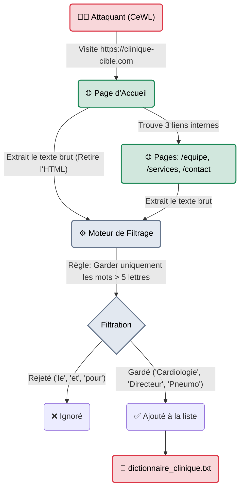

---
description: "CeWL (Custom Word List generator) — Un aspirateur de mots-clés. Il parcourt (spider) le site web d'une entreprise pour en extraire tout le jargon métier afin de créer un dictionnaire de mots de passe sur-mesure."
icon: lucide/book-open-check
tags: ["RED TEAM", "PASSWORD", "WORDLISTS", "CEWL", "SPIDER"]
---

# CeWL — Le Tailleur Sur-Mesure

<div
  class="omny-meta"
  data-level="🟢 Débutant"
  data-version="5.4+"
  data-time="~15 minutes">
</div>


## Introduction

!!! quote "Analogie pédagogique — Le Costume Sur-Mesure (Le Tailleur)"
    Si **SecLists** est un gigantesque supermarché du prêt-à-porter (il y a des vêtements pour tout le monde, mais rien qui n'épouse parfaitement la forme de votre cible), **CeWL** est un tailleur de haute couture.
    Il se rend sur le site vitrine de l'entreprise ciblée, lit tous les articles de blog, toutes les fiches produits, tous les noms des directeurs, et "coud" un dictionnaire unique composé **exclusivement** des mots utilisés par l'entreprise. 

Les humains ont une faille psychologique majeure : ils créent des mots de passe avec les mots qu'ils voient tous les jours au bureau. Si une entreprise vend le logiciel "OmnyCare", il y a 99% de chances que des dizaines d'employés utilisent le mot de passe `OmnyCare2024!`. 
Le problème, c'est que le mot "OmnyCare" n'existe pas dans les dictionnaires mondiaux comme `rockyou.txt`. Développé en Ruby, `cewl` est un "Spider" (une araignée) qui va scraper le site de l'entreprise pour générer cette liste de mots locale.

<br>

---

## Architecture & Mécanismes Internes

### Le Spidering Textuel (Workflow)
CeWL ne cherche pas des vulnérabilités SQL ou des dossiers cachés. Il se comporte comme le robot d'indexation de Google (Googlebot).



<br>

---

## Intégration dans la Kill Chain

| Phase Précédente | CeWL | Phase Suivante |
| :--- | :--- | :--- |
| **OSINT / Reconnaissance** <br> (*Amass*) <br> On a cartographié le périmètre externe de l'entreprise et trouvé le site principal de communication. | ➔ **Création d'Armement (Weaponization)** ➔ <br> Génération d'une wordlist focalisée sur le jargon et l'histoire de la société. | **Brute-Force Réseau** <br> (*Hydra / Hashcat*) <br> On utilise la liste fraîchement générée pour attaquer le VPN des employés. |

<br>

---

## Workflow Opérationnel & Lignes de Commande Avancées

CeWL est très simple d'utilisation, mais il faut faire attention à la profondeur (Depth) de la recherche pour ne pas bloquer l'outil pendant des heures.

### 1. Génération Basique
On veut scanner le site `omnyvia.com`, avec une profondeur de 2 (L'accueil + 1 clic sur les liens). On ne garde que les mots qui font plus de 6 caractères pour éviter les conjonctions de coordination (mais, où, et, donc, or...).
```bash title="Création de dictionnaire ciblé"
cewl -d 2 -m 6 -w mots_omnyvia.txt https://omnyvia.com
```
- `-d 2` : Depth (Profondeur d'exploration des liens).
- `-m 6` : Min-length (Taille minimale du mot conservé).
- `-w` : Write (Fichier de sortie).

### 2. Le mode Mutation (Alphanumérique)
Le mode par défaut ne prend que des vrais mots (lettres). Si l'entreprise vend le produit "V-Engine 3.0", CeWL ignorera le "3.0" s'il n'est pas configuré pour accepter les chiffres et caractères spéciaux.
```bash title="Conservation des chiffres"
cewl -d 2 -m 5 --with-numbers -w mots_produits.txt https://omnyvia.com
```

### 3. Extraction des Emails (Le bonus OSINT)
Puisque CeWL lit tout le texte du site, l'auteur y a ajouté une fonction géniale pour extraire automatiquement les adresses emails cachées dans le code source de l'entreprise (dans les mentions légales, la page contact).
```bash title="Scraping d'adresses Email"
cewl -d 2 -e --email_file emails_omnyvia.txt https://omnyvia.com
```
- `-e` : Active l'extraction d'emails.
- Ces emails pourront ensuite être utilisés avec **GoPhish** pour l'ingénierie sociale !

<br>

---

## Bonnes & Mauvaises Pratiques (Do's & Don'ts)

| Action | Recommandation | Explication technique |
|---|---|---|
| ✅ **À FAIRE** | **Combiner CeWL avec des Règles Hashcat** | CeWL génère le mot "OmnyCare". Personne ne met ça tel quel. En associant ce fichier avec John ou Hashcat et la règle "OneRule", Hashcat le mutera en `OmnyCare2024!` ou `@OmnyCare123`. C'est là que réside la vraie puissance de CeWL. |
| ❌ **À NE PAS FAIRE** | **Définir une profondeur (`-d`) supérieure à 3 sur un gros site** | Si vous lancez `cewl -d 5` sur le site d'un grand média ou d'un géant du e-commerce, CeWL va ouvrir des centaines de milliers de pages (catégories, produits, commentaires). Cela va générer un fichier de 5 Go et prendre 3 jours, tout en s'apparentant à un Déni de Service (DoS) sur le serveur web. |

<br>

---

## Conclusion

!!! quote "Ce qu'il faut retenir"
    CeWL est l'outil parfait pour contrer les politiques de mots de passe fortes en entreprise. Lorsqu'une DSI oblige les employés à utiliser 12 caractères complexes, l'humain compense en utilisant le nom de son département ou le nom du produit phare de la boîte (qui font généralement plus de 8 lettres). CeWL extrait cette essence même et la transforme en dictionnaire.

> Nous avons les dictionnaires mondiaux (SecLists) et les dictionnaires sur-mesure (CeWL). Mais comment faire si nous ne voulons pas de "mots", mais si nous voulons générer de manière mathématique TOUTES les combinaisons possibles (ex: toutes les plaques d'immatriculation de France, ou tous les numéros de téléphone) ? C'est le rôle du forgeron : **[Crunch →](./crunch.md)**.


