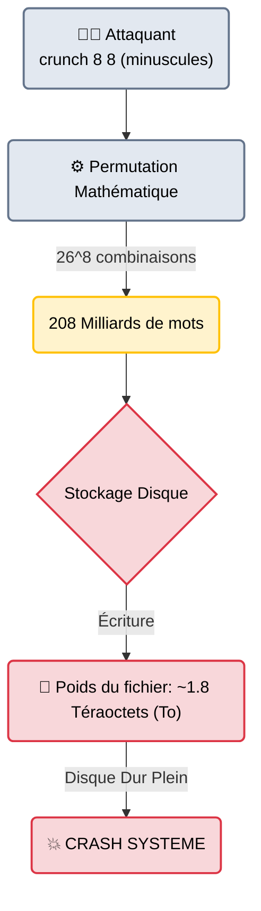

# Crunch — La Forge Mathématique

<div
  class="omny-meta"
  data-level="🟢 Débutant"
  data-version="3.6+"
  data-time="~15 minutes">
</div>

<div style="text-align: center; margin: 0 auto;">
    
</div>

## Introduction

!!! quote "Analogie pédagogique — Le Fabricant de Cadenas"
    Si **SecLists** est une immense bibliothèque de mots existants, et que **CeWL** est un tailleur qui lit les livres de l'entreprise pour en extraire des mots, **Crunch** ne connaît aucun mot. 
    Crunch est une forge mathématique. Vous lui dites : *"Fabrique-moi toutes les clés qui font exactement 4 chiffres"*, et il forge `0000`, `0001`, jusqu'à `9999`. Il n'y a pas de linguistique, pas de psychologie, uniquement de la force brute combinatoire pure.

Développé en **C** pour une vitesse d'exécution maximale, `crunch` est un générateur de dictionnaire basé sur des règles. Il est indispensable lorsque vous ciblez un mot de passe dont vous connaissez le format imposé par l'entreprise (ex: "Le mot de passe de l'imprimante est composé de 8 chiffres"), ou pour attaquer un identifiant structuré (numéros de sécurité sociale, numéros de téléphone, matricules employés).

<br>

---

## Architecture & Mécanismes Internes

### Le Moteur Combinatoire et la Limite Physique
L'architecture de Crunch est triviale (des boucles imbriquées calculant les permutations). Le véritable enjeu n'est pas logiciel, il est physique : **l'espace disque**.



<br>

---

## Intégration dans la Kill Chain

| Phase Précédente | Crunch | Phase Suivante |
| :--- | :--- | :--- |
| **OSINT / Documentation** <br> (*Reconnaissance*) <br> On a découvert que les numéros d'employés de l'entreprise commencent par `EMP-` suivi de 4 chiffres. | ➔ **Génération d'Armement (Weaponization)** ➔ <br> Crunch génère toutes les combinaisons de `EMP-0000` à `EMP-9999`. | **Brute-Force Réseau** <br> (*Hydra / Hashcat*) <br> On fournit la liste à Hydra pour bruteforcer l'accès au portail RH. |

<br>

---

## Workflow Opérationnel & Lignes de Commande Avancées

La syntaxe de base de Crunch est : `crunch <taille_min> <taille_max> [charset]`.

### 1. Génération Simple
Créer tous les mots de passe possibles entre 1 et 4 caractères, en utilisant uniquement l'alphabet minuscule (soit 475 254 mots).
```bash title="Bruteforce total (Court)"
crunch 1 4 abcdefghijklmnopqrstuvwxyz -o pass.txt
```
*(Si vous ne précisez pas le charset, Crunch utilise l'alphabet minuscule par défaut).*

### 2. Le Moteur de Motifs (Pattern `-t`)
C'est la fonctionnalité principale de l'outil. Au lieu de tester n'importe quoi, on fixe des caractères.
Les symboles magiques :
- `@` : Insère une lettre minuscule
- `,` : Insère une lettre majuscule
- `%` : Insère un chiffre
- `^` : Insère un symbole spécial

```bash title="Génération ciblée"
# L'administrateur s'appelle 'admin' suivi de 3 chiffres (ex: admin001, admin999)
crunch 8 8 -t admin%%% -o pass.txt

# Une plaque d'immatriculation française (ex: AB-123-CD)
crunch 9 9 -t @@-%%%-@@ -o plaques.txt
```

### 3. La Technique du Piping (Éviter de saturer le disque dur)
Comme vu dans le diagramme d'architecture, générer des mots de 10 caractères crée des fichiers de plusieurs Téraoctets. La solution d'ingénierie est le **Piping**. On n'écrit rien sur le disque dur : Crunch génère le mot dans la RAM, le donne instantanément à l'outil d'attaque, puis l'efface.
```bash title="Piping dans Aircrack-ng (Craquage WiFi)"
crunch 8 8 0123456789 | aircrack-ng -e MonWifi -w - capture.cap
```
*Le symbole `-` à la fin d'Aircrack lui dit de lire le flux sortant (stdout) de Crunch.*

<br>

---

## Bonnes & Mauvaises Pratiques (Do's & Don'ts)

| Action | Recommandation | Explication technique |
|---|---|---|
| ✅ **À FAIRE** | **Utiliser Hashcat (Mask) plutôt que Crunch + Hashcat** | Crunch a été conçu à une époque où les craqueurs n'avaient pas de moteur combinatoire. Aujourd'hui, **Hashcat** possède un moteur de masque natif (`-a 3 -m 1000 ?d?d?d?d`) qui est infiniment plus rapide car le mot est généré directement sur la carte graphique (GPU). Crunch ne doit être utilisé que si l'outil cible (ex: Hydra, Aircrack) n'a pas de moteur de masque interne. |
| ❌ **À NE PAS FAIRE** | **Tenter un "Vrai" Bruteforce > 8 caractères** | Si vous lancez `crunch 10 10`, le terminal va vous avertir que la taille du fichier sera de plusieurs Pétaoctets. Vous ne craquerez jamais un mot de passe complexe en essayant *toutes* les lettres de l'alphabet. Vous devez utiliser des dictionnaires probabilistes (SecLists) et des règles. |

<br>

---

## Conclusion

!!! quote "Ce qu'il faut retenir"
    Crunch est l'incarnation de la force brute pure. Il est extrêmement utile pour des missions "exotiques" où vous connaissez la structure mathématique ou réglementaire d'un identifiant ou d'un mot de passe (numéro de téléphone, format de ticket, code PIN de porte d'immeuble). Pour le reste, privilégiez toujours les Wordlists et les Rulesets pour casser des mots de passe générés par des humains.

> La boucle est bouclée. Du scan externe initial (`Nmap`) jusqu'à l'extraction et le craquage des mots de passe en interne (`Hashcat`), vous avez désormais accès au réseau cible. Mais que se passe-t-il une fois le mot de passe récupéré ? L'accès initial n'est que la première étape. L'Étape 9 regroupe l'arsenal d'**[Exploitation et Post-Exploitation →](../exploit/index.md)** pour automatiser votre maintien dans la place.


