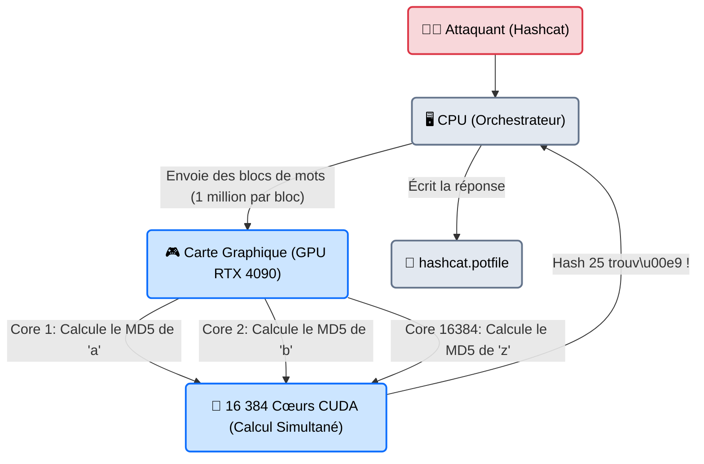
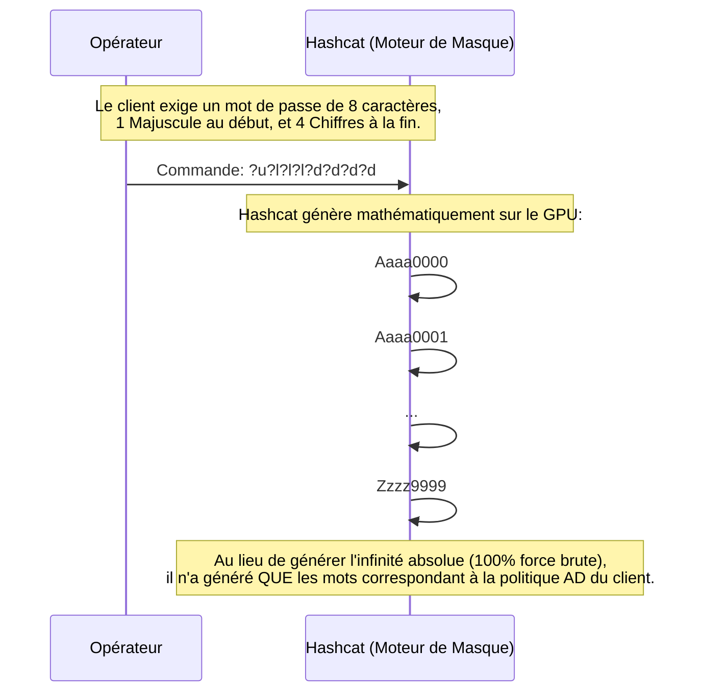

---
description: "Hashcat — Le logiciel de cassage de mots de passe le plus rapide au monde. Son architecture massivement parallèle exploite la puissance des cartes graphiques (GPU) pour briser l'irrécupérable."
icon: lucide/book-open-check
tags: ["RED TEAM", "PASSWORD", "CRACKING", "HASHCAT", "GPU"]
---

# Hashcat — La Mine Industrielle

<div
  class="omny-meta"
  data-level="🔴 Avancé"
  data-version="6.2.0+"
  data-time="~45 minutes">
</div>


## Introduction

!!! quote "Analogie pédagogique — L'Usine Industrielle et les 5000 Ouvriers"
    Si **John the Ripper** est un artisan horloger seul à son bureau (le CPU), **Hashcat** est une immense usine métallurgique chinoise.
    L'usine ne sait pas ouvrir les enveloppes (fichiers ZIP, PDF) pour extraire les plans. Mais une fois que vous lui donnez la formule mathématique pure (le Hash NTLM ou WPA2), Hashcat mobilise ses 5000 ouvriers simultanément (les cœurs de la carte graphique - GPU). Là où l'artisan horloger teste 3 000 combinaisons par seconde, l'usine Hashcat en teste 100 Milliards par seconde.

Considéré comme l'arme absolue par tous les Pentesters et hackers de la planète, `hashcat` est le logiciel de *Password Recovery* le plus rapide et le plus avancé. Il ne s'utilise quasiment jamais sur un ordinateur portable d'audit, mais sur des "Rigs" de minage (des ordinateurs dédiés possédant 4 à 8 cartes graphiques Nvidia RTX de dernière génération en parallèle). C'est le boss de fin de l'Active Directory.

<br>

---

## Architecture & Mécanismes Internes

### 1. Le Traitement Parallèle GPU (Architecture OpenCL/CUDA)
Contrairement aux processeurs (CPU) conçus pour exécuter des tâches logiques complexes, les cartes graphiques (GPU) sont conçues pour exécuter des millions de petits calculs mathématiques simples simultanément (à la base pour afficher les pixels d'un jeu vidéo 3D). Le craquage de mots de passe étant une opération mathématique simple (MD5, SHA1) répétée à l'infini, c'est l'environnement idéal.



### 2. Le Système de Masques (Sequence Diagram)
Hashcat excelle dans les attaques par force brute pure "intelligente" grâce à son moteur de **Mask Attack**. Plutôt que de tout tester, on contraint l'usine.



<br>

---

## Intégration dans la Kill Chain

| Phase Précédente | Hashcat | Phase Suivante |
| :--- | :--- | :--- |
| **Dump Active Directory** <br> (*Secretsdump / Mimikatz*) <br> On a extrait 5000 empreintes NTLM (le format Windows) depuis le contrôleur de domaine. | ➔ **Craquage Massif (Credential Access)** ➔ <br> La ferme GPU casse 3000 des 5000 mots de passe en moins de 10 minutes. | **Password Spraying / Pivot** <br> (*CrackMapExec*) <br> On utilise les mots de passe en clair pour tester l'accès au réseau VPN et aux serveurs isolés. |

<br>

---

## Workflow Opérationnel & Lignes de Commande Avancées

Hashcat est strict. Il ne "devine" rien. Vous devez lui indiquer exactement de quel type de hash il s'agit (le `Mode`) et comment l'attaquer (l'`Attack Mode`).

### 1. Identifier le Hash
Contrairement à John, vous devez consulter le [Wiki des Hashcat Modes](https://hashcat.net/wiki/doku.php?id=example_hashes) pour trouver le numéro (`-m`) de votre hash.
- `-m 0` : MD5 basique
- `-m 1000` : NTLM (Mots de passe Windows)
- `-m 22000` : WPA/WPA2 (Wifi PMKID)
- `-m 1800` : SHA-512 (Linux `/etc/shadow`)

### 2. Les Modes d'Attaque (`-a`)
- `-a 0` : **Dictionnaire** (Straight) -> Utilise une Wordlist.
- `-a 1` : **Combinator** -> Assemble 2 wordlists (`mot1` + `mot2`).
- `-a 3` : **Masque** (Brute-force) -> Teste des caractères spécifiques.

### 3. Exemple 1 : Attaque par Dictionnaire + Règles (Le grand classique)
On a dumpé la base Windows (`hashes.txt`), on veut utiliser `rockyou.txt`, mais en lui appliquant la règle "OneRuleToRuleThemAll" (une des règles de mutation les plus puissantes créées par la communauté).
```bash title="NTLM Wordlist + Rules"
hashcat -m 1000 -a 0 hashes.txt /usr/share/wordlists/rockyou.txt -r /usr/share/hashcat/rules/OneRuleToRuleThemAll.rule
```

### 4. Exemple 2 : L'Attaque par Masque (Politique d'Entreprise)
On sait que l'entreprise oblige ses employés à mettre l'année courante à la fin du mot de passe (ex: `MotDePasse2024`).
- `?a` : N'importe quel caractère (lettre/chiffre/symbole)
- `?d` : Chiffre (Digit)
```bash title="Masque spécifique"
hashcat -m 1000 -a 3 hashes.txt ?a?a?a?a?a?a2024
```
*Le GPU testera les 6 premiers caractères en bruteforce total, puis ajoutera "2024" à la fin.*

### 5. Optimisation : Réglage du workload
Si votre ordinateur est dédié au craquage, vous pouvez ordonner à Hashcat de s'approprier toute la carte graphique, quitte à faire figer votre écran (`-w 3` ou `-w 4`).
```bash title="Mode Cauchemar (Performance Max)"
hashcat -m 1000 -a 0 hashes.txt rockyou.txt -w 3 -O
```
*Le flag `-O` (Optimize) dit au noyau CUDA d'ignorer les mots de passe de plus de 32 caractères pour gagner 20% de vitesse.*

<br>

---

## Bonnes & Mauvaises Pratiques (Do's & Don'ts)

| Action | Recommandation | Explication technique |
|---|---|---|
| ✅ **À FAIRE** | **Nettoyer les Hashes avant import** | Hashcat ne prend que des hashes propres (ex: `Administrateur:500:AAD3...:31D6...:::`). Les utilitaires comme Responder ou Secretsdump génèrent des formats un peu sales. Nettoyez le fichier au format `Utilisateur:Hash` avec un script bash/awk avant de lancer Hashcat. |
| ❌ **À NE PAS FAIRE** | **Craquer du Bcrypt/Argon2 sur un CPU portable** | Les algorithmes modernes (`bcrypt -m 3200`, `argon2`) sont conçus spécifiquement pour *résister* aux cartes graphiques (en consommant de la RAM). Tenter de craquer un hash Bcrypt avec Hashcat sur un PC bas de gamme va littéralement faire fondre le composant pour une vitesse pathétique (2 mots/seconde). |

<br>

---

## Avertissement Hardware (Le Danger Physique)

!!! danger "Risque d'Incendie et de Destruction Matérielle"
    Hashcat est l'un des rares logiciels informatiques capables de détruire physiquement un composant.
    
    1. **Tension Thermique (Thermal Throttling)** : Hashcat pousse les GPU à 100% de leur capacité pendant des jours entiers. Si le système de refroidissement de la tour ou du PC portable est défaillant, la carte mère ou la batterie peut fondre.
    2. **Température Limite** : Par défaut, Hashcat s'arrête en urgence (Abort) si le capteur de la carte graphique atteint **90°C**. N'utilisez **JAMAIS** le flag `--hwmon-disable` (qui désactive la sonde thermique) sauf si vous êtes dans un centre de données climatisé professionnel.

<br>

---

## Conclusion

!!! quote "Ce qu'il faut retenir"
    Hashcat est le prédateur ultime des bases de données hachées. Si le hachage est considéré "faible" par les standards modernes (comme le NTLM de Microsoft utilisé dans 90% des réseaux mondiaux), un cluster Hashcat bien configuré le considérera comme du "texte en clair chiffré dans du papier aluminium". C'est pour contrer Hashcat que les mots de passe de moins de 14 caractères sont désormais considérés comme obsolètes en entreprise.

> Mais que faire si vous n'arrivez pas à obtenir la base de données hachée (pas de faille Web, pas d'accès local) ? Il ne vous reste plus qu'à attaquer le portail d'authentification par la porte de devant, en essayant les mots de passe directement via le réseau. C'est le rôle des bruteforceurs en ligne : **[Hydra →](./hydra.md)**.


