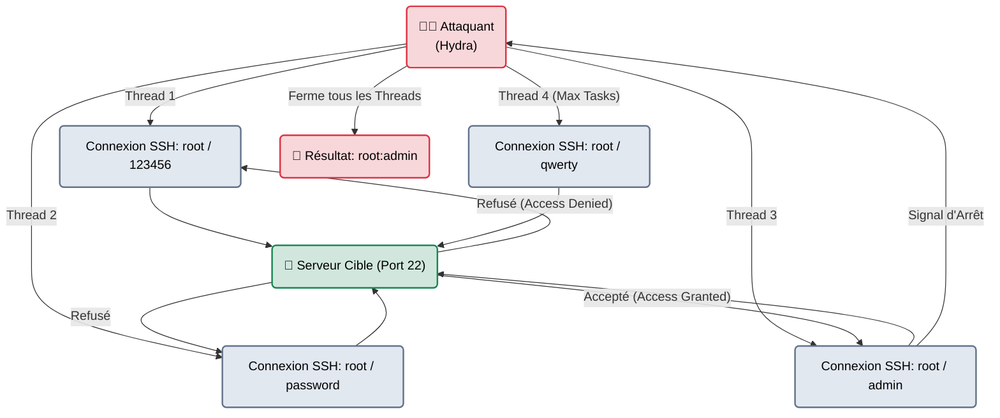
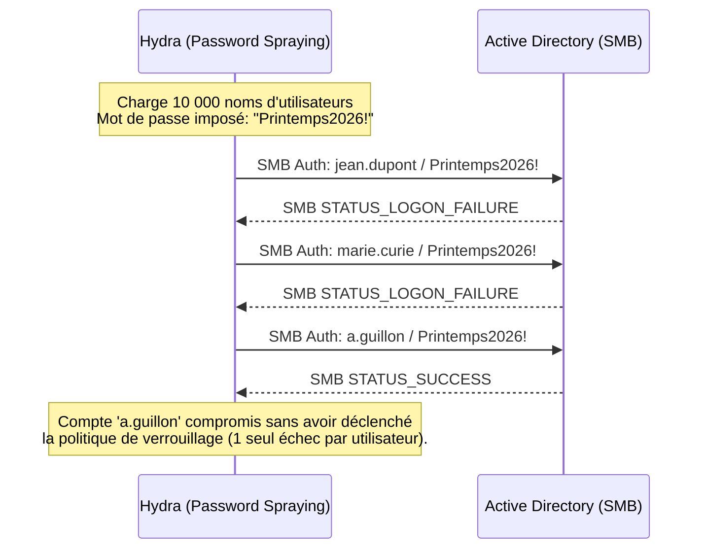

# Hydra — Le Bélier Frontal

<div
  class="omny-meta"
  data-level="🟢 Débutant"
  data-version="9.5+"
  data-time="~30 minutes">
</div>

<div style="text-align: center; margin: 0 auto;">
    
</div>

## Introduction

!!! quote "Analogie pédagogique — Frapper à la Porte d'Entrée"
    Si **Hashcat** vole le coffre-fort pour l'ouvrir secrètement chez lui à la disqueuse (Hors-Ligne), **Hydra** est un bélier qui tape violemment sur la porte principale de la banque en plein jour (En-Ligne).
    Il n'y a aucune furtivité : le garde à l'intérieur (le système de journalisation / SOC) entend chaque coup sur la porte. De plus, si la banque a une politique "Après 3 coups, on scelle la porte" (Account Lockout), le bélier va paralyser l'entreprise. Mais si la porte est en bois et que le garde dort, Hydra rentre en 5 secondes.

Maintenu par la célèbre équipe **THC (The Hacker's Choice)**, `hydra` est un login cracker paré pour le réseau. Au lieu d'attaquer des données mathématiques, il interagit avec de vrais serveurs via plus de 50 protocoles (RDP, SSH, FTP, HTTP-POST, SMB, Telnet, LDAP). Son rôle est d'envoyer en boucle des requêtes d'authentification réseau jusqu'à obtenir un message "Access Granted".

<br>

---

## Architecture & Mécanismes Internes

### 1. Le Pool de Connexions Concurrentes (TCP/UDP)
Hydra n'attend pas qu'une connexion se termine pour en lancer une autre. Il ouvre des dizaines de *Sockets TCP* en parallèle ("Threads" ou "Tasks").



### 2. Différence Bruteforce vs Password Spraying
Dans une attaque réseau, essayer 10 000 mots de passe sur **1 seul utilisateur** bloque le compte (Lockout Policy à 3 essais). 
La technique moderne (Password Spraying) consiste à essayer **1 seul mot de passe commun** (ex: `Welcome2024!`) sur **10 000 utilisateurs différents**.



<br>

---

## Intégration dans la Kill Chain

| Phase Précédente | Hydra | Phase Suivante |
| :--- | :--- | :--- |
| **Enumération / OSINT** <br> (*Nmap / CeWL*) <br> On a découvert un service SSH ouvert (Port 22) et une liste de prénoms de l'entreprise. | ➔ **Accès Réseau (Initial Access)** ➔ <br> On pulvérise les identifiants en boucle (Spraying) sur le service externe. | **Mouvement Latéral** <br> (*NetExec / SSH*) <br> On ouvre le terminal avec l'identifiant volé et on attaque l'infrastructure interne. |

<br>

---

## Workflow Opérationnel & Lignes de Commande Avancées

La syntaxe d'Hydra est universelle : `hydra [options] [protocole]://[IP]`. Minuscule = 1 élément. Majuscule = Fichier (Liste).

### 1. Attaque ciblée classique (Un utilisateur, beaucoup de mots de passe)
L'administrateur a laissé un vieux serveur FTP sans sécurité de verrouillage de compte.
```bash title="Brute Force sur Port FTP 21"
hydra -l admin -P /usr/share/wordlists/rockyou.txt ftp://192.168.1.50
```
- `-l admin` : (Minuscule) Teste un seul utilisateur.
- `-P rockyou.txt` : (Majuscule) Teste toute une liste de mots de passe.

### 2. Password Spraying sur du RDP (Windows Remote Desktop)
On possède une liste d'utilisateurs d'entreprise, on veut tous les tester avec un mot de passe faible souvent utilisé.
```bash title="Pulvérisation de mot de passe (Furtif)"
hydra -L users.txt -p "Entreprise2024!" rdp://10.10.10.42 -t 4
```
- `-L users.txt` : Teste toute la liste d'utilisateurs.
- `-p "..."` : Un seul mot de passe.
- `-t 4` : Réduit les Threads (Connexions parallèles) à 4 pour ne pas surcharger le port RDP (qui crashe souvent).

### 3. Attaque de Formulaire Web (HTTP POST-Form)
C'est le mode le plus complexe d'Hydra. Il faut lui indiquer l'URL du formulaire, les variables POST, et le message d'erreur prouvant que le login a échoué.
```bash title="Bruteforce d'une page de Login Web"
hydra -l admin -P pass.txt 10.10.10.42 http-post-form "/login.php:user=^USER^&pass=^PASS^:F=Login failed"
```
*(C'est très verbeux et sujet aux erreurs. Aujourd'hui, on préfère utiliser Burp Suite Intruder ou ffuf pour le web, et laisser Hydra pour les protocoles réseau comme SSH/SMB).*

<br>

---

## Contournement & Furtivité

Par défaut, Hydra est l'inverse de la furtivité.

1. **Wait and Sleep (Éviter le Ban Fail2Ban)** :
   Si le serveur cible possède un outil défensif comme *Fail2Ban* (qui bannit l'IP après 5 échecs), il faut demander à Hydra d'attendre très longtemps entre chaque tentative de connexion (ex: 60 secondes).
   ```bash title="Lent et Indétectable"
   hydra -l root -P pass.txt ssh://cible.com -W 60
   ```

2. **Éviter le timeout du serveur FTP** :
   Beaucoup de services (comme le FTP ou LDAP) refusent les multi-connexions de la même adresse IP en même temps.
   Réduisez le parallélisme à 1 Thread (`-t 1`) ou vous n'aurez que des faux-négatifs (des erreurs de connexion réseau interprétées comme des mauvais mots de passe).

<br>

---

## Bonnes & Mauvaises Pratiques (Do's & Don'ts)

| Action | Recommandation | Explication technique |
|---|---|---|
| ✅ **À FAIRE** | **Activer le Verbose (`-V`) en début d'attaque** | Les attaques réseau crashent souvent (changement de clé SSH, refus de connexion). Lancez toujours l'attaque avec le flag `-V` au début pour voir si Hydra tente bien de se connecter ou s'il est bloqué par le pare-feu. |
| ❌ **À NE PAS FAIRE** | **Utiliser `-P rockyou.txt` sur un Active Directory** | Rockyou.txt contient 14 millions de mots. Si vous l'utilisez en bruteforce sur l'utilisateur "Administrateur" d'un domaine Windows, au 3ème mot raté, le compte de l'Admin sera verrouillé (Locked). S'il s'agit du vrai compte de production de l'entreprise, vous venez de provoquer un Déni de Service critique (DoS). |

<br>

---

## Avertissement Légal & Bruit Réseau (SOC)

!!! danger "L'Alerte Rouge des SOC"
    Le "Brute-force SSH" ou "Brute-force SMB" depuis une adresse IP externe est littéralement la première règle de détection (règle Sigma) configurée par les analystes SOC (Security Operations Center) sur leur SIEM (Splunk/Elastic).
    
    - 50 échecs de connexion sur un compte Root en 10 secondes déclencheront des alertes instantanées sur les téléphones de l'équipe de défense.
    - Lors d'une vraie opération d'intrusion (Red Team), Hydra n'est jamais utilisé de manière agressive. Il est relégué aux tests automatisés "bruyants" ou configuré en Password Spraying très lent (1 tentative par heure) sur l'OWA (Outlook) de l'entreprise.

<br>

---

## Conclusion

!!! quote "Ce qu'il faut retenir"
    Aussi vieux qu'Internet, Hydra reste l'outil de référence absolu pour taper sur les protocoles réseau (SSH, FTP, MySQL, RDP). C'est un marteau. Il ne demande pas de finesse, juste un bon dictionnaire et une cible dont le pare-feu est mal configuré. Ne l'utilisez jamais pour le Web (Burp/ffuf sont meilleurs), et méfiez-vous de la stratégie de verrouillage de compte (Lockout) de votre client.

> Mais si Hydra est trop vieux, existe-t-il une alternative plus stable, plus rapide et codée dans une logique similaire ? Bien sûr. L'éternel frère ennemi d'Hydra, qui le remplace parfois dans certains workflows réseau : **[Medusa →](./medusa.md)**.


