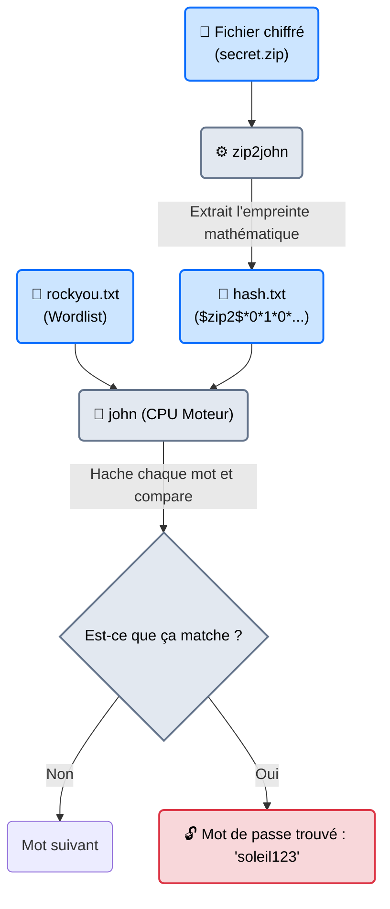
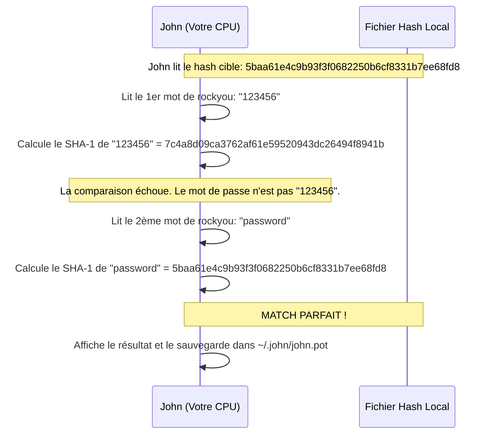

# John the Ripper — Le Couteau Suisse

<div
  class="omny-meta"
  data-level="🟢 Débutant"
  data-version="1.9.0+"
  data-time="~35 minutes">
</div>

<div style="text-align: center; margin: 0 auto;">
    
</div>


## Introduction

!!! quote "Analogie pédagogique — Le Serrurier Polyvalent (Le Couteau Suisse)"
    Si **Hashcat** est une usine industrielle avec 500 ouvriers (GPU) spécialisés dans l'ouverture d'un seul type de coffre ultra-blindé, **John the Ripper** est le serrurier de quartier avec son trousseau magique.
    Il n'est pas le plus rapide, car il travaille à la main (le processeur CPU). En revanche, il sait ouvrir *absolument tout* : un vieux fichier ZIP chiffré, une clé privée SSH protégée, un document PDF, un hash Linux `/etc/shadow`, ou un mot de passe Windows. Il a un outil spécifique pour extraire la serrure de chaque porte.

Créé à l'origine en 1996 pour UNIX, **John the Ripper (JtR)** (généralement utilisé via sa version étendue *Jumbo*) est le programme de craquage hors-ligne par défaut sur Kali Linux. Son principal avantage réside dans ses utilitaires d'extraction (les fameux outils `*2john`). Vous n'avez pas besoin de savoir à quoi ressemble un hash cryptographique, John l'extrait pour vous et se configure tout seul pour le casser.

<br>

---

## Architecture & Mécanismes Internes

### 1. La Chaîne de Craquage (Workflow)
John ne peut pas attaquer directement un fichier "physique" (`secret.zip`). Il faut d'abord utiliser un script annexe pour en extraire l'empreinte mathématique (le Hash), puis attaquer cette empreinte.



### 2. Le Mécanisme de Hachage CPU (Sequence Diagram)
Voici pourquoi on appelle cela du craquage "hors-ligne". John the Ripper ne communique jamais avec la cible. Tout se passe dans la mémoire vive de votre propre ordinateur.



<br>

---

## Intégration dans la Kill Chain

| Phase Précédente | John the Ripper | Phase Suivante |
| :--- | :--- | :--- |
| **Vol de Fichiers / Post-Exploitation** <br> (*Metasploit / LFI*) <br> On a téléchargé les fichiers `/etc/passwd` et `/etc/shadow` du serveur. | ➔ **Craquage (Credential Access)** ➔ <br> John unshadow les fichiers et tente de casser le mot de passe root. | **Élévation de Privilèges** <br> (*SSH*) <br> On se reconnecte légitimement en SSH avec le mot de passe cassé. |

<br>

---

## Workflow Opérationnel & Lignes de Commande Avancées

La force de John est sa simplicité. Contrairement à Hashcat, il est capable d'auto-détecter le format de l'empreinte cryptographique.

### 1. Préparation : Les utilitaires d'extraction `*2john`
Kali Linux inclut des dizaines de scripts pour extraire les hashes.
```bash title="Exemples d'extractions courantes"
# Pour un fichier ZIP chiffré
zip2john backup.zip > hash_zip.txt

# Pour une clé privée SSH (id_rsa chiffrée avec une passphrase)
ssh2john id_rsa > hash_ssh.txt

# Pour un document PDF verrouillé
pdf2john document.pdf > hash_pdf.txt

# Cas spécial Linux : Fusionner passwd et shadow
unshadow /etc/passwd /etc/shadow > linux_hashes.txt
```

### 2. Craquage par Dictionnaire (Wordlist Attack)
L'attaque la plus courante. On donne à John le hash et le dictionnaire. Le format est auto-détecté.
```bash title="L'attaque classique"
john --wordlist=/usr/share/wordlists/rockyou.txt hash_zip.txt
```
*Astuce : Pendant que John tourne, appuyez sur la touche `Espace` ou `Entrée` de votre clavier. Il affichera son statut en direct (Vitesse, Temps restant, Mots testés).*

### 3. Voir les résultats trouvés
John ne recraquera jamais un hash qu'il a déjà trouvé. Il le stocke dans le fichier `john.pot`. Pour revoir un mot de passe :
```bash title="Afficher les mots de passe cassés"
john --show hash_zip.txt
```

### 4. L'Attaque Mutante (Rules)
C'est ici que John the Ripper devient redoutable. Le mot "P@ssw0rd123" n'est probablement pas dans `rockyou.txt` (qui contient surtout des mots simples). La fonction `--rules` va dire à John de prendre le mot "password" du dictionnaire, et de le muter (mettre des majuscules, remplacer le "a" par "@", ajouter "123" à la fin).
```bash title="Wordlist + Mutation dynamique"
john --wordlist=rockyou.txt --rules=Jumbo hash_ssh.txt
```

<br>

---

## Contournement & Limitations

John the Ripper est fondamentalement limité par l'architecture des processeurs CPU.

1. **La Vitesse CPU vs GPU** :
   Un CPU très haut de gamme possède 16 à 32 cœurs. Une carte graphique (GPU) possède plus de 5000 cœurs. Pour casser un hash complexe comme le `bcrypt` ou le `WPA2`, John the Ripper sur un ordinateur portable mettra des années, là où Hashcat sur une ferme de cartes graphiques mettra 12 heures.
2. **Auto-détection (Le piège)** :
   Si le hash est ambigu (par exemple, un hash MD5 brut sans contexte), John va le deviner. Parfois, il se trompe de format et lance l'attaque avec le mauvais algorithme. Dans ce cas, il faut forcer le format : `john --format=raw-md5 hash.txt`.

<br>

---

## Bonnes & Mauvaises Pratiques (Do's & Don'ts)

| Action | Recommandation | Explication technique |
|---|---|---|
| ✅ **À FAIRE** | **Utiliser le mode Single Crack en premier** | Si vous venez de dumper la base de données Active Directory, lancez `john --single hashes.txt`. Ce mode très rapide prend le nom d'utilisateur (ex: `a.guillon`) et le mute pour essayer de le casser (ex: `aguillon123!`, `guillon.a`). Ça marche effroyablement souvent en entreprise. |
| ❌ **À NE PAS FAIRE** | **Utiliser John pour un Handshake Wi-Fi WPA2** | Craquer un réseau WiFi nécessite le calcul de l'algorithme lent PBKDF2-HMAC-SHA1 (4096 itérations par mot). Sur John (CPU), la vitesse sera d'environ 3000 mots/seconde. C'est inutile. Utilisez Hashcat (GPU) pour atteindre 500 000 mots/seconde. |

<br>

---

## Avertissement Légal & Preuve de Concept

!!! danger "Droits d'Accès et Exfiltration"
    Récupérer le fichier de hashes Linux `/etc/shadow` ou la base NTDS.DIT de Windows nécessite d'être déjà Administrateur/Root (Privilege Escalation).
    
    1. Dans un contexte de Red Team, casser le hash d'un autre administrateur permet un mouvement latéral furtif (réutilisation de mot de passe sur d'autres serveurs).
    2. Ne partagez jamais un fichier `.pot` (le cache de mots de passe cassés de John) avec un tiers non autorisé, il contient les secrets industriels de vos clients en clair.

<br>

---

## Conclusion

!!! quote "Ce qu'il faut retenir"
    John the Ripper (Jumbo) est le roi de la polyvalence. Ses scripts d'extraction (`zip2john`, `ssh2john`) sont indispensables dans toute opération de récupération de données. Il est l'outil parfait pour un pentester en déplacement sur un ordinateur portable pour casser rapidement des mots de passe simples.

> Mais que se passe-t-il si le client utilise une stratégie de mots de passe robuste de 12 caractères complexes hachés avec le standard NTLM de Windows ? Le processeur de votre PC portable va fondre avant de terminer le calcul. Il est temps de passer à l'arme lourde, le logiciel qui fait rugir les cartes graphiques et consomme des milliers de Watts : **[Hashcat →](./hashcat.md)**.


