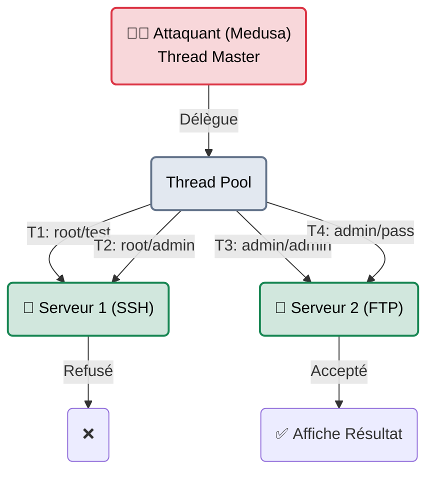

# Medusa — Le Frère Jumeau

<div
  class="omny-meta"
  data-level="🟢 Débutant"
  data-version="2.2+"
  data-time="~20 minutes">
</div>

<div style="text-align: center; margin: 0 auto;">
    
</div>

## Introduction

!!! quote "Analogie pédagogique — Le Char d'Assaut vs Le Bélier"
    Si **Hydra** est un bélier porté par 10 soldats de manière un peu chaotique (il gère 50 protocoles, parfois de manière instable), **Medusa** est un char d'assaut. 
    Il gère beaucoup moins de protocoles qu'Hydra (seulement les grands classiques : SSH, FTP, SMB, HTTP, Telnet, VNC), mais son architecture logicielle (Pthreads) est mieux conçue pour éviter que le processus ne "plante" au milieu d'une longue attaque.

`medusa` est le concurrent historique direct de `hydra`. Les deux font exactement la même chose : du brute-force en ligne sur des services réseau. Cependant, de nombreux administrateurs et auditeurs préfèrent Medusa pour des audits très lourds car son comportement multithread le rend souvent plus stable, notamment lors de l'attaque de serveurs Microsoft (SMB) qui ont tendance à rejeter violemment les requêtes d'Hydra.

<br>

---

## Architecture & Mécanismes Internes

### 1. Parallélisme Asynchrone (Pthreads)
Contrairement à Hydra qui crée des "processus de connexion" parfois lourds pour le CPU local, Medusa utilise la bibliothèque C `pthread` (Threads POSIX). Cela lui permet de tester plusieurs mots de passe en même temps, mais aussi d'attaquer plusieurs machines simultanément sur le réseau avec une seule ligne de commande.



### 2. La Syntaxe des Modules (`-M`)
Là où Hydra détecte le protocole par l'URL (ex: `ssh://ip`), Medusa utilise une philosophie de "Modules" explicites (`-M ssh`). Cela rend la ligne de commande moins intuitive pour un débutant, mais garantit qu'on utilise bien le bon moteur d'attaque.

<br>

---

## Intégration dans la Kill Chain

| Phase Précédente | Medusa | Phase Suivante |
| :--- | :--- | :--- |
| **Identification de Services** <br> (*Nmap*) <br> Découverte d'un parc de 15 serveurs avec le port Telnet (23) ouvert. | ➔ **Accès Réseau (Initial Access)** ➔ <br> Medusa attaque les 15 serveurs en parallèle avec le dictionnaire `mirai.txt`. | **Mouvement Latéral / Botnet** <br> (*C2 Framework / SSH*) <br> Déploiement d'une charge malveillante sur les routeurs compromis. |

<br>

---

## Workflow Opérationnel & Lignes de Commande Avancées

La syntaxe de Medusa repose fortement sur les lettres capitales pour distinguer "un" de "plusieurs" (`-u` pour un compte, `-U` pour un fichier de comptes).

### 1. Attaque Standard sur un Protocole Simple
La commande classique pour tester le compte Administrateur d'un serveur SSH avec un dictionnaire de mots de passe.
```bash title="Attaque SSH Mono-Cible"
medusa -h 10.10.10.42 -u root -P /usr/share/wordlists/rockyou.txt -M ssh
```
- `-h` : Host (L'adresse IP cible).
- `-u` : User (Un nom d'utilisateur unique).
- `-P` : Password File (Un fichier dictionnaire, Majuscule).
- `-M ssh` : Le module SSH.

### 2. Brute-Force d'un Parc Entier (Attaque de Masse)
C'est ici que Medusa brille par rapport à Hydra. On peut lui donner une liste d'adresses IP (`-H ips.txt`) et lui demander d'attaquer tout le monde en même temps.
```bash title="Attaque de masse FTP"
medusa -H serveurs_ftp.txt -U liste_users.txt -P liste_pass.txt -M ftp
```

### 3. Les Flags d'Arrêt (Crucial)
Lors d'une attaque, si vous testez 10 000 mots de passe et que Medusa trouve le bon mot de passe au bout du 3ème essai, **il continuera de tester les 9 997 mots restants** (ce qui fera un bruit infernal sur le réseau et risque de bloquer le compte par la suite). Il faut utiliser les options de "Fail-Fast".
```bash title="Trouver et s'arrêter"
medusa -h 192.168.1.5 -u admin -P pass.txt -M smbnt -f -O resultat.txt
```
- `-f` (Fail First) : Dit à Medusa d'arrêter immédiatement toute l'attaque dès qu'un mot de passe valide est trouvé.
- `-O` : Sauvegarde dans un fichier au lieu de tout cracher dans le terminal.

<br>

---

## Comparaison : Medusa ou Hydra ?

Pourquoi choisir l'un plutôt que l'autre dans un Pentest ?

| Caractéristique | Hydra | Medusa |
|---|---|---|
| **Protocoles supportés** | Plus de 50 (Excellente couverture) | Environ 20 (Les fondamentaux) |
| **Formulaires Web** | Fort (http-post-form, CSRF tokens) | Très faible (Déconseillé pour le Web) |
| **Stabilité** | Parfois instable sur les gros dictionnaires | Extrêmement stable et rapide |
| **Parallélisme massif (IPs multiples)** | Possible, mais complexe à tuner | Intégration native très fluide (`-H`) |

<br>

---

## Bonnes & Mauvaises Pratiques (Do's & Don'ts)

| Action | Recommandation | Explication technique |
|---|---|---|
| ✅ **À FAIRE** | **Utiliser Medusa pour le "Password Spraying" SMB** | Attaquer le protocole Windows SMB (`-M smbnt`) est souvent douloureux. Medusa le gère très bien en mode "Spraying" (1 mot de passe sur 10 000 utilisateurs) : `medusa -h DC_IP -U users.txt -p Welcome2024! -M smbnt`. |
| ❌ **À NE PAS FAIRE** | **Attaquer des services protégés par du 2FA** | Comme pour Hydra, si l'accès SSH ou le VPN nécessite un mot de passe ET l'insertion d'un code Google Authenticator (MFA/2FA), Medusa obtiendra toujours un "Access Denied", même s'il trouve le bon mot de passe. N'attaquez que des services mal sécurisés ou "Legacy". |

<br>

---

## Conclusion

!!! quote "Ce qu'il faut retenir"
    Medusa n'est pas révolutionnaire, mais c'est un outil très apprécié par les ingénieurs réseau et les auditeurs qui ont besoin d'attaquer des centaines de routeurs ou serveurs SSH simultanément de manière parfaitement stable. Gardez à l'esprit que ces attaques génèrent énormément de logs et ne passeront jamais inaperçues face à un SOC.

> Que vous utilisiez Hydra, Medusa, Hashcat ou John The Ripper, l'outil en lui-même n'est que l'arme. Les munitions de cette arme, c'est ce qui fait la différence entre un hackeur amateur et un professionnel. Plongeons dans la plus grande bibliothèque de dictionnaires de la planète : **[SecLists →](./seclists.md)**.


