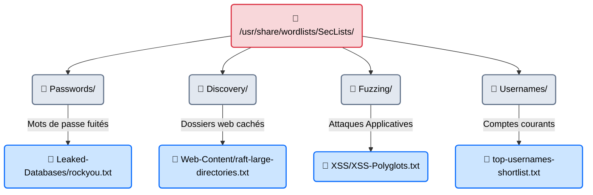

---
description: "SecLists — Le référentiel mondial des listes de sécurité (Wordlists). Une immense bibliothèque open-source regroupant les mots de passe divulgués, les payloads de fuzzing et les dossiers cachés."
icon: lucide/book-open-check
tags: ["THEORY", "WORDLISTS", "SECLISTS", "DICTIONARY", "BRUTEFORCE"]
---

# SecLists — La Bibliothèque d'Alexandrie

## Introduction

!!! quote "Analogie pédagogique — L'Armurerie aux Mille Munitions"
    Un outil comme **Hashcat**, **Hydra** ou **ffuf** n'est qu'un pistolet vide. Sans munitions, ils ne servent à rien. **SecLists** est la plus grande armurerie du monde.
    Plutôt que de tester des mots au hasard depuis le dictionnaire Larousse, un hacker professionnel ne tire que des munitions "qualifiées" : les 10 millions de mots de passe les plus utilisés par les humains en 2024, les 5000 noms de dossiers les plus couramment cachés par les développeurs web, ou les 100 injections SQL les plus dévastatrices. Tout cela est rangé et classé dans SecLists.

Maintenu par le chercheur en sécurité **Daniel Miessler**, le projet GitHub `SecLists` est le compagnon indispensable de tout testeur d'intrusion. Installé par défaut sur Kali Linux (dans `/usr/share/wordlists/seclists`), c'est un dépôt colossal de fichiers textes (les *Wordlists*) catégorisés selon le type d'attaque (Mots de passe, Fuzzing Web, Noms d'utilisateurs, DNS). 

 

---

## Architecture des Dossiers (Où chercher ?)

Ne vous perdez pas dans les centaines de fichiers. Un Pentester utilise principalement 4 grands dossiers selon son objectif.

### 1. La Découverte Web (`Discovery/Web-Content/`)
Oubliez `dirb/common.txt`. Le dossier `raft-large-directories.txt` (issu d'une analyse massive de l'internet) contient les vrais noms de dossiers utilisés par les développeurs modernes (ex: `/api/v1`, `/.git`, `/wp-includes`). À utiliser avec **ffuf** ou **Gobuster**.

### 2. Le Graal des Mots de Passe (`Passwords/Leaked-Databases/`)
C'est ici que se trouve le légendaire fichier **RockYou.txt**. En 2009, l'entreprise RockYou a été piratée, révélant les mots de passe en clair de 32 millions d'utilisateurs. Ce fichier contient les ~14 millions de mots de passe uniques de cette fuite, triés par fréquence d'utilisation (de `123456` à `iloveyou`). Si vous faites un brute-force (Hydra/Hashcat), vous commencez **toujours** par RockYou.

### 3. Les Charges Utiles (`Fuzzing/`)
Si vous utilisez Burp Suite Intruder pour trouver une injection SQL, vous n'allez pas taper des mots au hasard. Vous allez charger `Fuzzing/SQLi/SQLi-Auth-Bypass.txt` qui contient des centaines de variations de `admin' OR 1=1 --`.

 

---

## Bonnes & Mauvaises Pratiques (Do's & Don'ts)

| Action | Recommandation | Explication technique |
|---|---|---|
| ✅ **À FAIRE** | **Utiliser de petites listes ciblées en premier** | Un pentester professionnel commence toujours par attaquer un site avec `raft-small-directories.txt` (10 000 mots = 10 secondes) pour choper les vulnérabilités évidentes ("Low-Hanging Fruits"). S'il ne trouve rien, il passe aux listes massives la nuit. |
| ❌ **À NE PAS FAIRE** | **Utiliser Rockyou pour fuzzer des dossiers Web** | C'est l'erreur classique du débutant. `rockyou.txt` contient des mots de passe avec des espaces, des smileys, des insultes. Si vous mettez ça dans **ffuf** pour trouver des dossiers web (`http://cible.com/FUZZ`), 90% des requêtes seront mal formées (Erreur 400 Bad Request) et le site plantera. Chaque tâche a sa wordlist ! |

 

---

## L'Alternative Ciblée (La Wordlist Sur-Mesure)

Malgré la puissance de SecLists (qui contient des millions de mots génériques), il y a un angle mort critique.
Si vous attaquez l'entreprise fictive "CyberCorp 2024" basée à "Marseille", aucun dictionnaire générique ne contiendra le mot de passe `CyberCorpMars2024!`.

Pour briser la sécurité de cette entreprise, il ne faut pas utiliser un dictionnaire mondial, il faut créer un **dictionnaire sur-mesure** fabriqué spécifiquement à partir du champ lexical de l'entreprise cible (ses produits, ses fondateurs, son jargon). 
C'est exactement ce que fait l'outil d'extraction linguistique automatique : **[CeWL →](./cewl.md)**.

