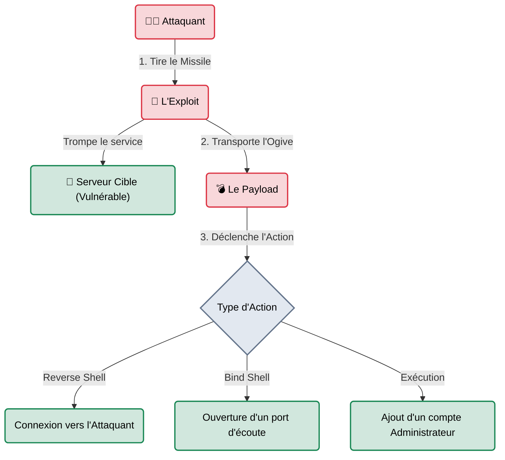
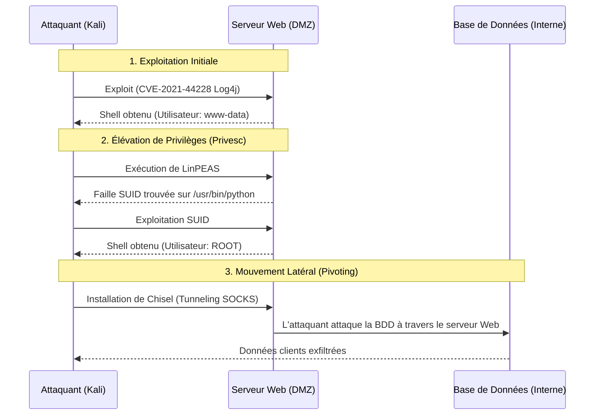

# Exploitation & Post-Exploitation

## Introduction

!!! quote "Analogie pédagogique — L'Intrusion et l'Occupation"
    Trouver une faille (Phase de Scan), c'est repérer qu'une fenêtre du bâtiment est restée ouverte. 
    **L'Exploitation**, c'est l'action de passer par cette fenêtre pour atterrir dans le couloir (Obtenir un accès initial / Un shell).
    **La Post-Exploitation**, c'est ce que vous faites une fois à l'intérieur : voler les clés du gardien (Élévation de Privilèges), ouvrir les portes des autres bureaux (Mouvement Latéral), et cacher un micro sous le bureau du directeur (Persistance).

La phase d'exploitation marque le basculement définitif entre un *Scanner de Vulnérabilités* (qui s'arrête au constat) et un *Test d'Intrusion* (qui prouve l'impact réel). C'est le moment où l'attaquant exécute du code malveillant sur la machine de la victime.

 

---

## Les 3 Piliers de l'Exploitation

L'exploitation n'est pas magique, c'est l'exécution d'une charge utile (Payload) via un vecteur d'attaque (Exploit).

### 1. L'Exploit (Le Vecteur)
C'est le code qui tire parti du bug logiciel (ex: un *Buffer Overflow*, une injection SQL, une désérialisation non sécurisée). L'exploit est spécifique à une version exacte d'un logiciel (ex: Apache 2.4.49).

### 2. Le Payload (La Charge Utile)
C'est ce que l'exploit transporte. Une fois la faille ouverte, c'est le Payload qui s'exécute. Souvent généré par **[Msfvenom →](./msfvenom.md)**, il peut s'agir d'un script Bash, d'un exécutable Windows (exe), ou d'un shellcode en assembleur.

### 3. Le Shell (L'Accès)
C'est le résultat ultime de l'exploitation. Il existe deux grandes familles :
- **Bind Shell** : La victime ouvre un port (ex: 4444) et attend que l'attaquant s'y connecte. (Souvent bloqué par le pare-feu entrant du client).
- **Reverse Shell** : La victime se connecte *vers* l'ordinateur de l'attaquant. (Beaucoup plus furtif, car les pare-feux autorisent généralement le trafic sortant).

 

---

## La Post-Exploitation : Le Vrai Pentest Commence

Beaucoup de débutants pensent que le piratage s'arrête lorsqu'on obtient le premier shell (accès console). Dans la réalité, le premier shell obtenu est souvent celui d'un utilisateur "poubelle" (ex: `www-data`, le compte restreint du serveur web). Cet utilisateur n'a quasiment aucun droit. 

C'est ici que commence la **Post-Exploitation**, un cycle répété jusqu'à la compromission totale du réseau (Domaine Admin).

### Étape 1 : Enumeration Interne (Situtational Awareness)
Qui suis-je ? Où suis-je ? Quels sont les autres ordinateurs autour de moi ? On utilise des outils comme `whoami`, `ipconfig`, ou des scripts automatisés d'énumération de failles locales (**[LinPEAS / WinPEAS →](./peas.md)**).

### Étape 2 : Élévation de Privilèges (Privesc)
L'art de passer d'un compte utilisateur standard à un compte administrateur (Root / SYSTEM). Cela implique de trouver des erreurs de configuration système (fichiers avec de mauvaises permissions, mots de passe oubliés dans des scripts, vulnérabilités du noyau Linux/Windows).

### Étape 3 : Pivoting & Tunneling
Une fois administrateur du serveur web (situé dans la DMZ, la zone exposée à internet), l'attaquant l'utilise comme une "passerelle" (un Pivot) pour attaquer le reste du réseau interne de l'entreprise (qui n'était pas accessible depuis Internet). Des outils comme **[Ligolo-NG →](./ligolo-ng.md)** ou **[Chisel →](./chisel.md)** créent des tunnels secrets à travers cette machine.

 

---

## Bonnes & Mauvaises Pratiques (Do's & Don'ts)

| Action | Recommandation | Explication technique |
|---|---|---|
| ✅ **À FAIRE** | **Stabiliser son Shell en priorité** | Quand vous obtenez un Reverse Shell basique via Netcat, si vous appuyez sur `Ctrl+C`, la connexion se coupe et vous perdez tout. La première commande d'un Pentester doit être `python3 -c 'import pty; pty.spawn("/bin/bash")'` pour transformer ce shell fragile en un terminal stable interactif (TTY). |
| ❌ **À NE PAS FAIRE** | **Lancer des exploits à l'aveugle** | Les exploits publics trouvés sur Internet (Exploit-DB, GitHub) n'ont aucune garantie de fiabilité. Lancer un script Python obscur nommé `exploit_apache.py` sur un serveur de production client peut provoquer un Blue Screen of Death (Kernel Panic). Il faut toujours lire le code source de l'exploit avant de le lancer. |

 

---

## Avertissement Légal & Hors-Périmètre

!!! danger "Dépassement de Périmètre (Out of Scope)"
    La post-exploitation est la phase où le risque de dépasser le contrat est le plus élevé.
    Si vous pivotez depuis le serveur d'une entreprise vers un sous-réseau qui appartient en réalité à un hébergeur tiers (comme AWS ou OVH) sans leur accord explicite, vous êtes juridiquement considéré comme un cybercriminel en pleine attaque, même si votre contrat initial est valide pour le serveur web. Vérifiez toujours vos adresses IP cibles (`ip route`).

