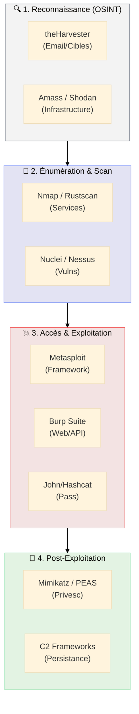

# Cyber : Outils & Red Team

## Introduction

!!! quote "Analogie pédagogique — L'Artisan du Casse"
    Un pentester n'est pas un magicien, c'est un **artisan**. Pour chaque porte, il a un crochet spécifique. Pour chaque coffre, il a un stéthoscope. Son sac à outils (l'arsenal Red Team) est organisé par étapes : il ne sort pas sa perceuse (Exploitation) avant d'avoir observé les rondes des gardes (OSINT). Ce hub est votre sac à outils — chaque compartiment correspond à une phase précise d'un engagement offensif.

Bienvenue dans l'arsenal **Red Team**. Cette section documente les outils et les méthodologies utilisés pour simuler des attaques réelles, auditer des infrastructures et tester la résilience des systèmes de défense (Blue Team).

 

---

## Le Master Diagram : L'Arsenal du Pentester

La réussite d'un test d'intrusion repose sur l'enchaînement logique des outils. Utiliser un exploit avant d'avoir énuméré les services est la garantie d'un échec bruyant.

---

## Les Compartiments de l'Arsenal

### 🔍 OSINT & Reconnaissance
Cartographier la surface d'attaque externe sans interaction directe.
[Accéder au module OSINT](./osint/index.md){ .md-button .md-button--primary }

### 🌐 Pentest Web & API
Auditer les applications web (OWASP Top 10), les APIs et les micro-services.
[Voir les outils Web →](./web/index.md)

### 📡 Pentest Réseau & Services
Énumération des ports, attaques de protocoles et audit Active Directory.
[Voir les outils Réseau →](./network/index.md)

### 💣 Exploitation & Post-Exploit
Prise de contrôle, élévation de privilèges et maintien de la persistance.
[Voir l'arsenal d'Exploit →](./exploit/index.md)

### 🔑 Password Attacks
Bruteforce, cracking de hashs et attaques par dictionnaire.
[Voir les outils de Cracking →](./crack/index.md)

---

## Conclusion

!!! quote "L'arsenal au service de la stratégie"
    La maîtrise technique des outils n'est que la moitié du chemin. Un expert Red Team se distingue par sa capacité à choisir le bon outil au bon moment, tout en respectant une méthodologie rigoureuse et une éthique professionnelle stricte.

> Prêt à commencer ? Débutez par la phase de reconnaissance avec le module **[OSINT & Reconnaissance](./osint/index.md)**.