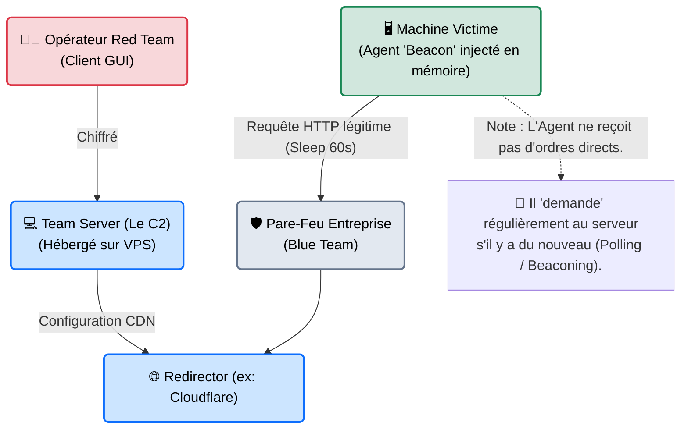

# C2 Frameworks — Le Centre de Commandement

    

{: style="width: 100px; display: block; margin: 0 auto;" }

## Introduction

!!! quote "Analogie pédagogique — Le Général et ses Espions"
    Pirater un seul ordinateur, c'est facile. Mais si vous avez piraté 50 ordinateurs dans une multinationale, comment leur donnez-vous des ordres en même temps sans que les vigiles (la Blue Team) ne s'en rendent compte ?
    Vous ne les appelez pas en direct. Vous construisez un réseau radio chiffré depuis un sous-marin, avec des relais locaux (Redirectors). Vous envoyez un message codé : "Espions, à midi, copiez ce dossier". Et les 50 espions (les *Beacons* ou *Agents*) exécutent l'ordre silencieusement.
    Le **Framework C2** (Command and Control), c'est l'ordinateur central dans ce sous-marin. C'est l'interface d'administration de la Red Team.

Un **C2 Framework** est une infrastructure logicielle complète conçue pour gérer la phase de Post-Exploitation. Au lieu d'avoir un simple terminal noir (Reverse Shell classique) par machine piratée, le pentester dispose d'une interface professionnelle (souvent graphique) pour générer des malwares (Payloads), gérer des dizaines de victimes simultanément, automatiser la persistance, et exfiltrer des données de manière furtive et chiffrée.

 

---

## Architecture du Concept (C2 Infrastructure)

L'architecture d'un C2 moderne ne connecte jamais directement la victime à l'attaquant. Elle utilise des proxies et des techniques d'évasion (Malleable C2).

 

---

## Intégration Opérationnelle (Les Leaders du Marché)

Les frameworks C2 sont les outils les plus complexes de l'arsenal. Ils remplacent avantageusement Metasploit pour les missions haut de gamme.

| Framework | Licence | Spécificité métier |
|---|---|---|
| **Cobalt Strike** | Commercial (~$3,500/an) | Le standard d'or historique. Modulable via *Aggressor Scripts* et profils *Malleable C2* (pour imiter le trafic de Google ou Amazon). Extrêmement ciblé par les Antivirus. |
| **Sliver** | Open Source (Go) | Développé par BishopFox. Le grand favori moderne des Red Teams. Gère très bien le trafic DNS, mTLS, WireGuard, et génère des binaires Go difficiles à analyser pour les EDR. |
| **Havoc** | Open Source | Une interface graphique magnifique (semblable à Cobalt Strike) qui gagne en popularité pour son extensibilité et sa gestion d'agents externes (C++). |
| **Mythic** | Open Source | Une architecture en microservices (Docker) permettant de brancher n'importe quel langage d'agent (macOS, Linux, Windows) au même serveur central via des API HTTP/WebSockets. |

 

---

## Le Workflow Idéal (L'Opération C2 Standard)

Voici comment une Red Team mène une opération de compromission de domaine avec un C2 (ex: *Sliver*) :

1. **Génération du Payload** : L'opérateur demande au C2 de générer un *Beacon* (un petit virus silencieux) configuré pour se connecter à une adresse IP relais tous les 10 minutes (`Sleep: 600s`).
2. **Leurre Malleable** : On configure le serveur C2 pour que le trafic de ce Beacon ressemble à s'y méprendre à des requêtes vers l'API de Spotify (Trafic obfusqué).
3. **Infection (Phishing)** : La victime clique sur la pièce jointe envoyée par la Red Team. Le Beacon est chargé dans la mémoire vive de l'ordinateur (Fileless).
4. **Prise de Contrôle (Interactive)** : L'ordinateur victime apparaît sur l'écran du pentester. Le pentester réduit le `Sleep` à 1 seconde, lance un module de vol de mots de passe (Mimikatz intégré au C2), puis ordonne au Beacon de se rendormir.

 

---

## Bonnes & Mauvaises Pratiques (Do's & Don'ts)

| Action | Recommandation | Explication opérationnelle |
|---|---|---|
| ✅ **À FAIRE** | **Utiliser des "Redirectors" (Reverse Proxy)** | Si vous pointez votre malware directement vers l'IP de votre C2 principal, et que la Blue Team l'analyse, ils bloqueront l'IP. Tout votre réseau tombera. Un redirector (VPS à 5€) permet de protéger le C2 maître. |
| ✅ **À FAIRE** | **Adapter le Jitter (Gigue)** | Ne configurez pas vos agents pour rappeler le serveur exactement toutes les 60 secondes. C'est mathématique et détectable par les sondes. Ajoutez un `Jitter` de 20% (rappels aléatoires entre 48s et 72s). |
| ❌ **À NE PAS FAIRE** | **Exécuter des binaires sur le disque** | Les EDR modernes détecteront toute création de `.exe` ou script louche sur le disque dur. Un bon C2 injecte tout (outils, scripts) directement dans la mémoire vive (RAM) d'un processus légitime (ex: *explorer.exe*). |
| ❌ **À NE PAS FAIRE** | **Utiliser les profils C2 par défaut** | Lancer Cobalt Strike ou Sliver sans modifier le profil réseau par défaut équivaut à hurler "JE SUIS UN HACKER" sur le réseau. Les signatures par défaut sont blacklistées partout. |

 

---

## Avertissement Légal & Éthique

!!! danger "Ligne Rouge — L'Infection Systémique et le STAD[^1]"
    L'utilisation d'un Framework C2 est l'acte offensif le plus lourd technologiquement. C'est l'équivalent de la création et de la gestion d'un Botnet professionnel.

    1. **Contrôle sans autorisation** : Le déploiement d'un agent C2 (Beacon) sur une machine sans mandat écrit explicite tombe sous le coup de l'**Article 323-1 du Code pénal** (Maintien frauduleux dans un STAD).
    2. **Transfert de données (Exfiltration)** : Les C2 sont conçus pour exfiltrer silencieusement des données. L'exfiltration non autorisée de données confidentielles est qualifiée de **Vol d'Information** (Art. 311-1).
    3. **Risque de "Takeover"** : Si votre serveur C2 n'est pas lui-même ultra-sécurisé, un véritable groupe criminel (APT) pourrait pirater *votre* serveur et prendre le contrôle de *toutes* vos victimes. La négligence de la Red Team dans sa propre OpSec engagerait alors sa responsabilité civile et pénale.

 

---

## Conclusion

!!! quote "Ce qu'il faut retenir"
    Un bon hacker maîtrise ses exploits. Un grand hacker maîtrise son infrastructure. Les C2 Frameworks permettent d'industrialiser les tests d'intrusion et de simuler le comportement réel des pires menaces mondiales (Ransomware Gangs, APT). Apprendre à déployer et masquer un serveur Sliver ou Havoc, c'est entrer dans la cour des grands de l'ingénierie offensive.

> Pour concevoir une infrastructure C2 résiliente et invisible, il est indispensable de maîtriser parfaitement les règles strictes de sécurité opérationnelle détaillées dans **[OpSec & Anonymisation →](./opsec.md)**.

 

[^1]: **Système de Traitement Automatisé de Données (STAD)** : Serveur, ordinateur ou téléphone. L'infection par un agent (Beacon) pour prendre le contrôle à distance caractérise l'infraction suprême au STAD.

