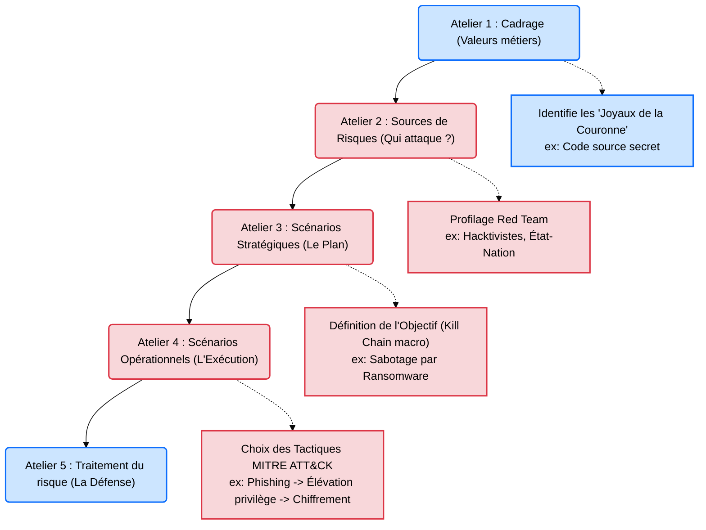

---
description: "EBIOS Risk Manager (Vue Red Team) — Comprendre et exploiter la méthodologie française d'analyse de risques pour orienter les campagnes offensives."
icon: lucide/book-open-check
tags: ["RED TEAM", "EBIOS", "METHODOLOGIE", "GOUVERNANCE", "RISQUE"]
---

# EBIOS RM — L'Analyse de Risque Offensive

## Introduction

!!! quote "Analogie pédagogique — Le Chef de la Sécurité vs Le Voleur"
    Imaginez un château. Le chef de la sécurité (Gouvernance) utilise une méthode mathématique pour calculer où mettre les gardes : il compte la valeur de l'or, le prix de la porte et le coût d'une attaque. Ça, c'est l'**EBIOS RM** classique.
    Maintenant, imaginez le voleur (Red Team) qui trouve ce document sur le bureau du chef de la sécurité. Pour le voleur, c'est le **plan parfait** : il sait exactement ce que le château protège le plus, quels sont les scénarios d'attaque que le château craint le plus, et surtout, quelles sont les faiblesses acceptées (les risques résiduels). Utiliser EBIOS en Red Team, c'est attaquer l'adversaire en utilisant sa propre stratégie contre lui.

Créée par l'**ANSSI** (Agence Nationale de la Sécurité des Systèmes d'Information) française, **EBIOS Risk Manager** est la méthode officielle de gestion des risques cyber en France. Bien qu'elle soit conçue pour la défense (Blue Team / CISO), les équipes offensives de haut niveau (Red Team) l'utilisent à l'envers : ils se servent des scénarios de risques stratégiques pour concevoir des campagnes d'attaque ultra-réalistes et alignées sur les pires craintes du client.

 

---

## Architecture du Concept (Ateliers EBIOS)

La méthode EBIOS RM est structurée en 5 ateliers séquentiels. En Red Team, on se concentre principalement sur les ateliers 2, 3 et 4 pour modéliser notre attaque.

 

---

## Intégration Opérationnelle (Le Rôle du Threat Intel)

La Threat Intelligence (Renseignement sur la Menace) fait le pont entre EBIOS et le Pentest technique.

1. **Atelier 2 (Source de Risque)** ➔ L'équipe offensive se glisse dans la peau du profil défini par EBIOS. Si le risque redouté est "Un concurrent déloyal", la Red Team n'utilisera pas de Ransomware (trop bruyant), mais des techniques d'exfiltration furtives (APT).
2. **Atelier 4 (Scénario Opérationnel)** ➔ C'est ici que l'on connecte EBIOS au **MITRE ATT&CK**. Le scénario abstrait de l'entreprise ("*Le pirate entre par la boîte mail et vole les brevets*") est traduit en ligne de commande par la Red Team (*"T1566 Phishing ➔ T1003 OS Credential Dumping ➔ T1048 Exfiltration Over Alternative Protocol"*).

 

---

## Le Workflow Idéal (L'Audit Dirigé par les Risques)

Un Pentest classique tape sur tout ce qui bouge. Une opération Red Team basée sur EBIOS (Risk-Driven) est chirurgicale :

1. **Demande de la cartographie EBIOS** : Lors du cadrage, le chef de mission Red Team demande l'analyse de risque EBIOS du client.
2. **Ciblage des "Événements Redoutés"** : Le client craint par dessus tout l'altération de sa base de données clients (Atelier 1).
3. **Construction du Scénario** : La Red Team construit un scénario de Phishing ciblant spécifiquement les administrateurs de la base de données (Ateliers 3 & 4).
4. **Exécution Ciblée** : L'équipe ignore les serveurs web marketing vulnérables qui ne font pas partie du chemin d'attaque vers la BDD.
5. **Démonstration de l'Impact** : Lors du rapport final, la Red Team valide que le risque théorique modélisé dans EBIOS par le client est bel et bien réel et exploitable.

 

---

## Bonnes & Mauvaises Pratiques (Do's & Don'ts)

| Action | Recommandation | Explication métier |
|---|---|---|
| ✅ **À FAIRE** | **Adapter son niveau (Tuning)** | Si vous simulez un "Script Kiddie" (EBIOS SR1), utilisez des outils très connus et bruyants (ex: Nmap par défaut, SQLmap). |
| ✅ **À FAIRE** | **Lier les rapports** | Dans votre rapport de Pentest, mentionnez clairement : *"Cette faille valide le scénario opérationnel n°4 de votre analyse EBIOS."* C'est ce qui justifie votre budget auprès du COMEX. |
| ❌ **À NE PAS FAIRE** | **Faire du Zéro-Day si inutile** | Ne gaspillez pas une vulnérabilité ultra-complexe (Zéro-Day) si le scénario EBIOS de l'entreprise identifie que l'attaquant principal est un stagiaire malveillant (qui n'aurait pas cette compétence). |
| ❌ **À NE PAS FAIRE** | **Ignorer le contexte métier** | Accéder en root au serveur d'imprimantes est un succès technique. Mais si la donnée vitale EBIOS est le code source sur Github, vous n'avez pas atteint l'objectif Red Team. |

 

---

## Avertissement Légal & Éthique

!!! danger "Audits Stratégiques et Droit d'Accès"
    Bien que l'utilisation d'EBIOS RM soit une approche méthodologique documentaire (Gouvernance), elle implique pour la Red Team d'avoir accès à des documents **hautement confidentiels** du client (La cartographie de ses pires faiblesses et de ses valeurs critiques).

    - **Secret des affaires & NDA** : La divulgation de l'analyse EBIOS d'une entreprise (ou sa conservation non sécurisée sur votre ordinateur de Pentester) peut entraîner des poursuites civiles pour rupture de l'accord de confidentialité (NDA).
    - **Attaques par rebond** : Les scénarios stratégiques EBIOS incluent souvent l'écosystème (Partenaires, Sous-traitants). *ATTENTION* : L'autorisation de pirater la cible principale (Mandat) ne vous autorise **JAMAIS** à pirater le partenaire pour faire rebond, à moins qu'il n'ait lui-même co-signé l'autorisation d'intrusion. L'**Article 323-1** s'applique à chaque entité juridique séparément.

 

---

## Conclusion

!!! quote "Ce qu'il faut retenir"
    Un bon auditeur technique sait comment contourner un pare-feu. Un excellent auditeur stratégique sait *pourquoi* ce pare-feu a été mis là, et *quelle* est la valeur de la donnée derrière lui. Maîtriser EBIOS RM, c'est passer du statut de technicien (Hacker) au statut de Consultant en Stratégie Offensive, capable de parler d'architecture système le matin, et de gestion du risque financier l'après-midi avec le Directeur Général.

> Pour garantir le succès d'une opération Red Team sans se faire repérer par la Blue Team avant d'atteindre l'objectif stratégique défini, la maîtrise parfaite de la furtivité est indispensable. Poursuivez avec les règles d'**[OpSec et Anonymisation →](./opsec.md)**.

