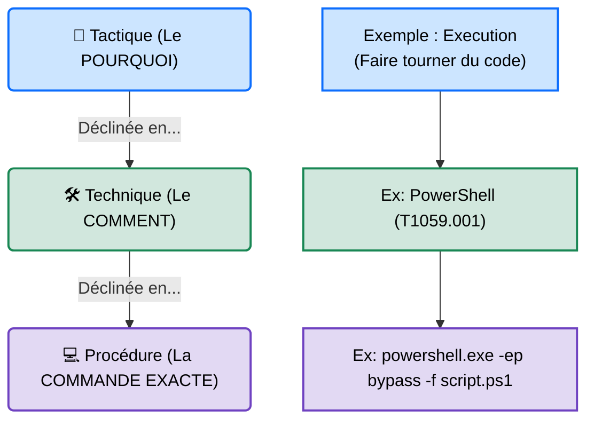

---
description: "MITRE ATT&CK — Le langage universel de la cybersécurité. Une taxonomie mondiale des tactiques et techniques utilisées par les adversaires."
icon: lucide/book-open-check
tags: ["RED TEAM", "MITRE ATTACK", "METHODOLOGIE", "STRATEGIE", "TTP"]
---

# Le Framework MITRE ATT&CK

## Introduction

!!! quote "Analogie pédagogique — Le Dictionnaire des Criminels"
    Imaginez que la police du monde entier essaie de décrire un cambriolage. Un policier français dira *"il a crocheté la serrure"*, un policier américain dira *"he picked the lock"*, et un autre dira *"il a forcé l'entrée"*. C'est le chaos. 
    **Le framework MITRE ATT&CK** est un dictionnaire universel. Il décide que cette action précise s'appelle officiellement `T1078` (Valid Accounts). Grâce à ce tableau géant, quand un Red Teamer attaque une entreprise à Tokyo ou qu'un Blue Teamer défend un serveur à Paris, ils utilisent exactement les mêmes mots, les mêmes codes, et se comprennent parfaitement.

Le **MITRE ATT&CK** (Adversarial Tactics, Techniques, and Common Knowledge) est une base de connaissances mondiale (mise à jour en permanence) des comportements adverses, basée sur des observations réelles d'attaques. Ce n'est pas un outil logiciel, c'est une **taxonomie** qui classe "Ce que l'attaquant veut faire" (Tactique) et "Comment il le fait" (Technique).

 

---

## Architecture du Concept (TTPs)

L'architecture du framework repose sur le concept de **TTPs** : Tactiques, Techniques et Procédures.

1. **Tactiques (Colonnes)** : Représentent l'objectif tactique à court terme (ex: Obtenir un accès initial, Voler des identifiants). Le framework principal (Enterprise) en compte 14.
2. **Techniques (Cellules)** : La méthode utilisée pour atteindre l'objectif tactique (ex: Phishing, Brute-force). Il y en a des centaines.
3. **Procédures** : L'implémentation spécifique de la technique (ex: Lancer un exécutable précis d'un groupe de hackers connu, APT29).

 

---

## Intégration Opérationnelle

Le MITRE ATT&CK est le pont entre l'attaque (Red) et la défense (Blue), créant la sécurité collaborative (Purple Team).

1. **Pour la Red Team (L'Attaque)** ➔ Il sert de **Catalogue de jeu (Playbook)**. Lors d'un engagement, le Red Teamer peut décider d'imiter le comportement d'un groupe criminel spécifique (ex: FIN7) en ne sélectionnant que les TTPs utilisées historiquement par ce groupe, pour voir si le client est capable de les détecter.
2. **Pour la Blue Team (La Défense)** ➔ Il sert de **Carte de Couverture**. L'équipe de défense regarde le tableau MITRE et colorie en vert les techniques qu'elle sait détecter (via le SIEM/EDR) et en rouge les techniques où elle est aveugle.
3. **Reporting (Le Chef d'Orchestre)** ➔ Dans un rapport professionnel d'audit, chaque vulnérabilité exploitée doit être "mappée" (liée) à son ID MITRE (ex: *L'exploitation de la faille correspond à l'ID T1190 - Exploit Public-Facing Application*).

 

---

## Le Workflow Idéal (Émulation d'Adversaire)

Contrairement à un pentest classique où l'on cherche "toutes les failles possibles", une opération Red Team basée sur MITRE ATT&CK cherche à tester "la réaction du client face à une attaque ciblée".

1. **Threat Intelligence** : On identifie les menaces probables pour le client (ex: Pour une banque, on ciblera des groupes financiers comme *Carbanak*).
2. **Sélection des TTPs** : Via l'outil *MITRE ATT&CK Navigator*, on sélectionne le groupe *Carbanak*. Le tableau met en surbrillance les 20 techniques qu'ils utilisent.
3. **Exécution (Red)** : La Red Team lance sa campagne en se limitant strictement à ces 20 techniques.
4. **Analyse (Purple)** : La Red Team et la Blue Team se réunissent : *"À la technique T1003 (OS Credential Dumping), j'ai utilisé Mimikatz. L'avez-vous vu dans vos logs ?"*

 

---

## Bonnes & Mauvaises Pratiques (Do's & Don'ts)

| Action | Recommandation | Explication métier |
|---|---|---|
| ✅ **À FAIRE** | **Utiliser le MITRE Navigator** | Outil web officiel qui permet de colorier la matrice pour préparer un rapport visuel compréhensible par la direction. |
| ✅ **À FAIRE** | **Lier ses outils aux IDs** | Un excellent développeur Red Team tagge ses scripts Python avec l'ID MITRE correspondant (`# MITRE: T1059`). |
| ❌ **À NE PAS FAIRE** | **Essayer de couvrir 100% de la matrice** | C'est impossible. De nouvelles techniques sont ajoutées chaque mois. L'objectif est la couverture des risques prioritaires de votre secteur. |
| ❌ **À NE PAS FAIRE** | **Confondre Faille (CVE) et Technique (TTP)** | Une CVE (ex: Log4Shell) est une faille logicielle spécifique. Le MITRE décrit le *comportement* (ex: T1190 - Exploit Application). |

 

---

## Avertissement Légal & Éthique

!!! danger "Compréhension vs Exécution"
    Le framework MITRE ATT&CK est public. Le consulter ou cartographier une architecture est une activité d'analyse (Gouvernance/Risque) totalement légale.

    Cependant, **l'émulation de ces techniques** (l'exécution des Procédures) sur un Système de Traitement Automatisé de Données (STAD) réel sans contrat de Red Teaming signé tombe sous le coup de l'**Article 323-1 du Code pénal** français.
    
    Plus grave encore : le framework documentant des techniques de destruction (Tactique : *Impact*, Technique : *Data Destruction T1485*, ex: Ransomwares), l'exécution volontaire ou accidentelle de ces techniques entraînant l'altération de données est passible de **5 ans de prison et 150 000 € d'amende**. Les clauses de non-responsabilité (RoE) doivent formellement exclure ou encadrer les techniques destructrices.

 

---

## Conclusion

!!! quote "Ce qu'il faut retenir"
    Le MITRE ATT&CK a révolutionné la cybersécurité en imposant un vocabulaire commun. Ce n'est plus "j'ai utilisé un script powershell pour voler des mots de passe", mais "j'ai exécuté la technique T1003 via la tactique T1059". Maîtriser ce framework est aujourd'hui une compétence non-négociable pour tout professionnel offensif (Red) ou défensif (Blue) cherchant à s'intégrer sur le marché du travail.

> Le MITRE classe les attaques. Mais comment l'entreprise évalue-t-elle le risque financier ou humain de ces attaques ? Découvrez le point de vue stratégique français avec la méthode **[EBIOS Risk Manager (Red Team) →](./ebios-redteam.md)**.

