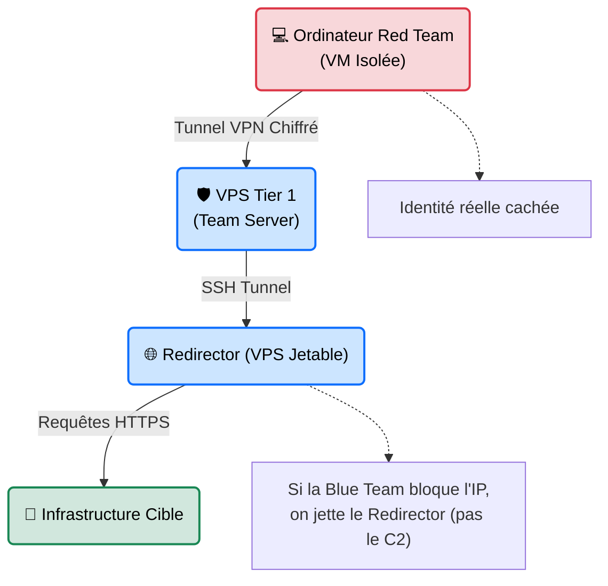

---
description: "OpSec & Anonymisation — Les règles fondamentales de sécurité opérationnelle pour mener un audit offensif sans compromettre sa propre identité ou celle du client."
icon: lucide/book-open-check
tags: ["RED TEAM", "OPSEC", "ANONYMISATION", "FURTIVITE", "METHODOLOGIE"]
---

# OpSec & Anonymisation

## Introduction

!!! quote "Analogie pédagogique — L'Empreinte dans la Neige"
    Imaginez un cambrioleur de génie, capable d'ouvrir la porte la plus blindée du monde en quelques secondes. Il accomplit le vol parfait. Le problème ? Il est venu avec sa propre voiture, garée devant la caméra, et a laissé la carte de visite de son entreprise sur le bureau.
    C'est ce qui arrive à un pentester brillant qui n'a pas d'**OpSec** (Security Operations). L'OpSec, c'est l'art de contrôler l'information. C'est s'assurer qu'au moment où l'on pénètre la forteresse ennemie (le réseau cible), on ne laisse aucune trace numérique qui pourrait nous relier, nous, ou nos propres outils, à l'attaque. C'est marcher dans la neige sans laisser la moindre empreinte.

La **Sécurité Opérationnelle (OpSec)** est l'ensemble des mesures prises par la Red Team pour protéger ses propres opérations. Une mauvaise OpSec peut ruiner des mois de préparation en révélant l'infrastructure de contrôle (C2) à la Blue Team, ou pire, en exposant les données confidentielles volées au client sur des réseaux publics non sécurisés.

 

---

## Architecture du Concept (Le Pare-Feu Red Team)

Une infrastructure d'attaque professionnelle ne se connecte jamais directement de l'ordinateur portable du pentester à la cible. Elle passe toujours par un réseau d'anonymisation et des serveurs relais jetables (Redirectors).

 

---

## Intégration Opérationnelle (Les Outils de l'Ombre)

L'OpSec dicte l'architecture de la chaîne d'attaque :

1. **Isolation (Machines Virtuelles)** ➔ Ne piratez jamais avec votre machine hôte (Windows/Mac). Utilisez toujours des VMs (Kali, ParrotOS, Whonix) avec un réseau isolé (NAT/Host-Only). Si un malware se retourne contre vous (Reverse Hack), seul le bac à sable est touché.
2. **Anonymisation du Trafic (VPN / Tor)** ➔ Tout le trafic sortant de la VM doit passer par une passerelle sécurisée (ex: *Whonix Gateway* routant tout dans Tor, ou un VPN "No-Log" dédié à la mission).
3. **Infrastructure Jetable (Cloud/VPS)** ➔ L'infrastructure d'attaque (Serveur Phishing, Serveur C2) est hébergée sur des VPS anonymes achetés avec de la crypto-monnaie. Les noms de domaine utilisés (ex: `support-microsoft-update.com`) sont enregistrés avec des informations WHOIS masquées (Privacy Guard).
4. **Nettoyage des Outils (Obfuscation)** ➔ Les scripts et binaires utilisés (payloads) sont recompilés et débarrassés de leurs métadonnées (nom du développeur, chemin des dossiers locaux) avant d'être envoyés chez le client.

 

---

## Le Workflow Idéal (Le Standard Furtivité)

1. **Sanitisation Initiale** : Suppression des noms d'utilisateurs par défaut dans les scripts. Vérification qu'aucune requête DNS ne fuite en dehors du tunnel VPN de la Red Team (DNS Leak Test).
2. **Déploiement Compartimenté** : On crée l'architecture (C2 ➔ Redirector ➔ Cible).
3. **Le Test du "Bruit"** : Avant d'attaquer la cible, la Red Team attaque son propre serveur de test pour voir quelles traces elle laisse dans les logs (IP, User-Agents de ses outils).
4. **Exécution Furtive** : On évite de lancer un Nmap agressif à 14h00 depuis la même IP qui héberge notre serveur de Command & Control (Règle d'Or : Séparer l'infrastructure de reconnaissance de l'infrastructure de C2).
5. **Nettoyage (Clean-up)** : À la fin de la mission, suppression sécurisée (Wipe) de tous les VPS, de toutes les portes dérobées (Webshells) laissées chez le client, et destruction des logs du proxy.

 

---

## Bonnes & Mauvaises Pratiques (OpSec Fails)

L'histoire regorge de hackers brillants tombés pour des erreurs de débutants.

| Action | Recommandation | Explication opérationnelle |
|---|---|---|
| ✅ **À FAIRE** | **Utiliser des User-Agents classiques** | Modifiez vos scripts (Python, Go) pour qu'ils s'annoncent comme `Mozilla/5.0 (Windows NT 10.0...)` plutôt que `python-requests/2.25`. |
| ✅ **À FAIRE** | **Chiffrer les disques durs** | Tous les ordinateurs et VPS de l'équipe Red Team doivent utiliser un chiffrement de disque entier (LUKS/BitLocker). En cas de saisie, les données du client sont protégées. |
| ❌ **À NE PAS FAIRE** | **Tester son malware sur VirusTotal** | Si vous uploadez votre virus sur VirusTotal pour voir s'il est détecté, VirusTotal le partagera instantanément avec tous les antivirus du monde (Blue Team). Votre malware est "brûlé" en 5 minutes. |
| ❌ **À NE PAS FAIRE** | **Se connecter à ses comptes personnels** | Ne consultez JAMAIS votre Facebook ou votre boîte mail personnelle depuis l'ordinateur/IP qui sert à l'attaque. La corrélation temporelle des IP est fatale. |

 

---

## Avertissement Légal & Éthique

!!! danger "Anonymat, Droit et Confidentiel Défense"
    Si l'utilisation de VPN, de Tor et de pseudonymes est légale, **l'objectif de l'OpSec** dicte la ligne de démarcation entre l'audit professionnel et la criminalité :

    1. **Protection des données du client** : C'est une obligation contractuelle. Si vous vous faites pirater votre machine d'attaque et que les données bancaires du client fuitent parce que vous n'aviez pas chiffré votre disque, **vous êtes responsable civilement (négligence)** et vous ferez face à des sanctions RGPD.
    2. **Le Blanchiment d'Infrastructure** : En Red Team "White Hat", votre commanditaire (le DSI) DOIT pouvoir vérifier que l'attaque venait bien de vous (vous lui donnez une "White List" de vos adresses IP à la fin). 
    3. **Obstruction à la justice** : Si une autorité judiciaire demande l'accès à vos serveurs dans le cadre d'une enquête légitime, l'effacement volontaire de preuves (Wiping) après saisie constitue une **entrave à l'action de la justice**, punie de **3 ans d'emprisonnement et 45 000 € d'amende** (Article 434-4 du Code pénal).

 

---

## Conclusion

!!! quote "Ce qu'il faut retenir"
    L'OpSec est la seule chose qui sépare un professionnel d'un amateur bruyant. C'est un état d'esprit paranoïaque et méthodique qui doit infuser chaque clic, chaque commande et chaque architecture serveur de l'auditeur. Si la cryptographie sécurise le message, l'OpSec sécurise le messager.

> Maintenant que vous savez opérer dans l'ombre au niveau réseau, apprenez à cacher vos données et vos canaux de communication à la vue de tous (au sein même d'images ou de fichiers normaux) grâce à la **[Stéganographie →](./steganographie.md)**.

