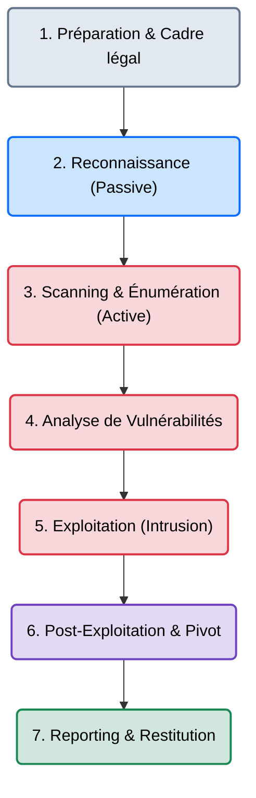

# Les Phases d'un Pentest

    

{: style="width: 100px; display: block; margin: 0 auto;" }

## Introduction

!!! quote "Analogie pédagogique — Le Casse de la Banque"
    Un test d'intrusion (Pentest) n'est pas un acte de vandalisme aléatoire. C'est un casse de banque planifié par des professionnels. On ne commence pas par percer le coffre. On commence par observer les caméras depuis la rue (**Reconnaissance**), on teste discrètement les badges des employés (**Énumération**), on trouve un défaut de fabrication dans le système d'alarme (**Analyse**), on le désactive pour s'introduire (**Exploitation**), et une fois dans la banque, on cherche les clés de la chambre forte principale (**Post-Exploitation**). Enfin, on remet au directeur une liste de tout ce qu'il doit réparer pour éviter un vrai braquage (**Reporting**).

La réalisation d'un audit de sécurité offensif suit une méthodologie rigoureuse, mondialement reconnue (inspirée de la PTES - *Penetration Testing Execution Standard*). Sauter une étape, c'est risquer de passer à côté d'une faille critique (faux négatif) ou de casser l'infrastructure du client en utilisant un outil au mauvais moment.

 

---

## Architecture du Cycle de Vie

Un engagement Red Team ou Pentest est un pipeline linéaire où la sortie de la phase `N` alimente toujours l'entrée de la phase `N+1`.

 

---

## Intégration Opérationnelle (Quels outils pour quelle phase ?)

La méthodologie dicte l'outil, et non l'inverse. Voici comment les outils du marché s'insèrent dans ce cycle de vie :

1. **Reconnaissance (OSINT)** ➔ `Amass`, `SpiderFoot`, `Shodan`. Objectif : Trouver les actifs (IPs, Domaines, Employés) sans toucher la cible.
2. **Scanning & Énumération** ➔ `Nmap`, `ffuf`, `Gobuster`. Objectif : Interagir avec les actifs trouvés pour découvrir les ports ouverts et les dossiers web cachés.
3. **Analyse de Vulnérabilités** ➔ `Nuclei`, `Nessus`. Objectif : Vérifier si les services découverts à l'étape 2 sont connus pour être faillibles (CVE).
4. **Exploitation** ➔ `Metasploit`, `SQLmap`, ou Exploits Python sur-mesure. Objectif : Tirer parti de la faille pour obtenir un accès initial (Shell).
5. **Post-Exploitation** ➔ `Cobalt Strike`, `BloodHound`, `Mimikatz`. Objectif : Élever ses privilèges (devenir Administrateur), voler des mots de passe et se propager dans le réseau interne.

 

---

## Les 3 Types d'Engagements (Boîtes)

Le cadre du pentest détermine la quantité d'informations dont vous disposez avant de démarrer.

| Type | Connaissance de la cible initiale | Réalisme / Objectif |
|---|---|---|
| **Black Box** (Boîte Noire) | Aucune information (juste le nom de l'entreprise). | Simule un attaquant externe réel (Ransomware). Focus sur les phases 1 et 2. |
| **Grey Box** (Boîte Grise) | Accès utilisateur standard fourni (compte client). | Simule un employé mécontent ou un compte piraté. Le plus courant en entreprise. |
| **White Box** (Boîte Blanche) | Accès total (code source, schémas d'architecture). | Audit de sécurité profond et exhaustif. Maximum de ROI pour le client. |

 

---

## Le Workflow Idéal (Le Standard Professionnel)

1. **Le Cadrage (Kick-off)** : Avant de lancer le moindre script, le Pentester et le DSI de l'entreprise ciblée se réunissent pour définir le **Périmètre** (Quelles IPs sont autorisées ?).
2. **La Signature (Autorisation d'intrusion)** : Sans ce document signé, le pentest est un acte de piratage illégal.
3. **L'Exécution (Phase 2 à 6)** : Déroulement technique de l'audit en respectant les horaires convenus (ex: *ne pas faire de tests de déni de service la journée*).
4. **La Restitution (Phase 7)** : Rédaction d'un rapport contenant un "Executive Summary" pour la direction (impact business) et des "Fiches Techniques" pour les développeurs (comment corriger la faille).

 

---

## Bonnes & Mauvaises Pratiques (Do's & Don'ts)

| Action | Recommandation | Explication métier |
|---|---|---|
| ✅ **À FAIRE** | **Prendre des notes en continu** | Une capture d'écran d'une faille au moment T est la seule preuve que vous pourrez mettre dans votre rapport final. Documentez tout. |
| ✅ **À FAIRE** | **Communiquer avec la Blue Team** | Si vous faites crasher un serveur de production par erreur lors de la phase d'exploitation, prévenez immédiatement le client. |
| ❌ **À NE PAS FAIRE** | **Sauter l'énumération** | Si vous lancez *Metasploit* avant d'avoir parfaitement énuméré tous les ports avec *Nmap*, vous ferez beaucoup de bruit pour rien et raterez la faille la plus évidente. |
| ❌ **À NE PAS FAIRE** | **Déborder du périmètre (Scope)** | Si le client a autorisé le test sur `app.cible.com` mais pas sur `db.cible.com`, toucher à la base de données est une rupture de contrat. |

 

---

## Avertissement Légal & Éthique

!!! danger "Cadre Pénal — Le Mandat d'Intrusion"
    Un test d'intrusion est, par définition, la commission d'actes qui seraient pénalement répréhensibles sans l'accord de la victime.
    
    Toutes les actions réalisées de l'étape 3 (Scanning) à 6 (Post-Exploitation) constituent un **accès ou maintien frauduleux dans un STAD (Système de Traitement Automatisé de Données)**, réprimé par l'**Article 323-1 du Code pénal** (jusqu'à 7 ans de prison).

    **L'Autorisation d'Intrusion** (aussi appelée *Mandat de Pentest* ou *Rules of Engagement*) est le seul document juridique qui vous protège. Ce document doit obligatoirement inclure :
    1. L'identité des auditeurs.
    2. La liste exhaustive des cibles (Adresses IP, Domaines).
    3. Les dates et horaires de validité de l'audit.
    4. La signature du représentant légal de l'entreprise ciblée.

    *Ne lancez jamais de Nmap sur Internet sans ce document pour la cible concernée.*

 

---

## Conclusion

!!! quote "Ce qu'il faut retenir"
    La technique brute ne vaut rien sans la méthodologie. Un auditeur qui trouve une faille "par chance" n'est pas un professionnel. L'auditeur Red Team de haut niveau est celui qui peut garantir au client qu'après son passage, la totalité de la surface d'attaque a été testée de manière exhaustive, reproductible, et documentée.

> Maintenant que le cycle de vie est clair, découvrez le langage universel utilisé pour nommer les attaques découvertes lors de l'audit avec le **[Framework MITRE ATT&CK →](./mitre-attack.md)**.

