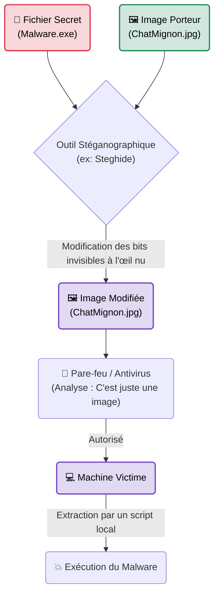

# Stéganographie & Obfuscation

    

{: style="width: 100px; display: block; margin: 0 auto;" }

## Introduction

!!! quote "Analogie pédagogique — L'Encre Invisible"
    La Cryptographie, c'est écrire un message secret dans une boîte verrouillée avec un cadenas inviolable. Tout le monde voit la boîte, tout le monde sait que c'est un secret, mais personne ne peut l'ouvrir.
    La **Stéganographie**, c'est utiliser de l'encre invisible pour écrire ce secret au dos d'une carte postale tout à fait banale que vous envoyez par la Poste. Le facteur la lit, le douanier la regarde, mais personne ne sait même qu'il y a un secret à l'intérieur. La cryptographie cache le *contenu*, la stéganographie cache *l'existence même* du message.

La **Stéganographie** est une technique millénaire (du grec *steganos* : caché). En cybersécurité, elle consiste à dissimuler un fichier (Payload, mot de passe, ou code malveillant) à l'intérieur d'un autre fichier inoffensif (appelé *Carrier* ou Porteur), comme une image JPEG, une vidéo MP4 ou un fichier audio WAV. C'est l'arme ultime pour contourner les antivirus (Evasion) et faire de l'exfiltration de données (Data Leakage) indétectable.

 

---

## Architecture du Concept (Modification LSB)

La méthode la plus courante (particulièrement sur les images BMP ou PNG) est la modification du bit de poids faible (**LSB - Least Significant Bit**).

 

---

## Intégration Opérationnelle (L'Arsenal Red Team)

En attaque, on ne fait pas de la stéganographie pour "jouer à l'espion", on la fait pour répondre à des problèmes opérationnels stricts :

1. **Livraison du Payload (Phishing)** ➔ Envoyer un `.exe` par email est bloqué par tous les filtres anti-spam. Envoyer un `.jpg` d'une fausse facture contenant le code caché passe souvent inaperçu. Un script PowerShell macro téléchargera l'image, en extraira le code, et l'exécutera en mémoire (sans toucher le disque dur).
2. **Exfiltration de Données** ➔ Comment voler les plans secrets du client si son réseau bloque les transferts FTP et Dropbox ? On compresse les plans, on les cache dans les photos de profil Twitter ou Instagram des faux employés créés par l'attaquant.
3. **Command & Control (C2) Furtif** ➔ Le serveur de l'attaquant ne donne pas des ordres clairs (ex: "Exécute `whoami`"). Le serveur met à jour une image sur un blog WordPress anodin. Le malware infecté télécharge cette image chaque jour et lit les ordres cachés dans les pixels.

 

---

## Le Workflow Idéal (Exfiltration)

Voici comment une Red Team exfiltre un petit volume de données très critiques via stéganographie :

1. **Compression & Chiffrement** : Le fichier "mots_de_passe_admin.txt" est compressé en ZIP, puis chiffré en AES-256 avec un mot de passe très fort.
2. **Insertion (Embedding)** : On utilise un outil comme *Steghide* ou *OutGuess* pour intégrer ce fichier chiffré dans le code hexadécimal d'une photo d'entreprise officielle (ex: logo.jpg) de haute résolution.
3. **Exfiltration (Smuggling)** : L'attaquant envoie l'image "logo.jpg" en pièce jointe à une adresse email externe, ou la poste sur un compte GitHub public appartenant à l'attaquant.
4. **Extraction** : Le DLP (Data Loss Prevention) de l'entreprise a vu passer une simple image inoffensive. L'attaquant chez lui télécharge l'image, applique la commande d'extraction avec son mot de passe, et récupère les données.

 

---

## Bonnes & Mauvaises Pratiques (Do's & Don'ts)

| Action | Recommandation | Explication métier |
|---|---|---|
| ✅ **À FAIRE** | **Chiffrer AVANT de cacher** | La stéganographie n'est pas du chiffrement. Si un analyste Forensic trouve l'image et l'extrait, il verra votre code. Chiffrez d'abord, cachez ensuite. |
| ✅ **À FAIRE** | **Utiliser de grandes images compressées sans perte (PNG/BMP)** | Plus l'image ("Carrier") est grosse, plus vous pouvez cacher de données sans dégrader visuellement l'image (ce qui la rendrait suspecte). |
| ❌ **À NE PAS FAIRE** | **Uploader sur Facebook / WhatsApp** | Les réseaux sociaux grand public re-compressent violemment les images uploadees pour gagner de la place sur leurs serveurs. Cette compression détruit les pixels modifiés (LSB) : votre code caché sera effacé. |
| ❌ **À NE PAS FAIRE** | **Augmenter la taille du fichier d'origine** | Cacher un `.exe` de 5 Mo dans un fichier `.jpg` de 500 Ko créera une "image" de 5.5 Mo... ce qui est immédiatement suspect pour n'importe quel analyste sécurité (Blue Team). |

 

---

## Avertissement Légal & Éthique

!!! danger "Vol de Propriété Intellectuelle & Cadre Pénal"
    La stéganographie en elle-même est une science informatique légale. Cependant, son utilisation en entreprise touche souvent à la qualification **d'exfiltration de données**.

    En droit pénal français :
    - Si vous copiez des données appartenant à l'entreprise pour les faire sortir du réseau d'une manière non autorisée (même pendant un audit sans mandat spécifique sur la fuite d'informations), vous commettez un **Vol de données** (Article 311-1 du Code pénal).
    - L'utilisation de moyens cryptographiques (et par extension de dissimulation algorithmique) pour préparer un délit constitue une circonstance aggravante. 

    *Ne testez jamais l'exfiltration de données réelles (Base de données clients, Code source) via stéganographie. Utilisez toujours des données factices (Dummy files) générées pour l'exercice.*

 

---

## Conclusion

!!! quote "Ce qu'il faut retenir"
    La stéganographie est le summum de l'OpSec (Sécurité Opérationnelle). Là où les malwares normaux jouent à "chat" avec les Antivirus (Evasion classique), la stéganographie refuse de jouer : elle se promène devant les gardes déguisée en tapisserie. C'est la méthode de choix des APT (Advanced Persistent Threats) étatiques pour infiltrer et exfiltrer sans bruit.

> Comment orchestrer ces communications cachées à grande échelle pour piloter des centaines de machines infectées ? C'est le rôle des infrastructures avancées détaillées dans **[C2 (Command & Control) Frameworks →](./c2-frameworks.md)**.

 

---

## Conclusion

!!! quote "Ce qu'il faut retenir"
    La maîtrise théorique et pratique de ces concepts est indispensable pour consolider votre posture de cybersécurité. L'évolution constante des menaces exige une veille technique régulière et une remise en question permanente des acquis.

> [Retour à l'index →](./index.md)
