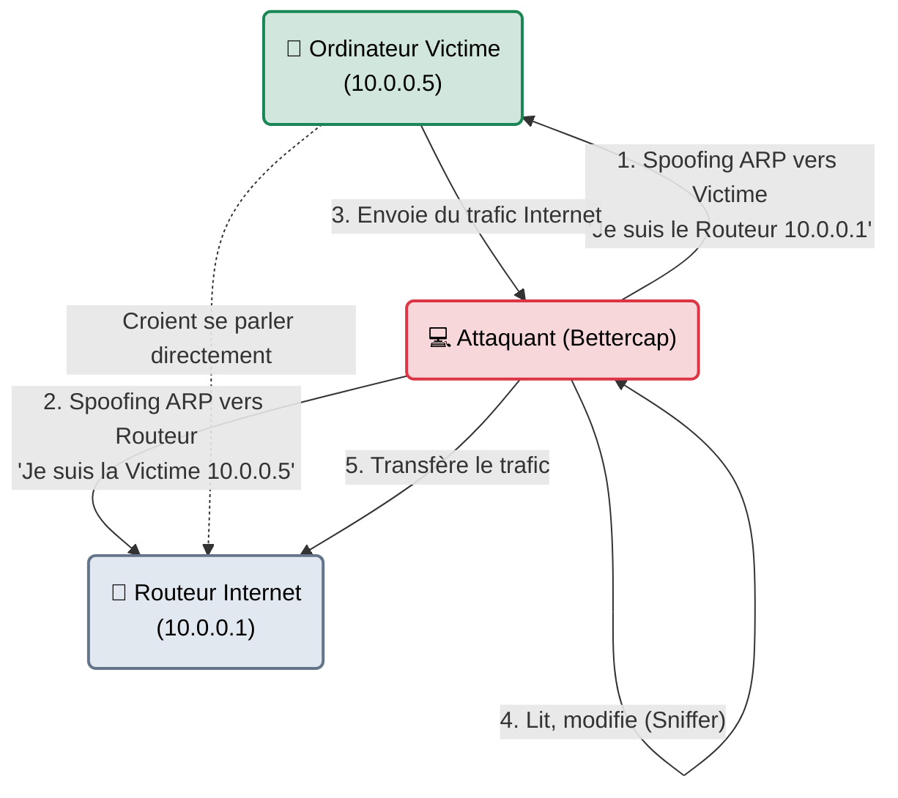

---
description: "Bettercap — Le couteau suisse moderne pour les attaques Man-in-the-Middle (MITM). Remplace le vénérable Ettercap pour l'interception et l'altération du trafic réseau."
icon: lucide/book-open-check
tags: ["RED TEAM", "RESEAU", "MITM", "BETTERCAP", "SPOOFING"]
---

# Bettercap — Le Faux Aiguilleur

<div
  class="omny-meta"
  data-level="🟡 Intermédiaire"
  data-version="2.0+ (Go)"
  data-time="~20 minutes">
</div>


## Introduction

!!! quote "Analogie pédagogique — L'Aiguilleur de Train Malveillant"
    Imaginez un train qui doit aller de Paris à Lyon. Le conducteur a une carte. Mais l'attaquant arrive au poste d'aiguillage et modifie tous les panneaux : il indique "Lyon, par ici" à la gare de Paris, et "Paris, par ici" à la gare de Lyon. 
    L'attaquant se place au milieu. Le train de Paris arrive chez lui, l'attaquant ouvre le courrier, le lit, le modifie peut-être, puis renvoie le train vers le vrai Lyon. Personne ne s'est rendu compte du détour.
    **Bettercap** est l'outil parfait pour modifier les panneaux de signalisation du réseau (ARP Spoofing) et se placer au centre de toutes les communications d'une entreprise.

Écrit en Go (très rapide), **Bettercap** est le successeur spirituel d'Ettercap. C'est l'outil de référence pour exécuter des attaques de type "Man-in-the-Middle" (L'Homme du Milieu) sur un réseau local (LAN) ou sans-fil (WiFi/Bluetooth). Il permet d'intercepter les mots de passe non chiffrés, de modifier des pages web à la volée, ou de rediriger le trafic DNS.

<br>

---

## Fonctionnement & Architecture (Le Poison ARP)

Sur un réseau local, les ordinateurs se trouvent grâce à leur adresse MAC (Couche 2), pas leur adresse IP. L'attaque principale de Bettercap (ARP Spoofing) consiste à inonder le réseau de faux messages ARP.



<br>

---

## Cas d'usage & Complémentarité

Bettercap est principalement utilisé lors de la phase de **Reconnaissance Interne** une fois que l'attaquant est branché sur une prise réseau dans les locaux de l'entreprise.

1. **Vol d'identifiants clairs** : Si des employés utilisent encore de vieux protocoles (FTP, Telnet, HTTP sans SSL), Bettercap extraira les mots de passe à la volée.
2. **Contournement HSTS (SSL Stripping)** : Bettercap tente de forcer les navigateurs des victimes à abandonner le HTTPS sécurisé pour repasser sur du vieux HTTP non chiffré afin de pouvoir lire les mots de passe.
3. **Caplets (Automatisation)** : Bettercap supporte un système de scripts (les *Caplets*) permettant de configurer des attaques extrêmement complexes en un fichier texte.

<br>

---

## Les Options Principales (Mode Interactif)

Bettercap se lance généralement sans options complexes (`sudo bettercap -iface eth0`), et tout se gère ensuite dans son interface interactive.

| Module Interne | Fonction | Description approfondie |
| :--- | :--- | :--- |
| `net.probe` | **Découverte** | Envoie des requêtes réseau douces (UDP/TCP/ARP) pour identifier toutes les machines autour de vous. |
| `arp.spoof` | **L'Attaque MITM** | Active l'usurpation ARP. Les cibles vous enverront tout leur trafic. |
| `net.sniff` | **Le Mouchard** | Analyse le trafic intercepté par `arp.spoof` pour y trouver des mots de passe (FTP, HTTP) ou des données intéressantes. |
| `http.proxy` | **Injection Web** | Intercepte les pages HTTP demandées par la victime et permet d'y injecter un script malveillant (ex: un faux popup de mise à jour Windows). |

<br>

---

## Installation & Configuration

Installé par défaut sur Kali Linux. Si absent, il se récupère via apt.

```bash title="Installation sous Kali Linux"
sudo apt update && sudo apt install bettercap
```

<br>

---

## Le Workflow Idéal (L'Attaque MITM Classique)

Voici comment un auditeur intercepte le trafic d'un poste Windows situé sur le même réseau (ex: Poste de la secrétaire, IP: `10.0.0.5`).

### 1. Lancement et Découverte
```bash title="Lancer Bettercap sur la carte réseau ethernet"
sudo bettercap -iface eth0
```
Dans l'interface `10.0.0.0/24 > `, on active la découverte.
```text
> net.probe on
# Bettercap affiche la liste de toutes les adresses IP et MAC du réseau.
```

### 2. Ciblage
Par défaut, Bettercap attaquera *tout* le réseau. C'est dangereux. On configure l'outil pour n'attaquer que le poste de la secrétaire (`10.0.0.5`).
```text
> set arp.spoof.targets 10.0.0.5
```

### 3. Empoisonnement et Sniffing
On lance l'usurpation (Spoofing) et on active le mouchard pour lire les données.
```text
> arp.spoof on
> net.sniff on
```
*Le terminal va commencer à faire défiler toutes les requêtes DNS, les visites web et les mots de passe interceptés de la secrétaire.*

<br>

---

## Bonnes & Mauvaises Pratiques (Do's & Don'ts)

| Action | Recommandation | Explication métier |
|---|---|---|
| ✅ **À FAIRE** | **Activer `arp.spoof.fullduplex`** | Par défaut, Bettercap ne trompe que la victime. Pour un vrai MITM, vous devez aussi tromper le routeur (Full-duplex) pour qu'il vous renvoie les réponses destinées à la victime. Tapez `set arp.spoof.fullduplex true`. |
| ❌ **À NE PAS FAIRE** | **Spoofer tout le réseau complet** | Si vous lancez `arp.spoof on` sans définir de cible (`targets`), vous vous déclarez comme étant le Routeur Principal pour les 254 machines de l'entreprise. Votre petit PC portable ne pourra jamais router tout ce trafic. Résultat : **Coupure totale d'Internet pour toute l'entreprise** (Déni de Service). |

<br>

---

## Avertissement Légal & Éthique

!!! danger "Violation du Secret des Correspondances et Interception"
    L'attaque Man-in-the-Middle est l'une des techniques les plus sévèrement punies par le droit pénal car elle touche à la vie privée.
    
    1. **Atteinte au secret (Art 226-15)** : Intercepter et lire les communications privées ou professionnelles (les mails, les mots de passe) d'un employé qui croit être sur un réseau chiffré est un délit grave.
    2. **Modification de données (Art 323-3)** : Si vous utilisez `http.proxy` pour modifier à la volée ce que la victime voit sur son écran, vous entravez le fonctionnement normal du système.
    
    Le MITM ne doit être utilisé qu'avec l'accord explicite du client (Mandat écrit) et, si des données personnelles sont interceptées par erreur, elles doivent être détruites immédiatement (RGPD).

<br>

---

## Conclusion

!!! quote "Ce qu'il faut retenir"
    Aujourd'hui, l'écrasante majorité du Web est en HTTPS. Lire le contenu des messages via Bettercap est donc devenu très difficile (SSL Stripping obsolète face à HSTS). Cependant, Bettercap reste redoutable pour deux choses : comprendre précisément vers quels serveurs les machines internes tentent de communiquer, et rediriger ces requêtes vers des serveurs pirates.

> Bettercap force le trafic à passer par vous. Mais sur un réseau Microsoft Windows, il y a un outil encore plus pervers, qui *attend patiemment* qu'un ordinateur Windows pose une question, pour lui mentir et voler son mot de passe. C'est l'outil ultime de la Red Team : **[Responder →](./responder.md)**.


