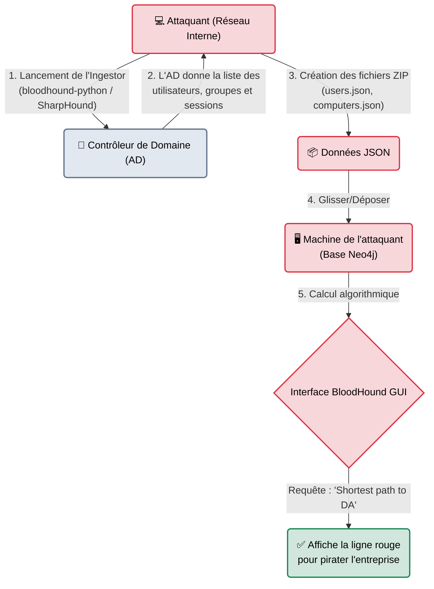

---
description: "BloodHound — L'outil de cartographie et d'analyse de graphes Active Directory. Révèle les chemins d'escalade de privilèges invisibles à l'œil nu."
icon: lucide/book-open-check
tags: ["RED TEAM", "ACTIVE DIRECTORY", "BLOODHOUND", "GRAPHE", "ESCALADE"]
---

# BloodHound — La Carte au Trésor

<div
  class="omny-meta"
  data-level="🟡 Intermédiaire"
  data-version="4.3+"
  data-time="~20 minutes">
</div>


## Introduction

!!! quote "Analogie pédagogique — Le GPS du Cambrioleur"
    Imaginez un labyrinthe géant d'un million de portes. Vous avez une clé qui ouvre 10 portes. Derrière ces 10 portes, vous trouvez 3 nouvelles clés. Ces 3 clés ouvrent 50 autres portes. Pour un humain, trouver quel enchaînement exact de portes ouvrir pour atteindre la "Salle des Coffres" (Le Contrôleur de Domaine) prendrait des mois d'exploration et de dessins sur un tableau blanc.
    **BloodHound** est le GPS du labyrinthe. Il demande à l'Active Directory la liste de TOUTES les serrures et de TOUTES les clés de l'entreprise (L'ingestion). Puis, il dessine une carte interactive et vous calcule en 2 secondes : *"Prends la porte de la secrétaire, vole la clé du stagiaire IT, ouvre le serveur d'archives, et tu auras la clé du boss"*.

Conçu par SpectreOps, **BloodHound** a changé la face du pentest mondial. En exploitant la théorie des graphes (la base de données Neo4j), il met en évidence des "Chemins d'attaque" (Attack Paths) et des relations de confiance qui sont mathématiquement impossibles à voir pour un administrateur système qui regarde de simples listes Excel ou des consoles d'administration Windows classiques.

<br>

---

## Fonctionnement & Architecture (Ingestion & Graphe)

BloodHound fonctionne obligatoirement en deux parties. Une partie **Ingestion** (La récolte des données sur le réseau cible) et une partie **Analyse** (Le logiciel graphique sur la machine de l'attaquant).



<br>

---

## Cas d'usage & Complémentarité

BloodHound ne "pirate" rien et n'exploite aucune faille de sécurité. Il ne fait qu'analyser les erreurs de conception et d'administration ("Misconfigurations").

1. **Trouver la chaîne de compromission** : Un utilisateur a les droits sur le compte d'un autre, qui lui-même est admin local d'un serveur, sur lequel se connecte parfois un Administrateur du Domaine. BloodHound met cette chaîne en évidence sous forme de "noeuds" reliés par des flèches.
2. **Post-Exploitation Stratégique** : Combiné avec *CrackMapExec* (NetExec) ou *Impacket*, l'attaquant sait EXACTEMENT quel mot de passe dumper ou sur quelle machine faire un mouvement latéral pour atteindre sa cible. L'attaque devient chirurgicale au lieu de faire du bruit partout.

<br>

---

## Les Composants (Les Ingestors)

La collecte des données est la phase la plus critique. Elle se fait via des "Ingestors". Il faut avoir au minimum le compte d'un "Simple Employé" du domaine pour avoir le droit de lancer l'ingestor (c'est le comportement standard d'un annuaire LDAP : tout employé a le droit de lire le registre).

| Ingestor | Utilisateur visé | Description approfondie |
| :--- | :--- | :--- |
| `SharpHound.exe` | **Poste Windows Cible** | Développé en C#. L'attaquant l'exécute sur le poste d'un employé infecté. Très rapide, mais fortement surveillé par les antivirus. |
| `bloodhound-python` | **Machine Linux Attaquant** | L'attaquant se connecte depuis son propre Kali Linux via le réseau. C'est plus silencieux (Fileless du côté Windows), mais nécessite que l'attaquant connaisse le mot de passe de l'employé. |
| `Neo4j` | **Machine Attaquant** | Le moteur de base de données graphique sous-jacent qui stocke tous les nœuds de la carte. |

<br>

---

## Installation & Configuration

BloodHound GUI est un logiciel graphique lourd (Electron). Il s'installe localement sur votre machine (Kali).

```bash title="Installation de l'Interface et de la Base de données"
sudo apt update
sudo apt install bloodhound neo4j bloodhound.py
```

<br>

---

## Le Workflow Idéal (De la collecte à la Carte)

### 1. La Collecte des Données (L'Ingestion)
L'attaquant a récupéré le mot de passe du stagiaire "t.martin" (`MotDePasse!123`). Il lance l'ingestor Python depuis sa propre machine sans rien installer chez le client.
```bash title="Extraction des données depuis l'AD"
bloodhound-python -u 't.martin' -p 'MotDePasse!123' -ns 10.0.0.2 -d CORP.LOCAL -c All
```
*Le script va poser des dizaines de milliers de requêtes LDAP au serveur `10.0.0.2`. Il va générer des fichiers JSON compressés dans le dossier courant.*

### 2. Démarrage de la Base de Données
Dans un nouveau terminal, on allume le "moteur" mathématique.
```bash title="Démarrer Neo4j"
sudo neo4j start
# Lors du premier lancement, rendez-vous sur http://localhost:7474 pour définir un mot de passe Neo4j.
```

### 3. L'Analyse (La Carte au Trésor)
Lancez l'interface graphique en tapant `bloodhound`.
1. Connectez-vous avec vos identifiants Neo4j.
2. Un grand écran noir s'ouvre. Faites un **Glisser-Déposer** de tous les fichiers JSON créés à l'étape 1 dans la fenêtre BloodHound. Le logiciel va "ingérer" et analyser le réseau.
3. Allez dans l'onglet "Analysis" (Les questions pré-programmées) et cliquez sur le graal du pentester :
   👉 **`Find Shortest Paths to Domain Admins`**

Une carte se dessine sous vos yeux. Chaque flèche correspond à une action ("HasSession", "MemberOf", "AdminTo"). Il ne reste plus qu'à appliquer la recette.

<br>

---

## Bonnes & Mauvaises Pratiques (Do's & Don'ts)

| Action | Recommandation | Explication métier |
|---|---|---|
| ✅ **À FAIRE** | **Marquer le nœud de départ** | L'option "Shortest Path" par défaut est souvent une fausse joie (elle suppose que vous contrôlez des utilisateurs clés). Indiquez à BloodHound votre point de départ réel (Clic droit sur "t.martin" -> `Mark User as Owned`) pour qu'il calcule la route *depuis votre position*. |
| ❌ **À NE PAS FAIRE** | **Lancer un `SharpHound -c All` en pleine journée** | La requête "All" inclut l'énumération des Sessions. SharpHound va envoyer une requête SMB à **tous les ordinateurs de l'entreprise en même temps**. Sur un grand réseau, le SOC (Security Operations Center) détectera instantanément cette activité de "Network Sweeping" et bloquera le compte compromis. |

<br>

---

## Avertissement Légal & Éthique

!!! danger "Cartographie et Vol de Topologie"
    BloodHound navigue dans une zone sensible de l'audit interne :
    
    1. **Requêtes Légitimes, Usage Détourné** : Interroger un contrôleur de domaine (LDAP) pour connaître la liste des groupes est le droit de n'importe quel employé Windows authentifié. L'AD répond d'ailleurs de son plein gré.
    2. **Le Déclencheur Juridique** : Ce n'est pas la collecte qui est pénalement répréhensible, c'est l'usage du compte "t.martin". Si ce compte a été obtenu frauduleusement (via Responder ou Phishing), l'utilisation même de BloodHound constitue le "Maintien frauduleux dans un STAD" (Art. 323-1).
    
    *Cependant, pour les Blue Teams, BloodHound est un outil purement défensif, légal et très puissant, pour trouver les failles de leur propre réseau et les réparer.*

<br>

---

## Conclusion

!!! quote "Ce qu'il faut retenir"
    BloodHound a révolutionné l'approche de la sécurité réseau en introduisant la devise de John Lambert (Microsoft) : *"Les défenseurs pensent en listes, les attaquants pensent en graphes"*. Le logiciel a prouvé que même si l'entreprise a les meilleurs mots de passe du monde et des serveurs ultra-sécurisés, si les droits d'accès s'entremêlent, il y a mathématiquement toujours une route qui mène aux clés du royaume.

> **Bravo !** Vous maîtrisez maintenant l'arsenal d'exploitation réseau. Du simple scan Nmap au graphique tridimensionnel de l'AD, en passant par le MITM, l'horizon des possibles s'ouvre à vous.
> Dans la section suivante (Étape 5), nous verrons les outils "Boîte Noire", qui ne font pas de chirurgie, mais scannent le réseau à la recherche de **Vulnérabilités logicielles** (CVE) connues.


