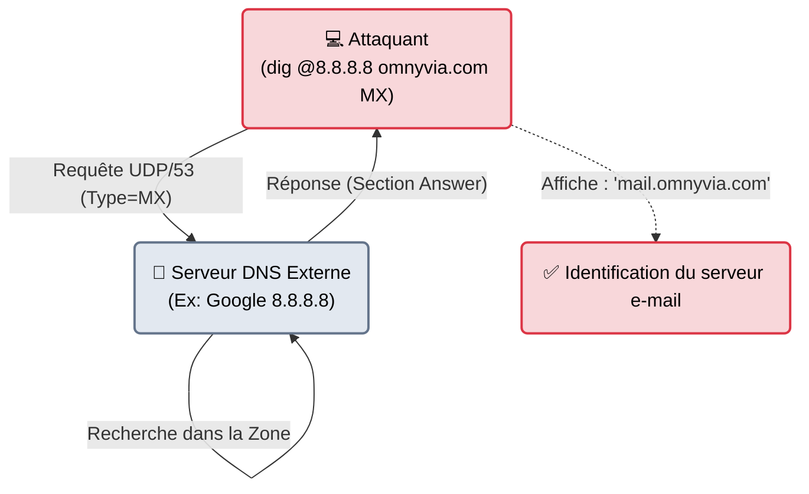

# dig — L'Interrogatoire DNS

<div
  class="omny-meta"
  data-level="🟡 Intermédiaire"
  data-version="BIND 9+"
  data-time="~15 minutes">
</div>

<div style="text-align: center; margin: 0 auto;">
    
</div>

## Introduction

!!! quote "Analogie pédagogique — L'Interrogatoire de Police"
    Demander à votre ordinateur d'aller sur "omnyvia.com", c'est comme demander le chemin dans la rue : on vous donne l'adresse finale et c'est tout.
    Mais quand vous utilisez **dig**, c'est comme placer le serveur des adresses (le Serveur DNS) dans une salle d'interrogatoire. Vous ne lui demandez pas juste l'adresse finale. Vous exigez de voir tout son carnet : *"Qui gère tes e-mails ? (MX)"*, *"Qui valide ta cryptographie ? (TXT)"*, *"À qui as-tu délégué la gestion de tes sous-domaines ? (NS)"*. Et **dig** vous fournit le rapport de l'interrogatoire avec chaque détail technique du protocole.

Faisant partie de la suite logicielle BIND (le standard d'Internet), **dig** a remplacé `nslookup` sous Linux comme outil officiel pour l'administration DNS. En Red Team, il est l'outil principal de la phase d'OSINT ou de cartographie pour comprendre comment le réseau cible est structuré (Quels serveurs mail attaquent-on ? Par quel WAF passe le trafic ?).

<br>

---

## Fonctionnement & Architecture (Les Champs DNS)

La puissance de `dig` vient de sa capacité à cibler un serveur DNS précis et à interroger des types de "champs" d'enregistrement spécifiques (A, AAAA, MX, TXT, NS...).



<br>

---

## Cas d'usage & Complémentarité

`dig` est vital au début d'un engagement pour dresser la carte externe de la cible.

1. **Recherche de faiblesses d'e-mails** : En interrogeant les champs `TXT`, l'attaquant vérifie si les protections anti-phishing (SPF, DKIM, DMARC) sont configurées. Si elles sont absentes, il sait qu'il pourra envoyer de faux e-mails (Social Engineering) au nom de l'entreprise.
2. **Identification des WAF (Pare-feux web)** : Si le champ `A` (l'IP du site web) pointe vers Cloudflare ou Akamai, l'attaquant sait immédiatement que le site web réel est protégé derrière un bouclier.

<br>

---

## Les Options Principales

`dig` est extrêmement verbeux par défaut. C'est pourquoi ses options (souvent précédées d'un `+`) servent principalement à formater sa sortie.

| Option | Fonction | Description approfondie |
| :--- | :--- | :--- |
| `@[Serveur]` | **Serveur Cible** | Pose la question à un DNS spécifique (ex: `@1.1.1.1`) au lieu d'utiliser le DNS fourni par votre fournisseur d'accès. |
| `[Type]` | **Type de Record** | Le champ voulu. Ex: `A` (IP v4), `AAAA` (IP v6), `MX` (Serveur Mail), `NS` (Serveur de noms), `TXT` (Texte), `ANY` (Tout). |
| `+short` | **Mode Scripting** | N'affiche **que** la réponse finale (l'IP ou le nom), supprime tout le rapport technique de BIND. Indispensable pour Bash. |
| `+trace` | **Résolution Complète** | Fait le travail d'un DNS récursif : part des serveurs Root d'Internet et descend la chaîne hiérarchique jusqu'à trouver l'IP. Très utile pour voir où un domaine "bloque". |

<br>

---

## Le Workflow Idéal (L'Analyse d'un Domaine)

Voici les commandes séquentielles pour extraire toute la configuration réseau d'une entreprise.

### 1. Où est hébergé le site web ? (Champ A)
```bash title="Recherche de l'IP du serveur web"
dig +short A omnyvia.com
# Résultat: 142.250.179.110
```

### 2. Où attaquer pour faire du Phishing ? (Champs MX & TXT)
On cherche les serveurs mails, et surtout on vérifie s'ils sont protégés contre l'usurpation (SPF).
```bash title="Récupération de la configuration Mail"
# 1. Trouver les serveurs qui gèrent les mails (ex: Office365, Google Workspace)
dig +short MX omnyvia.com

# 2. Lire les règles de sécurité cachées dans les champs texte
dig +short TXT omnyvia.com
# Résultat: "v=spf1 include:_spf.google.com ~all"
```

### 3. Comment faire du sous-domaine Takeover ? (Champ CNAME)
Parfois, un sous-domaine (`blog.entreprise.com`) pointe vers un service externe (`entreprise.wordpress.com`) via un champ CNAME (Alias). Si l'entreprise a supprimé son blog Wordpress mais oublié de supprimer l'Alias DNS, l'attaquant peut "racheter" le nom `entreprise.wordpress.com` et prendre le contrôle de `blog.entreprise.com`.
```bash title="Recherche d'Alias"
dig +short CNAME blog.omnyvia.com
```

<br>

---

## Bonnes & Mauvaises Pratiques (Do's & Don'ts)

| Action | Recommandation | Explication métier |
|---|---|---|
| ✅ **À FAIRE** | **Interroger le bon DNS** | Si vous voulez tester le DNS *interne* d'une entreprise, vous devez l'interroger directement (`dig @10.0.0.2 intra.corp`). Ne demandez pas l'adresse d'un serveur Intranet au DNS public de Google (`8.8.8.8`), il ne la connaîtra jamais. |
| ❌ **À NE PAS FAIRE** | **Utiliser `dig ANY` pour tout avoir d'un coup** | Autrefois, `dig ANY` ramenait toute la configuration d'un coup. Aujourd'hui, la plupart des gros hébergeurs (Cloudflare) le bloquent car cette commande a été utilisée pour des attaques par amplification (DDoS). Faites des requêtes séparées (A, MX, TXT). |

<br>

---

## Avertissement Légal & Éthique

!!! note "Une Pratique Publique (OSINT)"
    Interroger des serveurs DNS publics (ceux accessibles sur Internet) pour connaître la configuration d'un domaine est une activité d'OSINT (Reconnaissance en Source Ouverte) **totalement légale**.
    
    Les informations d'un DNS public sont faites pour être publiques (sinon, personne ne trouverait le site web). Extraire les IP, les serveurs MX ou les champs SPF ne constitue pas un accès frauduleux à un STAD (Art 323-1), tant que vous n'essayez pas de pirater le serveur DNS lui-même (via une faille Bind) ou de provoquer un Déni de Service (DDoS via DNS Amplification).

