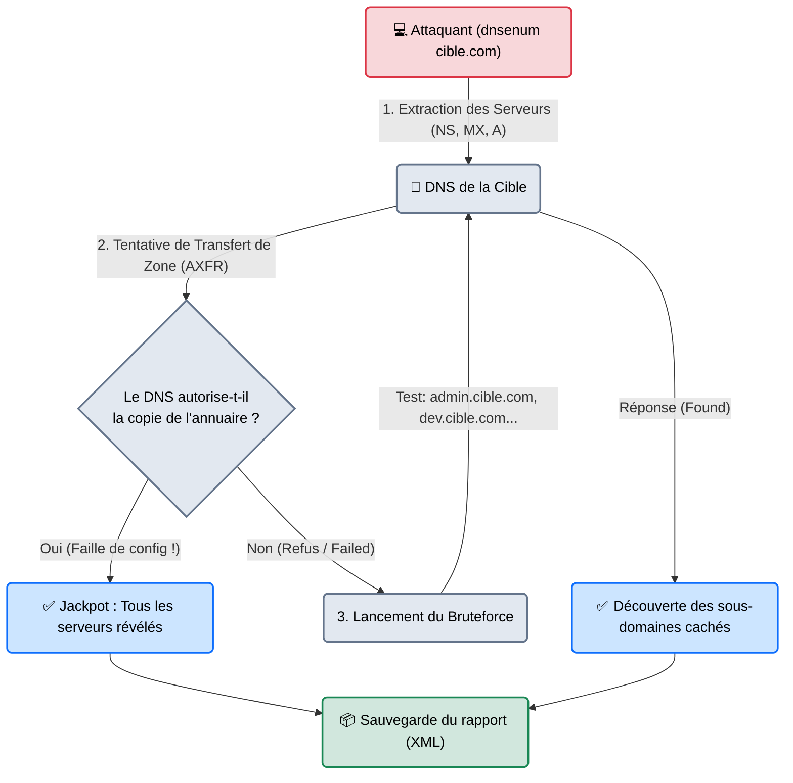

# Dnsenum — Le Cartographe Offensif

<div
  class="omny-meta"
  data-level="🟡 Intermédiaire"
  data-version="1.2.6+"
  data-time="~20 minutes">
</div>

<div style="text-align: center; margin: 0 auto;">
    
</div>

## Introduction

!!! quote "Analogie pédagogique — Le Cambriolage des Archives"
    `dig` ou `host` sont comme poser une question à l'accueil d'une entreprise : *"Avez-vous le numéro du serveur comptabilité ?"*. Si l'accueil dit non, vous devez deviner d'autres noms vous-même.
    **Dnsenum** (DNS Enumeration) n'est pas là pour poser une question. C'est un outil automatisé qui tape un grand coup sur le comptoir et demande la copie intégrale du registre des employés (Transfert de Zone). Si le standardiste refuse, l'outil ouvre un dictionnaire et récite 10 000 prénoms à la seconde (*"Avez-vous un serveur VPN ? Un serveur DEV ? Un serveur ADMIN ?"*) jusqu'à ce que l'accueil finisse par répondre "Oui" à certaines de ces suppositions (Bruteforce).

Contrairement à `dig` qui est un outil de diagnostic neutre, **dnsenum** est un outil purement offensif (développé en Perl). Il a été conçu pour automatiser toutes les techniques permettant de découvrir les sous-domaines cachés d'une cible, dans le but d'élargir la surface d'attaque. Il combine requêtes DNS standard, requêtes Google (Scraping), attaques de transfert de zone (AXFR) et bruteforce massif par dictionnaire.

<br>

---

## Fonctionnement & Architecture (Le Pipeline d'Énumération)

Dnsenum exécute un algorithme en entonnoir. Il essaie d'abord les méthodes les plus silencieuses et rentables, puis finit par le bruteforce bruyant.



<br>

---

## Cas d'usage & Complémentarité

Dnsenum fait le lien exact entre la phase d'OSINT et la phase de Scan Réseau actif (Nmap).

1. **Recherche de serveurs oubliés** : L'attaque par dictionnaire permet souvent de dénicher des serveurs comme `test.entreprise.com` ou `old-vpn.entreprise.com` qui ne sont liés nulle part sur le site principal, et qui sont souvent criblés de failles de sécurité non patchées.
2. **Transfert de Zone Interne** : Si une attaque AXFR réussit sur un DNS public, c'est rare. Mais si le pentester réussit à s'infiltrer dans le réseau de l'entreprise (Post-Exploitation) et lance Dnsenum sur le *Serveur Active Directory* interne, le transfert de zone réussit très souvent, fournissant instantanément la carte complète des imprimantes, postes et serveurs de la société.

<br>

---

## Les Options Principales

Dnsenum est très simple d'utilisation, mais ses paramètres contrôlent principalement le niveau d'agressivité de la force brute.

| Option | Fonction | Description approfondie |
| :--- | :--- | :--- |
| `--enum` | **Mode Raccourci** | L'équivalent de "Lancer tout avec les options par défaut" (Identique à ne rien mettre, juste le domaine). |
| `-f [fichier]` | **Fichier Dictionnaire** | Définit le fichier texte contenant les mots à tester (ex: `subdomains-top1mil.txt`). Si on ne précise rien, il utilise le dictionnaire Kali par défaut. |
| `--threads [nb]` | **Multithreading** | Le nombre de questions posées en simultané au serveur DNS. Plus c'est haut, plus c'est rapide, plus c'est bruyant (défaut souvent à 5, monter à 50+ en Bug Bounty). |
| `-o [fichier.xml]` | **Output** | Exporte tous les résultats dans un fichier XML lisible et parsable. |

<br>

---

## Installation & Configuration

Installé par défaut sur Kali Linux.

```bash title="Installation sous Debian/Ubuntu"
sudo apt update && sudo apt install dnsenum
```
*Le fichier de dictionnaire par défaut est situé dans `/usr/share/dnsenum/dns.txt`.*

<br>

---

## Le Workflow Idéal (L'Énumération Intensive)

Voici la commande type lancée au tout début d'une mission de reconnaissance sur l'infrastructure d'un client.

### 1. Préparation de la commande
L'attaquant spécifie un très bon dictionnaire (comme ceux fournis par SecLists) et augmente la vitesse d'interrogation.
```bash title="L'Attaque complète"
# -f : Utilisation d'un gros dictionnaire de sous-domaines
# --threads : On lance 50 requêtes simultanées
# -o : On sauvegarde les preuves
dnsenum --enum -f /usr/share/seclists/Discovery/DNS/subdomains-top1million-110000.txt --threads 50 -o enum_cible.xml omnyvia.com
```

### 2. Comprendre le Rapport (Les 3 Phases)
Le terminal va afficher successivement les 3 phases de l'algorithme :

1. **Host's addresses** : Les informations classiques (Adresse IP du site principal, des serveurs mails).
2. **Zone Transfer** : Dnsenum va interroger chacun des serveurs NS (Nom de serveurs) trouvés à l'étape 1 en leur demandant un `AXFR`. Si l'écran affiche `AXFR failed`, c'est normal (le système est sécurisé). Si l'écran se remplit de centaines de lignes, vous venez d'exploiter une vulnérabilité critique de mauvaise configuration DNS.
3. **Brute forcing** : Si l'AXFR a échoué, Dnsenum lance son dictionnaire. Chaque sous-domaine valide trouvé s'affichera à l'écran avec son adresse IP associée.

<br>

---

## Bonnes & Mauvaises Pratiques (Do's & Don'ts)

| Action | Recommandation | Explication métier |
|---|---|---|
| ✅ **À FAIRE** | **Utiliser de bons dictionnaires (SecLists)** | Le dictionnaire de base de Dnsenum est vieux. Téléchargez le dépôt GitHub "SecLists" qui contient les listes des sous-domaines les plus utilisés mondialement dans l'industrie IT. |
| ❌ **À NE PAS FAIRE** | **Lancer une énumération agressive depuis sa propre box** | Un bruteforce de 1 million de sous-domaines générera 1 million de requêtes DNS (UDP) vers votre propre Fournisseur d'Accès Internet ou vers la cible. Cela peut être détecté comme une attaque par amplification ou déclencher des filtres anti-DDoS. Utilisez un proxy DNS ou lancez l'outil depuis un serveur VPS loué pour l'audit. |

<br>

---

## Avertissement Légal & Éthique

!!! danger "Force Brute et Transfert de Zone"
    Interroger un nom publiquement (OSINT) est légal. Tenter d'arracher l'intégralité d'une infrastructure avec un outil automatisé est différent.
    
    1. **Le Transfert de Zone (AXFR)** : Demander un AXFR à un serveur dont vous n'êtes pas propriétaire est souvent considéré par les analystes SOC (Security Operations Center) comme une intention hostile caractérisée.
    2. **Le Bruteforce Massif** : Frapper la porte d'un serveur 500 fois par seconde pour deviner l'existence de ses ressources peut dégrader la bande passante du serveur (Art. 323-2 du Code pénal) et remplit les logs des firewalls du client, coûtant potentiellement de l'argent (Frais d'ingestion de logs dans un SIEM).
    
    *Ne lancez un Dnsenum agressif que si vous possédez une autorisation formelle d'audit de sécurité sur le périmètre.*

