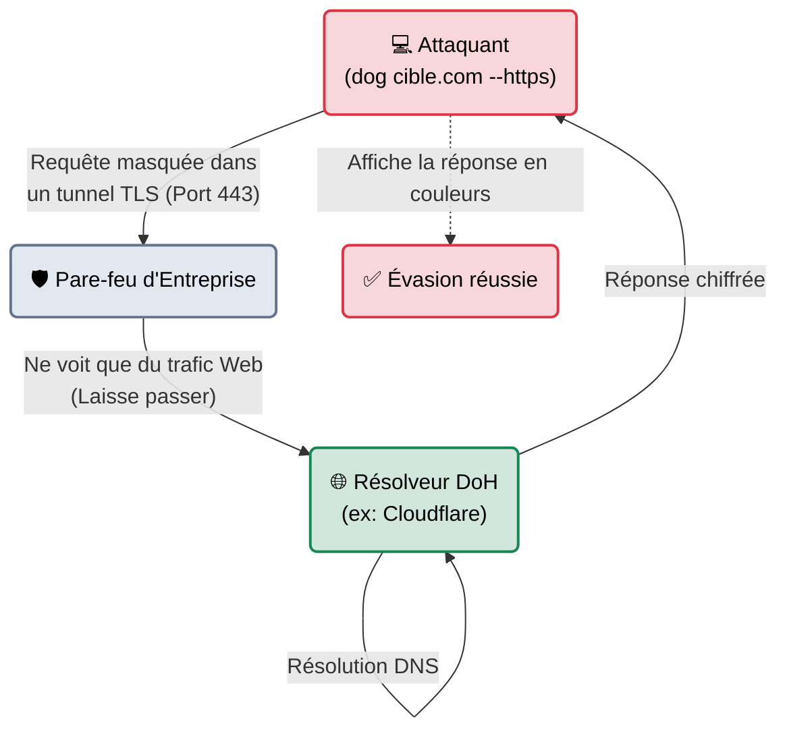

# dog — Le Client DNS Moderne

<div
  class="omny-meta"
  data-level="🟢 Débutant"
  data-version="0.1.0+"
  data-time="~10 minutes">
</div>

<div style="text-align: center; margin: 0 auto;">
    
</div>

## Introduction

!!! quote "Analogie pédagogique — Le Traducteur Instantané"
    Si **nslookup** est un vieux dictionnaire poussiéreux et **dig** un manuel technique extrêmement complet mais complexe à lire, **dog** est une application smartphone de traduction instantanée.
    Elle est extrêmement rapide, utilise des couleurs pour que tout soit visuellement clair du premier coup d'œil, supporte nativement les protocoles modernes chiffrés (DoH/DoT), et peut vous exporter ses réponses dans des formats lisibles par d'autres machines (JSON). C'est l'outil DNS de la génération Rust.

Écrit en Rust, **dog** est un client DNS en ligne de commande moderne. S'il n'a pas (encore) vocation à remplacer la toute-puissance d'investigation de `dig`, il s'impose de plus en plus chez les Pentesters et les Bug Bounty Hunters pour sa rapidité d'exécution, sa lisibilité et sa facilité d'intégration dans des scripts d'automatisation.

<br>

---

## Fonctionnement & Architecture (Le DNS Chiffré)

L'une des grandes forces de `dog` par rapport à ses ancêtres est sa gestion native du **DoH** (DNS over HTTPS). Au lieu de faire ses requêtes en clair sur le port 53 (visible par n'importe quel pare-feu), il chiffre la requête DNS dans un tunnel HTTPS (Port 443).



<br>

---

## Cas d'usage & Complémentarité

`dog` brille dans des cas d'usage où la vitesse et l'évasion réseau sont primordiales.

1. **Contournement de la surveillance locale (DoH/DoT)** : Lors d'un audit physique, si le pare-feu du client intercepte (Sinkhole) toutes les requêtes DNS sur le port 53 pour vous empêcher d'accéder à vos propres serveurs d'attaque (C2), `dog` permet de forcer la résolution de manière chiffrée via le port 443.
2. **Pipelines d'automatisation (JSON)** : En Bug Bounty, les chercheurs automatisent leurs trouvailles. `dog` permet d'exporter une réponse DNS directement en JSON natif pour être traitée par d'autres outils (comme `jq`).

<br>

---

## Les Options Principales

La syntaxe de `dog` se veut volontairement plus simple et plus intuitive que celle de `dig`.

| Option | Fonction | Description approfondie |
| :--- | :--- | :--- |
| `--https` | **DNS-over-HTTPS** | Force l'outil à utiliser une requête HTTPS sécurisée pour contourner l'interception locale. |
| `--tls` | **DNS-over-TLS** | Utilise le protocole DoT (Port 853) au lieu de l'UDP standard. |
| `-J` ou `--json`| **Export JSON** | Transforme l'affichage coloré en un objet JSON strictement formaté, idéal pour le traitement machine. |
| `[Type]` | **Filtre** | Spécifiez simplement `A`, `MX`, `TXT`, etc., à la fin de la ligne. |

<br>

---

## Installation & Configuration

L'outil n'est pas encore installé par défaut sur toutes les distributions Kali Linux, mais il est disponible dans les dépôts récents.

```bash title="Installation sous Linux"
sudo apt update && sudo apt install dog
```

<br>

---

## Le Workflow Idéal (Évasion et Automatisation)

Voici comment un auditeur moderne utilise `dog` pour enquêter sur une cible sans alerter le SOC (Security Operations Center) local.

### 1. La Requête Discrète (DoH)
L'attaquant cherche l'adresse IP de `omnyvia.com`, mais il ne veut pas que le pare-feu de l'entreprise où il est branché voit cette requête.
```bash title="Requête chiffrée via Cloudflare"
dog omnyvia.com A --https @https://cloudflare-dns.com/dns-query
```
*Le pare-feu verra seulement une connexion HTTPS vers Cloudflare, mais ignorera quel domaine a été recherché.*

### 2. Le Formatage pour Scripts (JSON)
L'attaquant veut intégrer les serveurs e-mail de la cible dans un script de Phishing en Python.
```bash title="Exportation propre"
dog omnyvia.com MX --json | jq '.'
```
```json
{
  "responses": [
    {
      "name": "omnyvia.com.",
      "type": "MX",
      "class": "IN",
      "ttl": 300,
      "priority": 10,
      "exchange": "mail.omnyvia.com."
    }
  ]
}
```

<br>

---

## Bonnes & Mauvaises Pratiques (Do's & Don'ts)

| Action | Recommandation | Explication métier |
|---|---|---|
| ✅ **À FAIRE** | **L'utiliser en binôme avec `jq`** | La sortie JSON de `dog` est sa plus grande force. Si vous avez une liste de 100 sous-domaines, vous pouvez utiliser `dog --json` combiné à `jq` pour extraire instantanément toutes les adresses IP sans avoir besoin de faire du nettoyage complexe avec `awk` ou `grep`. |
| ❌ **À NE PAS FAIRE** | **Jeter `dig` à la poubelle** | `dog` est esthétique et moderne, mais `dig` reste le standard mondial du debug DNS de très bas niveau (notamment pour l'analyse précise des en-têtes et le DNSSEC). Considérez `dog` comme un outil quotidien rapide, et `dig` comme votre microscope de laboratoire. |

<br>

---

## Avertissement Légal & Éthique

!!! note "Contournement de la politique de sécurité"
    L'utilisation du DoH (DNS-over-HTTPS) pour interroger des domaines est techniquement légale (OSINT).
    
    Cependant, **utiliser intentionnellement le DoH sur le réseau interne d'un client pour contourner ses systèmes de filtrage web** (ex: Contournement d'un proxy de sécurité) est une violation des politiques de sécurité locales. Dans le cadre d'un test d'intrusion, cette manœuvre permet de prouver que les données peuvent être exfiltrées de manière furtive, mais cela ne doit être fait qu'en accord avec les règles d'engagement.

<br>

---

## Conclusion

!!! quote "Ce qu'il faut retenir"
    `dog` est l'exemple parfait de la nouvelle génération d'outils (comme `bat` pour `cat` ou `ripgrep` pour `grep`). Il ne réinvente pas la roue, mais il rend la lecture et l'utilisation quotidienne d'une tâche fastidieuse beaucoup plus agréable grâce aux couleurs et aux formats modernes.

> Maintenant que nous avons vu tous les outils pour interroger "proprement" les serveurs DNS (dig, nslookup, host, dog), il est temps de passer aux méthodes offensives pour arracher les secrets de ces serveurs avec l'automatisation de **[dnsenum →](./dnsenum.md)**.


