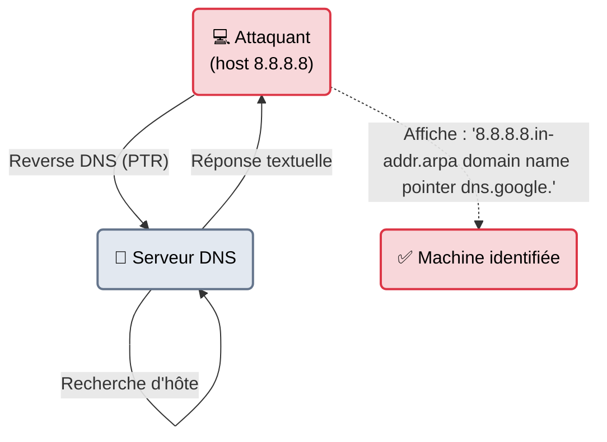

---
description: "host — L'utilitaire de résolution DNS minimaliste. Idéal pour les scripts automatisés (Bash) ou les requêtes simples (IP vers Nom, Nom vers IP)."
icon: lucide/book-open-check
tags: ["RED TEAM", "RESEAU", "DNS", "HOST", "SCRIPTING"]
---

# host — La Réponse Rapide

<div
  class="omny-meta"
  data-level="🟢 Débutant"
  data-version="Standard UNIX"
  data-time="~5 minutes">
</div>


## Introduction

!!! quote "Analogie pédagogique — L'Application GPS"
    Si *dig* est un interrogatoire policier complexe et *nslookup* un vieil annuaire interactif, **host** est simplement la barre de recherche de votre application GPS.
    Vous tapez "Hôpital Central", l'outil vous répond "3 Rue Pasteur". Vous tapez "3 Rue Pasteur", l'outil vous répond "Hôpital Central". C'est net, sans fioritures techniques, et immédiat.

La commande **host** est le troisième outil classique de diagnostic DNS (avec `dig` et `nslookup`). Sa philosophie est la simplicité absolue. Son rôle principal est de traduire très rapidement un nom de domaine en adresse IP (Résolution DNS standard), ou une adresse IP en nom de domaine (Résolution DNS Inverse ou *Reverse DNS*).

<br>

---

## Fonctionnement & Architecture (Résolution Simple)

Contrairement à `dig` qui affiche les en-têtes complexes des paquets réseau, `host` est conçu pour retourner une phrase complète, lisible par un humain.


```mermaid
flowchart TB
    %% Couleurs à fort contraste
    classDef attacker fill:#f8d7da,stroke:#dc3545,stroke-width:2px,color:#000
    classDef server fill:#e2e8f0,stroke:#64748b,stroke-width:2px,color:#000
    classDef success fill:#d1e7dd,stroke:#198754,stroke-width:2px,color:#000

    A("💻 Attaquant<br>(host 8.8.8.8)") -->|"Reverse DNS (PTR)"| B("🏢 Serveur DNS")
    
    B -->|"Recherche d'hôte"| B
    
    B -->|"Réponse textuelle"| A
    
    A -.->|"Affiche : '8.8.8.8.in-addr.arpa domain name pointer dns.google.'"| C("✅ Machine identifiée")

    class A,C attacker
    class B server
```

<br>

---

## Cas d'usage & Complémentarité

Le principal cas d'usage de `host` en Red Team se situe dans l'automatisation par script (Bash Scripting).

1. **Mass Reverse DNS** : Un pentester possède une liste de 254 adresses IP et veut savoir si elles correspondent à des noms de serveurs (ex: `srv-backup.corp`). Il écrit une simple boucle Bash utilisant `host` pour tester toutes les IPs.
2. **Transfert de Zone manuel** : Bien que des outils spécialisés (comme `dnsenum`) soient plus puissants, `host` possède l'option historique `-l` pour demander poliment à un serveur DNS la copie intégrale de ses répertoires (Attaque de transfert de zone).

<br>

---

## Les Options Principales

La syntaxe de `host` se résume souvent à : `host [nom_ou_ip]`. Quelques options utiles existent.

| Option | Fonction | Description approfondie |
| :--- | :--- | :--- |
| `-t [Type]` | **Filtre par Type** | Pour demander un champ spécifique (ex: `-t MX` pour les serveurs mail). |
| `-l` | **List (Zone Transfer)** | Tente de lister tous les hôtes d'un domaine. C'est l'équivalent de l'attaque `AXFR` (Zone Transfer) sous dig. |
| `[Serveur]` | **Serveur Spécifique** | Si on ajoute une adresse IP à la toute fin de la commande, `host` interrogera ce serveur-là au lieu de celui de votre FAI. |

<br>

---

## Le Workflow Idéal (Le Reverse DNS Scripté)

Voici l'application la plus classique d'un attaquant qui a récupéré une plage d'IP `10.0.0.X` (un réseau d'entreprise) et veut cartographier les noms des machines.

### 1. La Commande Unique (Preuve de Concept)
On teste d'abord une seule IP pour voir si le DNS interne accepte de résoudre les adresses à l'envers.
```bash title="Reverse Lookup"
host 10.0.0.5
# Résultat : 5.0.0.10.in-addr.arpa domain name pointer srv-files-ad.intra.corp.
```
*Le serveur a répondu ! L'IP `10.0.0.5` est donc le serveur de fichiers de l'entreprise.*

### 2. Le Script Bash (Automatisation)
On emballe la commande `host` dans une boucle for pour scanner le sous-réseau complet (de 1 à 254).
```bash title="Scan Reverse DNS d'un réseau interne (/24)"
for ip in $(seq 1 254); do
    host 10.0.0.$ip | grep "pointer" | cut -d " " -f 1,5
done
```
**Explication de la magie Unix :**
- `seq 1 254` : Génère les chiffres de 1 à 254.
- `host 10.0.0.$ip` : Tente la résolution pour chaque IP.
- `grep "pointer"` : Ne garde que les réponses positives (ignore les erreurs "Not found").
- `cut -d " " -f 1,5` : Nettoie l'affichage en ne gardant que l'IP et le nom final.

Le résultat sera une liste propre et parfaite de tous les serveurs internes de l'entreprise.

<br>

---

## Bonnes & Mauvaises Pratiques (Do's & Don'ts)

| Action | Recommandation | Explication métier |
|---|---|---|
| ✅ **À FAIRE** | **Utiliser `host` pour les vérifications rapides** | Gardez `dig` pour les audits techniques complexes où vous avez besoin de voir le TTL ou les flags de sécurité DNS (DNSSEC). Utilisez `host` quand vous avez juste une IP et que vous voulez un nom (ou l'inverse). |
| ❌ **À NE PAS FAIRE** | **Utiliser l'option `-l` contre un DNS public en 2024** | La faille de "Transfert de Zone" (Zone Transfer / AXFR) est connue depuis 25 ans. Si vous tapez `host -l google.com`, le serveur DNS de Google vous bloquera immédiatement, car vous lui demandez de vous donner la liste de tous ses millions de serveurs internes d'un coup. |

<br>

---

## Conclusion

!!! quote "Ce qu'il faut retenir"
    Aujourd'hui, de nombreux professionnels de la sécurité ignorent `host` au profit de `dig` (qui possède l'option `+short` faisant quasiment la même chose). Cependant, sa syntaxe pure et son comportement "Unix-like" (pas de bavardage, que de l'information utile) en font un composant intemporel des boucles de scripts bash d'énumération réseau.

> Les trois outils (dig, nslookup, host) posent une question au serveur DNS et attendent une réponse. Mais comment faire quand on veut automatiser la recherche de dizaines de sous-domaines cachés (ex: `vpn.cible.com`, `admin.cible.com`) ? Il faut passer à un outil de force brute offensif : **[Dnsenum →](./dnsenum.md)**.


