# host (DNS Lookup Utility)

## Introduction

<div
  class="omny-meta"
  data-level="🟢 Débutant"
  data-version="0"
  data-time="10-15 minutes">
</div>

!!! quote "Analogie pédagogique"
    _Imaginez **host** comme un **annuaire téléphonique express** : vous posez une question simple ("Qui est example.com ?") et vous obtenez une réponse directe et concise, sans fioritures ni explications techniques inutiles. C'est l'outil parfait quand vous voulez juste une information rapide._

> **host** est l'**outil DNS le plus simple** disponible sur Linux et macOS. Il privilégie la **clarté** et la **rapidité** au détriment des détails techniques. Parfait pour des **vérifications rapides** ou des **scripts simples**, host offre une sortie lisible et concise sans la complexité de dig.

**host** est idéal pour :

- **Vérifications DNS ultra-rapides**
- **Scripts shell simples**
- **Utilisateurs débutants**
- **Résolutions DNS basiques**
- **Alternative légère à dig**

!!! info "Pourquoi utiliser host ?"
    **host** combine **simplicité d'utilisation** et **sortie lisible**. Quand vous n'avez besoin que d'une information DNS basique sans détails techniques, host est l'outil parfait.

## Installation

=== ":fontawesome-brands-linux: Debian/Ubuntu"

    ```bash
    # host fait partie de bind-tools/bind9-host
    sudo apt update
    sudo apt install bind9-host
    
    # Vérifier l'installation
    host -V
    ```

=== ":fontawesome-brands-linux: RHEL/CentOS/Fedora"

    ```bash
    # host fait partie de bind-utils
    sudo dnf install bind-utils
    
    # Vérifier l'installation
    host -V
    ```

=== ":fontawesome-brands-linux: Arch Linux"

    ```bash
    # host fait partie de bind
    sudo pacman -S bind
    
    # Vérifier l'installation
    host -V
    ```

=== ":fontawesome-brands-apple: macOS"

    ```bash
    # host est préinstallé sur macOS
    host -V
    
    # Si nécessaire, installer via Homebrew
    brew install bind
    ```

=== ":fontawesome-brands-windows: Windows"

    ```powershell
    # host n'est pas disponible nativement sur Windows
    # Options :
    
    # 1. Utiliser WSL
    wsl --install
    sudo apt install bind9-host
    
    # 2. Utiliser nslookup (natif Windows)
    nslookup
    
    # 3. Utiliser dig via BIND pour Windows
    ```

## Syntaxe de base

```bash
host [options] nom-ou-ip [serveur-dns]
```

**Composants :**

- **nom-ou-ip** : Nom de domaine ou adresse IP à interroger
- **serveur-dns** : Serveur DNS à utiliser (optionnel)
- **options** : Modificateurs de comportement (-t, -a, -v, etc.)

## Utilisation basique

### Requête simple (A + AAAA)

```bash
# Requête par défaut (A + AAAA si disponible)
host example.com
```

??? example "Sortie de host"

    ```plaintext
    example.com has address 93.184.216.34
    example.com has IPv6 address 2606:2800:220:1:248:1893:25c8:1946
    ```

**Avantages de host :**

- Sortie **claire et lisible**
- Affiche automatiquement **IPv4 et IPv6**
- **Pas de détails techniques** superflu
- Parfait pour un **coup d'œil rapide**

### Spécifier un serveur DNS

```bash
# Utiliser Google DNS
host example.com 8.8.8.8

# Utiliser Cloudflare DNS
host example.com 1.1.1.1

# Utiliser Quad9
host example.com 9.9.9.9
```

### Résolution inverse

```bash
# IP → nom de domaine
host 93.184.216.34

# Sortie :
# 34.216.184.93.in-addr.arpa domain name pointer example.com.
```

## Requêtes par type

=== "A (IPv4)"

    ```bash
    # Enregistrement A
    host -t A example.com
    
    # Sortie : example.com has address 93.184.216.34
    ```

=== "AAAA (IPv6)"

    ```bash
    # Enregistrement AAAA
    host -t AAAA example.com
    
    # Sortie : example.com has IPv6 address 2606:2800:220:1:248:1893:25c8:1946
    ```

=== "MX (Mail)"

    ```bash
    # Enregistrements MX
    host -t MX example.com
    
    # Sortie :
    # example.com mail is handled by 10 mail1.example.com.
    # example.com mail is handled by 20 mail2.example.com.
    ```

=== "NS (Name Servers)"

    ```bash
    # Serveurs DNS autoritaires
    host -t NS example.com
    
    # Sortie :
    # example.com name server ns1.example.com.
    # example.com name server ns2.example.com.
    ```

=== "TXT (Texte)"

    ```bash
    # Enregistrements TXT
    host -t TXT example.com
    
    # Sortie :
    # example.com descriptive text "v=spf1 include:_spf.google.com ~all"
    ```

=== "SOA (Start of Authority)"

    ```bash
    # Informations SOA
    host -t SOA example.com
    
    # Sortie : example.com has SOA record ns1.example.com. admin.example.com. 2024011801 7200 3600 1209600 3600
    ```

=== "CNAME (Alias)"

    ```bash
    # Enregistrement CNAME
    host -t CNAME www.example.com
    
    # Sortie : www.example.com is an alias for example.com.
    ```

=== "PTR (Reverse)"

    ```bash
    # Résolution inverse explicite
    host -t PTR 93.184.216.34
    
    # Ou plus simplement
    host 93.184.216.34
    ```

## Options avancées

### Mode verbeux

```bash
# Afficher plus de détails (similaire à dig)
host -v example.com

# Équivalent à dig mais avec sortie host
host -d example.com
```

### Requête complète (tous types)

```bash
# Interroger tous les types d'enregistrements
host -a example.com

# Équivalent de -t ANY
```

### Contrôle TCP/UDP

```bash
# Forcer l'utilisation de TCP
host -T example.com

# Utile si les réponses UDP sont tronquées
```

### Délai d'attente

```bash
# Définir le timeout (en secondes)
host -W 5 example.com

# Nombre de tentatives
host -R 3 example.com
```

### Format de sortie

```bash
# Afficher uniquement les adresses IP
host example.com | awk '{print $NF}'

# Vérifier si un domaine existe (code retour)
host example.com > /dev/null 2>&1 && echo "Existe" || echo "N'existe pas"
```

## Cas d'usage pratiques

### 1. Vérification rapide de domaine

```bash
# Vérifier qu'un domaine résout
host example.com

# Vérifier plusieurs domaines
for domain in example.com google.com github.com; do
    echo -n "$domain : "
    host $domain | grep "has address" | awk '{print $NF}'
done
```

### 2. Vérifier la propagation DNS

=== ":fontawesome-brands-linux: Bash :lucide-terminal:"

    ```bash
    #!/bin/bash
    # Vérification propagation DNS avec host
    
    DOMAIN="example.com"
    DNS_SERVERS=("8.8.8.8@Google" "1.1.1.1@Cloudflare" "9.9.9.9@Quad9")
    
    echo "Propagation DNS pour $DOMAIN"
    echo "=============================="
    
    for server in "${DNS_SERVERS[@]}"; do
        IFS='@' read -r ip name <<< "$server"
        echo -e "\n[$name] ($ip)"
        host $DOMAIN $ip | grep "has address"
    done
    ```

### 3. Audit mail (MX + SPF)

```bash
#!/bin/bash
# Vérification configuration email

DOMAIN=$1

if [ -z "$DOMAIN" ]; then
    echo "Usage: $0 <domaine>"
    exit 1
fi

echo "=== Configuration mail pour $DOMAIN ==="
echo ""

echo "[Serveurs MX]"
host -t MX $DOMAIN

echo -e "\n[Enregistrement SPF]"
host -t TXT $DOMAIN | grep "spf1"

echo -e "\n[Résolution des MX]"
for mx in $(host -t MX $DOMAIN | awk '{print $NF}' | sed 's/\.$//'); do
    echo "  $mx :"
    host $mx | grep "has address"
done
```

### 4. Monitoring simple

```bash
#!/bin/bash
# Surveillance DNS basique

DOMAIN="example.com"
INTERVAL=60

echo "Surveillance de $DOMAIN (intervalle: ${INTERVAL}s)"
echo "Ctrl+C pour arrêter"
echo ""

LAST_IP=""

while true; do
    CURRENT_IP=$(host $DOMAIN 2>/dev/null | grep "has address" | head -n 1 | awk '{print $NF}')
    TIMESTAMP=$(date "+%Y-%m-%d %H:%M:%S")
    
    if [ "$CURRENT_IP" != "$LAST_IP" ]; then
        if [ -n "$LAST_IP" ]; then
            echo "[$TIMESTAMP] ⚠️  CHANGEMENT : $LAST_IP → $CURRENT_IP"
        else
            echo "[$TIMESTAMP] IP initiale : $CURRENT_IP"
        fi
        LAST_IP="$CURRENT_IP"
    else
        echo "[$TIMESTAMP] Stable : $CURRENT_IP"
    fi
    
    sleep $INTERVAL
done
```

### 5. Résolution batch

```bash
#!/bin/bash
# Résolution de plusieurs domaines

DOMAINS_FILE="domains.txt"

if [ ! -f "$DOMAINS_FILE" ]; then
    echo "Fichier $DOMAINS_FILE introuvable"
    exit 1
fi

echo "Résolution DNS batch"
echo "===================="
echo ""

while IFS= read -r domain; do
    [ -z "$domain" ] && continue  # Ignorer lignes vides
    echo -n "$domain : "
    
    IP=$(host $domain 2>/dev/null | grep "has address" | head -n 1 | awk '{print $NF}')
    
    if [ -n "$IP" ]; then
        echo "✅ $IP"
    else
        echo "❌ Non résolu"
    fi
done < "$DOMAINS_FILE"
```

### 6. Comparer DNS géographiques

```bash
#!/bin/bash
# Comparer réponses DNS de différents pays

DOMAIN="cdn.example.com"

# DNS de différents pays
declare -A DNS_SERVERS=(
    ["France"]="1.1.1.1"
    ["USA"]="8.8.8.8"
    ["Japon"]="210.197.74.200"
    ["Allemagne"]="194.150.168.168"
)

echo "Comparaison DNS géographique pour $DOMAIN"
echo "=========================================="

for country in "${!DNS_SERVERS[@]}"; do
    dns="${DNS_SERVERS[$country]}"
    echo -e "\n[$country] ($dns)"
    host $DOMAIN $dns | grep "has address"
done
```

## Diagnostic de problèmes

### Problème 1 : Domaine non résolu

```bash
# Test basique
host example.com

# Tester avec Google DNS
host example.com 8.8.8.8

# Tester avec mode verbeux
host -v example.com
```

**Codes de retour :**

- **0** : Succès
- **1** : Erreur générale
- **2** : Serveur DNS inaccessible

### Problème 2 : Résultats incohérents

```bash
# Comparer plusieurs DNS
for dns in 8.8.8.8 1.1.1.1 9.9.9.9; do
    echo "DNS $dns :"
    host example.com $dns
    echo ""
done
```

### Problème 3 : Timeout

```bash
# Augmenter le timeout
host -W 10 example.com

# Augmenter les tentatives
host -R 5 example.com

# Essayer TCP au lieu d'UDP
host -T example.com
```

## Comparaison avec dig et nslookup

| Critère | host | dig | nslookup |
|---------|------|-----|----------|
| **Simplicité** | ⭐⭐⭐ Très simple | ⭐⭐ Moyen | ⭐⭐⭐ Simple |
| **Lisibilité** | ⭐⭐⭐ Excellente | ⭐ Technique | ⭐⭐ Bonne |
| **Détails** | ⭐ Minimal | ⭐⭐⭐ Complet | ⭐⭐ Moyen |
| **Options** | ⭐ Limitées | ⭐⭐⭐ Nombreuses | ⭐⭐ Moyennes |
| **Scripting** | ⭐⭐ Bon | ⭐⭐⭐ Excellent | ⭐ Moyen |
| **Multiplateforme** | ❌ Linux/macOS | ❌ Linux/macOS | ✅ Partout |
| **DNSSEC** | ❌ Non | ✅ Complet | ❌ Non |
| **Mode interactif** | ❌ Non | ❌ Non | ✅ Oui |
| **Courbe d'apprentissage** | ⭐⭐⭐ Facile | ⭐ Moyenne | ⭐⭐ Facile |

### Quand utiliser quel outil ?

```mermaid
graph TD
    A[Besoin DNS ?] --> B{Quel système ?}
    
    B -->|Windows| C[nslookup]
    B -->|Linux/macOS| D{Quel besoin ?}
    
    D -->|Vérification rapide| E[host]
    D -->|Diagnostic approfondi| F[dig]
    D -->|Script simple| E
    D -->|Script complexe| F
    
    E --> G[Sortie lisible]
    F --> H[Sortie détaillée]
    C --> I[Compatible partout]
    
    style E fill:#99ff99
    style F fill:#99ccff
    style C fill:#ffcc99
```



## Options de ligne de commande

| Option | Description | Exemple |
|--------|-------------|---------|
| `-t <type>` | Type d'enregistrement | `host -t MX example.com` |
| `-a` | Tous les enregistrements | `host -a example.com` |
| `-v` | Mode verbeux | `host -v example.com` |
| `-d` | Mode debug | `host -d example.com` |
| `-T` | Forcer TCP | `host -T example.com` |
| `-W <sec>` | Timeout en secondes | `host -W 5 example.com` |
| `-R <n>` | Nombre de tentatives | `host -R 3 example.com` |
| `-4` | IPv4 uniquement | `host -4 example.com` |
| `-6` | IPv6 uniquement | `host -6 example.com` |
| `-C` | Comparer SOA des NS | `host -C example.com` |

## Exemples avancés

### Vérifier la cohérence des serveurs NS

```bash
# Comparer les SOA de tous les NS
host -C example.com

# Sortie : Liste tous les NS avec leur numéro de série SOA
# Permet de détecter les NS non synchronisés
```

### Résolution IPv4 vs IPv6

```bash
# IPv4 uniquement
host -4 example.com

# IPv6 uniquement
host -6 example.com

# Les deux
host example.com
```

### Tracer les CNAME

```bash
# host suit automatiquement les CNAME
host www.example.com

# Sortie :
# www.example.com is an alias for example.com.
# example.com has address 93.184.216.34
```

## Scripts utiles

### Script de validation DNS

```bash
#!/bin/bash
# Validation DNS complète avec host

DOMAIN=$1

if [ -z "$DOMAIN" ]; then
    echo "Usage: $0 <domaine>"
    exit 1
fi

echo "=== Validation DNS pour $DOMAIN ==="
echo ""

# Vérifier A
echo "[IPv4]"
if host -t A $DOMAIN > /dev/null 2>&1; then
    host -t A $DOMAIN | grep "has address"
else
    echo "❌ Aucun enregistrement A"
fi

# Vérifier AAAA
echo -e "\n[IPv6]"
if host -t AAAA $DOMAIN > /dev/null 2>&1; then
    host -t AAAA $DOMAIN | grep "has IPv6"
else
    echo "⚠️  Aucun enregistrement AAAA"
fi

# Vérifier MX
echo -e "\n[Mail]"
if host -t MX $DOMAIN > /dev/null 2>&1; then
    host -t MX $DOMAIN
else
    echo "⚠️  Aucun enregistrement MX"
fi

# Vérifier NS
echo -e "\n[Name Servers]"
host -t NS $DOMAIN

# Vérifier cohérence NS
echo -e "\n[Cohérence NS]"
host -C $DOMAIN | grep "SOA" | awk '{print $1, $7}' | sort -u
```

### Benchmark de latence DNS

```bash
#!/bin/bash
# Benchmark latence DNS avec host

DOMAIN="example.com"
ITERATIONS=5
DNS_SERVERS=("8.8.8.8" "1.1.1.1" "9.9.9.9")

echo "Benchmark DNS pour $DOMAIN ($ITERATIONS itérations)"
echo "===================================================="

for dns in "${DNS_SERVERS[@]}"; do
    echo -e "\nServeur DNS: $dns"
    
    total=0
    for i in $(seq 1 $ITERATIONS); do
        start=$(date +%s%N)
        host $DOMAIN $dns > /dev/null 2>&1
        end=$(date +%s%N)
        
        elapsed=$(( (end - start) / 1000000 ))  # En millisecondes
        total=$((total + elapsed))
        echo "  Test $i : ${elapsed}ms"
    done
    
    avg=$((total / ITERATIONS))
    echo "  Moyenne : ${avg}ms"
done
```

## Bonnes pratiques

!!! tip "Utilisation optimale de host"
    ✅ **Pour vérifications rapides** : host est plus rapide que dig pour les cas simples
    
    ✅ **Pour scripts simples** : Sortie facilement parsable
    
    ✅ **Pour débutants** : Aucune connaissance technique requise
    
    ✅ **Pour résolution batch** : Traiter de nombreux domaines rapidement
    
    ✅ **Combinaison avec grep/awk** : Extraire facilement les informations

!!! warning "Limitations"
    ❌ **Pas de DNSSEC** : Impossible de vérifier les signatures
    
    ❌ **Pas de traçage** : Pas d'équivalent de `dig +trace`
    
    ❌ **Options limitées** : Moins flexible que dig
    
    ❌ **Pas sur Windows** : Nécessite WSL
    
    ⚠️ **Sortie variable** : Format peut légèrement varier selon les versions

## Astuces

### Vérifier si un domaine existe

```bash
# Méthode 1 : Code retour
if host example.com > /dev/null 2>&1; then
    echo "Le domaine existe"
else
    echo "Le domaine n'existe pas"
fi

# Méthode 2 : Compter les résultats
if [ $(host example.com | grep "has address" | wc -l) -gt 0 ]; then
    echo "Le domaine a des enregistrements A"
fi
```

### Extraire uniquement l'IP

```bash
# Première IP trouvée
host example.com | grep "has address" | head -n 1 | awk '{print $NF}'

# Toutes les IP
host example.com | grep "has address" | awk '{print $NF}'
```

### Vérifier la présence d'IPv6

```bash
if host -t AAAA example.com | grep -q "has IPv6"; then
    echo "✅ IPv6 disponible"
else
    echo "❌ Pas d'IPv6"
fi
```

## Pour aller plus loin

!!! info "Ressources complémentaires"
    **Documentation :**
    
    - `man host` - Manuel complet
    - [ISC BIND Documentation](https://www.isc.org/bind/)
    
    **Alternatives :**
    
    - **dig** : Pour diagnostics DNS avancés
    - **nslookup** : Pour compatibilité Windows
    - **drill** : Alternative moderne (ldns-utils)
    - **dog** : Outil DNS moderne en Rust
    
    **Utilisation combinée :**
    
    ```bash
    # Utiliser host pour vérifier, dig pour diagnostiquer
    host example.com || dig +trace example.com
    
    # Pipeline avec d'autres outils
    host example.com | grep address | awk '{print $NF}' | xargs -I {} whois {}
    ```
